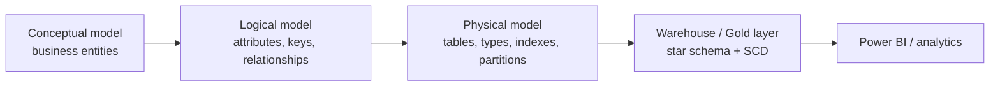

# Data Modeling — Learning Path

Data modeling is the discipline of **designing how data is structured, related, and stored** so it's correct, performant, and understandable. Every warehouse, lakehouse Gold layer, and analytics system rests on a data model. This module sits between [SQL](../SQL/01_What_is_SQL.md) and [Data Warehousing](../Data_Warehousing/01_Data_Warehouse_Fundamentals.md).

**No coding background required.** Each note leads with a plain-language idea and a real-world analogy before the technical depth.

---

## Why data modeling matters
- A good model makes queries **simple and fast**; a bad one makes every report slow and every join painful.
- It's the **contract** between source systems, engineers, and analysts — everyone agrees what "customer" or "order" means.
- For a data engineer, modeling shows up as designing **Gold-layer star schemas**, **SCD dimensions**, and the relationships behind every BI dashboard.

---

## Reading order

| # | File | What you'll learn |
|---|---|---|
| 01 | [Data Modeling Fundamentals](01_Data_Modeling_Fundamentals.md) | Conceptual/logical/physical models, entities, keys, relationships, cardinality (ER modeling) |
| 02 | [Normalization & Denormalization](02_Normalization_and_Denormalization.md) | 1NF–BCNF, when to normalize vs denormalize |
| 03 | [Dimensional Modeling](03_Dimensional_Modeling.md) | Star vs snowflake, facts, dimensions, grain, surrogate keys, additivity |
| 04 | [Slowly Changing Dimensions](04_Slowly_Changing_Dimensions.md) | SCD Types 0–6 and how to implement SCD2 in Delta |
| 05 | [Data Vault & Modern Modeling](05_Data_Vault_and_Modern_Modeling.md) | Data Vault 2.0, wide tables / OBT, modeling for the lakehouse |
| — | [Interview Questions & Answers](Interview_Questions_and_Answers.md) | Test yourself across the module |

---

## How each note is structured
1. **What is it?** — plain definition + real-world analogy.
2. **Example** — a concrete table/diagram.
3. **Advanced** — the rules and trade-offs used in real projects.
4. **Pro / Interview** — design decisions, gotchas, and interview-grade Q&A.

---

## The big picture

Start here: **[01 — Data Modeling Fundamentals](01_Data_Modeling_Fundamentals.md)**.

## Further Learning — Docs & Videos
- Dimensional modeling (Kimball Group): https://www.kimballgroup.com/data-warehouse-business-intelligence-resources/kimball-techniques/dimensional-modeling-techniques/
- Data modeling guide (IBM): https://www.ibm.com/topics/data-modeling
- Video — data modeling explained: https://www.youtube.com/results?search_query=data+modeling+for+data+engineers+explained
