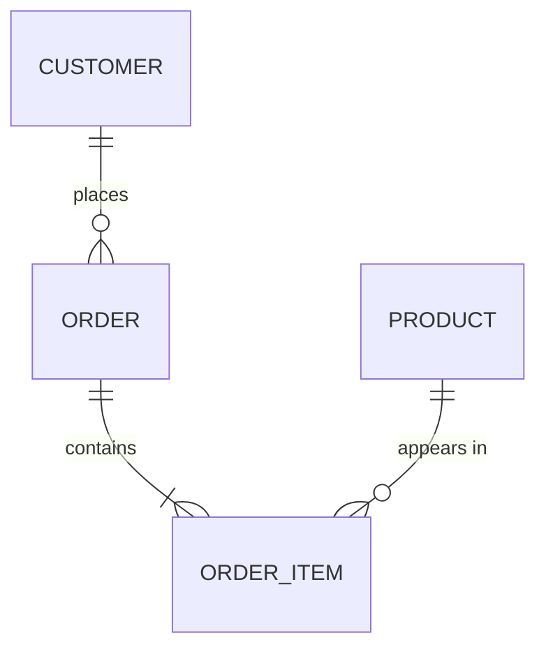

# 01 — Data Modeling Fundamentals

## What is data modeling?

**Data modeling** is designing a blueprint of how data is organized: what **things** you store (entities), what **facts** you keep about them (attributes), and how they **relate** to each other. It's done before building tables, the way an architect draws plans before pouring concrete.

**Analogy:** Building a house without a blueprint gives you clashing rooms and a leaking roof. Building a database without a data model gives you duplicated data, broken joins, and reports nobody trusts. The model is the blueprint.

---

## The three levels of a data model

Data modeling moves from abstract to concrete in three stages:

| Level | Answers | Audience | Example |
|---|---|---|---|
| **Conceptual** | *What* entities and relationships exist? | Business stakeholders | "A Customer places many Orders" |
| **Logical** | *What* attributes, keys, and rules? (platform-independent) | Analysts + engineers | Customer(customer_id **PK**, name, email); Order(order_id **PK**, customer_id **FK**, amount) |
| **Physical** | *How* is it stored? (tables, types, indexes, partitions) | Engineers/DBAs | `CREATE TABLE orders (order_id BIGINT, ... ) PARTITIONED BY (order_date)` |

> **Exam/interview tip:** Conceptual = entities + relationships (no attributes). Logical = adds attributes/keys, still DB-agnostic. Physical = actual DDL with types/indexes/partitions for a specific engine.

---

## Core building blocks (ER modeling)

**Entity–Relationship (ER) modeling** is the classic technique for OLTP/application databases.

- **Entity** — a thing you store data about (Customer, Product, Order). Becomes a table.
- **Attribute** — a property of an entity (name, price). Becomes a column.
- **Relationship** — how entities connect (a Customer *places* Orders).
- **Primary Key (PK)** — uniquely identifies a row (customer_id).
- **Foreign Key (FK)** — a column referencing another table's PK, enforcing the relationship.

### Cardinality — the "how many" of relationships
| Cardinality | Meaning | Example |
|---|---|---|
| **One-to-one (1:1)** | Each A relates to exactly one B | Person ↔ Passport |
| **One-to-many (1:N)** | One A, many B | Customer → Orders |
| **Many-to-many (M:N)** | Many A ↔ many B (needs a **bridge/junction** table) | Students ↔ Courses |

> **M:N trap:** A relational model can't store many-to-many directly — you resolve it with a **junction/bridge table** (e.g., `student_course(student_id, course_id)`).

---

## Keys in depth

- **Natural key** — a business identifier from the source (email, SSN, product SKU). Can change or be reused.
- **Surrogate key** — a system-generated meaningless integer/GUID PK. Stable, decoupled from the source, and essential for warehouse dimensions (enables SCD2).
- **Composite key** — a PK made of multiple columns (e.g., `(order_id, line_no)`).
- **Candidate key** — any column(s) that could serve as the PK.

> **Interview tip:** In OLTP, natural keys are common; in the **warehouse/Gold layer, prefer surrogate keys** for dimensions so one business entity can have multiple historical versions (SCD2), each with a unique key.

---

## OLTP modeling vs Analytical modeling

| | OLTP (application DB) | Analytical (warehouse/lakehouse) |
|---|---|---|
| Technique | **ER / normalized** | **Dimensional (star)** |
| Goal | Fast, safe writes; no redundancy | Fast reads; simple joins |
| Shape | Many small related tables | Few wide fact + dimension tables |
| Normal form | 3NF+ | Denormalized dimensions |

This is why a data engineer **re-models** OLTP source data into a **dimensional** model for the Gold layer — the next files cover both.

---

## Pro / Interview notes

- **Model to the questions, not the source.** A warehouse model should make the business's actual reports easy — start from the metrics/queries, not from copying the source schema.
- **Define the grain first** (covered in dimensional modeling) — everything else follows.
- **Document the model** — an ER/dimensional diagram + a data dictionary is the artifact interviewers expect a senior to produce.
- **Common mistake:** modeling the warehouse as a 1:1 copy of the OLTP schema → slow, join-heavy reports. Re-model into star schema.

---

## Quick Review
- ✔ Three levels: **Conceptual** (entities/relationships) → **Logical** (attributes/keys) → **Physical** (DDL/indexes/partitions)
- ✔ ER building blocks: entity, attribute, relationship, **PK/FK**
- ✔ Cardinality: 1:1, 1:N, **M:N needs a bridge table**
- ✔ **Surrogate keys** for warehouse dimensions (stable, enable SCD2)
- ✔ OLTP = normalized ER; analytics = **dimensional star**
- ✔ Model to the business questions; define grain first

## Further Learning — Docs & Videos
- ER modeling (IBM): https://www.ibm.com/topics/entity-relationship-diagram
- Conceptual vs logical vs physical: https://www.databricks.com/glossary/data-modeling
- Video — ER modeling & keys: https://www.youtube.com/results?search_query=entity+relationship+data+model+primary+foreign+key

Next: **[02 — Normalization & Denormalization](02_Normalization_and_Denormalization.md)**.
