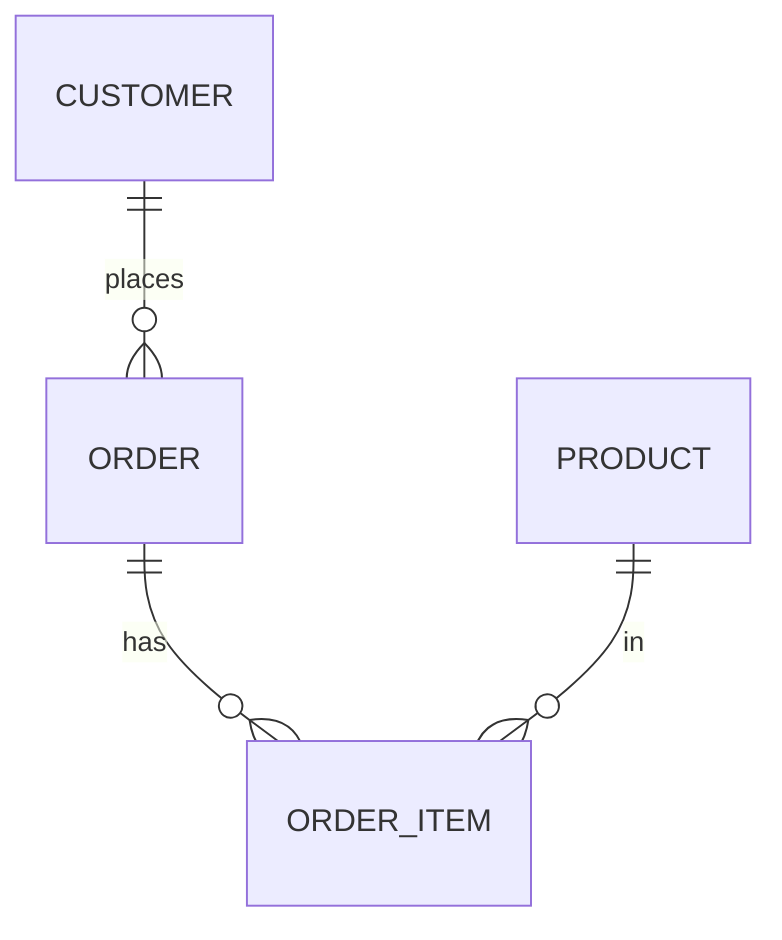

# 02 — Normalization & Denormalization

## What is normalization?

**Normalization** is organizing tables to **remove redundancy** and prevent update anomalies, by splitting data into related tables so each fact is stored **once**. **Denormalization** deliberately reintroduces redundancy to make **reads faster**.

**Analogy:** Normalization is storing each friend's phone number once in a contacts app and referencing it everywhere — change it in one place, it's updated everywhere. Writing the number on every letter you send (denormalization) is faster to read but a nightmare to update.

---

## Why normalize? The anomalies it prevents

If you store everything in one big table, you hit:
- **Update anomaly** — a customer's city stored on every order row; changing it means updating thousands of rows (and missing some).
- **Insert anomaly** — can't add a product until someone orders it.
- **Delete anomaly** — deleting the last order for a customer loses the customer entirely.

Normalization splits data so each fact lives in exactly one place.

---

## The normal forms (know 1NF–3NF cold)

| Normal form | Rule | Fixes |
|---|---|---|
| **1NF** | Atomic values (no lists in a cell), unique rows, a PK | Repeating groups / multi-valued cells |
| **2NF** | 1NF + no **partial dependency** (non-key columns depend on the *whole* composite key) | Columns depending on only part of a composite key |
| **3NF** | 2NF + no **transitive dependency** (non-key columns depend only on the key, not on other non-key columns) | e.g., `zip → city` stored in an orders table |
| **BCNF** | Stricter 3NF (every determinant is a candidate key) | Rare edge cases in 3NF |

**Memory trick (3NF):** *"Each non-key column depends on the key, the whole key, and nothing but the key."*

### Worked example
Un-normalized order row:
`order_id, customer_name, customer_city, product_name, product_price, qty`

- **1NF:** one product per row (no lists).
- **2NF:** move product attributes to a `Product` table (they depend on product, not the order).
- **3NF:** move customer attributes to a `Customer` table (`customer_city` depends on customer, not order).

Result: `Order`, `OrderItem`, `Product`, `Customer` — each fact stored once.

---

## Denormalization — and when to use it

Normalized models are great for **writes** (OLTP) but require many **joins** for reads. Analytics/BI wants **few joins**, so warehouses **denormalize**:

- **Star schema dimensions** are denormalized (all product attributes in one `dim_product`, not split into sub-tables).
- **Pre-aggregated Gold tables** duplicate computed values to make dashboards instant.
- **One Big Table (OBT)** flattens everything for column-store engines.

**Trade-off:** denormalization costs storage and risks update inconsistency, but modern pipelines control that by **rebuilding** the denormalized tables from normalized/raw sources each run (so there's a single source of truth upstream).

| | Normalize | Denormalize |
|---|---|---|
| Best for | OLTP writes, integrity | OLAP reads, BI, dashboards |
| Redundancy | Minimal | Intentional |
| Joins | Many | Few |
| Update risk | Low | Managed by rebuild-from-source |

---

## Pro / Interview notes

- **Rule of thumb:** normalize the **source/OLTP** and the **Silver** layer for integrity; **denormalize the Gold** layer (star schema) for query speed.
- **Snowflake schema** = a partially normalized star (dimensions split into sub-tables) — less redundancy, more joins; usually **star (denormalized) wins** for BI.
- **Common mistake:** over-normalizing the analytics layer → slow, join-heavy reports; or denormalizing the OLTP layer → update anomalies.
- Denormalized ≠ unmanaged: you keep integrity by **deriving** Gold from governed upstream data (medallion architecture).

---

## Quick Review
- ✔ Normalization removes redundancy → prevents insert/update/delete anomalies
- ✔ **1NF** (atomic) → **2NF** (no partial dep) → **3NF** (no transitive dep) → BCNF
- ✔ 3NF mantra: depend on **the key, the whole key, nothing but the key**
- ✔ OLTP/Silver = normalized; **Gold = denormalized** (star) for fast reads
- ✔ Denormalization trades storage/consistency for read speed; managed by rebuild-from-source
- ✔ Snowflake = normalized dimensions (more joins); star usually preferred

## Further Learning — Docs & Videos
- Normalization (1NF-3NF) guide: https://www.geeksforgeeks.org/normal-forms-in-dbms/
- Normalize vs denormalize (AWS): https://aws.amazon.com/compare/the-difference-between-normalization-and-denormalization/
- Video — database normalization explained: https://www.youtube.com/results?search_query=database+normalization+1nf+2nf+3nf+explained

Next: **[03 — Dimensional Modeling](03_Dimensional_Modeling.md)**.
