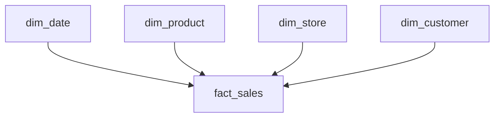

# 03 — Dimensional Modeling

## What is dimensional modeling?

**Dimensional modeling** (Kimball) designs analytics tables around **how the business asks questions**: numeric **measures** you want to analyze (sales amount, quantity) sit in **fact** tables, and the descriptive **context** (who, what, when, where) sits in **dimension** tables. It's the standard for warehouses, marts, and the lakehouse **Gold** layer.

**Analogy:** A fact table is the receipt (amounts, quantities, timestamps, references). The dimensions are the catalogs you look things up in — the product catalog, the store directory, the calendar. You slice the receipts *by* the catalogs.

---

## Fact vs Dimension tables

| | Fact table | Dimension table |
|---|---|---|
| Holds | Numeric **measures** + foreign keys to dimensions | Descriptive **attributes** |
| Size | Tall & narrow (millions–billions of rows) | Short & wide (denormalized) |
| Grows | Fast (per event) | Slowly |
| Example | `fact_sales(date_sk, product_sk, store_sk, qty, amount)` | `dim_product(product_sk, name, category, brand)` |

---

## The star schema

A central **fact** surrounded by **denormalized dimensions** — the classic, fast, BI-friendly design.



### Star vs Snowflake
- **Star** = dimensions denormalized (one table each). Fewer joins, faster, simpler → **preferred for BI**.
- **Snowflake** = dimensions normalized into sub-tables (e.g., product → category → department). Less redundancy, more joins, slower.

---

## Grain — define it first

The **grain** is *what one fact row represents*. Declare it before choosing dimensions or measures.

- "One row per **order line**" · "one row per **daily account balance**" · "one row per **shipment**."
- Every dimension and measure must be true at that grain. **Mixed grain = broken aggregations.**

> **Interview tip:** The Kimball 4-step design: (1) pick the **business process**, (2) declare the **grain**, (3) choose the **dimensions**, (4) choose the **facts/measures**.

---

## Types of fact tables
| Type | One row = | Example |
|---|---|---|
| **Transaction** | One event | A sale, a click |
| **Periodic snapshot** | State at regular intervals | Daily account balance |
| **Accumulating snapshot** | One process, updated through milestones | Order → picked → shipped → delivered |
| **Factless fact** | An event with no measure (just keys) | Student attended class; promotion coverage |

## Types of dimensions
- **Conformed** — shared across facts with the same meaning (one `dim_date`, one `dim_customer`) → consistent cross-mart reporting.
- **Role-playing** — one dimension used in multiple roles (dim_date as order_date, ship_date).
- **Degenerate** — a dimension key with no attributes, kept in the fact (e.g., invoice number).
- **Junk** — low-cardinality flags/indicators bundled into one small dimension.
- **Slowly Changing (SCD)** — attributes that change over time (see file 04).

---

## Measures and additivity
| Type | Can you SUM across…? | Example |
|---|---|---|
| **Additive** | all dimensions | sales amount, quantity |
| **Semi-additive** | some dimensions, **not time** | account balance, inventory level |
| **Non-additive** | none (never sum) | ratios, percentages, unit price |

> **Trap:** summing a **non-additive** measure (like average rating or margin %) gives nonsense. Store the components and compute the ratio at query time.

---

## Surrogate keys (recap for facts/dims)
Dimensions use **surrogate keys** (system-generated integers) as PKs, referenced by fact FKs. This decouples the warehouse from source keys and **enables SCD2** (one customer → multiple versioned rows, each with its own surrogate key).

---

## Building a star schema in the lakehouse
```sql
-- Gold fact (Delta), FKs to dimensions + additive measures
CREATE TABLE gold.fact_sales (
  sale_sk BIGINT, date_sk INT, product_sk INT, store_sk INT, customer_sk INT,
  quantity INT, amount DECIMAL(18,2)
) USING DELTA PARTITIONED BY (date_sk);

-- Denormalized dimension
CREATE TABLE gold.dim_product (
  product_sk BIGINT, product_nk STRING, name STRING, category STRING, brand STRING
) USING DELTA;
```

---

## Pro / Interview notes
- **Conformed dimensions** are the #1 senior signal — they let separate marts agree on "customer/date/product."
- **Design to the grain**; keep facts skinny (keys + measures), push descriptions to dimensions.
- **Partition facts by date**; ZORDER on high-cardinality filter keys (Delta).
- **Common mistakes:** mixed grain, storing measures in dimensions, snowflaking everything, summing non-additive measures.

---

## Quick Review
- ✔ **Fact** = measures + FKs (tall/narrow); **Dimension** = descriptive attributes (short/wide)
- ✔ **Star** (denormalized, fast) preferred over **snowflake** (normalized) for BI
- ✔ Define **grain first**; Kimball 4 steps: process → grain → dimensions → facts
- ✔ Fact types: transaction / periodic / accumulating snapshot / factless
- ✔ Dimensions: conformed, role-playing, degenerate, junk, SCD
- ✔ Measures: additive / semi-additive / **non-additive (never sum)**
- ✔ **Surrogate keys** on dimensions enable SCD2

## Further Learning — Docs & Videos
- Kimball dimensional modeling techniques: https://www.kimballgroup.com/data-warehouse-business-intelligence-resources/kimball-techniques/dimensional-modeling-techniques/
- Star schema (Databricks): https://www.databricks.com/glossary/star-schema
- Video — star schema, facts & dimensions: https://www.youtube.com/results?search_query=star+schema+fact+dimension+grain+explained

Next: **[04 — Slowly Changing Dimensions](04_Slowly_Changing_Dimensions.md)**.
