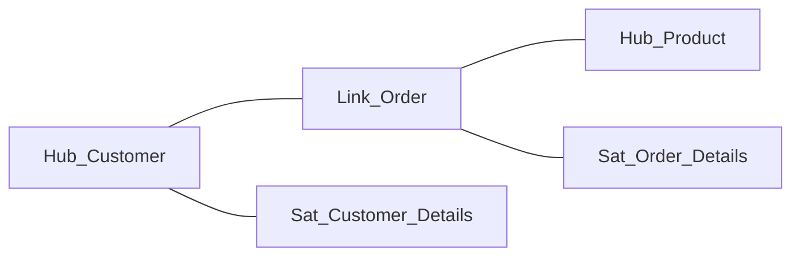

# 05 — Data Vault & Modern Modeling

## Beyond star schema

Star schema (Kimball) is the dominant analytics model, but two other approaches come up for a senior data engineer: **Data Vault** (for large, agile enterprise warehouses) and **wide/One-Big-Table (OBT)** modeling (for modern column-store/lakehouse engines).

---

## Data Vault 2.0

**What it is:** an enterprise modeling method optimized for **scalability, auditability, and agility** — built to absorb changing sources and load in parallel. It splits data into three component types:

| Component | Holds | Analogy |
|---|---|---|
| **Hub** | The **business keys** (e.g., customer_id) + metadata | The index of "things that exist" |
| **Link** | The **relationships** between hubs (customer↔order) | The connections between things |
| **Satellite** | The **descriptive attributes + history** of a hub/link | The changing details, versioned by load date |

**Why use it:**
- **Auditability** — everything is insert-only and timestamped (full lineage/history by design).
- **Agility** — adding a new source = adding satellites/links, without redesigning existing tables.
- **Parallel loading** — hubs, links, satellites load independently.

**Trade-off:** many tables and lots of joins → **not** query-friendly for BI. Data Vault is a **raw/integration** layer; you still build **star-schema marts** on top for consumption.

> **Interview framing:** "Data Vault for the integration/enterprise layer (auditability + agility), Kimball star schema for the presentation/serving layer (query speed)."

---

## Wide tables / One Big Table (OBT)

Modern **column-store** engines (Delta, Parquet, Snowflake, BigQuery) read only the columns a query needs, so a single **denormalized wide table** can outperform a star schema for many dashboards (no joins at all).

- **Pros:** zero joins, dead-simple for analysts, great with columnar compression + data skipping.
- **Cons:** redundancy, harder to maintain conformed logic, can get unwieldy for complex models.
- **When:** a specific report/feature table, ML feature tables, or when join cost dominates.

> Reality: modern lakehouses often mix **star schema** (governed, reusable) with **OBT Gold tables** (per-use-case, join-free).

---

## Modeling for the lakehouse (medallion mapping)

| Layer | Modeling approach |
|---|---|
| **Bronze** | Raw, as-ingested (no modeling) |
| **Silver** | Cleaned, conformed, often **normalized/3NF-ish** or Data Vault (integration) |
| **Gold** | **Dimensional star schema** and/or **OBT** for serving |

So the modeling techniques from this whole module land in specific layers: normalization/Data Vault in Silver (integrity/integration), dimensional/OBT in Gold (consumption).

---

## Choosing an approach
| Need | Approach |
|---|---|
| BI / dashboards / reporting | **Star schema** (Kimball) |
| Large, evolving, audit-heavy enterprise warehouse | **Data Vault** (+ star marts on top) |
| Single fast report / ML features / join-free | **Wide table / OBT** |
| Application / transactional | **Normalized ER (3NF)** |

---

## Pro / Interview notes
- Be able to **compare** Kimball (star), Inmon (top-down 3NF EDW), and Data Vault — and say *when* each fits.
- **Inmon vs Kimball:** Inmon = top-down normalized enterprise warehouse then marts; Kimball = bottom-up conformed dimensional marts. Data Vault is a third option focused on the integration layer.
- **Modern take:** most Azure lakehouses use **medallion + dimensional Gold**, sometimes Data Vault in Silver for heavily-regulated/large enterprises.
- **Common mistake:** using Data Vault as the serving layer (too many joins) — always build star marts for consumption.

---

## Quick Review
- ✔ **Data Vault** = Hubs (keys) + Links (relationships) + Satellites (attributes/history); auditable, agile, parallel-loadable — an **integration** layer, not for BI
- ✔ Build **star marts on top** of Data Vault for consumption
- ✔ **OBT / wide tables** exploit column stores → join-free, great for specific reports/ML
- ✔ Lakehouse mapping: Silver = normalized/Data Vault; **Gold = star / OBT**
- ✔ Know Kimball vs Inmon vs Data Vault and when each fits

## Further Learning — Docs & Videos
- Data Vault 2.0 overview: https://www.databricks.com/glossary/data-vault
- Kimball vs Inmon vs Data Vault: https://www.youtube.com/results?search_query=kimball+vs+inmon+vs+data+vault
- One Big Table vs star schema: https://www.youtube.com/results?search_query=one+big+table+vs+star+schema

Next: test yourself — **[Interview Questions & Answers](Interview_Questions_and_Answers.md)**.
