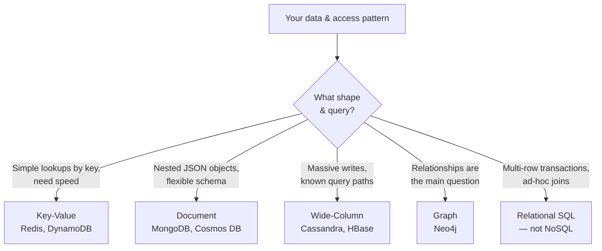

# NoSQL — Learning Path

NoSQL is the family of databases built for **scale, flexible schemas, and shapes of data that relational tables handle awkwardly** — JSON documents, key-value caches, huge time-series tables, and graphs of relationships. As a data engineer you meet NoSQL as the **source system** feeding your pipelines (an app on MongoDB or Cosmos DB), as a **serving layer** for low-latency apps, and as a **cache** in front of slower stores. This module sits alongside [SQL](../SQL/01_What_is_SQL.md) and [Data Modeling](../Data_Modeling/00_Data_Modeling_Learning_Path.md).

**No coding background required.** Each note leads with a plain-language idea and a real-world analogy, then builds to job-ready depth and practical scenarios.

---

## Why NoSQL matters for a data engineer
- Modern apps store data as **JSON documents**, not neat rows — you will ingest, flatten, and model that data constantly.
- NoSQL powers the **speed layer**: shopping carts, session state, feature stores, real-time leaderboards, IoT ingestion.
- Knowing **when NOT to use NoSQL** (and why) is exactly the judgment interviews probe. "Use the right tool" beats "NoSQL is web-scale."
- In Azure, **Cosmos DB** is the flagship NoSQL service and a frequent DP-203 / DP-700 topic.

---

## Reading order

| # | File | What you'll learn |
|---|---|---|
| 01 | [What is NoSQL?](01_What_is_NoSQL.md) | Definition, why it exists, SQL vs NoSQL, the four families, when to use each |
| 02 | [Key-Value Stores](02_Key_Value_Stores.md) | Redis, DynamoDB — the simplest, fastest model; caching and sessions |
| 03 | [Document Databases](03_Document_Databases.md) | MongoDB, Cosmos DB — JSON documents, embedding vs referencing |
| 04 | [Wide-Column Stores](04_Wide_Column_Stores.md) | Cassandra, HBase — partition keys, huge write-heavy tables |
| 05 | [Graph Databases](05_Graph_Databases.md) | Neo4j — nodes, edges, relationship-first queries |
| 06 | [CAP Theorem & Consistency](06_CAP_Theorem_and_Consistency.md) | CAP, BASE vs ACID, consistency levels, replication, sharding |
| 07 | [NoSQL Data Modeling](07_NoSQL_Data_Modeling.md) | Model by access pattern, denormalize, avoid unbounded documents |
| 08 | [Azure Cosmos DB](08_Azure_Cosmos_DB.md) | Partition keys, RUs, APIs, consistency — the Azure flagship |
| 09 | [NoSQL in Data Engineering](09_NoSQL_in_Data_Engineering.md) | Ingesting NoSQL into the lakehouse, CDC, practical scenarios |
| — | [Interview Questions & Answers](Interview_Questions_and_Answers.md) | Test yourself across the module |

---

## How each note is structured
1. **What is it?** — plain definition + real-world analogy.
2. **Example** — a concrete document/command/diagram.
3. **Advanced** — the rules and trade-offs used in real projects.
4. **Pro / Interview** — design decisions, gotchas, and interview-grade Q&A.

---

## The big picture

Golden rule: **relational stores data by its structure; NoSQL stores data by how you'll read it.** You model the queries first.

Start here: **[01 — What is NoSQL?](01_What_is_NoSQL.md)**.

## Further Learning — Docs & Videos
- NoSQL explained (MongoDB): https://www.mongodb.com/nosql-explained
- NoSQL databases (AWS): https://aws.amazon.com/nosql/
- Azure Cosmos DB overview (Microsoft Learn): https://learn.microsoft.com/azure/cosmos-db/introduction
- Video — SQL vs NoSQL explained: https://www.youtube.com/results?search_query=sql+vs+nosql+explained+for+beginners
