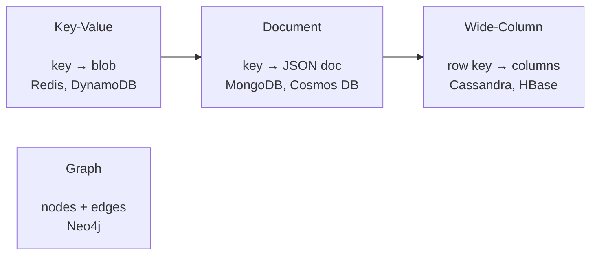

# What is NoSQL?

## What is NoSQL?

NoSQL means **"Not Only SQL"** — a family of databases that deliberately step away from the strict rows-and-columns of a [relational database](../SQL/02_SQL_Database.md) to gain **flexible schemas, horizontal scale, and speed** for particular shapes of data.

Analogy: a relational database is a **spreadsheet with a locked layout** — every row must have the same columns, agreed in advance, and the power comes from joining sheets together. A NoSQL database is more like a **box of labeled folders**: each folder can hold a slightly different set of papers, you grab a folder instantly by its label, and you don't stop to cross-reference twelve other boxes first. You trade the spreadsheet's rigor and joins for the folder box's flexibility and speed.

NoSQL is **not one product and not "anti-SQL."** It's an umbrella over four very different database families (key-value, document, wide-column, graph), and many of them added SQL-like query languages back on top because SQL is genuinely useful.

---

## Why does NoSQL exist? The problem it solved

Around 2005–2010, companies like Google, Amazon, and Facebook hit walls with relational databases:

- **Scale** — a single relational server can only grow so big (scale *up*). Web-scale apps needed to spread one dataset across hundreds of cheap servers (scale *out*), which relational databases do poorly.
- **Schema rigidity** — every `ALTER TABLE` on a billion-row table is painful. Product teams wanted to add fields without migrations.
- **Data shape** — a user profile with nested addresses, preferences, and a list of devices is *one object* in code but shatters into 5+ joined tables in SQL.
- **Speed** — for a shopping cart or a session, you don't need joins and transactions; you need a millisecond lookup by key.

NoSQL databases pick a **narrower job** and do it faster and at bigger scale than a general-purpose relational engine.

---

## SQL vs NoSQL — the core comparison

| Dimension | SQL (Relational) | NoSQL |
|---|---|---|
| **Schema** | Fixed, defined up front | Flexible / schema-on-read; rows can differ |
| **Data model** | Tables, rows, columns | Key-value, document, wide-column, or graph |
| **Scaling** | Vertical (bigger server); sharding is hard | Horizontal (add commodity nodes) by design |
| **Joins** | First-class, powerful | Usually none — you pre-join by embedding/duplicating |
| **Transactions** | ACID across many rows/tables | Often BASE; limited/partition-scoped transactions |
| **Query language** | SQL (standard) | Per-product APIs (some SQL-like) |
| **Best for** | Complex relationships, ad-hoc queries, integrity | Known access patterns, huge scale, flexible/nested data |
| **Consistency** | Strong by default | Tunable, often eventual |

Mantra: **SQL is model-your-data-then-query; NoSQL is model-your-queries-then-store.**

---

## The four families of NoSQL

| Family | Stores data as | Grab data by | Great for | Learn more |
|---|---|---|---|---|
| **Key-Value** | A value blob under a unique key | The key only | Caching, sessions, feature flags | [02](02_Key_Value_Stores.md) |
| **Document** | Self-contained JSON/BSON documents | Key or fields inside the doc | App data, catalogs, profiles | [03](03_Document_Databases.md) |
| **Wide-Column** | Rows with flexible column sets, grouped by partition | Partition + clustering key | Time-series, IoT, huge write volume | [04](04_Wide_Column_Stores.md) |
| **Graph** | Nodes connected by relationships | Traversing relationships | Social networks, fraud, recommendations | [05](05_Graph_Databases.md) |

---

## When to use NoSQL — and when NOT to

**Reach for NoSQL when:**
- You know your **access patterns** in advance and they're simple (get by key, list by partition).
- Data is **naturally nested/semi-structured** (JSON from apps, events, IoT).
- You need to **scale writes/reads horizontally** to very high volume.
- Schema changes frequently or varies per record.

**Stay with relational SQL when:**
- You need **ad-hoc queries and joins** across many entities (analytics, reporting).
- **Multi-row/multi-table ACID transactions** are essential (banking, inventory ledgers).
- Data has **strong, stable relationships** and integrity matters more than raw scale.
- The dataset is moderate and a single strong server is plenty.

The senior answer to "SQL or NoSQL?" is almost never dogmatic — it's **"what are the access patterns, the scale, and the consistency needs?"** Most real systems use *both* (polyglot persistence): Postgres for orders, Redis for the cart, Elasticsearch for search.

---

## Azure Usage

Azure's NoSQL flagship is **Azure Cosmos DB** — a globally distributed, multi-model service exposing several APIs (NoSQL/document, MongoDB, Cassandra, Gremlin/graph, Table). Other Azure NoSQL options: **Azure Cache for Redis** (key-value), **Azure Table Storage** (cheap key-value/wide-column), and **Azure Managed Instance for Apache Cassandra**. As a data engineer you'll frequently ingest from Cosmos DB into a lakehouse via **Change Feed** or **Synapse Link**. See [08_Azure_Cosmos_DB.md](08_Azure_Cosmos_DB.md).

---

## Real World Example

An e-commerce site is *polyglot*: **PostgreSQL** holds orders and payments (needs ACID and joins for finance), **MongoDB/Cosmos DB** holds the product catalog (each product a flexible JSON doc with varying attributes), **Redis** holds each shopper's cart and session (millisecond key lookups), **Elasticsearch** powers search, and a **graph database** powers "customers who bought this also bought." No single store is "best" — each family is chosen for its access pattern.

---

## Schema-on-write vs schema-on-read

Relational databases are **schema-on-write**: the structure is enforced the moment you insert, so bad data is rejected at the door. Most NoSQL stores are **schema-on-read**: they'll store almost any shape, and *your code* imposes meaning when it reads. This is powerful (fast iteration, mixed shapes) but shifts the burden — **the database no longer protects you from inconsistent data**, so validation moves into the application and pipeline. As a data engineer ingesting NoSQL, you'll spend real effort handling documents where a field is a string in some records and an object in others.

## "NoSQL is schemaless" is a myth

There's always a schema — it just lives somewhere. In NoSQL it lives in your **application code and access patterns** rather than in `CREATE TABLE`. An unmanaged "schemaless" collection becomes a swamp of inconsistent documents that every downstream consumer must defensively parse. Mature teams enforce schema through validation rules (e.g., MongoDB JSON Schema validators, Cosmos DB app-side checks) and treat the *access pattern* as the real design artifact.

## Denormalization is the default, not the exception

Because NoSQL usually can't join, you **duplicate data on purpose** so each read hits one place. An order document embeds a snapshot of the customer name and product name at purchase time. This is a feature (fast reads, historical accuracy) but you accept the cost: **updates must fan out** to every copy, and there's no foreign key keeping copies in sync. This flips a lifetime of relational "never duplicate data" instinct — and is the #1 mental shift for engineers moving to NoSQL. See [07_NoSQL_Data_Modeling.md](07_NoSQL_Data_Modeling.md).

## Horizontal scaling and sharding — the whole point

NoSQL scales by **partitioning (sharding)**: rows are split across nodes by a **partition key**, and each node owns a slice. Pick the key well and load spreads evenly across the cluster; pick it badly and one node gets hammered (a **hot partition**) while others idle. This single decision — *what is my partition key?* — dominates NoSQL performance and is covered in [06](06_CAP_Theorem_and_Consistency.md) and [08](08_Azure_Cosmos_DB.md).

---

## The four families exist because of different physics

- **Key-value** optimizes for the fastest possible O(1) lookup — often in-memory (Redis).
- **Document** optimizes for storing and retrieving whole application objects atomically.
- **Wide-column** optimizes for **write throughput and sequential range scans** on massive tables (log-structured storage / LSM trees — writes are cheap appends).
- **Graph** optimizes for **traversals** where the cost of "friends of friends of friends" stays constant instead of exploding into recursive SQL joins.

Choosing a family isn't fashion — it's matching your dominant operation to the engine's underlying storage design. A senior can explain *why* Cassandra eats writes and *why* a 5-hop query is trivial in Neo4j but murder in SQL.

## Polyglot persistence and the cost of it

Using the right store per job (polyglot persistence) is powerful but not free: more systems to operate, more consistency boundaries, more places for data to drift. The pragmatic modern move is often a **multi-model database** (Cosmos DB, PostgreSQL with JSONB) that covers several patterns "well enough," reserving specialist stores for where they truly earn their keep. "Boring, one database" is a legitimate senior choice.

## NoSQL didn't kill SQL — SQL absorbed NoSQL

The 2010s "NoSQL will replace relational" prediction failed. Instead: relational engines added JSON columns (Postgres JSONB, SQL Server `JSON`), NoSQL engines added SQL-like query languages (Cosmos DB SQL API, CQL), and the industry landed on **"use both, deliberately."** The durable lesson for your career: learn the *access-pattern reasoning*, not the marketing — it transfers across every product.

## Interview-grade Q&A

- *What does NoSQL stand for and mean?* "Not Only SQL" — non-relational databases optimized for scale, flexible schema, and specific data shapes; complements rather than replaces SQL.
- *SQL vs NoSQL in one sentence?* SQL models data by its structure then queries flexibly; NoSQL models data by its queries then stores accordingly.
- *Name the four families with an example each.* Key-value (Redis), document (MongoDB), wide-column (Cassandra), graph (Neo4j).
- *When would you NOT choose NoSQL?* When you need ad-hoc joins/analytics or multi-entity ACID transactions and integrity over raw horizontal scale.
- *Is NoSQL schemaless?* No — the schema lives in the application and access patterns instead of the database; unmanaged "schemaless" data becomes a data swamp.

---

## Further Learning — Docs & Videos

**Documentation**
- NoSQL explained (MongoDB): https://www.mongodb.com/nosql-explained
- What is NoSQL? (AWS): https://aws.amazon.com/nosql/
- SQL vs NoSQL (Microsoft Learn): https://learn.microsoft.com/azure/architecture/data-guide/big-data/non-relational-data

**Videos**
- SQL vs NoSQL explained: https://www.youtube.com/results?search_query=sql+vs+nosql+explained
- NoSQL database types: https://www.youtube.com/results?search_query=types+of+nosql+databases+explained
