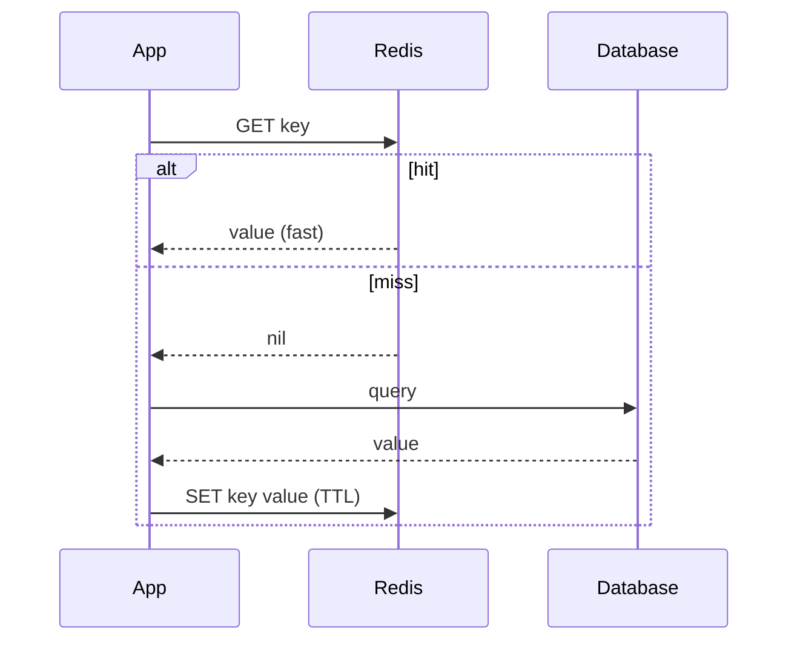

# Key-Value Stores

## What is a key-value store?

A key-value store is the **simplest possible database**: you hand it a unique **key** (a string), and it stores a **value** under that key. To read, you give the key back and get the value instantly. That's the whole model — no tables, no columns, no joins.

Analogy: a **coat check** at a theater. You hand over your coat (the value), get a numbered ticket (the key), and later present the ticket to get your exact coat back in one step. The attendant never rifles through coats looking for "all the wool ones" — that's not what a coat check is for. A key-value store is the same: lightning-fast lookup *by the ticket*, and deliberately bad at searching *inside* the coats.

Examples: **Redis** (in-memory, blazing fast), **Amazon DynamoDB**, **Azure Cache for Redis**, **Azure Table Storage**, **etcd**, **Memcached**.

---

## Example

Conceptually a key-value store is a giant dictionary/hash map:

```
"user:1001:session"   → "{token: abc123, expires: 1699999999}"
"cart:1001"           → "[{sku: 'A9', qty: 2}, {sku: 'B3', qty: 1}]"
"feature:new_checkout"→ "on"
"page:home:views"     → 48213
```

Redis commands feel like talking to that dictionary:

```bash
SET user:1001:session "abc123"     # store
GET user:1001:session              # → "abc123"
EXPIRE user:1001:session 3600      # auto-delete after 1 hour (TTL)
INCR page:home:views               # atomic counter → 48214
DEL cart:1001                      # delete
```

The value is usually **opaque** to the database — often a string, JSON blob, or serialized object. The store doesn't look inside it.

---

## What key-value stores are great at

- **Caching** — keep the result of a slow query/API call in Redis; serve it in microseconds next time.
- **Session storage** — web session state keyed by session ID, with a TTL so it self-expires.
- **Rate limiting & counters** — atomic `INCR` for "requests per minute per user."
- **Feature flags & config** — flip behavior without a deploy.
- **Leaderboards & queues** — Redis has sorted sets and lists for real-time ranking and job queues.

Common thread: **you always know the exact key**, you want the answer *now*, and you don't need to query by the value's contents.

---

## What they're bad at

- **Querying by value** — "find all sessions expiring today" isn't a key lookup; the store won't help.
- **Relationships / joins** — none.
- **Complex analytics** — wrong tool entirely.

If you find yourself wanting to search *inside* values, you've outgrown key-value and want a [document database](03_Document_Databases.md).

---

## Azure Usage

- **Azure Cache for Redis** — managed Redis for caching and session state in front of Azure SQL, Cosmos DB, or APIs; the go-to speed layer.
- **Azure Table Storage / Cosmos DB Table API** — cheap, massively scalable key-value (partition key + row key) for logs, metadata, and simple lookups.
- As a data engineer you'll often put Redis **in front of** a Cosmos DB or SQL serving layer to cut cost and latency for hot reads.

---

## Real World Example

A news website's homepage is expensive to build (dozens of queries). Instead of rebuilding it per visitor, the app caches the rendered homepage in **Redis** under `page:home:v3` with a 60-second TTL. 99% of visitors get the cached copy in under a millisecond; the database is hit at most once a minute. When the story list changes, the app deletes the key and the next request rebuilds it. This one pattern removes most of the load from the primary database.

---
---

# Part 2 — Advanced

## In-memory vs persistent

**Redis** keeps data in **RAM**, which is why it's so fast — but RAM is volatile and limited. Redis offers persistence options (**RDB snapshots** and the **AOF** append-only log) so it can survive restarts, plus replication for HA. Still, the mental model is "fast, mostly-in-memory, treat as rebuildable cache" unless you deliberately configure durability. **DynamoDB** and **Azure Table Storage**, by contrast, are disk-backed and durable by default. Match the tool to whether the data is *rebuildable cache* (Redis) or a *system of record* (DynamoDB/Table).

## TTL and eviction — designing for a full cache

Cache memory is finite, so key-value stores support **TTL** (auto-expire a key after N seconds) and **eviction policies** for when memory fills: `LRU` (drop least-recently-used), `LFU` (least-frequently-used), or `noeviction` (reject writes). Choosing the wrong policy silently breaks things — e.g., `noeviction` on a cache turns a full cache into write errors. Session and cache data should carry a TTL; permanent data should not live in a cache configured to evict.

## Beyond plain strings — Redis data structures

Redis is often called a "data structure server" because values can be rich types, each with atomic operations:

| Type | Use case |
|---|---|
| String / int | Cache, counters (`INCR`) |
| Hash | Store an object's fields under one key |
| List | Queues, recent-activity feeds |
| Set | Unique tags, membership tests |
| Sorted Set (ZSET) | Leaderboards, priority queues, time-ranked feeds |
| Stream | Lightweight event log / message bus |

This is why Redis handles leaderboards and job queues that a plain key-value store couldn't.

## The cache-aside pattern (the one you must know)



The app checks the cache first; on a miss it reads the DB and populates the cache. Simple and dominant — but it introduces **cache invalidation** ("the second hard problem in computer science"): when the DB changes, stale cache entries must be deleted or they serve wrong data.

---

# Part 3 — Pro Level (what 10+ year engineers know)

## Partition key design in DynamoDB / Table Storage

Durable key-value stores at scale use a **composite key**: a **partition key** (which node/slice) plus an optional **sort key** (ordering within the partition). Get this wrong and you create a **hot partition** — e.g., partitioning events by `date` means *today's* partition takes 100% of writes while yesterday's sits idle. Good keys spread load evenly (high cardinality) yet keep related items together for range queries. This is the same partition-key discipline that dominates [wide-column stores](04_Wide_Column_Stores.md) and [Cosmos DB](08_Azure_Cosmos_DB.md).

## The three classic cache failures

- **Cache stampede / thundering herd** — a hot key expires and thousands of requests hit the DB simultaneously to rebuild it. Fix: locks, staggered TTLs, or "serve stale while revalidating."
- **Cache penetration** — repeated requests for keys that don't exist bypass the cache every time. Fix: cache the "not found" result briefly.
- **Cache avalanche** — many keys share the same TTL and expire together, spiking the DB. Fix: jitter TTLs.

Naming these in an interview signals real production experience.

## Consistency: cache vs source of truth

A cache is a *copy*, so it can be stale. Two strategies: **write-through** (write to cache and DB together — consistent but slower writes) vs **cache-aside** (populate lazily — faster but a window of staleness). There's no free lunch; you're choosing where to pay. For money and inventory, don't trust the cache for the final decision — re-read the source of truth before committing.

## Interview-grade Q&A

- *What is a key-value store best for?* Fast lookups by known key: caching, sessions, counters, feature flags — not querying by value or joining.
- *Why is Redis so fast?* It's in-memory and single-threaded with efficient data structures; no disk seek on the hot path.
- *What is TTL and why does it matter?* Time-to-live auto-expires keys — essential for sessions and cache freshness and to bound memory use.
- *Explain cache-aside and its main risk.* App reads cache first, falls back to DB on miss and populates it; the risk is cache invalidation / staleness.
- *What's a hot partition and how do you avoid it?* One partition key taking disproportionate traffic; avoid with a high-cardinality, evenly-distributed key.

---

## Further Learning — Docs & Videos

**Documentation**
- Redis data types: https://redis.io/docs/latest/develop/data-types/
- Amazon DynamoDB — key concepts: https://docs.aws.amazon.com/amazondynamodb/latest/developerguide/HowItWorks.CoreComponents.html
- Azure Cache for Redis: https://learn.microsoft.com/azure/azure-cache-for-redis/cache-overview

**Videos**
- Redis crash course: https://www.youtube.com/results?search_query=redis+crash+course
- Caching strategies explained: https://www.youtube.com/results?search_query=cache+aside+write+through+caching+strategies
