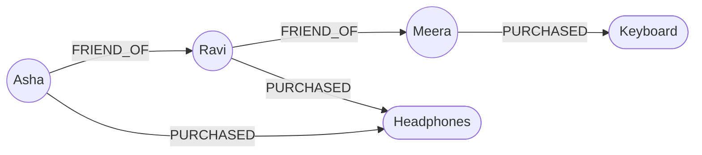

# Graph Databases

## What is a graph database?

A graph database stores data as **nodes** (things) connected by **edges** (relationships), where the *relationships themselves are first-class data* you can store properties on and traverse instantly. It's built for questions where the **connections** are the point.

Analogy: a graph database is a **whiteboard covered in sticky notes joined by drawn arrows**. Each sticky note is a person, product, or account (a node); each arrow is a relationship — "FRIEND_OF," "PURCHASED," "REPORTS_TO" — and the arrows can carry labels like "since 2019." To answer "who is connected to whom, and how," you just follow the arrows. You don't reconstruct the connections by cross-referencing a dozen spreadsheets — they're drawn right there.

Examples: **Neo4j**, **Azure Cosmos DB (Gremlin API)**, **Amazon Neptune**, **ArangoDB**, **TigerGraph**.

---

## Example

A tiny social + purchase graph:



In **Neo4j's Cypher** query language, "friends of Asha's friends who bought Headphones" is a short, readable traversal:

```cypher
MATCH (asha:Person {name:'Asha'})-[:FRIEND_OF]->()-[:FRIEND_OF]->(fof:Person)
      -[:PURCHASED]->(p:Product {name:'Headphones'})
RETURN fof.name
```

The pattern in the `MATCH` clause is literally a picture of the arrows you're following. Nodes have **labels** (`:Person`) and **properties** (`{name:'Asha'}`); edges have **types** (`:FRIEND_OF`) and can have properties too (`{since: 2019}`).

---

## Why graphs exist: the join problem

Relationships *can* be modeled in SQL (foreign keys, junction tables), but **deep relationship queries destroy relational performance**. "Friends of friends of friends" is a 3-way self-join; go 5–6 hops (fraud rings, supply chains) and the joins multiply combinatorially until the query is unusable. A graph database stores each node with **direct pointers to its neighbors**, so traversing one more hop costs the same no matter how deep you go (**index-free adjacency**). Deep-relationship queries that are murder in SQL are trivial in a graph.

---

## What graph databases are great at

- **Social networks** — friends, follows, mutual connections.
- **Recommendations** — "customers who bought X also bought Y," "people you may know."
- **Fraud detection** — rings of accounts sharing devices, addresses, or cards.
- **Knowledge graphs** — Google's, and the retrieval layer behind many AI/RAG systems.
- **Network & IT topology, supply chains, identity/access graphs.**

Common thread: the **relationships and their patterns are the primary question**, and they go many hops deep.

---

## What they're bad at

- **Bulk analytical aggregation** ("total sales per region") — a warehouse does that far better.
- **Simple tabular data with shallow relationships** — a graph is overkill; use SQL.
- **Very high write throughput of independent records** — that's a wide-column job.

---

## Azure Usage

**Azure Cosmos DB for Apache Gremlin** is Azure's managed graph API (Gremlin is a graph traversal language, like Cypher). It gives you graph modeling with Cosmos DB's global distribution and scaling. For data engineers, graph data is often built/served operationally and, when analytics are needed, projected into tabular form in the lakehouse — or the graph is used as a **specialized serving layer** beside the warehouse.

---

## Real World Example

A bank fights fraud by modeling **accounts, devices, phone numbers, and addresses as nodes**, with edges when they're shared. A single fraudulent ring might be twenty "different" customers who all quietly connect through two shared devices and one address. In SQL, detecting that means recursive self-joins that time out. As a graph, it's a short traversal: *find clusters of accounts within N hops of a shared device* — the ring lights up instantly. This "connected data" pattern is why graphs took over fraud, recommendations, and knowledge graphs.

---

## Property graph vs RDF

Two graph models exist. The **property graph** (Neo4j, Gremlin) — nodes and edges carry key-value properties — is the common, developer-friendly model. **RDF/triple stores** represent everything as `subject–predicate–object` triples and use **SPARQL**; they dominate formal semantic-web and linked-data/ontology work. For most engineering (social, recommendations, fraud) you'll meet property graphs; know RDF exists and is the standards-based cousin used for knowledge representation.

## Index-free adjacency — the performance secret

The reason graph traversals stay fast is **index-free adjacency**: each node physically stores direct references to its adjacent edges/nodes, so "get this node's neighbors" is a pointer hop, not an index lookup or join. Query cost scales with the **size of the result you touch**, not the total size of the database. That's why a 6-hop query on a billion-node graph can beat the same logic as SQL joins — the graph never scans or joins the whole dataset, it just walks the local neighborhood.

## Cypher and Gremlin — thinking in patterns

Graph query languages express **patterns**, not tables. Cypher's ASCII-art `(a)-[:REL]->(b)` describes the shape you want to find; the engine finds every match. This is a genuinely different mindset from SQL's set operations — you describe a *walk through the graph*. Variable-length patterns (`-[:FRIEND_OF*1..3]->`) express "1 to 3 hops away" in a few characters, something that needs recursive CTEs and pain in SQL.

## Graphs in AI: GraphRAG and knowledge graphs

A modern, job-relevant use: **knowledge graphs feeding LLMs**. Instead of retrieving loose text chunks, **GraphRAG** retrieves a connected subgraph of facts and their relationships, giving the model structured, linked context and reducing hallucination. If you work near AI/RAG systems, graph databases are increasingly part of the retrieval architecture — a strong talking point in 2026 interviews.

---

## Graph is a serving model, rarely a warehouse

Graphs excel at **traversal queries on connected data**, not at scanning-and-aggregating billions of rows. The senior pattern is to keep the graph as a **specialized operational/serving store** (fraud checks, recommendations, identity resolution) and **not** try to make it the analytics platform — bulk aggregation still belongs in the lakehouse/warehouse. Data often flows: warehouse computes features → graph serves relationship queries → results feed the app. Using a graph for tabular analytics, or a warehouse for deep traversals, are both classic misfits.

## Supernodes — the graph "hot partition"

The graph equivalent of a hot partition is a **supernode**: a node with a huge number of edges (a celebrity with 50 million followers, a shared "USD" currency node). Traversals through a supernode explode because every path fans out through its millions of edges. Mitigations include partitioning the relationships, filtering by edge properties early, or restructuring the model so the supernode isn't on the hot path. Recognizing supernodes is a mark of graph experience.

## Scaling graphs is genuinely hard

The same **index-free adjacency** that makes traversals fast makes **horizontal sharding hard** — if a traversal crosses machines, you lose the cheap pointer hop and pay network cost. So graph databases historically scale *up* better than *out*, and distributed graph systems are complex. Practically: graphs shine when the connected dataset fits a well-provisioned cluster and the value is in deep queries — not as an infinite-scale firehose store (that's wide-column's job).

## Interview-grade Q&A

- *When do you choose a graph database?* When relationships and multi-hop traversals are the core question — social, recommendations, fraud rings, knowledge graphs.
- *Why are deep-relationship queries faster in a graph than in SQL?* Index-free adjacency: nodes point directly to neighbors, so each extra hop is a pointer walk, not another join over the whole table.
- *Nodes, edges, properties — what are they?* Nodes are entities, edges are typed relationships between them, and both can carry key-value properties.
- *Property graph vs RDF?* Property graphs (Neo4j/Gremlin) attach properties to nodes/edges; RDF stores subject-predicate-object triples queried with SPARQL for semantic/linked data.
- *What's a supernode and why is it a problem?* A node with an enormous number of edges; traversals through it fan out and blow up performance.
- *Is a graph a good analytics warehouse?* No — it's a traversal/serving store; bulk aggregation belongs in a lakehouse/warehouse.

---

## Further Learning — Docs & Videos

**Documentation**
- Neo4j graph database concepts: https://neo4j.com/docs/getting-started/
- Cypher query language: https://neo4j.com/docs/cypher-manual/current/
- Cosmos DB for Gremlin: https://learn.microsoft.com/azure/cosmos-db/gremlin/introduction

**Videos**
- Graph databases explained: https://www.youtube.com/results?search_query=graph+database+explained+neo4j
- Neo4j / Cypher crash course: https://www.youtube.com/results?search_query=neo4j+cypher+crash+course
