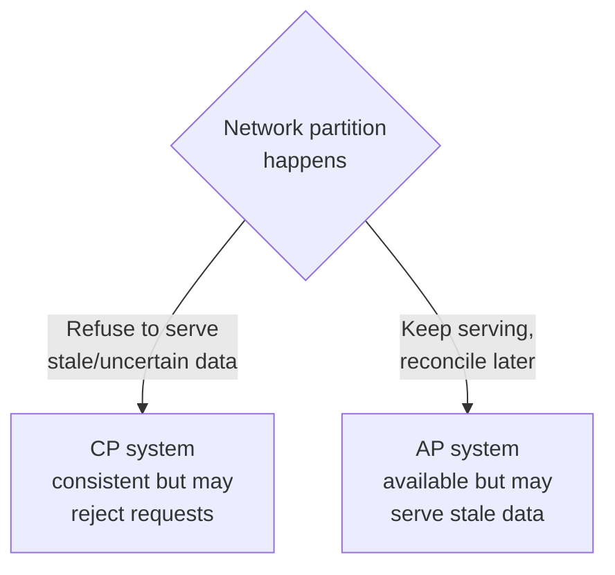

# CAP Theorem & Consistency

## What is the CAP theorem?

The CAP theorem says that any **distributed** database (one spread across multiple machines) can fully guarantee only **two of these three** properties at the same time:

- **C — Consistency**: every read sees the most recent write; all nodes agree.
- **A — Availability**: every request gets a (non-error) response, even if some nodes are down.
- **P — Partition tolerance**: the system keeps working even when the network between nodes breaks (a "partition").

Analogy: two shopkeepers run **branches of the same store** and normally phone each other after every sale to stay in sync. One day the **phone line goes down** (a partition). Now each shopkeeper faces a choice: (a) **keep selling** and risk selling the same last item twice — that's choosing **Availability** over Consistency; or (b) **stop selling** until the phone works so the books never disagree — that's choosing **Consistency** over Availability. What they *can't* do is both keep selling *and* stay perfectly in sync while the line is down. That impossible-during-a-partition choice is the heart of CAP.

---

## The key insight: P is not optional

In any real distributed system, **network partitions will happen** — cables fail, nodes crash, regions disconnect. So you don't really get to "pick any two." **P is mandatory**, which means the real choice is:

> **When a partition happens, do you sacrifice Consistency (stay CP) or Availability (stay AP)?**

| Choice | Behavior during a partition | Example systems | Fits |
|---|---|---|---|
| **CP** (Consistency + Partition tolerance) | Reject/block requests rather than return possibly-wrong data | HBase, MongoDB (default), Cosmos DB (strong) | Banking, inventory, anything where wrong data is worse than no data |
| **AP** (Availability + Partition tolerance) | Always respond, accept temporary disagreement | Cassandra, DynamoDB, Cosmos DB (eventual) | Shopping carts, social feeds, IoT — uptime beats perfect freshness |

There's no universally "better" choice — it depends on whether **wrong data or downtime** hurts your business more.

---

## ACID vs BASE

Relational databases promise **ACID**; many NoSQL systems offer **BASE** instead — a deliberate relaxation to gain scale and availability.

| ACID (relational) | BASE (many NoSQL) |
|---|---|
| **A**tomicity — all or nothing | **BA** — Basically Available (always responds) |
| **C**onsistency — always valid state | **S** — Soft state (may change without input, as replicas sync) |
| **I**solation — transactions don't interfere | **E** — Eventually consistent (converges over time) |
| **D**urability — committed data survives | |

BASE trades "always perfectly consistent" for "always available and horizontally scalable." A social media like count being off by a few for a second is fine (BASE); your bank balance being off by a few is not (ACID). See [SQL DCL/TCL](../SQL/12_SQL_DCL_TCL.md) for ACID transactions in the relational world.

---

## Eventual consistency, in plain terms

"**Eventually consistent**" means: after a write, different replicas may briefly disagree, but if no new writes come in, they will **all converge** to the same value soon (usually milliseconds). You post a comment; a friend in another region might not see it for a heartbeat, then does. This is the normal, acceptable trade for planet-scale availability — as long as you *know* it's happening and don't build money-critical logic on a possibly-stale read.

---

## Azure Usage

**Azure Cosmos DB** turns CAP into a **dial** rather than a fixed choice: it offers **five consistency levels** — Strong, Bounded Staleness, Session, Consistent Prefix, Eventual — letting you trade consistency for latency, availability, and cost per workload. **Session consistency** (the default) is the sweet spot for most apps: a user always sees their own writes, while the global system stays fast and available. This is the single most Cosmos-DB-specific CAP concept — see [08_Azure_Cosmos_DB.md](08_Azure_Cosmos_DB.md).

---

## Real World Example

A global shopping site runs its **cart on an AP store** (Cassandra/DynamoDB): during a network blip a user must *never* see "service unavailable," so the system stays available and reconciles cart replicas afterward — worst case, a re-added item. But **checkout and payment** run on a **CP / ACID** path: if the system can't be *sure* an item is in stock and the card charged exactly once, it must **refuse** rather than risk double-charging or overselling. Same company, two different CAP choices, chosen by what failure is more costly.

---
---

# Part 2 — Advanced

## PACELC — the theorem CAP left out

CAP only describes behavior *during a partition*, but partitions are rare. **PACELC** completes the picture: **if Partition (P) then choose A or C; Else (E) choose Latency (L) or Consistency (C)**. It says that *even when the network is healthy*, a distributed system still trades **latency vs consistency** — waiting for all replicas to confirm (consistent, slower) vs answering from one (fast, maybe stale). This is the more honest, everyday model: Cosmos DB's consistency levels are essentially a PACELC dial. Mentioning PACELC signals you understand CAP is only half the story.

## Replication: how the copies are kept

Distributed databases keep **multiple replicas** of each piece of data for durability and availability. Two styles:

- **Leader–follower (primary–replica)** — one node accepts writes, others copy them. Simpler, but the leader is a bottleneck/failure point (failover promotes a follower).
- **Leaderless / multi-master** — any node accepts writes (Cassandra, DynamoDB), reconciling via quorums and conflict resolution. Highly available, but needs strategies for conflicting concurrent writes.

Replication is *why* CAP exists at all — with one copy there'd be nothing to keep consistent.

## Quorums: tuning consistency with N, R, W

Leaderless systems tune consistency with three numbers: **N** replicas, **W** nodes that must acknowledge a write, **R** nodes read from. If **R + W > N**, a read is guaranteed to overlap the latest write → **strong-ish consistency**. Lower R and W → faster but possibly stale. This is exactly Cassandra's `ONE`/`QUORUM`/`ALL` levels from [04](04_Wide_Column_Stores.md). The quorum formula is the practical mechanism behind "tunable consistency."

## Sharding (partitioning) for scale

Where replication *copies* data, **sharding splits** it — each shard holds a slice of the dataset on a different node, so the system scales beyond one machine's capacity. The split is by a **partition/shard key**, and (as in every prior chapter) a bad key creates **hot shards**. Real systems combine both: shard for scale, replicate each shard for durability/availability.

---

# Part 3 — Pro Level (what 10+ year engineers know)

## "CA" systems don't really exist (in distributed reality)

Textbooks list CA as an option, but for a genuinely distributed system it's a fiction: since partitions *will* occur and you can't refuse to tolerate them, a "CA" design just means "CP that becomes unavailable, or AP that becomes inconsistent, when the partition inevitably hits." A single-node database is trivially CA because there's nothing to partition — but the moment you distribute, you're really choosing **CP or AP**. Seniors treat CAP as "CP vs AP under partition," not a menu of three.

## Consistency is a spectrum, not a switch

Beyond "strong vs eventual" there's a whole ladder: **strong → bounded staleness → session → consistent prefix → eventual**, plus guarantees like **read-your-writes**, **monotonic reads**, and **causal consistency**. Cosmos DB's five levels map onto this. The pro skill is choosing the **weakest consistency that's still correct for the use case** — because weaker consistency buys lower latency, higher availability, and (in Cosmos DB) lower cost. Defaulting everything to "strong" is often overpaying.

## Idempotency: designing for the AP world

If your system may retry writes (because an AP store returned uncertainly, or a message was redelivered), operations must be **idempotent** — applying them twice equals applying them once. "Set balance to 100" is idempotent; "add 10 to balance" is not. In distributed/eventually-consistent systems and streaming pipelines, idempotency and dedup keys are how you stay correct despite retries and at-least-once delivery. This is where CAP theory meets day-to-day pipeline engineering ([09](09_NoSQL_in_Data_Engineering.md)).

## Interview-grade Q&A

- *State the CAP theorem.* A distributed system can guarantee only two of Consistency, Availability, Partition tolerance simultaneously.
- *Why is the real choice CP vs AP?* Partition tolerance is non-negotiable in distributed systems, so the actual decision is what to sacrifice *when* a partition occurs — consistency or availability.
- *ACID vs BASE?* ACID guarantees strict correctness (relational); BASE (Basically Available, Soft state, Eventually consistent) relaxes it for availability and scale.
- *What is eventual consistency?* Replicas may briefly disagree after a write but converge if writes stop — acceptable when staleness is cheap.
- *What does PACELC add?* Even without a partition (Else), you still trade Latency vs Consistency — the everyday version of the trade-off.
- *How do quorums tune consistency?* With N replicas, requiring R + W > N guarantees reads overlap the latest write; lower R/W trades consistency for speed.
- *Give a system that's AP and one that's CP.* AP: Cassandra/DynamoDB. CP: HBase/MongoDB default. Cosmos DB is tunable across the range.

---

## Further Learning — Docs & Videos

**Documentation**
- CAP theorem (IBM): https://www.ibm.com/topics/cap-theorem
- PACELC & consistency trade-offs (Cosmos DB): https://learn.microsoft.com/azure/cosmos-db/consistency-levels
- ACID vs BASE (MongoDB): https://www.mongodb.com/resources/basics/databases/acid-transactions

**Videos**
- CAP theorem explained: https://www.youtube.com/results?search_query=cap+theorem+explained
- Consistency models in distributed systems: https://www.youtube.com/results?search_query=eventual+consistency+distributed+systems+explained
