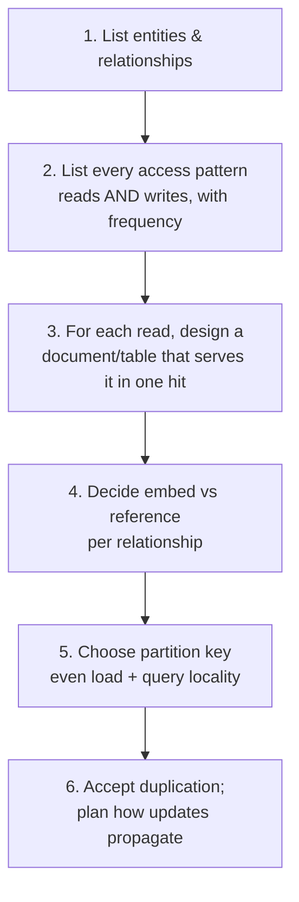

# NoSQL Data Modeling

## What is NoSQL data modeling?

NoSQL data modeling is the practice of designing your collections/tables around **how the application will read and write the data**, rather than around the "pure" structure of the data itself. In relational modeling you normalize first and query later; in NoSQL you **list your queries first and shape the data to serve them**.

Analogy: a relational model is like organizing a **warehouse by category** — all screws in one aisle, all planks in another — very tidy, and you walk around collecting pieces (joins) whenever you build something. NoSQL modeling is like a **flat-pack furniture kit**: everything needed for *this one chair* is boxed together, pre-arranged for the way you'll actually use it. The kit duplicates screws across boxes (you'll find the same screw type in the chair box and the table box), but assembly is fast because nothing is scattered. NoSQL trades the tidy warehouse for ready-to-use kits.

---

## The one rule that changes everything

> **Relational: structure first, then figure out queries. NoSQL: queries first, then design the structure.**

Because most NoSQL stores **can't join**, you can't stitch data together at read time. So you decide, *before* storing anything, exactly which questions the app will ask, and you pre-assemble the answers. This is why two teams with identical data can build completely different NoSQL models — their **access patterns** differ.

---

## The modeling workflow



The center of gravity is **step 2**. If you can't list the access patterns, you're not ready to model — and if they change drastically later, you may need to remodel (the flip side of relational's query-flexibility).

---

## The core techniques

### 1. Denormalize / duplicate on purpose
Store the customer's name *inside* each order so displaying an order needs no lookup. Yes, the name is now in many places. That's accepted — reads are fast and each order keeps a **historical snapshot** (the name at purchase time) which is often what you actually want.

### 2. Embed vs reference (from [Document DBs](03_Document_Databases.md))
- **Embed** small, bounded, read-together data (order line items inside the order).
- **Reference** large, shared, or unbounded data (don't embed the entire product catalog into every order — reference product IDs).

### 3. One table/collection per access pattern (wide-column style)
Need messages by conversation *and* by user? Build two structures, each keyed for its query. Duplication is the price of no-join speed.

### 4. Pre-compute and store aggregates
Instead of counting likes at read time, keep a `likeCount` field and increment it on write. Reads become trivial; you moved the work to write time.

---

## Example: modeling a blog

**Access patterns:** (1) show a post with its author and recent comments; (2) list a user's posts.

A document design that serves pattern (1) in a single read:

```json
{
  "_id": "post_501",
  "title": "Getting started with NoSQL",
  "body": "...",
  "author": { "id": "u_12", "name": "Asha Rao" },   // embedded snapshot (reference id kept too)
  "tags": ["nosql", "databases"],
  "commentCount": 42,
  "recentComments": [                                  // subset pattern: only the latest few
    { "user": "Ravi", "text": "Great post!", "at": "2026-08-01" }
  ]
}
```

- `author` is **embedded as a snapshot** (fast display) but keeps `id` so we can also **reference** the full user.
- `recentComments` uses the **subset pattern** — the latest few for display; the full comment thread lives in a separate `comments` collection referenced by `postId` (comments are unbounded — never embed them all).
- `commentCount` is a **pre-computed aggregate** so we never count at read time.

---

## Azure Usage

In **Cosmos DB**, modeling *is* choosing the **partition key** plus the embed/reference decisions above. The partition key must give even load and keep single-query data together (e.g., partition comments by `postId` so all comments for a post sit in one partition). A great data model keeps most queries **single-partition** (cheap, fast) and avoids **cross-partition fan-out** (expensive). See [08_Azure_Cosmos_DB.md](08_Azure_Cosmos_DB.md).

---

## Real World Example

An order-history screen must load instantly. The team **embeds** line items and a **snapshot** of the customer name and each product's name/price *as they were at purchase time* directly in the order document — so rendering the page is one read, and it correctly shows historical prices even after the catalog changes. The full mutable product catalog stays in its own collection (referenced by ID) because it's large and shared. This is denormalization, snapshotting, and embed-vs-reference all working together — the everyday craft of NoSQL modeling.

---
---

# Part 2 — Advanced

## Named schema-design patterns

Practitioners (notably the MongoDB community) catalogued reusable patterns worth knowing by name:

| Pattern | Problem it solves |
|---|---|
| **Subset** | Big embedded array — keep only the frequently-read subset in the doc, rest referenced |
| **Bucket** | Time-series flooding you with tiny docs — group readings into per-hour/day "bucket" docs |
| **Computed** | Expensive read-time math — pre-compute and store the result (aggregate) |
| **Extended Reference** | Repeated joins — embed just the *few fields you display* from the referenced entity |
| **Outlier** | A few giant documents (a celebrity user) break the model — handle them specially |
| **Schema Versioning** | Evolving shape — tag docs with `schemaVersion`, migrate lazily |

Naming these in an interview or design review shows you model deliberately, not by guesswork.

## Handling relationships without joins

- **1:1** — embed.
- **1:few** (bounded) — embed the array (addresses on a customer).
- **1:many / 1:squillions** (unbounded) — reference, and query the child collection by the parent's ID; use the subset pattern for the "recent" view.
- **Many:many** — usually reference IDs on one or both sides; sometimes duplicate a small subset for the hot read.

The decision always comes back to **size, growth, and how the data is read** — not to a normalization rule.

## The write-amplification cost of duplication

Denormalization makes reads cheap but **writes expensive and risky**: change a product's name and you may need to update it in thousands of order documents (or accept that old orders keep the old name — often correct!). You must consciously decide, per duplicated field: *is this a historical snapshot (leave it) or a live mirror (must propagate)?* Live mirrors need a fan-out update process, frequently driven by a [change feed](09_NoSQL_in_Data_Engineering.md). Forgetting this produces silent data drift.

---

# Part 3 — Pro Level (what 10+ year engineers know)

## Model for the read/write ratio and the money

The right model depends on **which operation dominates and what it costs**. Read-heavy display data → denormalize hard, pre-compute aggregates, embed. Write-heavy or frequently-changing shared data → reference to avoid fan-out. In Cosmos DB/DynamoDB this is literally a **billing decision** — every read/write consumes provisioned throughput, so a model that turns one screen into one single-partition read instead of ten cross-partition queries directly cuts the monthly bill. Senior NoSQL modeling is as much cost engineering as data engineering.

## The remodeling risk — NoSQL's hidden tax

Relational's flexibility means new questions = new `SELECT`. NoSQL's query-first design means a genuinely **new access pattern can require restructuring data and backfilling** millions of documents. Experienced engineers hedge by (a) keeping reference IDs even inside embedded snapshots so re-linking is possible, (b) landing raw data in a lakehouse where *any* query is possible, and (c) reserving aggressive denormalization for patterns they're confident are stable. Knowing this trade-off is exactly why "it depends" is the honest answer to SQL-vs-NoSQL.

## Don't model NoSQL like relational (the #1 failure)

The most common disaster is taking a normalized relational schema, mapping each table to a collection, and then trying to "join" in application code across collections — you get the worst of both worlds: no joins *and* no denormalization benefit, with N+1 query storms killing performance. If your NoSQL design has lots of collections you constantly cross-reference at read time, you've modeled it relationally by accident. Redesign around access patterns.

## Interview-grade Q&A

- *What's the fundamental difference in modeling NoSQL vs relational?* Relational models the data's structure then queries flexibly; NoSQL lists access patterns first and shapes data to serve them (no joins).
- *When embed vs reference?* Embed small, bounded, read-together data; reference large, shared, or unbounded data.
- *Why duplicate data in NoSQL?* No joins — pre-assembling answers makes reads a single fast operation; snapshots also capture point-in-time history.
- *What's the downside of denormalization and how do you manage it?* Write amplification and drift risk; decide snapshot-vs-mirror per field and fan out mirror updates via a change feed.
- *Name three NoSQL schema patterns.* Subset, bucket, computed (also extended-reference, outlier, schema-versioning).
- *What's the classic NoSQL modeling mistake?* Modeling it like relational — many collections cross-referenced at read time, causing N+1 query storms.

---

## Further Learning — Docs & Videos

**Documentation**
- MongoDB schema design patterns: https://www.mongodb.com/developer/products/mongodb/mongodb-schema-design-best-practices/
- Cosmos DB data modeling & partitioning: https://learn.microsoft.com/azure/cosmos-db/nosql/modeling-data
- DynamoDB single-table design: https://docs.aws.amazon.com/amazondynamodb/latest/developerguide/bp-modeling-nosql.html

**Videos**
- NoSQL data modeling: https://www.youtube.com/results?search_query=nosql+data+modeling+access+patterns
- MongoDB schema design patterns: https://www.youtube.com/results?search_query=mongodb+schema+design+patterns
