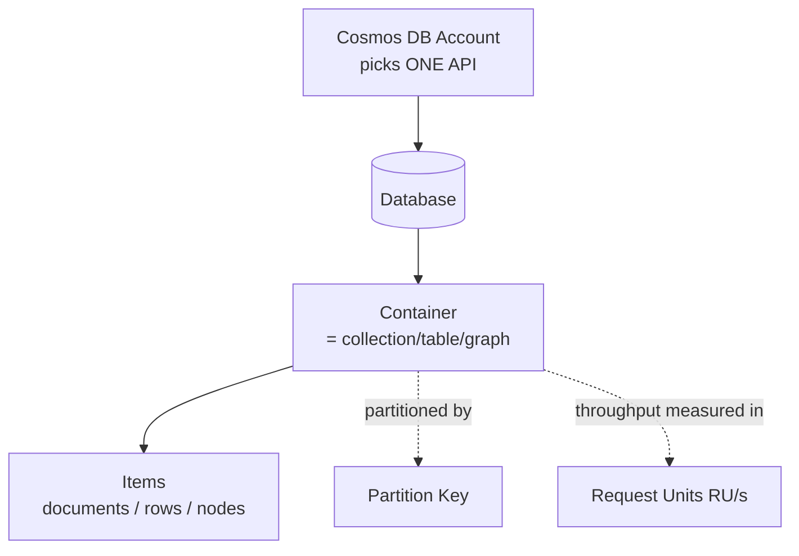

# Azure Cosmos DB

## What is Azure Cosmos DB?

Azure Cosmos DB is Microsoft's **globally distributed, multi-model NoSQL database** — a single managed service that can store documents, key-value, wide-column, or graph data, replicate it across the world with a click, and scale throughput elastically. It's Azure's flagship NoSQL offering and a recurring topic on the **DP-203** and **DP-700** certifications.

Analogy: Cosmos DB is like a **global chain of identical warehouses**. You store an item once and the chain automatically keeps a copy in every region you choose, so a customer anywhere reaches their *local* warehouse in milliseconds. You don't run the trucks, staff the buildings, or copy inventory between them — you just say "I want presence in these three regions" and Microsoft handles the logistics. You pay for the shelf space and the number of pick-and-pack operations, not for the buildings.

---

## The building blocks

| Concept | What it is |
|---|---|
| **Account** | Top-level resource; you choose its **API** here (see below) |
| **Database** | A namespace grouping containers |
| **Container** | The unit of scale — a collection (docs), table (rows), or graph. Throughput and partition key are set here |
| **Item** | A single document / row / node |
| **Partition key** | The field that decides how items are distributed across physical partitions |
| **Request Unit (RU/s)** | The currency of throughput — every read/write/query costs RUs |

---

## The APIs — one engine, many faces

You pick **one API per account**, usually to match existing skills or to migrate an app with minimal changes:

| API | Model | Use / migration story |
|---|---|---|
| **NoSQL (Core/SQL)** | Document | The native, most feature-rich API; SQL-like queries over JSON — default choice for new apps |
| **MongoDB** | Document | Wire-compatible with MongoDB — lift-and-shift existing Mongo apps |
| **Cassandra** | Wide-column | CQL-compatible — migrate Cassandra workloads |
| **Gremlin** | Graph | Graph traversals ([05](05_Graph_Databases.md)) |
| **Table** | Key-value | Upgrade path from Azure Table Storage |
| **PostgreSQL** | Distributed relational | Citus-based; not NoSQL, but offered under the Cosmos DB umbrella |

The **NoSQL (Core) API** is the one to learn first — it's native and exam-favored.

---

## The two decisions that define Cosmos DB

Everything about performance and cost comes down to two choices:

### 1. Partition key
Cosmos DB spreads a container's data across **physical partitions** by the partition key (same idea as every prior chapter). A **good** key:
- has **high cardinality** (many distinct values) so load spreads evenly,
- **groups data you query together** into the same partition (so common queries are single-partition and cheap),
- **spreads writes** so no single partition is a hot spot.

Bad key → **hot partition** (one partition throttled while others idle) and expensive **cross-partition** queries. This is the #1 Cosmos DB design decision and a guaranteed interview/exam topic.

### 2. Request Units (RU/s)
Cosmos DB abstracts CPU, memory, and IO into one currency: the **Request Unit**. A point-read of a 1 KB item ≈ **1 RU**; writes and queries cost more; a big cross-partition query can cost hundreds. You provision (or autoscale) **RU/s per container/database**, and if you exceed it you get **throttled (HTTP 429)** and must retry. So performance tuning = **reducing the RUs your access patterns consume** (good partition keys, point reads over queries, right indexing). RU/s + storage = your bill.

---

## Consistency levels — the CAP dial

Cosmos DB exposes **five consistency levels** (from [06](06_CAP_Theorem_and_Consistency.md)), trading consistency against latency, availability, and cost:

| Level | Guarantee | Cost/latency |
|---|---|---|
| **Strong** | Always the latest write, globally | Highest latency/RU; no stale reads |
| **Bounded Staleness** | At most K versions / T seconds behind | High |
| **Session** (default) | Read-your-own-writes within a session | Balanced — the usual choice |
| **Consistent Prefix** | Reads never see out-of-order writes | Low |
| **Eventual** | Replicas converge eventually | Lowest latency/RU |

**Session** is the default and right for most apps. Pick **Strong** only where you truly need it (its cost and latency are real); pick **Eventual** for cheap, fast, staleness-tolerant reads.

---

## Real World Example

A retailer runs its product catalog and shopping app on **Cosmos DB (NoSQL API)**, partitioned by `categoryId`, replicated to three regions so shoppers worldwide get local low latency. They set **Session** consistency (users always see their own cart edits), **autoscale RU/s** to ride the daily traffic curve without overpaying at night, and design screens as **single-partition point reads** to keep RU cost low. For analytics, they enable **Azure Synapse Link** so the data team queries a separate analytical copy with Spark/SQL — **without touching the transactional RUs** the live app depends on.

---

## Global distribution & multi-region writes

Adding a region is a checkbox — Cosmos DB replicates your data there and routes users to the nearest replica automatically. You can also enable **multi-region writes** (active-active), so every region accepts writes locally for the lowest write latency and highest availability. The cost is **conflict resolution**: two regions might update the same item concurrently, resolved by a last-write-wins policy or a custom procedure. This is CAP/PACELC ([06](06_CAP_Theorem_and_Consistency.md)) made operational — global availability in exchange for conflict handling.

## Indexing policy — automatic, but tunable

By default Cosmos DB **automatically indexes every property** of every item, which makes queries flexible but adds RU cost to writes and consumes storage. For write-heavy containers you tune the **indexing policy** — include only the paths you actually filter/sort on, exclude the rest — to cut write RUs. This mirrors the [SQL index](../SQL/11_SQL_Indexes.md) trade-off: index for your query patterns, not for everything.

## Change Feed — the pipeline hook

Every container exposes a **Change Feed**: an ordered, persistent log of all inserts and updates (not deletes, by default). This is the primary way data engineers get data *out* of Cosmos DB in near-real-time — Azure Functions, Databricks, or Azure Data Factory read the change feed to stream changes into a Delta lakehouse, trigger downstream processing, or fan out denormalized updates. It's Cosmos DB's built-in CDC and the backbone of [NoSQL-to-lakehouse pipelines](09_NoSQL_in_Data_Engineering.md).

## Provisioned vs Autoscale vs Serverless

Three throughput/billing modes:
- **Provisioned (manual RU/s)** — fixed capacity; cheapest for steady, predictable load.
- **Autoscale** — scales RU/s between a floor and 10× ceiling automatically; great for spiky/unknown traffic without over-provisioning.
- **Serverless** — pay strictly per request; ideal for dev/test and low or bursty workloads.

Choosing the wrong mode is a common source of surprise bills — steady heavy load on serverless, or spiky load on high fixed provisioned capacity.

---

## Separating transactional and analytical workloads (HTAP)

Running big analytical queries against the transactional container **steals RUs from the live app** and can throttle real users. The Cosmos DB answer is **Azure Synapse Link**: it maintains a separate **analytical store** (columnar, auto-synced from the transactional store) that Synapse/Spark query **without consuming transactional RUs** — no ETL pipeline to build, no impact on the app. This HTAP pattern (Hybrid Transactional/Analytical Processing) is a favorite architecture question: *how do you analyze Cosmos DB data without hurting the app?* → Synapse Link's analytical store (or Change Feed → lakehouse).

## RU cost is an architecture force

Because every operation is priced in RUs, cost pressure actively shapes good design: **point reads (by id + partition key) are the cheapest possible operation**, so you model to make hot paths point reads; cross-partition queries and unindexed scans are expensive, so you avoid them; oversized items and over-indexing inflate write RUs, so you trim both. The best Cosmos DB engineers read the **RU charge** returned on every request and treat lowering it as the core optimization loop — performance and cost are the same problem here.

## Time-to-Live and hot/cold data

Cosmos DB supports **per-item TTL** to auto-expire data (sessions, transient events) so it doesn't accumulate RU-costly storage. A common pattern: keep **hot, recent** data in Cosmos DB with a TTL, while the **Change Feed continuously offloads everything to cheap Delta/ADLS** for long-term history and analytics. You get fast serving on a small hot set and cheap infinite retention in the lake — a cost-optimized, tiered design.

## Interview-grade Q&A

- *What is Azure Cosmos DB?* A globally distributed, multi-model, fully managed NoSQL database with tunable consistency and elastic RU-based throughput.
- *What are Request Units?* The normalized currency of throughput (CPU/memory/IO); every operation costs RUs and you provision RU/s per container — exceed it and you're throttled (429).
- *How do you choose a partition key?* High cardinality for even distribution, groups query-together data into one partition, and spreads writes to avoid hot partitions.
- *Name the five consistency levels and the default.* Strong, Bounded Staleness, Session (default), Consistent Prefix, Eventual.
- *How do you analyze Cosmos DB data without hurting the app?* Azure Synapse Link's analytical store (or Change Feed → lakehouse) — no RU impact on the transactional store.
- *What is the Change Feed used for?* Near-real-time CDC out of Cosmos DB — streaming changes to lakehouse, triggering functions, fanning out updates.
- *Provisioned vs autoscale vs serverless?* Fixed capacity for steady load; autoscale for spiky load; serverless pay-per-request for dev/low/bursty workloads.

---

## Further Learning — Docs & Videos

**Documentation**
- Cosmos DB introduction: https://learn.microsoft.com/azure/cosmos-db/introduction
- Partitioning & partition keys: https://learn.microsoft.com/azure/cosmos-db/partitioning-overview
- Request Units: https://learn.microsoft.com/azure/cosmos-db/request-units
- Consistency levels: https://learn.microsoft.com/azure/cosmos-db/consistency-levels
- Azure Synapse Link for Cosmos DB: https://learn.microsoft.com/azure/cosmos-db/synapse-link

**Videos**
- Azure Cosmos DB explained: https://www.youtube.com/results?search_query=azure+cosmos+db+explained
- Cosmos DB partitioning & RUs: https://www.youtube.com/results?search_query=cosmos+db+partition+key+request+units
