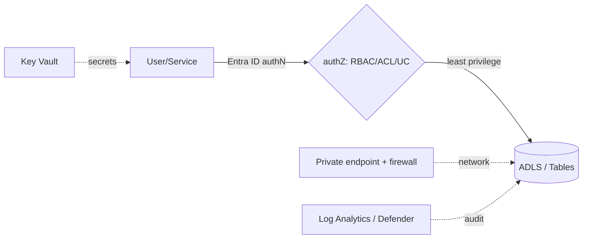

# 01 — Data Governance & Security

## What is data governance?

**Data governance** is the set of policies, roles, and controls that ensure data is **secure, compliant, discoverable, high-quality, and well-understood** across an organization. It answers: *Who owns this data? Who can access it? Where did it come from? Is it sensitive? Can we trust it?*

**Analogy:** A library isn't just shelves of books — it has a catalog (find things), a membership/borrowing system (who can access what), classification (fiction vs reference vs restricted), and records of provenance. Data governance is that library system for your data estate.

---

## The pillars of data governance
| Pillar | What it covers |
|---|---|
| **Cataloging & discovery** | A searchable inventory of data assets, owners, descriptions, glossary |
| **Access control & security** | Who can read/write what (RBAC/ACLs), authentication, encryption |
| **Lineage** | Where data came from and how it flows (source → transform → target) |
| **Classification & privacy** | Tagging sensitive/PII data; masking; GDPR/HIPAA compliance |
| **Data quality** | Accuracy, completeness, validity (see [Data Quality](../Data_Quality/01_Data_Quality_Fundamentals.md)) |
| **Ownership & stewardship** | Accountable owners/stewards per domain |
| **Auditing** | Who accessed/changed what, when |

---

## Security: authentication vs authorization
- **Authentication (authN)** = proving *who you are* (Microsoft Entra ID, Managed Identity, service principals).
- **Authorization (authZ)** = what you're *allowed to do* (RBAC roles, ACLs, GRANTs).
- **authN happens first, then authZ.**

### Access control in Azure DE
| Mechanism | Scope | Example |
|---|---|---|
| **Azure RBAC** | Resource/container level | `Storage Blob Data Contributor` on ADLS |
| **POSIX ACLs (ADLS)** | File/folder level | Fine-grained read/write on a Silver folder |
| **Unity Catalog GRANTs** | catalog/schema/table/column | `GRANT SELECT ON TABLE ... TO group` |
| **Row-Level Security / masking** | Row/column | Show only a user's region; mask PII |

> **Best practice:** grant to **groups**, not individuals; principle of **least privilege**; **RBAC is evaluated before ACLs** on ADLS.

---

## Securing the Azure data platform (the standard answer)
- **Identity:** **Managed Identity** for services (no keys/passwords); Entra ID auth; service principals for automation.
- **Secrets:** store in **Azure Key Vault**; reference via secret scopes / linked services — never hard-code.
- **Network:** **private endpoints + firewalls** (deny public access); VNet integration; Self-Hosted IR for on-prem.
- **Encryption:** **TDE / at-rest** (default), in-transit TLS, **customer-managed keys (CMK)** if required, **Always Encrypted**/column encryption for sensitive fields.
- **Fine-grained:** Unity Catalog RBAC + **dynamic views** (row/column security), dynamic data masking.
- **Monitoring:** diagnostic logs + **Microsoft Defender for Cloud/SQL** + audit to **Log Analytics**.

---

## Governance tools on Azure
- **Microsoft Purview** — estate-wide **catalog, classification (PII), lineage, glossary** across ADLS, SQL, Synapse, Power BI, on-prem, multi-cloud.
- **Unity Catalog (Databricks)** — lakehouse governance: three-level namespace, RBAC to groups, **automatic column/table lineage**, audit, Volumes for files.
- **Azure Policy** — enforce resource configuration/compliance rules.
- **RBAC + Key Vault + Defender** — the security backbone.

> **Purview vs Unity Catalog:** Purview = broad estate-wide cataloging/classification/lineage; Unity Catalog = Databricks-scoped access control + lineage. They **complement** each other.

---

## Compliance & privacy
- **PII classification** (Purview auto-scans for SSN, credit card, etc.).
- **Masking / anonymization** for non-privileged users (dynamic data masking, dynamic views).
- **GDPR "right to be forgotten":** delete a user's data (`DELETE ... WHERE user_id=...` in Delta) then **VACUUM** to physically remove files; verify no lingering copies across zones.
- **Retention policies**, audit trails, and access reviews.

---

## Pro / Interview notes
- The strong security answer bundles: **Managed Identity + RBAC (least privilege) + Key Vault + private endpoints + encryption + Unity Catalog/Purview + Log Analytics auditing.**
- Know **authN before authZ**, **RBAC before ACLs**, and **grant to groups**.
- **Data lineage** (Purview/UC, automatic) is the go-to answer for "where did this column come from / impact analysis."
- **Common mistakes:** account keys/SAS instead of MSI; secrets in code; public network access; per-user grants; ignoring lineage/classification.

---

## Quick Review
- ✔ Governance pillars: **catalog, access/security, lineage, classification/privacy, quality, ownership, audit**
- ✔ authN (who) before authZ (what); **RBAC before ACLs**; grant to **groups**, least privilege
- ✔ Security = **Managed Identity + Key Vault + private endpoints + encryption (TDE/CMK) + fine-grained (UC/RLS/masking) + Log Analytics**
- ✔ **Purview** (estate catalog/classification/lineage) + **Unity Catalog** (lakehouse RBAC/lineage) — complementary
- ✔ GDPR delete = `DELETE` + **VACUUM**; classify + mask PII
- ✔ Azure Policy enforces resource compliance

## Further Learning — Docs & Videos
- Data governance (Microsoft Purview): https://learn.microsoft.com/en-us/purview/purview
- Unity Catalog governance: https://docs.databricks.com/en/data-governance/unity-catalog/index.html
- Azure security fundamentals: https://learn.microsoft.com/en-us/azure/security/fundamentals/
- Video — data governance explained: https://www.youtube.com/results?search_query=data+governance+purview+unity+catalog+explained

Next: **[Interview Questions & Answers](Interview_Questions_and_Answers.md)**.
