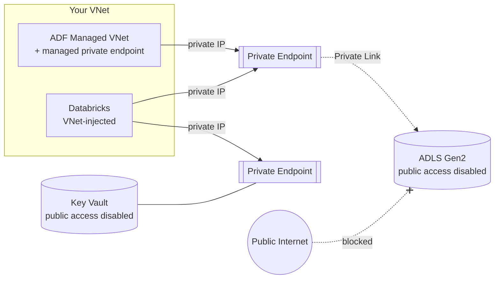

# Network Security & Private Connectivity

## Why this note exists

[Data Governance & Security](01_Data_Governance_and_Security.md) covered **who** can access data (RBAC/ACL, Managed Identity, Key Vault, Purview). This note covers the other half interviewers probe: **how the traffic physically flows** — and how you stop your data ever traversing the public internet. In enterprise Azure DE (banks, healthcare, government), "lock down the network" is a hard requirement, and *"how would you make ADF reach storage privately?"* is a standard senior question.

Analogy: identity is the **ID badge** that says you're allowed in the building. Networking is the **private underground tunnel** between buildings, so no one can even *see* you moving between them, badge or not. Real security uses both — a valid badge on a public street still exposes you.

---

## The core idea: public endpoint vs private endpoint

By default, Azure PaaS services (Storage, Key Vault, SQL, Event Hubs) have a **public endpoint** — a public DNS name reachable from the internet, gated only by keys/identity and an optional firewall. The hardened pattern replaces that with a **private endpoint**.

| | Public endpoint | Service endpoint | **Private endpoint (Private Link)** |
|---|---|---|---|
| Reachable from | Internet (+ firewall rules) | Internet, but VNet gets optimized route | **Only your VNet** — a private IP |
| Traffic path | Public internet | Azure backbone, source = VNet identity | **Azure backbone, never public** |
| Data exfiltration risk | Higher | Medium | **Lowest** |
| Cost | Free | Free | Per-endpoint hourly + data |

A **private endpoint** projects the PaaS service as a **NIC with a private IP inside your VNet**. Combined with **"disable public network access"** on the service, the resource becomes unreachable except from inside the network. **Private Link** is the umbrella technology; the private endpoint is the object you create.

**DNS is the classic gotcha:** a private endpoint only works if the service's DNS name resolves to the *private* IP. That requires a **Private DNS Zone** (e.g. `privatelink.dfs.core.windows.net`) linked to the VNet. "Private endpoint created but connection still goes public / fails" is almost always DNS.

---

## Service-by-service (the ones a DE wires up)

**ADLS Gen2 / Blob** — disable public access, add a **private endpoint** per sub-resource (`dfs`, `blob`). Optionally keep a **storage firewall** allowlisting specific VNets/IPs as a lighter-weight alternative.

**Azure Data Factory** — enable a **Managed Virtual Network** for the Integration Runtime, then create **Managed Private Endpoints** from ADF to each data store. Now ADF's copy/dataflow traffic reaches storage/SQL over Private Link, no public exposure and no self-hosted IR needed just for networking. (A **Self-hosted IR** is still the tool for reaching *on-premises* or other-cloud sources.)

**Azure Databricks** — the hardened deployment combines:
- **VNet injection** — deploy the workspace's clusters into *your* VNet (two delegated subnets), so cluster traffic obeys your NSGs/routes.
- **Secure Cluster Connectivity (SCC / "no public IP")** — clusters get no public IP; the control plane reaches them via a relay.
- **Private Link** — private endpoints for both the front-end (users→workspace) and back-end (clusters→control plane), plus private endpoints to ADLS/Key Vault.

**Azure Key Vault / SQL / Event Hubs / Synapse** — same recipe: private endpoint + disable public access + Private DNS Zone. Synapse adds a **Managed VNet + managed private endpoints**, mirroring ADF.

---

## Supporting controls

- **NSG (Network Security Group)** — subnet/NIC-level allow/deny rules (the stateful firewall on your subnets).
- **User-Defined Routes (UDR) + Azure Firewall / NVA** — force outbound traffic through a firewall for inspection and egress control (limits [data exfiltration](../../16_Cost_and_Performance/03_Storage_and_Query_Cost.md) and controls **egress** cost).
- **Service tags** — named groups of Azure IP ranges (e.g. `Storage`, `AzureDatabricks`) so NSG rules don't hard-code IPs.
- **Managed Identity + Key Vault** ([governance note](01_Data_Governance_and_Security.md)) — networking hides the path; identity still authenticates the caller. Use **both**; never rely on network isolation alone (defense in depth).

---

## Reference "locked-down" architecture

The pattern to describe in an interview:

1. All PaaS services have **public access disabled** + **private endpoints** into a hub/spoke VNet, with **Private DNS Zones**.
2. **ADF Managed VNet** with managed private endpoints to sources/sinks; **Self-hosted IR** only for on-prem.
3. **Databricks** with VNet injection + SCC (no public IP) + Private Link to workspace, control plane, ADLS, Key Vault.
4. Secrets in **Key Vault** (private endpoint), accessed via **Managed Identity** — no keys in code.
5. Egress forced through **Azure Firewall** via UDR; **NSGs** with service tags on every subnet.
6. Access still governed by **RBAC/ACL + Unity Catalog/Purview** on top.

---

## What breaks (and the fix)

| Problem | Fix |
|---|---|
| Private endpoint created, connection still fails/goes public | Missing/mis-linked **Private DNS Zone** — resolve the name to the private IP |
| ADF can't reach storage after disabling public access | Enable **Managed VNet** + **managed private endpoint** from ADF to that store |
| Databricks clusters can't start in a locked-down VNet | Subnet NSG/UDR blocking control-plane/relay traffic; allow required **service tags** |
| On-prem source unreachable | Private endpoints don't cross to on-prem — use a **Self-hosted IR** (or ExpressRoute/VPN) |
| Everything private but a service still exposed | You isolated the network but left **public access enabled** — flip it off explicitly |

---

## Interview-grade Q&A

- *How do you make ADF reach ADLS privately?* Enable ADF **Managed VNet**, create a **managed private endpoint** to the storage account, disable the storage account's public access, and rely on **Private DNS** so the name resolves to the private IP.
- *Service endpoint vs private endpoint?* A service endpoint optimizes the route and presents the VNet identity but the service keeps a public endpoint; a **private endpoint** gives the service a **private IP in your VNet** and lets you turn public access off entirely — stronger isolation.
- *What is Private Link?* The technology that exposes a PaaS service (or your own service) as a private endpoint reachable only over the Azure backbone from your VNet.
- *How do you lock down Databricks?* **VNet injection** (clusters in your VNet), **Secure Cluster Connectivity** (no public IP), and **Private Link** for front-end/back-end plus ADLS/Key Vault; secrets via Managed Identity.
- *Most common private-endpoint failure?* DNS — the service name must resolve to the private IP via a linked **Private DNS Zone**.
- *Is network isolation enough?* No — defense in depth. Keep **identity/RBAC + Key Vault + governance** on top; the network hides the path, identity still authorizes the caller.
- *What's a Self-hosted IR for, if you have a Managed VNet?* Reaching **on-premises** or other-network sources; managed private endpoints only cover Azure PaaS.

---

## Further Learning — Docs & Videos
- Azure Private Link overview: https://learn.microsoft.com/azure/private-link/private-link-overview
- ADF Managed VNet & managed private endpoints: https://learn.microsoft.com/azure/data-factory/managed-virtual-network-private-endpoint
- Databricks secure deployment (VNet injection, SCC, Private Link): https://learn.microsoft.com/azure/databricks/security/network/
- Video — Azure Private Endpoints explained: https://www.youtube.com/results?search_query=azure+private+endpoint+private+link+explained
