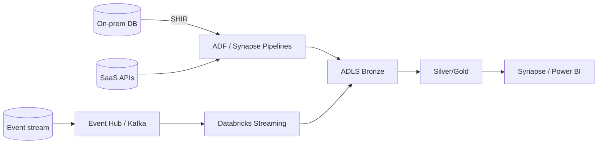

# 01 — Data Integration Fundamentals

## What is data integration?

**Data integration** is combining data from **many different sources** (databases, APIs, files, apps, streams) into a **unified, consistent** view for analytics or operations. ETL/ELT is *one* technique within data integration — the broader topic covers *all* the ways data is moved, combined, and synchronized across systems.

**Analogy:** A company runs a CRM, an e-commerce app, a finance system, and dozens of spreadsheets — each an island with its own format and "truth." Data integration builds the bridges and a common language so you can answer "what's our total revenue per customer?" across all of them.

---

## Why it matters
- Real businesses have **data silos** (different teams, tools, clouds). Integration unifies them.
- It's the **first job** of most data platforms: get data out of source systems reliably and into one place.
- Poor integration → inconsistent numbers, duplicated records, and reports that disagree.

---

## The main data-integration approaches

| Approach | What it does | When |
|---|---|---|
| **ETL** | Extract → Transform (external engine) → Load | Legacy warehouses, heavy pre-load cleansing |
| **ELT** | Extract → Load raw → Transform in the target | Modern lakehouse (cheap storage + elastic compute) |
| **Data replication** | Copy/sync data from source to target as-is | DR, offloading reads, keeping a mirror |
| **Change Data Capture (CDC)** | Stream only inserts/updates/deletes | Low-latency incremental sync |
| **Data virtualization / federation** | Query multiple sources **without moving** data | Ad-hoc access, avoid copies (e.g., Synapse serverless over the lake) |
| **Streaming integration** | Continuous, event-by-event ingestion | Real-time analytics (Event Hub/Kafka) |
| **API-based / app integration** | Pull/push via REST/SOAP, iPaaS (Logic Apps) | SaaS apps, webhooks, business workflows |

> **Interview tip:** Data integration ⊃ ETL/ELT. Show you know replication, CDC, virtualization, streaming, and API integration too — and *when* each fits.

---

## Batch vs streaming integration
| | Batch | Streaming |
|---|---|---|
| Cadence | Scheduled (hourly/daily) | Continuous, per-event |
| Latency | Minutes–hours | Sub-second–seconds |
| Tools | ADF, Synapse Pipelines, Databricks jobs | Event Hub/Kafka + Structured Streaming / Stream Analytics |
| Use | Most analytics/reporting | Real-time dashboards, alerting, fraud |

Most platforms are **hybrid**: batch for the bulk, streaming for the time-sensitive.

---

## Key concerns in any integration
- **Connectivity & auth** — reach the source securely (Managed Identity, Key Vault, private networking, Self-Hosted IR for on-prem).
- **Schema mapping & drift** — align source schemas to the target; handle new/changed columns.
- **Incremental vs full** — load only changes (watermark/CDC) at scale.
- **Idempotency** — re-runs must not duplicate (MERGE / partition overwrite).
- **Data quality** — validate on the way in; quarantine bad records.
- **Latency & throughput** — meet the SLA without overloading the source.
- **Governance & lineage** — track where data came from (Purview / Unity Catalog).

---

## Where it fits in the Azure platform

---

## Pro / Interview notes
- Frame integration as **"get data reliably from many sources into one governed place, incrementally and idempotently."**
- Know the **when-not-to-move-data** answer: **data virtualization/federation** (Synapse serverless, external tables) avoids copies for ad-hoc access.
- **Common mistake:** treating integration as only "ETL in ADF" — seniors discuss CDC, streaming, replication, and virtualization.

---

## Quick Review
- ✔ Data integration = unify many sources into one consistent view (ETL/ELT is a subset)
- ✔ Approaches: **ETL/ELT, replication, CDC, virtualization, streaming, API/iPaaS**
- ✔ **Batch** (scheduled bulk) vs **streaming** (continuous, low-latency); most platforms hybrid
- ✔ Core concerns: connectivity/auth, schema drift, **incremental + idempotent**, quality, governance
- ✔ Virtualization/federation = query without moving data

## Further Learning — Docs & Videos
- What is data integration? (IBM): https://www.ibm.com/topics/data-integration
- Azure integration services: https://learn.microsoft.com/en-us/azure/architecture/data-guide/
- Video — data integration explained: https://www.youtube.com/results?search_query=data+integration+explained+etl+cdc+streaming

Next: **[02 — Integration Patterns](02_Integration_Patterns.md)**.
