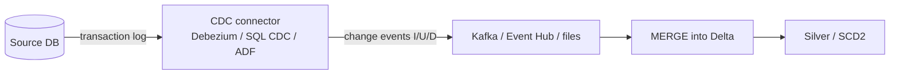

# 03 — Change Data Capture (CDC)

## What is CDC?

**Change Data Capture** captures **row-level changes** (inserts, updates, deletes) from a source system as they happen, so downstream systems can stay in sync **incrementally** without full reloads. Instead of asking "what does the table look like now?", CDC answers "what *changed* since last time?"

**Analogy:** Rather than photocopying an entire ledger every night (full load), CDC is a running feed of "line 42 changed from X to Y, line 88 was deleted" — you apply just those changes.

---

## Why CDC over a watermark?
A watermark (`modified > last_run`) catches inserts/updates **but misses deletes** and needs a reliable modified column. CDC:
- Captures **deletes** (critical for accurate mirrors/GDPR).
- Is **low-latency** (near real-time).
- Doesn't scan the whole table each run.
- Preserves the **order** and **type** of each change.

Trade-off: more setup, and it requires source support (change log access).

---

## How CDC works (the log-based approach)
Most robust CDC reads the database's **transaction log** (redo/WAL/binlog) — the same log the DB uses for recovery — so it captures changes with **minimal load** on the source and no need for triggers.



### CDC mechanisms
| Mechanism | How | Notes |
|---|---|---|
| **Log-based** | Read the DB transaction log | Lowest overhead, captures all changes + order; preferred |
| **Trigger-based** | DB triggers write changes to a shadow table | Works anywhere, but adds write overhead |
| **Query/timestamp-based** | Poll a `modified_at` column | Simple, but misses deletes/intermediate changes |

---

## CDC on Azure
- **SQL Server / Azure SQL CDC & Change Tracking** — native change capture.
- **Azure Data Factory CDC** — native CDC resource / mapping data flow CDC for supported sources.
- **Debezium + Kafka / Event Hubs** — popular open-source log-based CDC into a stream.
- **Databricks** — consume the change stream and **MERGE** into Delta; **DLT `APPLY CHANGES`** applies CDC feeds (incl. SCD2) declaratively.
- **Delta Change Data Feed (CDF)** — Delta's own feature to expose row-level changes *out of* a Delta table for downstream consumers.

---

## Applying CDC changes (the MERGE pattern)
```sql
MERGE INTO silver.customers t
USING cdc_changes s
ON t.id = s.id
WHEN MATCHED AND s.op = 'D' THEN DELETE
WHEN MATCHED AND s.op = 'U' THEN UPDATE SET *
WHEN NOT MATCHED AND s.op IN ('I','U') THEN INSERT *;
```
- Handle **out-of-order** changes by keeping only the **latest** change per key (dedupe with `ROW_NUMBER` on the change timestamp/LSN).
- For history, apply as **SCD Type 2** (DLT `APPLY CHANGES ... STORED AS SCD TYPE 2`).

---

## Delta Change Data Feed (CDF)
Enable on a Delta table to let downstream jobs read only what changed:
```sql
ALTER TABLE silver.orders SET TBLPROPERTIES (delta.enableChangeDataFeed = true);
SELECT * FROM table_changes('silver.orders', 5);   -- changes since version 5
```
Great for incrementally propagating Silver → Gold without re-scanning.

---

## Pro / Interview notes
- **Log-based CDC** is the gold standard (low source impact, captures deletes + order).
- **Idempotency + dedupe** are essential: replays and out-of-order events must not corrupt the target → keep latest-per-key, MERGE.
- **Common mistakes:** using a watermark when deletes matter; not handling out-of-order/late changes; ignoring schema drift in the change feed.
- Mention **Delta CDF** for propagating changes *between lakehouse layers*.

---

## Quick Review
- ✔ CDC = capture row-level **inserts/updates/deletes** incrementally, near real-time
- ✔ Beats watermark because it **captures deletes** and is low-latency
- ✔ **Log-based** (transaction log) preferred over trigger/query-based
- ✔ Azure: SQL CDC/Change Tracking, ADF CDC, Debezium+Event Hubs, DLT `APPLY CHANGES`
- ✔ Apply with **MERGE** (handle D/U/I); dedupe latest-per-key for out-of-order
- ✔ **Delta Change Data Feed** propagates changes between Delta tables

## Further Learning — Docs & Videos
- What is CDC (Debezium): https://debezium.io/documentation/
- ADF change data capture: https://learn.microsoft.com/en-us/azure/data-factory/concepts-change-data-capture
- Delta Change Data Feed: https://docs.databricks.com/en/delta/delta-change-data-feed.html
- Video — CDC explained: https://www.youtube.com/results?search_query=change+data+capture+cdc+explained+debezium

Next: **[04 — Azure Integration Services](04_Azure_Integration_Services.md)**.
