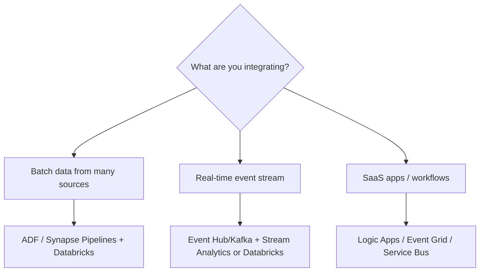
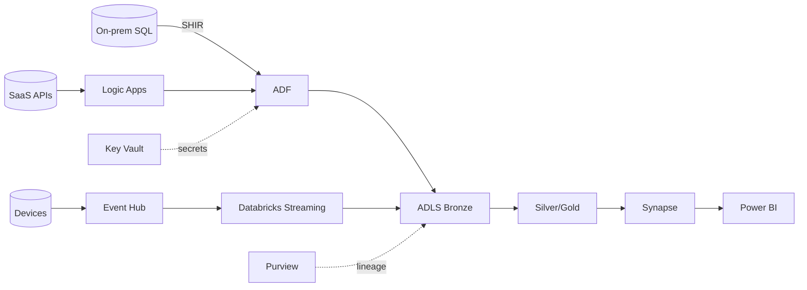

# 04 — Azure Integration Services

## The toolbox

Azure offers several services for data integration; a senior engineer picks the **right one for the job** and explains why. They split into **data integration** (moving/transforming data) and **application integration** (connecting apps/events).

---

## Data integration services

| Service | Role | Best for |
|---|---|---|
| **Azure Data Factory (ADF)** | Managed ETL/ELT orchestration, 90+ connectors, Copy + Data Flows | Batch ingestion, orchestration, on-prem via Self-Hosted IR |
| **Synapse Pipelines** | ADF engine inside Synapse | Same as ADF, when you're standardized on Synapse |
| **Azure Databricks** | Spark transformation + Auto Loader + streaming | Heavy/complex transforms, big data, ML, lakehouse |
| **Azure Stream Analytics** | SQL-based real-time stream processing | Simple real-time aggregations/alerts |
| **Azure Event Hubs** | High-throughput streaming ingestion (Kafka-compatible) | Millions of events/sec, telemetry |
| **Azure Functions** | Serverless event-driven glue | Lightweight API calls, file reactions, small transforms |

## Application / event integration services

| Service | Role | Best for |
|---|---|---|
| **Logic Apps** | Low-code workflow/iPaaS with 100s of connectors | SaaS app integration, approvals, business workflows |
| **Event Grid** | Reactive event routing (pub/sub for discrete events) | "When X happens, trigger Y" |
| **Service Bus** | Enterprise messaging (queues/topics, ordering, transactions) | Reliable app-to-app messaging |
| **API Management** | Publish/secure/throttle APIs | Exposing/consuming APIs at scale |

> **Interview trap — messaging vs streaming vs events:** **Event Hubs** = high-throughput event *streaming*. **Service Bus** = enterprise *messaging* (queues/topics, ordering, transactions). **Event Grid** = reactive *event routing*. Know which fits.

---

## Choosing the right service (decision guide)

- **Orchestration + ingestion (batch)** → **ADF** (or Synapse Pipelines); transform in **Databricks**.
- **Real-time** → **Event Hubs/Kafka** → **Structured Streaming** (complex) or **Stream Analytics** (simple SQL).
- **On-prem/private sources** → ADF **Self-Hosted IR**.
- **SaaS/app workflows** → **Logic Apps**; **event routing** → **Event Grid**; **reliable messaging** → **Service Bus**.
- **Lightweight glue** (call an API, react to a blob) → **Azure Functions**.

---

## How they fit together (reference)

---

## Cross-cutting concerns (apply to all)
- **Security:** Managed Identity + RBAC, Key Vault for secrets, private endpoints.
- **Governance:** lineage/classification via **Purview**; access via **Unity Catalog**.
- **Reliability:** retries, alerts, idempotent loads, monitoring to **Log Analytics**.
- **Cost:** right-size compute, incremental loads, pause idle resources.

---

## Pro / Interview notes
- Position **ADF as orchestration/ingestion** and **Databricks as transformation** — don't do heavy transforms in ADF Data Flows at scale.
- Be crisp on **Event Hubs vs Service Bus vs Event Grid** — a very common trap.
- Know **when NOT to move data**: Synapse **serverless** external tables query the lake in place (virtualization).
- **Common mistake:** defaulting every problem to ADF; seniors match the tool to batch/stream/app/event.

---

## Quick Review
- ✔ **ADF / Synapse Pipelines** = batch ingestion + orchestration; **Databricks** = transformation
- ✔ **Event Hubs/Kafka** (stream ingest) + **Stream Analytics** (simple) or **Databricks** (complex) for real-time
- ✔ **Logic Apps** (workflows/iPaaS), **Event Grid** (event routing), **Service Bus** (messaging), **Functions** (glue)
- ✔ On-prem → **Self-Hosted IR**
- ✔ Trap: Event Hubs (streaming) vs Service Bus (messaging) vs Event Grid (events)
- ✔ Cross-cutting: MSI + Key Vault + private endpoints, Purview/UC governance, retries/monitoring, cost

## Further Learning — Docs & Videos
- Azure integration services overview: https://learn.microsoft.com/en-us/azure/architecture/data-guide/
- Messaging services compared: https://learn.microsoft.com/en-us/azure/event-grid/compare-messaging-services
- Video — ADF vs Databricks vs Synapse: https://www.youtube.com/results?search_query=azure+data+factory+vs+databricks+vs+synapse

Next: test yourself — **[Interview Questions & Answers](Interview_Questions_and_Answers.md)**.
