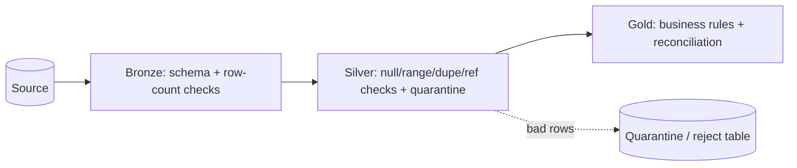

# 01 — Data Quality & Validation

## What is data quality?

**Data quality** is how well data fits its intended use — is it accurate, complete, consistent, and timely enough to trust for decisions? A data engineer's job isn't just moving data; it's delivering data people can **rely on**. "Garbage in, garbage out" — bad data quietly poisons every downstream report and model.

**Analogy:** A pipeline can deliver water fast and cheaply, but if it's contaminated, everyone downstream gets sick. Data quality is the filtration and testing that keeps the water safe.

---

## The dimensions of data quality (know these)
| Dimension | Question | Example failure |
|---|---|---|
| **Accuracy** | Does it reflect reality? | Wrong price on a product |
| **Completeness** | Are required values present? | Null customer_id |
| **Consistency** | Does it agree across systems? | Two systems show different totals |
| **Validity** | Does it conform to rules/format? | `age = -5`, bad email format |
| **Uniqueness** | No unwanted duplicates? | Same order counted twice |
| **Timeliness** | Is it fresh enough? | Yesterday's data in a real-time dashboard |
| **Integrity** | Are relationships valid? | Order referencing a missing customer |

> **Interview tip:** name the dimensions — accuracy, completeness, consistency, validity, uniqueness, timeliness, integrity — and give a check for each.

---

## Where to enforce quality (shift-left)
Validate **early and at each hop** of the medallion architecture:
- **Ingestion/Bronze:** schema checks, file completeness, row counts.
- **Silver:** null/range/format rules, deduplication, referential checks, standardization.
- **Gold:** business-rule checks, reconciliation totals.

**Shift-left** = catch problems as early as possible (cheaper to fix in Bronze than in a CEO's dashboard).



---

## Handling bad data — quarantine, don't crash
Don't fail the whole load on a few bad rows. Route violations to a **quarantine/reject** table with the reason, keep the pipeline running, and alert. Fix or reprocess quarantined rows later. Fail-the-pipeline only for **critical** violations (e.g., a required key missing everywhere).

| Action | When |
|---|---|
| **Keep + flag** | Track quality metrics, non-critical |
| **Drop/quarantine row** | Bad row, pipeline continues |
| **Fail the pipeline** | Critical, unrecoverable violation |

---

## Validation approaches & tools
- **Explicit Spark/SQL checks** — count nulls, range filters, `dropDuplicates`, referential joins.
- **Delta constraints** — `ALTER TABLE ... ADD CONSTRAINT valid_age CHECK (age > 0)` (Delta rejects violating writes).
- **DLT Expectations** — declarative rules in Delta Live Tables: `EXPECT` (track), `ON VIOLATION DROP ROW`, `ON VIOLATION FAIL UPDATE`.
- **Great Expectations** — open-source data-quality framework (expectation suites, docs, validation results).
- **Schema enforcement/evolution** — Delta rejects mismatched schemas by default; `_rescued_data` (Auto Loader) captures unexpected fields.

```python
# DLT expectations (declarative quality gates)
@dlt.expect_or_drop("valid_id", "id IS NOT NULL")
@dlt.expect("fresh", "event_time > current_date() - interval 2 days")
def silver_events():
    return dlt.read_stream("bronze_events")
```
```sql
-- Delta CHECK constraint
ALTER TABLE silver.orders ADD CONSTRAINT positive_amount CHECK (amount >= 0);
```

---

## Data observability
Beyond one-off checks, **data observability** continuously monitors **freshness, volume, schema, and distribution** and alerts on anomalies (e.g., "row count dropped 90% overnight", "a column went 50% null"). Tools: built-in metrics + alerts, Great Expectations, or platforms like Monte Carlo. It's the "monitoring" of data quality.

---

## Pro / Interview notes
- Lead with the **quality dimensions** + **shift-left** + **quarantine (don't crash)** + **automated gates (DLT expectations / Great Expectations)** + **observability/alerting**.
- Tie it to **CI/CD**: data-quality tests as **deployment gates** before promoting to prod.
- **Common mistakes:** validating only at the end; failing the whole load on any bad row; no quarantine; no freshness/volume monitoring; silently dropping bad data with no metric.

---

## Quick Review
- ✔ Dimensions: **accuracy, completeness, consistency, validity, uniqueness, timeliness, integrity**
- ✔ **Shift-left** — validate at each medallion hop (Bronze/Silver/Gold)
- ✔ **Quarantine** bad rows, keep the pipeline running; fail only on critical violations
- ✔ Tools: **Delta CHECK constraints, DLT expectations, Great Expectations**, schema enforcement
- ✔ **Data observability** = monitor freshness/volume/schema/distribution + alert
- ✔ Wire quality checks into **CI/CD gates**

## Further Learning — Docs & Videos
- DLT expectations (data quality): https://docs.databricks.com/en/delta-live-tables/expectations.html
- Great Expectations: https://greatexpectations.io/
- Data quality dimensions: https://www.ibm.com/topics/data-quality
- Video — data quality & validation in pipelines: https://www.youtube.com/results?search_query=data+quality+validation+pipeline+great+expectations

Next: **[Interview Questions & Answers](Interview_Questions_and_Answers.md)**.
