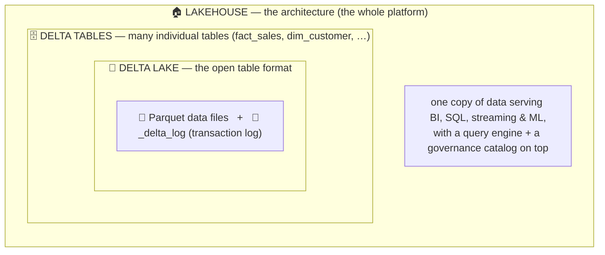
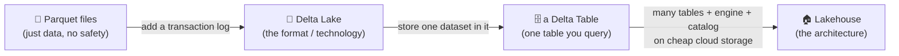

# Delta Lake vs Delta Table vs Lakehouse — what is what?

> 🗺️ Zooming out to database vs warehouse vs lake vs lakehouse? See the [Storage Paradigms Map](../00_Storage_Paradigms_Map.md). This page zooms *in* on the three easily-confused Delta terms.

These three words sound almost the same and are constantly mixed up. They are **not** synonyms — they sit at three different *levels*. Get this one picture straight and the rest of the folder clicks into place. Read this first, then dive into the detailed notes: [Delta Lake](01_Delta_Lake.md) · [Delta Table](02_Delta_Table.md) · [Lakehouse Architecture](03_Lakehouse_Architecture.md).

---

## The one-line answer

| Term | What it is | One word |
|---|---|---|
| **Delta Lake** | An open **storage format / technology** — Parquet files **+ a transaction log** | the **format** |
| **Delta Table** | **One specific table** stored in that format | a **table** |
| **Lakehouse** | The overall **architecture** that uses Delta tables on cheap cloud storage to get warehouse behaviour | the **house** |

So: **Delta Lake** is the *material*, a **Delta Table** is *one thing built from it*, and the **Lakehouse** is *the whole building*.

---

## The everyday analogy

Think of **PDF**:

- **Delta Lake** is like the **PDF format** — a technology/standard for how data is written and made reliable. You don't "query the PDF format"; it's the *rules*.
- A **Delta Table** is like **one PDF document** — an actual file (well, an actual dataset) created using that format. This is the thing you open, read, and update.
- The **Lakehouse** is like the **entire digital library** — the building, the shelves, the catalogue, and the librarians — all organised around PDF documents so people can find and use them.

You wouldn't say "email me the PDF format." You'd say "email me the PDF (document)." Same here: you *store data in* Delta Lake, you *query a* Delta table, you *build a* Lakehouse.

---

## Explain it to a non-technical person (the library analogy)

Forget PDFs for a second. Picture a **big modern library building**. 📚

| Term | In one picture | What it means |
|---|---|---|
| 🗄️ **Delta Table** | **One smart bookshelf** with a logbook attached | One table of data (e.g. `Customers`) |
| 🏛️ **Delta Lake** | The **whole library building** and its rules | The technology that keeps every shelf reliable |
| 🏠 **Lakehouse** | The **modern library concept** — storage *and* reading rooms in one | The overall design that does both cheap storage and fast answers |

**🗄️ Delta Table = one smart bookshelf.**
A normal shelf: if someone grabs a book while you're reorganising, they might take a half-updated mess. A **Delta table** is a shelf with a **logbook (the transaction log)** — every change is written down ("added 5 rows at 2 PM", "removed 1 row at 3 PM"). Two people can update it at once without corrupting it, and you can even ask *"show me how this shelf looked last Tuesday"* (**time travel**).
*Example:* a table of orders — thousands of new orders pour in while reports are being read, and nobody ever sees broken half-data.

**🏛️ Delta Lake = the whole library building (with rules).**
Before Delta Lake, companies had a **data lake** — think of a **giant garage where you dump boxes of stuff**: cheap and huge, but messy and unlabelled. **Delta Lake** turns that messy garage into an **organised library**: same cheap big space, but now with labels, order, and a logbook for every shelf, so the data is trustworthy.

**🏠 Lakehouse = the modern library concept (the "room with benches" part).**
There used to be **two separate buildings**:
- **Data Lake** — the cheap giant garage. Holds *everything* (even photos and videos), but slow to get clean answers.
- **Data Warehouse** — a fancy, tidy office with **comfortable reading rooms and benches**: fast, clean answers, but expensive and rigid.

Companies hated paying for *two* buildings and copying data between them. A **Lakehouse** is **one building that does both** — the cheap huge basement storage *plus* the comfortable reading rooms with benches — so you don't need two buildings anymore. **Delta Lake is the technology that makes this single building possible.**

```
🏠 LAKEHOUSE   = the whole modern library (storage + reading rooms in one)
   └── 🏛️ DELTA LAKE = the rules & logbooks that keep it trustworthy
          ├── 🗄️ DELTA TABLE: Customers   (one smart shelf)
          ├── 🗄️ DELTA TABLE: Orders      (another smart shelf)
          └── 🗄️ DELTA TABLE: Products    (another smart shelf)
```

---

## How they stack — the key diagram

Each level is **built on top of** the one below it. Read this from the inside out:



- Inside → out: **Parquet + a transaction log = Delta Lake**; a dataset in that format = **a Delta Table**; many Delta tables + an engine + a catalog on cloud storage = **a Lakehouse**.
- The **transaction log** (`_delta_log`) is the magic ingredient — it's what upgrades "just some Parquet files" into a reliable, updatable table with ACID and time travel.

### The same idea as a simple progression



---

## Now each one, a little deeper

### 📐 Delta Lake — the format (the technology)
Delta Lake is an **open-source storage layer**. Under the hood it is nothing more than **ordinary [Parquet](../File_Formats/05_Parquet.md) files plus a transaction log** (a `_delta_log` folder that records every change in order). That log is what gives plain files **database-like powers**:

- **ACID transactions** — writes fully succeed or fully fail, even with many writers.
- **Updates, deletes, and `MERGE`/upsert** — impossible on raw Parquet.
- **Time travel** — query the table as it was at an earlier version.
- **Schema enforcement & evolution**.

You install it, you write data "in Delta format" — it's a *technology*, not a specific dataset. → full note: **[01 — Delta Lake](01_Delta_Lake.md)**.

### 🗄️ Delta Table — one table in that format
A Delta table is **one concrete dataset** stored using Delta Lake — e.g. `fact_sales` or `dim_customer`. It's the thing you actually `SELECT` from, `MERGE` into, `OPTIMIZE`, and time-travel. Two flavours:

- **Managed** — Databricks/UC manages both the data files *and* the metadata; drop it and the data is deleted.
- **External** — you point it at a storage path (`abfss://…`); drop it and only the metadata goes, files remain.

→ full note: **[02 — Delta Table](02_Delta_Table.md)**.

### 🏠 Lakehouse — the architecture
A Lakehouse is a **design/architecture**, not a product. It puts a table format (Delta) **and** a query engine **and** a governance catalog on top of cheap cloud object storage, so **one copy of the data** serves BI dashboards, SQL, streaming, and machine learning — warehouse behaviour at data-lake cost. Delta tables are the building blocks; the [medallion architecture](04_Medallion_Architecture.md) (Bronze → Silver → Gold) is how you organise them inside it.

→ full note: **[03 — Lakehouse Architecture](03_Lakehouse_Architecture.md)**.

---

## Side-by-side comparison

| | 📐 Delta Lake | 🗄️ Delta Table | 🏠 Lakehouse |
|---|---|---|---|
| **What kind of thing?** | A storage **format / technology** | A single **table** (dataset) | An **architecture / pattern** |
| **Scope** | The rules for *all* Delta tables | *One* table | The *whole* platform |
| **Analogy** | The PDF *format* | *One* PDF document | The whole *library* |
| **You…** | *store data in* it | *query / update* it | *build / design* it |
| **Example** | "We use Delta Lake" | "`SELECT * FROM fact_sales`" | "Our lakehouse serves BI + ML" |
| **Made of** | Parquet + transaction log | Parquet + log + a table name/schema | Many Delta tables + engine + catalog |
| **Count** | One technology | Many (thousands) | Usually one per platform |

---

## The confusions to avoid

- **"Delta Lake and Lakehouse are the same."** No — Delta Lake is the *format*; the Lakehouse is the *architecture that uses it*. You can build a lakehouse with Delta (or with the similar Iceberg/Hudi formats). The format enables the architecture; it isn't the architecture.
- **"A Delta table is a special database table."** It's a folder of Parquet files + a `_delta_log` in cloud storage — Spark/SQL just makes it *behave* like a database table.
- **"Delta = Databricks."** Delta Lake is **open source**; Databricks created it but it runs on many engines. (And it's separate from *Delta Live Tables*, which is a Databricks pipeline feature — see [DLT](../../08_Databricks/08_Delta_Live_Tables.md).)
- **"Lakehouse is just a data lake."** A plain data lake has no transactions, schema, or governance — that's a "data swamp." The table format + catalog are exactly what make it a *lakehouse*.

---

## In one breath (say this in an interview)

> "**Delta Lake** is an open table *format* — Parquet plus a transaction log — that adds ACID, updates, and time travel to files. A **Delta table** is one *dataset* stored in that format. A **Lakehouse** is the *architecture* that puts Delta tables, a query engine, and a governance catalog on cheap cloud storage so a single copy of data serves BI, streaming, and ML."

---

## Where to go next
- **[01 — Delta Lake](01_Delta_Lake.md)** — the format in depth (the transaction log, ACID, time travel)
- **[02 — Delta Table](02_Delta_Table.md)** — managed vs external, `MERGE`, `OPTIMIZE`, `VACUUM`, Change Data Feed
- **[03 — Lakehouse Architecture](03_Lakehouse_Architecture.md)** — one copy of data, the three pillars, when to use it
- **[04 — Medallion Architecture](04_Medallion_Architecture.md)** — Bronze → Silver → Gold, how you organise tables inside the lakehouse
- **[Interview Questions & Answers](Interview_Questions_and_Answers.md)** — test yourself across all of the above
