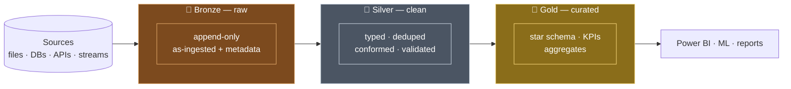
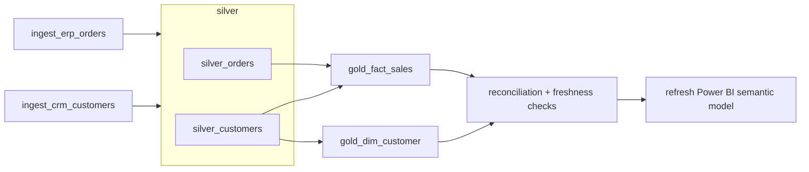

# Medallion Architecture (Bronze → Silver → Gold)

## What is it?

The **medallion architecture** (a.k.a. **multi-hop architecture**) is the standard way to organize a [lakehouse](03_Lakehouse_Architecture.md): data flows through **three layers of [Delta](01_Delta_Lake.md) tables**, and **quality goes up at every hop** — from raw, to cleaned, to business-ready. The names come from Olympic medals: 🥉 **Bronze** → 🥈 **Silver** → 🥇 **Gold**.

Analogy: it's a **water treatment plant**. River water enters a holding reservoir exactly as it arrived (Bronze). It's filtered and purified into safe, standard drinking water (Silver). Finally it's bottled and labelled for specific customers — sparkling, still, flavoured (Gold). You never drink straight from the river, and you never re-run the whole plant just to change a label.

> 🖥️ Want to *see* it run? The [runnable Project 1 repo](../../18_Projects/project_1_batch_medallion/README.md) implements all three layers in PySpark + Delta with sample data — `src/bronze.py`, `silver.py`, `gold.py` are literally these hops.

---

## The one-picture version



**The rule of thumb:** *raw in Bronze, trustworthy in Silver, valuable in Gold.* Each arrow is a transformation; each box is a set of Delta tables you can query, time-travel, and rebuild.

---

## Why three layers (and not one big transform)?

| If you skip layers… | What breaks |
|---|---|
| **No Bronze** ("transform on ingest") | You lose the **replay source** — when logic changes, you can't reprocess history because the raw form is gone |
| **No Silver** (raw → reports directly) | Every report re-does cleaning; bugs and duplicates leak into dashboards; no shared "clean" view |
| **One giant job** | Impossible to debug ("which step corrupted it?"), impossible to reuse a clean stage, re-runs redo everything |

Three layers give you **separation of concerns**: ingestion, cleaning, and business modelling are independent, individually testable, and independently reprocessable. This is [ELT](../../06_Data_Engineering/ETL_ELT/01_ETL_vs_ELT.md) done *inside* the lake.

---

## 🥉 Bronze — land it exactly as it arrived

**Job:** capture the source faithfully. **Bronze never transforms business data.**

| | |
|---|---|
| **Contains** | Raw records as-ingested + **ingestion metadata** (`_ingest_ts`, `_source_file`, `_batch_date`) |
| **Write mode** | **Append-only** — you never update or delete; every arrival is kept |
| **Schema** | Explicit/permissive; tolerate new columns with schema evolution — don't reject data here |
| **Consumers** | Data engineers, and *reprocessing* — the replay source for everything downstream |

**Why keep raw at all?** Because the day you find a bug in Silver logic, you rebuild Silver from Bronze — no need to re-pull from the source system (which may not even keep history). Bronze is your **undo button** and your **audit trail**.

```python
# Bronze = source + metadata, appended (no cleaning)
(raw.withColumn("_ingest_ts", current_timestamp())
    .withColumn("_source_file", input_file_name())
    .write.format("delta").mode("append").save(".../bronze/orders"))
```

---

## 🥈 Silver — make it trustworthy

**Job:** turn raw into a **clean, conformed, enterprise-wide view** — one good table per business entity.

| | |
|---|---|
| **Contains** | Correctly **typed**, **deduplicated**, standardized, **validated**, business-key-joined data |
| **Typical work** | Cast types · trim/normalize values · dedupe (latest wins) · **quarantine** bad rows · join reference data |
| **Write mode** | Overwrite or **`MERGE`** (upsert) for incremental loads |
| **Consumers** | Engineers *and* data scientists — the shared "single version of clean" both trust |

The two Silver signatures interviewers look for:

- **Dedupe** — keep the latest record per business key (a `row_number()` window over ingest time).
- **Quarantine** — route bad rows to a side table and keep the pipeline running, instead of dropping them silently or crashing. See [Data Quality](../../06_Data_Engineering/Data_Quality/01_Data_Quality_Fundamentals.md).

```python
# quarantine bad rows, then keep the newest version of each key
bad  = clean.filter(col("amount").isNull() | (col("amount") < 0))
good = clean.filter(col("amount").isNotNull() & (col("amount") >= 0))
w = Window.partitionBy("order_id").orderBy(col("_ingest_ts").desc())
silver = good.withColumn("rn", row_number().over(w)).filter("rn = 1").drop("rn")
```

---

## 🥇 Gold — make it valuable

**Job:** shape Silver into **business-defined, report-ready** tables — the numbers finance signs off on.

| | |
|---|---|
| **Contains** | [Dimensional models](../../02_Databases/Data_Modeling/03_Dimensional_Modeling.md) (fact + dimension tables), KPIs, aggregates, ML features |
| **Typical work** | Build star schemas · surrogate keys · **[SCD2](../../02_Databases/Data_Modeling/04_Slowly_Changing_Dimensions.md)** history · aggregate to the grain the business asks about |
| **Write mode** | Overwrite / `MERGE`; often one Gold table **per use case** (a finance mart, a marketing mart) |
| **Consumers** | BI analysts, dashboards ([Power BI](../../16_Power_BI_for_Engineers/00_Power_BI_Learning_Path.md)), ML feature stores |

Gold is where **modeling discipline** lives — the lakehouse merged the storage engines but **not** the need for a star schema and a semantic layer. A lakehouse with no Gold modeling is just a faster swamp.

---

## Each boundary is a *contract*, not a folder name

The real power of the medallion is that the layer names are **promises you enforce**:

- **Bronze** promises *"everything we received, unchanged"* — the replay source.
- **Silver** promises *"clean, deduplicated, conformed"* — the enterprise view.
- **Gold** promises *"business-defined, report-ready"* — the signed-off numbers.

Pointing a dashboard at **Silver** "just for now" silently breaks the Gold contract and dumps BI load onto engineering tables. Treat the arrows as boundaries to defend, not a naming convention.

---

## Naming and physical layout — where the layers actually live

The medallion is a *logical* pattern; you still have to decide what it looks like on storage and in the catalog. Two conventions dominate, and interviewers expect you to have an opinion.

**On storage (ADLS Gen2):** one container per layer, or one container with a folder per layer — either is fine, as long as it is consistent and the layer is the *first* thing in the path.

```
abfss://bronze@stgdataprod.dfs.core.windows.net/erp/orders/ingest_date=2026-09-02/
abfss://silver@stgdataprod.dfs.core.windows.net/orders/
abfss://gold@stgdataprod.dfs.core.windows.net/sales/fact_sales/
```

Notice the shape change across hops: **Bronze is organized by source system** (`erp/orders`, `crm/customers`) because it mirrors where the data came from. **Silver is organized by business entity** (`orders`, `customers`) because several sources have been conformed into one. **Gold is organized by consumer or mart** (`sales/`, `finance/`) because it exists to answer someone's questions.

**In the catalog ([Unity Catalog](../../08_Databricks/06_Unity_Catalog.md)'s three-level namespace):** the layer is normally the **schema**, and the **environment is the catalog** —

```sql
prod.bronze.erp_orders      dev.bronze.erp_orders
prod.silver.orders          dev.silver.orders
prod.gold.fact_sales        dev.gold.fact_sales
```

`catalog = environment, schema = layer` is the pattern Databricks recommends, because promoting code between environments then means changing one identifier, and you can grant a whole layer to a group in one statement (`GRANT SELECT ON SCHEMA prod.gold TO grp-analysts`). The alternative — `catalog = layer` — reads nicely but makes environment isolation awkward.

**Managed or external tables?** Managed tables (Unity Catalog owns the files) are the default now: lifecycle, `VACUUM`, and optimization are handled for you. Use **external** tables where another engine must read the same files, or where a strict storage-path convention is a compliance requirement. See [Storage Access: ABFSS & Volumes](../../08_Databricks/07_Storage_Access_ABFSS_and_Volumes.md).

**Access control maps onto the layers naturally** — a large part of why the split pays off:

| Layer | Who gets `SELECT` |
|---|---|
| Bronze | Data engineers only — it holds raw, unmasked, unvalidated data |
| Silver | Engineers + data scientists + power users |
| Gold | Everyone: analysts, dashboards, the business |

---

## Incremental loading — how each hop really runs

Nobody reprocesses everything nightly past a certain size. Each hop has a standard incremental mechanism, and naming them is what separates a real answer from a textbook one.

**Source → Bronze: [Auto Loader](../../08_Databricks/09_Auto_Loader_and_Ingestion.md)** (`cloudFiles`) tracks which files it has already seen in its own checkpoint, so a rerun picks up only new arrivals. `trigger(availableNow=True)` gives you "streaming semantics, batch schedule" — the right default for most batch pipelines.

```python
(spark.readStream.format("cloudFiles")
    .option("cloudFiles.format", "json")
    .option("cloudFiles.schemaLocation", f"{ckpt}/schema")
    .option("cloudFiles.schemaEvolutionMode", "addNewColumns")
    .load(landing_path)
    .withColumn("_ingest_ts", current_timestamp())
    .withColumn("_source_file", col("_metadata.file_path"))
 .writeStream
    .option("checkpointLocation", f"{ckpt}/bronze_orders")
    .trigger(availableNow=True)
    .toTable("prod.bronze.erp_orders"))
```

Without Auto Loader, the equivalents are a **high-water mark** (store the max `modified_ts`/id processed, filter the source above it) or **date-partitioned landing folders**. Both work; both need the watermark stored somewhere durable.

**Bronze → Silver:** read only the new Bronze rows, dedupe, then **`MERGE`** into Silver so reruns are safe. In streaming that means `foreachBatch` wrapping the `MERGE`:

```python
def upsert_to_silver(batch_df, batch_id):
    (DeltaTable.forName(spark, "prod.silver.orders").alias("t")
        .merge(batch_df.alias("s"), "t.order_id = s.order_id")
        .whenMatchedUpdateAll(condition="s._ingest_ts > t._ingest_ts")   # never regress on late data
        .whenNotMatchedInsertAll()
        .execute())

(spark.readStream.table("prod.bronze.erp_orders")
    .transform(clean_and_dedupe)
 .writeStream.foreachBatch(upsert_to_silver)
    .option("checkpointLocation", f"{ckpt}/silver_orders")
    .trigger(availableNow=True).start())
```

**Silver → Gold:** for aggregates, either recompute the affected grain (usually cheap and much simpler), or read Silver's **Change Data Feed** to update only what moved:

```sql
ALTER TABLE prod.silver.orders SET TBLPROPERTIES (delta.enableChangeDataFeed = true);
```

```python
changes = (spark.read.format("delta")
    .option("readChangeFeed", "true")
    .option("startingVersion", last_processed_version)
    .table("prod.silver.orders"))
```

**Rule of thumb:** reach for CDF when the Gold table is large and the daily delta is small. Below that, a full recompute of a Gold aggregate is simpler, cheaper to reason about, and self-healing.

---

## Idempotency, replay, and backfill

The medallion's real selling point is that **you can rebuild any layer from the one before it**. That promise only holds if every hop is **idempotent** — running it twice produces the same result as running it once.

| Hop | What makes it idempotent |
|---|---|
| Source → Bronze | Auto Loader checkpoint (each file processed once) or a high-water mark |
| Bronze → Silver | `MERGE` on the business key — a rerun overwrites the same row instead of adding one |
| Silver → Gold | Deterministic recompute of a partition/grain, or `MERGE` on the dimensional key |

**The replay drill** — worth being able to describe end to end, because it is a standard senior interview question:

1. A bug is found in Silver's currency conversion, three weeks after it shipped.
2. You **do not** call the source system. Bronze already holds every record exactly as it arrived.
3. Fix the transformation, re-run Silver over the affected Bronze window. Because Silver upserts on the business key, corrected values replace the bad ones in place.
4. Re-run the affected Gold tables from the corrected Silver.
5. Anything you *can't* recompute — Gold's [SCD2](../../02_Databases/Data_Modeling/04_Slowly_Changing_Dimensions.md) dimension history, for instance — needs explicit care: either rebuild the history from Bronze's ordered arrivals, or restore Gold from a Delta version taken before the bad load (`RESTORE TABLE ... TO VERSION AS OF n`).

**Backfill vs incremental** is the corresponding operational split: the same transformation code should run in both modes, differing only in the date range it is handed. If your backfill needs *different code* from the daily run, you have two implementations to keep correct — a reliable source of drift.

> **Deleting from Bronze is the exception that proves the rule.** Bronze is append-only *by policy*, but GDPR erasure and genuine corruption are real. Both are handled with a `DELETE` + `VACUUM` across every layer that holds the record, plus an audit note explaining why — not by pretending Bronze is immutable storage.

---

## Schema evolution across the hops

Each layer takes a deliberately different stance on a new or changed column, and that difference is the point.

| Layer | Stance on a new source column | Mechanism |
|---|---|---|
| **Bronze** | **Accept it.** Never reject data at the front door | `mergeSchema` / Auto Loader `addNewColumns`; unparseable values land in `_rescued_data` |
| **Silver** | **Decide deliberately.** A column joins the clean model only once someone has defined what it means | Explicit projection + contract test — an unmapped column is visible but unadopted |
| **Gold** | **Change by negotiation.** Consumers depend on this shape | A versioned change, an additive column, or a new table |

A **breaking** change (a type change, a dropped column, a redefined business key) isn't a schema-evolution problem — it's a **[data contract](../../14_Testing_and_DataOps/03_Data_Contracts.md)** problem. Bronze absorbs it so nothing crashes; Silver's tests should fail *loudly* so a human decides; Gold should never learn about it by surprise.

---

## Physical optimization — different answers per layer

Layers have different access patterns, so they deserve different physical treatment. Identical settings everywhere is a quiet performance and cost bug.

| | Bronze | Silver | Gold |
|---|---|---|---|
| **Partitioning** | By ingest date, matching how you replay | Only if genuinely large — partition when each partition would exceed ~1 GB | By the dimension reports filter on (usually date) |
| **Clustering** | Rarely worth it | **Liquid clustering** / `ZORDER` on join & filter keys (`order_id`, `customer_id`) | On the columns dashboards filter by |
| **File size** | Small files accumulate fastest here — compact regularly | `OPTIMIZE` after loads | `OPTIMIZE`; these tables are read constantly |
| **Retention (`VACUUM`)** | Longest — it is the replay source | Moderate | Shortest; rebuildable from Silver |
| **Read pattern** | Rare, whole-window scans | Frequent key lookups + joins | Constant filtered aggregates |

Two rules that matter more than any tuning knob:

- **Don't partition small tables.** Partitioning a 5 GB table by date produces thousands of tiny files and makes every query slower. Modern Delta handles this with data skipping and [liquid clustering](02_Delta_Table.md) instead — under roughly 1 TB, don't partition at all.
- **Small files are the medallion's characteristic failure.** Streaming ingest writes many small files into Bronze; without regular `OPTIMIZE`/auto-compaction the metadata cost eventually dominates the query cost. See [Performance Optimization](../../15_Cost_and_Performance/03_Performance_Optimization.md).

---

## Quality gates: the promises, enforced

The layer boundaries are only contracts if something *checks* them. The Bronze→Silver hop carries most of the enforcement, because that is where "raw" becomes "trustworthy."

| Check | Where | On failure |
|---|---|---|
| File arrived / row count > 0 | Source → Bronze | Alert — don't silently succeed on an empty load |
| Required columns present, types castable | Bronze → Silver | **Quarantine** the row, keep the pipeline running |
| Business key not null, unique after dedupe | Bronze → Silver | Quarantine + alert — a broken key corrupts every downstream join |
| Referential integrity (order → known customer) | Silver | Route to a late-arriving-dimension path, or an "unknown" member |
| Reconciliation: Gold totals vs Silver totals | Silver → Gold | **Fail the run** — a wrong number on a dashboard is worse than a late one |
| Freshness SLA per layer | All | Alert on the layer that actually stalled |

[Delta Live Tables](../../08_Databricks/08_Delta_Live_Tables.md) expresses these declaratively, with the three severities you should be able to name:

```python
@dlt.table(name="silver_orders")
@dlt.expect("valid_ts", "order_ts IS NOT NULL")                 # log it, keep the row
@dlt.expect_or_drop("valid_amount", "amount >= 0")              # drop the row, keep running
@dlt.expect_or_fail("valid_key", "order_id IS NOT NULL")        # stop the pipeline
def silver_orders():
    return dlt.read_stream("bronze_orders").transform(clean)
```

Choosing among the three *is* the design decision: **fail** for anything that would corrupt the model (a null business key), **drop/quarantine** for individual bad records, **log** for things worth watching but not acting on. Full treatment in [Data Quality Fundamentals](../../06_Data_Engineering/Data_Quality/01_Data_Quality_Fundamentals.md).

---

## One pipeline, two speeds (batch *and* streaming)

Because a Delta table is **both a stream sink and a stream source**, the *same* medallion shape runs in batch or streaming with little change: Bronze as a streaming ingest ([Auto Loader](../../08_Databricks/09_Auto_Loader_and_Ingestion.md)), Silver as a streaming transform, Gold as a micro-batch aggregate ([Structured Streaming](../../03_Programming/PySpark/13_Structured_Streaming.md)). [Delta Live Tables](../../08_Databricks/08_Delta_Live_Tables.md) expresses the whole multi-hop declaratively with built-in quality expectations.

---

## Where it runs — the same pattern on every platform

The medallion is a **pattern, not a product**. Every modern data platform implements it; only the nouns change. Being able to translate between them is a standard interview move.

| Platform | Bronze | Silver | Gold | Orchestrated by |
|---|---|---|---|---|
| **Databricks** | Delta tables via [Auto Loader](../../08_Databricks/09_Auto_Loader_and_Ingestion.md) | Delta tables (`MERGE`) | Delta star schema | [Workflows](../../08_Databricks/05_Databricks_Workflows.md) or [DLT](../../08_Databricks/08_Delta_Live_Tables.md) |
| **Microsoft Fabric** | Lakehouse `Files` / raw Delta tables in OneLake | Lakehouse Delta tables | Lakehouse Gold tables or a **Warehouse**, served to Power BI via Direct Lake | Fabric Data Pipelines / notebooks |
| **Azure Synapse** | ADLS + Spark pool | Spark pool Delta/Parquet | **Dedicated SQL pool** star schema, or serverless views | [Synapse Pipelines](../../10_Synapse_and_Fabric/01_Azure_Synapse_Analytics.md) |
| **ADF + Azure SQL / Snowflake** | Landing container | Staging schema | Mart schema | [ADF](../../06_Data_Engineering/ETL_ELT/02_Azure_Data_Factory.md) / [Airflow](../../11_Orchestration/03_Apache_Airflow.md) |
| **dbt on any warehouse** | Sources / raw schema | `staging` + `intermediate` models | `marts` models | dbt + a scheduler |

> **dbt's vocabulary is the medallion under different names:** `sources` → Bronze, `staging`/`intermediate` → Silver, `marts` → Gold. If you know one, you know the other — see [dbt Models & Refs](../../13_dbt/02_Models_and_Refs.md).

---

## It's the warehouse vocabulary you already know

Medallion terminology is new; the layering idea is decades old. Interviewers who came up through classic warehousing will use the older words, so map them out loud:

| Medallion | Classic data warehousing | The shared idea |
|---|---|---|
| **Bronze** | Landing / staging / ODS | Land it as-is, keep the replay source |
| **Silver** | Integration layer, cleansed/conformed layer, 3NF core (Inmon), Data Vault raw vault | One clean, deduped, enterprise-wide version of each entity |
| **Gold** | [Data marts](../../02_Databases/Data_Warehousing/02_Data_Mart.md), presentation layer, star schemas (Kimball), business vault | Business-defined, report-ready, signed-off numbers |

The lakehouse changed the *storage engine*, not the *need to layer*. Skipping Silver in a lakehouse is the same mistake as building independent data marts straight off source systems — see [Data Warehouse Fundamentals](../../02_Databases/Data_Warehousing/01_Data_Warehouse_Fundamentals.md).

---

## Orchestration shape

The medallion gives your scheduler an obvious DAG: **each layer is a dependency boundary.**



Three practical consequences:

- **Bronze tasks parallelize freely** — sources are independent, so one slow API doesn't hold up the others.
- **Silver fans in, Gold fans out.** A Gold table usually depends on several Silver tables, so Gold can't start until every Silver parent it needs has succeeded — the dependency your orchestrator exists to express. See [Orchestration Fundamentals](../../11_Orchestration/01_Orchestration_Fundamentals.md).
- **Failures are diagnosable.** "Bronze succeeded, Silver failed" tells you instantly that the source delivered but your cleaning logic hit something new — a triage step you simply don't get from one monolithic job.

**Per-layer SLAs and ownership** follow the same boundaries — which is how you avoid "the pipeline is broken" arguments:

| Layer | Typical SLA | Owner | On failure |
|---|---|---|---|
| Bronze | Minutes-to-hours after arrival | Ingestion/platform team | Alert engineers; nothing downstream ran anyway |
| Silver | Hours | Data engineering | Alert; downstream Gold is held |
| Gold | "Ready by 8 a.m." | DE + business data owner | **Page someone** — this one has an audience |

---

## Design decisions people get wrong

**"Do I need all three layers for every source?"** No. A tiny reference file (a 200-row country lookup) doesn't need three Delta tables. The layers are about *managing risk and change*; where there's no risk, don't add ceremony. But be honest about what you're skipping — a "temporary" Bronze-to-Gold shortcut is how replay capability quietly disappears.

**One Silver table per source, or per entity?** Per **entity**. Silver's job is conforming: if orders arrive from an ERP *and* a legacy system, both land in separate Bronze tables and merge into **one** `silver.orders`. If you end up with `silver.erp_orders` and `silver.legacy_orders`, you've built a second Bronze and pushed the conforming work onto Gold — where it will be done twice, differently.

**Do I need a fourth layer?** Almost never. "Platinum" is usually a symptom of one of two real problems: Gold is doing too much (split it into per-mart Gold tables instead), or you actually need a **[semantic layer](../../16_Power_BI_for_Engineers/02_Semantic_Model_and_Star_Schema.md)** on top of Gold, which is a different tool, not another Delta hop. Genuine exceptions exist — a separate ML feature layer off Silver, for instance — but call it what it is rather than extending the medal metaphor.

**Where do PII masking and GDPR live?** Restrict Bronze to engineers (raw PII lives there by definition), apply masking/tokenization **entering Silver**, and let Gold hold only what the business is cleared to see. For erasure requests, `DELETE` in **every** layer that holds the subject, then `VACUUM` — Bronze included. See [Data Governance & Security](../../06_Data_Engineering/Data_Governance/01_Data_Governance_and_Security.md).

**What does the extra storage cost?** You are storing the same records roughly three times, but Bronze/Silver are compressed Parquet on cheap object storage — [storage is almost never the expensive part](../../15_Cost_and_Performance/02_Storage_and_Query_Cost.md); *compute* is. The cost the layering actually saves is the re-ingest and the incident: rebuilding from Bronze costs a few dollars of compute, while re-pulling three weeks of history from a production ERP costs a change request, a maintenance window, and possibly data you can no longer get.

---

## What belongs in each layer (quick reference)

| Question | Bronze | Silver | Gold |
|---|---|---|---|
| Change the data? | ❌ never | ✅ clean/dedupe | ✅ model/aggregate |
| Keep every version? | ✅ append-only | ⚠️ latest per key | ⚠️ per business need |
| Who reads it? | engineers/replay | engineers + scientists | analysts + dashboards |
| Schema shape | source shape | conformed entities | star schema / KPIs |
| Safe to rebuild from prev layer? | from source | from Bronze | from Silver |

---

## Anti-patterns (name these in an interview)

- **Skipping Bronze** — no replay source; a logic change means re-pulling from source you may not control.
- **Cleaning in Bronze** — you can't tell what was original vs. altered; Bronze must stay raw.
- **BI on Silver** — permanent load on engineering tables, breaks the Gold contract, invites metric drift.
- **No dedupe/quarantine in Silver** — duplicates and bad rows leak into every downstream report.
- **No Gold modeling** — dashboards each invent their own joins/metrics → the same KPI disagrees across reports.
- **"More is better" layering** — you don't need Platinum/Diamond; three layers with enforced contracts is the pattern.

---

## Interview-grade Q&A

- *What is the medallion architecture?* A three-layer lakehouse pattern — Bronze (raw, append-only replay source), Silver (clean, deduped, conformed enterprise view), Gold (business-modeled, report-ready) — where data quality rises at each hop.
- *Why keep a raw Bronze layer?* It's the replay source: when a downstream transformation changes or has a bug, you rebuild Silver/Gold from Bronze without re-pulling from the source system.
- *What happens in Silver?* Typing, standardizing, **deduplication** (latest per business key), **validation/quarantine** of bad rows, and conforming/joining into clean entity tables.
- *What goes in Gold?* Dimensional models (facts + dimensions, surrogate keys, SCD2), KPIs, and aggregates at the grain the business asks about — one mart per use case.
- *Is medallion only for batch?* No — Delta tables are stream sources and sinks, so the same Bronze/Silver/Gold shape runs streaming or batch; DLT expresses it declaratively.
- *Why not just transform raw straight into reports?* You lose the replay source and a shared clean layer; every report re-does cleaning, so bugs and duplicates leak into dashboards and can't be reprocessed.
- *Are the layer names just folders?* No — they're **contracts** (raw / clean / business-ready) you enforce; pointing BI at Silver breaks the Gold contract.
- *How does each hop load incrementally?* Auto Loader (or a high-water mark) into Bronze, `MERGE` on the business key into Silver, and either a recompute of the affected grain or Change Data Feed into Gold.
- *What makes the pipeline idempotent?* A checkpoint at ingest and `MERGE`-on-key downstream, so a rerun overwrites the same rows rather than duplicating them — which is what makes replay safe.
- *How would you fix a bug found three weeks after it shipped?* Fix the transformation, re-run Silver from Bronze over the affected window, then re-run Gold from Silver. No contact with the source system.
- *How do you name and organize the layers?* Layer-first on storage (Bronze by source system, Silver by entity, Gold by consumer); in Unity Catalog, **catalog = environment, schema = layer**, so promotion changes one identifier.
- *Should every layer be partitioned and optimized the same way?* No — Bronze partitions by ingest date for replay, Silver clusters on join/filter keys, Gold on report filters; retention is longest on Bronze and shortest on Gold. Don't partition tables under about 1 TB.
- *Where do quality checks belong?* Mostly at Bronze→Silver: fail on anything that corrupts the model (null business key), quarantine individual bad rows, log the rest — DLT's `expect_or_fail` / `expect_or_drop` / `expect`.
- *How does the medallion map to classic warehousing?* Bronze ≈ staging/ODS, Silver ≈ the integration/conformed layer, Gold ≈ data marts / star schemas. New words, same layering.
- *Does every source need all three layers?* No — trivial reference data doesn't. But know exactly what replay capability you're giving up when you shortcut it.
- *Where does PII masking go?* Bronze stays raw and engineer-only; mask/tokenize entering Silver; Gold carries only what its audience is cleared to see. GDPR erasure means `DELETE` + `VACUUM` in every layer, Bronze included.

---

## Related Notes

- **Built on:** [Delta Lake](01_Delta_Lake.md) · [Delta Table](02_Delta_Table.md) · [Lakehouse Architecture](03_Lakehouse_Architecture.md)
- **Modeling the Gold layer:** [Dimensional Modeling](../../02_Databases/Data_Modeling/03_Dimensional_Modeling.md) · [Slowly Changing Dimensions](../../02_Databases/Data_Modeling/04_Slowly_Changing_Dimensions.md)
- **Quality gates (Bronze→Silver):** [Data Quality Fundamentals](../../06_Data_Engineering/Data_Quality/01_Data_Quality_Fundamentals.md)
- **Building it for real:** [Project 1 walkthrough](../../18_Projects/02_Project_1_Batch_Medallion_Pipeline.md) · 🖥️ [runnable repo](../../18_Projects/project_1_batch_medallion/README.md) · [ETL vs ELT](../../06_Data_Engineering/ETL_ELT/01_ETL_vs_ELT.md)

---

## Further Learning — Docs & Videos
- Medallion architecture (Databricks): https://learn.microsoft.com/azure/databricks/lakehouse/medallion
- Delta Live Tables (declarative multi-hop): https://learn.microsoft.com/azure/databricks/delta-live-tables/
- Video — medallion architecture (bronze/silver/gold): https://www.youtube.com/results?search_query=medallion+architecture+bronze+silver+gold
