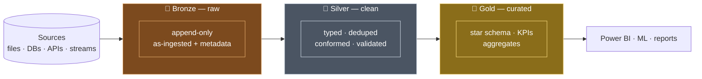

# Medallion Architecture (Bronze → Silver → Gold)

## What is it?

The **medallion architecture** (a.k.a. **multi-hop architecture**) is the standard way to organize a [lakehouse](03_Lakehouse_Architecture.md): data flows through **three layers of [Delta](01_Delta_Lake.md) tables**, and **quality goes up at every hop** — from raw, to cleaned, to business-ready. The names come from Olympic medals: 🥉 **Bronze** → 🥈 **Silver** → 🥇 **Gold**.

Analogy: it's a **water treatment plant**. River water enters a holding reservoir exactly as it arrived (Bronze). It's filtered and purified into safe, standard drinking water (Silver). Finally it's bottled and labelled for specific customers — sparkling, still, flavoured (Gold). You never drink straight from the river, and you never re-run the whole plant just to change a label.

> 🖥️ Want to *see* it run? The [runnable Project 1 repo](../../11_Projects/project_1_batch_medallion/README.md) implements all three layers in PySpark + Delta with sample data — `src/bronze.py`, `silver.py`, `gold.py` are literally these hops.

---

## The one-picture version



**The rule of thumb:** *raw in Bronze, trustworthy in Silver, valuable in Gold.* Each arrow is a transformation; each box is a set of Delta tables you can query, time-travel, and rebuild.

---

## Why three layers (and not one big transform)?

| If you skip layers… | What breaks |
|---|---|
| **No Bronze** ("transform on ingest") | You lose the **replay source** — when logic changes, you can't reprocess history because the raw form is gone |
| **No Silver** (raw → reports directly) | Every report re-does cleaning; bugs and duplicates leak into dashboards; no shared "clean" view |
| **One giant job** | Impossible to debug ("which step corrupted it?"), impossible to reuse a clean stage, re-runs redo everything |

Three layers give you **separation of concerns**: ingestion, cleaning, and business modelling are independent, individually testable, and independently reprocessable. This is [ELT](../../06_Data_Engineering/ETL_ELT/01_ETL_vs_ELT.md) done *inside* the lake.

---

## 🥉 Bronze — land it exactly as it arrived

**Job:** capture the source faithfully. **Bronze never transforms business data.**

| | |
|---|---|
| **Contains** | Raw records as-ingested + **ingestion metadata** (`_ingest_ts`, `_source_file`, `_batch_date`) |
| **Write mode** | **Append-only** — you never update or delete; every arrival is kept |
| **Schema** | Explicit/permissive; tolerate new columns with schema evolution — don't reject data here |
| **Consumers** | Data engineers, and *reprocessing* — the replay source for everything downstream |

**Why keep raw at all?** Because the day you find a bug in Silver logic, you rebuild Silver from Bronze — no need to re-pull from the source system (which may not even keep history). Bronze is your **undo button** and your **audit trail**.

```python
# Bronze = source + metadata, appended (no cleaning)
(raw.withColumn("_ingest_ts", current_timestamp())
    .withColumn("_source_file", input_file_name())
    .write.format("delta").mode("append").save(".../bronze/orders"))
```

---

## 🥈 Silver — make it trustworthy

**Job:** turn raw into a **clean, conformed, enterprise-wide view** — one good table per business entity.

| | |
|---|---|
| **Contains** | Correctly **typed**, **deduplicated**, standardized, **validated**, business-key-joined data |
| **Typical work** | Cast types · trim/normalize values · dedupe (latest wins) · **quarantine** bad rows · join reference data |
| **Write mode** | Overwrite or **`MERGE`** (upsert) for incremental loads |
| **Consumers** | Engineers *and* data scientists — the shared "single version of clean" both trust |

The two Silver signatures interviewers look for:

- **Dedupe** — keep the latest record per business key (a `row_number()` window over ingest time).
- **Quarantine** — route bad rows to a side table and keep the pipeline running, instead of dropping them silently or crashing. See [Data Quality](../../06_Data_Engineering/Data_Quality/01_Data_Quality_Fundamentals.md).

```python
# quarantine bad rows, then keep the newest version of each key
bad  = clean.filter(col("amount").isNull() | (col("amount") < 0))
good = clean.filter(col("amount").isNotNull() & (col("amount") >= 0))
w = Window.partitionBy("order_id").orderBy(col("_ingest_ts").desc())
silver = good.withColumn("rn", row_number().over(w)).filter("rn = 1").drop("rn")
```

---

## 🥇 Gold — make it valuable

**Job:** shape Silver into **business-defined, report-ready** tables — the numbers finance signs off on.

| | |
|---|---|
| **Contains** | [Dimensional models](../../02_Databases/Data_Modeling/03_Dimensional_Modeling.md) (fact + dimension tables), KPIs, aggregates, ML features |
| **Typical work** | Build star schemas · surrogate keys · **[SCD2](../../02_Databases/Data_Modeling/04_Slowly_Changing_Dimensions.md)** history · aggregate to the grain the business asks about |
| **Write mode** | Overwrite / `MERGE`; often one Gold table **per use case** (a finance mart, a marketing mart) |
| **Consumers** | BI analysts, dashboards ([Power BI](../../17_Power_BI_for_Engineers/00_Power_BI_Learning_Path.md)), ML feature stores |

Gold is where **modeling discipline** lives — the lakehouse merged the storage engines but **not** the need for a star schema and a semantic layer. A lakehouse with no Gold modeling is just a faster swamp.

---

## Each boundary is a *contract*, not a folder name

The real power of the medallion is that the layer names are **promises you enforce**:

- **Bronze** promises *"everything we received, unchanged"* — the replay source.
- **Silver** promises *"clean, deduplicated, conformed"* — the enterprise view.
- **Gold** promises *"business-defined, report-ready"* — the signed-off numbers.

Pointing a dashboard at **Silver** "just for now" silently breaks the Gold contract and dumps BI load onto engineering tables. Treat the arrows as boundaries to defend, not a naming convention.

---

## One pipeline, two speeds (batch *and* streaming)

Because a Delta table is **both a stream sink and a stream source**, the *same* medallion shape runs in batch or streaming with little change: Bronze as a streaming ingest ([Auto Loader](../../08_Databricks/06_Auto_Loader_and_Ingestion.md)), Silver as a streaming transform, Gold as a micro-batch aggregate ([Structured Streaming](../../03_Programming/PySpark/13_Structured_Streaming.md)). [Delta Live Tables](../../08_Databricks/05_Delta_Live_Tables.md) expresses the whole multi-hop declaratively with built-in quality expectations.

---

## What belongs in each layer (quick reference)

| Question | Bronze | Silver | Gold |
|---|---|---|---|
| Change the data? | ❌ never | ✅ clean/dedupe | ✅ model/aggregate |
| Keep every version? | ✅ append-only | ⚠️ latest per key | ⚠️ per business need |
| Who reads it? | engineers/replay | engineers + scientists | analysts + dashboards |
| Schema shape | source shape | conformed entities | star schema / KPIs |
| Safe to rebuild from prev layer? | from source | from Bronze | from Silver |

---

## Anti-patterns (name these in an interview)

- **Skipping Bronze** — no replay source; a logic change means re-pulling from source you may not control.
- **Cleaning in Bronze** — you can't tell what was original vs. altered; Bronze must stay raw.
- **BI on Silver** — permanent load on engineering tables, breaks the Gold contract, invites metric drift.
- **No dedupe/quarantine in Silver** — duplicates and bad rows leak into every downstream report.
- **No Gold modeling** — dashboards each invent their own joins/metrics → the same KPI disagrees across reports.
- **"More is better" layering** — you don't need Platinum/Diamond; three layers with enforced contracts is the pattern.

---

## Interview-grade Q&A

- *What is the medallion architecture?* A three-layer lakehouse pattern — Bronze (raw, append-only replay source), Silver (clean, deduped, conformed enterprise view), Gold (business-modeled, report-ready) — where data quality rises at each hop.
- *Why keep a raw Bronze layer?* It's the replay source: when a downstream transformation changes or has a bug, you rebuild Silver/Gold from Bronze without re-pulling from the source system.
- *What happens in Silver?* Typing, standardizing, **deduplication** (latest per business key), **validation/quarantine** of bad rows, and conforming/joining into clean entity tables.
- *What goes in Gold?* Dimensional models (facts + dimensions, surrogate keys, SCD2), KPIs, and aggregates at the grain the business asks about — one mart per use case.
- *Is medallion only for batch?* No — Delta tables are stream sources and sinks, so the same Bronze/Silver/Gold shape runs streaming or batch; DLT expresses it declaratively.
- *Why not just transform raw straight into reports?* You lose the replay source and a shared clean layer; every report re-does cleaning, so bugs and duplicates leak into dashboards and can't be reprocessed.
- *Are the layer names just folders?* No — they're **contracts** (raw / clean / business-ready) you enforce; pointing BI at Silver breaks the Gold contract.

---

## Related Notes

- **Built on:** [Delta Lake](01_Delta_Lake.md) · [Delta Table](02_Delta_Table.md) · [Lakehouse Architecture](03_Lakehouse_Architecture.md)
- **Modeling the Gold layer:** [Dimensional Modeling](../../02_Databases/Data_Modeling/03_Dimensional_Modeling.md) · [Slowly Changing Dimensions](../../02_Databases/Data_Modeling/04_Slowly_Changing_Dimensions.md)
- **Quality gates (Bronze→Silver):** [Data Quality Fundamentals](../../06_Data_Engineering/Data_Quality/01_Data_Quality_Fundamentals.md)
- **Building it for real:** [Project 1 walkthrough](../../11_Projects/02_Project_1_Batch_Medallion_Pipeline.md) · 🖥️ [runnable repo](../../11_Projects/project_1_batch_medallion/README.md) · [ETL vs ELT](../../06_Data_Engineering/ETL_ELT/01_ETL_vs_ELT.md)

---

## Further Learning — Docs & Videos
- Medallion architecture (Databricks): https://learn.microsoft.com/azure/databricks/lakehouse/medallion
- Delta Live Tables (declarative multi-hop): https://learn.microsoft.com/azure/databricks/delta-live-tables/
- Video — medallion architecture (bronze/silver/gold): https://www.youtube.com/results?search_query=medallion+architecture+bronze+silver+gold
