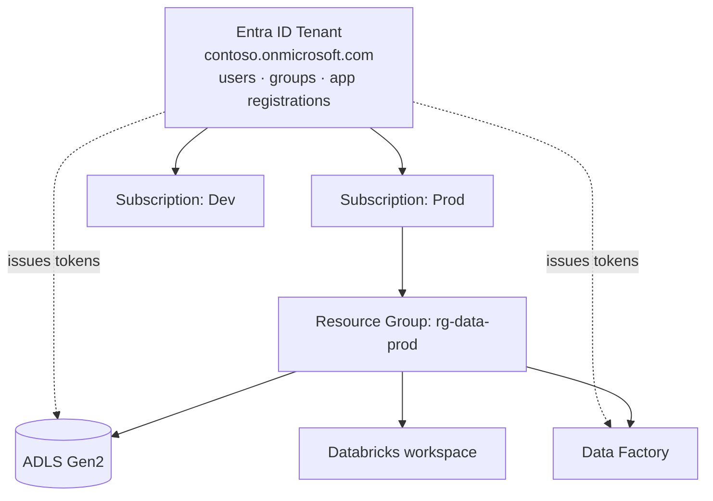
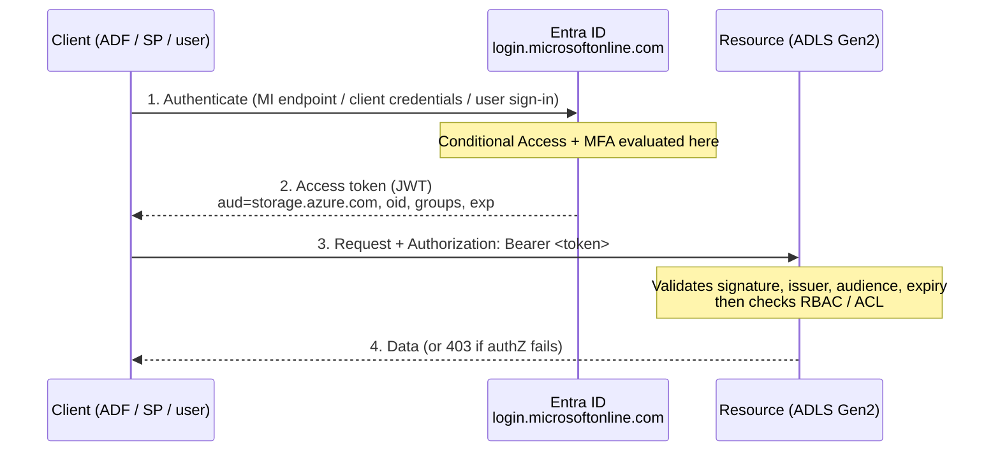

# 03 — Microsoft Entra ID (formerly Azure Active Directory)

## What is it?

**Microsoft Entra ID** is Azure's **cloud identity provider**: the service that holds every user, group, and application identity in your organization, proves who they are (**authentication**), and issues the **tokens** that every other Azure service checks before letting anyone touch anything.

Nothing in Azure happens without it. When a pipeline reads a file from [ADLS](../../05_Storage_and_Formats/Data_Lakes_and_Storage/03_Azure_Data_Lake_Storage.md), when a Databricks cluster mounts a container, when Power BI refreshes a dataset, when you log into the portal — an Entra ID token is being minted and checked. [Data Governance & Security](01_Data_Governance_and_Security.md) said *"authN happens first, then authZ."* **Entra ID is the authN half**, and it is also where the *principals* live that the authZ half (RBAC, ACLs, Unity Catalog GRANTs) hands permissions to.

**Analogy:** Entra ID is the **passport office** of your organization. It doesn't own any buildings and it doesn't decide which rooms you may enter — it issues the passport that proves you are who you claim to be, and stamps it with a few facts about you (your groups, your roles, whether you used MFA). Every building's own door policy (Azure RBAC, ADLS ACLs, Unity Catalog) then reads that passport and decides. A passport with no visa gets you nowhere; a visa with no passport is meaningless.

> **The rename:** Microsoft renamed **Azure Active Directory (Azure AD / AAD)** to **Microsoft Entra ID** in 2023. **Nothing technical changed** — same service, same APIs, same tokens, same `login.microsoftonline.com` endpoints. You will still see "Azure AD", "AAD", `azuread` Terraform providers, and `Azure Active Directory` in older docs, SDK names, and interview questions. Treat the two names as identical.

---

## Entra ID is *not* Active Directory

The single most common misconception, and a favourite interview trap.

| | **On-prem Active Directory (AD DS)** | **Microsoft Entra ID** |
|---|---|---|
| Runs on | Domain controllers you own | Microsoft's cloud, multi-tenant |
| Protocols | **Kerberos, LDAP, NTLM** | **OAuth 2.0, OpenID Connect, SAML, SCIM** |
| Structure | Forests, domains, OUs, Group Policy | A flat **tenant** + groups + administrative units |
| Designed for | Domain-joined Windows machines on a LAN | Internet-facing apps, SaaS, APIs, mobile |
| "Join" concept | Domain join | Entra join / hybrid join / registration |

They are **different products that solve the same problem in different eras**. Entra ID is not "AD in the cloud" — you cannot point an LDAP query at it, and there is no Group Policy.

- **Hybrid:** most enterprises run both, syncing on-prem AD → Entra ID with **Microsoft Entra Connect Sync** (or the lighter **Entra Cloud Sync**), so one on-prem account signs into Microsoft 365 and Azure. Password hash sync, pass-through auth, or federation (ADFS) are the three sign-in options.
- **Need real LDAP/Kerberos in the cloud** (a legacy app lifted-and-shifted)? That's **Microsoft Entra Domain Services** — a *separate*, managed AD domain, not Entra ID itself.

---

## The Entra product family (what the other names are)

"Entra" is the umbrella brand; **Entra ID** is the identity directory inside it. Worth recognizing the siblings so a JD doesn't confuse you:

| Product | What it is |
|---|---|
| **Microsoft Entra ID** | The directory + authentication service — **this note** |
| **Entra ID Governance** | Access reviews, entitlement management, lifecycle workflows |
| **Entra Workload ID** | Conditional Access, risk detection, and lifecycle *for apps/service principals* |
| **Entra Permissions Management** | CIEM — finds over-permissioned identities across Azure/AWS/GCP |
| **Entra External ID** | Identity for customers/partners (the successor to Azure AD B2C) |
| **Entra Verified ID** | Decentralized/verifiable credentials |
| **Entra Domain Services** | Managed *classic* AD domain (LDAP/Kerberos) for legacy apps |
| **Entra Private/Internet Access** | Zero-trust network access (Global Secure Access) |

---

## Tenant, directory, subscription — how they nest

This trips people up constantly, so get it precise:

- A **tenant** is one instance of Entra ID — one organization's directory, identified by a **Tenant ID** (a GUID) and one or more domains (`contoso.onmicrosoft.com`, `contoso.com`). *Directory* and *tenant* are used interchangeably.
- A **subscription** is a **billing and resource container**. Every subscription **trusts exactly one tenant** for identity.
- One tenant can hold **many subscriptions** (dev/test/prod). A subscription can be moved to another tenant, and doing so **wipes all its RBAC assignments** — because the principals that were assigned live in the old tenant.



**Management groups** sit *above* subscriptions for policy/RBAC inheritance; they are an Azure resource-hierarchy concept, still backed by the same tenant's identities.

---

## The identity types a data engineer actually meets

Everything Entra ID authenticates is a **security principal**. There are four kinds, and choosing correctly is most of the job.

| Principal | What it represents | Credential | Typical DE use |
|---|---|---|---|
| **User** | A human | Password + MFA | You, in the portal / Databricks UI / Power BI |
| **Group** | A set of users/SPs/groups | — | **The thing you should assign permissions to** |
| **Service principal (SP)** | An application's identity in *this* tenant | Client secret or **certificate** | Automation from outside Azure (GitHub Actions, on-prem jobs, Terraform) |
| **Managed identity (MI)** | A service principal Azure creates and whose credentials **Azure rotates for you** | **None you ever see** | ADF, Databricks Access Connector, Synapse, Functions, VMs reaching ADLS/Key Vault |

### App registration vs service principal (the nuance interviewers probe)

Registering an app creates **two** objects:

- an **Application object** — the global definition (one, in the tenant where it was registered), holding the **Application/Client ID**, redirect URIs, secrets, certificates, and exposed API permissions;
- a **Service principal** — the *local* instance of that app in a tenant, holding the **Object ID** that RBAC assignments actually point at.

So: **Client ID identifies the app; Object ID identifies the principal you grant roles to.** Multi-tenant apps have one application object and a service principal in every tenant that consented to it.

The three GUIDs you will paste into config a thousand times:

| ID | Also called | Points at |
|---|---|---|
| **Tenant ID** | Directory ID | Your organization's directory |
| **Client ID** | Application (client) ID | The app registration |
| **Object ID** | Principal ID | The service principal / MI you assign roles to |

### System-assigned vs user-assigned managed identity

| | **System-assigned** | **User-assigned** |
|---|---|---|
| Lifecycle | Born and **deleted with the resource** | A standalone Azure resource you manage |
| Sharing | Exactly **one** resource | **Many** resources share one identity |
| Best for | A single ADF/Function that needs its own identity | A fleet — grant `Storage Blob Data Contributor` **once**, attach to 20 resources |
| Re-create the resource? | New identity → **all role assignments must be redone** | Identity survives, roles stay intact |

**Rule of thumb:** system-assigned for one-off resources; **user-assigned** anywhere you'd otherwise repeat the same role assignments, or where the resource may be redeployed by CI/CD.

### Workload identity federation — the "no secrets at all" option

For workloads *outside* Azure (GitHub Actions, GitLab, Kubernetes, another cloud), **workload identity federation** lets that platform's own OIDC token be exchanged for an Entra token. You configure a **federated credential** on the app registration (issuer + subject + audience) instead of a client secret.

Result: **no secret exists to leak, expire, or rotate.** This is the modern, recommended way to authenticate a GitHub Actions deployment pipeline to Azure — and the right answer to *"how do you avoid storing an SP secret in CI?"*

---

## How authentication actually works (tokens, not passwords)

Entra ID speaks **OAuth 2.0** (authorization) and **OpenID Connect** (authentication on top of OAuth). The artifact everything revolves around is a **JWT access token**.



Key facts to have straight:

- **Tokens are per-resource.** A token has an **audience** (`aud`) — `https://storage.azure.com/`, `https://vault.azure.net`, `https://database.windows.net/`, `2ff814a6-3304-4ab8-85cb-cd0e6f879c1d` for Databricks. A storage token is rejected by Key Vault. "Wrong audience" is a very common cause of a mysterious 401.
- **Access tokens are short-lived** (~60–90 minutes, with variance). **Refresh tokens** are long-lived and let clients get new access tokens silently.
- **Claims** inside the token carry the identity: `oid` (object ID), `tid` (tenant), `appid`, `roles` (app roles), `groups`, `scp` (delegated scopes), `exp`.
- **Group claim overage:** if a user is in more than ~150–200 groups, Entra omits the `groups` claim and sends a Graph link instead. Apps that naively read `groups` then silently see *no* groups — a classic "works for juniors, breaks for the admin who's in every group" bug.
- **The flow that matters for automation** is the **client credentials flow**: `POST https://login.microsoftonline.com/<tenant>/oauth2/v2.0/token` with `client_id`, `client_secret`, `scope=https://storage.azure.com/.default` → access token. Managed identities do the same thing but fetch from a local **IMDS** endpoint with no secret involved.

---

## Entra roles vs Azure RBAC vs ADLS ACLs vs Unity Catalog

Four permission systems overlap in every Azure data platform. Knowing which one to reach for is a senior-level distinction.

| System | Governs | Examples | Where it's defined |
|---|---|---|---|
| **Entra ID roles** | The **directory itself** | Global Administrator, User Administrator, Application Administrator | Entra ID |
| **Azure RBAC — control plane** | **Managing resources** | Owner, Contributor, Reader on a resource group | Azure Resource Manager |
| **Azure RBAC — data plane** | **Reading/writing the data inside** | `Storage Blob Data Reader/Contributor/Owner`, `Key Vault Secrets User` | Azure Resource Manager |
| **ADLS POSIX ACLs** | Individual **files/folders** | `rwx` on `/silver/orders` | The storage filesystem |
| **Unity Catalog GRANTs** | Catalog/schema/table/column/row | `GRANT SELECT ON TABLE ... TO group` | Databricks |

> ⚠️ **The #1 real-world gotcha:** being **Owner or Contributor on a storage account does *not* let you read the data in it.** Those are *control-plane* roles — they let you manage the account (including reading its keys), not read blobs with your own identity. To read data as yourself you need a **data-plane** role such as `Storage Blob Data Reader`. This produces the infamous `403 AuthorizationPermissionMismatch` for people who are "already admin."

### ADLS evaluation order

1. **Azure RBAC is evaluated first.** If a data-plane role grants the operation, evaluation **stops** — ACLs are not consulted.
2. If RBAC doesn't grant it, **POSIX ACLs** on the path are evaluated (execute `x` needed on *every parent folder*, plus the actual permission on the target).
3. `Storage Blob Data Owner` is a **superuser** — it bypasses ACL checks entirely.

ACL details that bite:

- An ACL holds a **maximum of 32 entries** per file/directory → **assign ACLs to Entra groups, never individuals**, or you will hit the ceiling and have to redo the model.
- **Default ACLs apply only to newly created children.** Setting one does **not** retroactively fix existing files — you must apply access ACLs recursively.
- Role assignment changes can take **several minutes** to propagate. "I granted it and it still 403s" is usually propagation or a cached token, so also re-acquire the token.

---

## Where Entra ID shows up in the Azure data stack

### Azure Data Factory / Synapse pipelines → ADLS, SQL, Key Vault
Turn on the factory's **managed identity** (system-assigned exists by default; attach a user-assigned one for shared fleets), then grant it `Storage Blob Data Contributor` on the target container and `Key Vault Secrets User` on the vault. Linked services choose **Managed Identity** as the auth type — **no keys, no SAS, no secrets in JSON**. This is the expected answer to *"how does ADF authenticate to storage?"*

### Azure Databricks
Three separate identity surfaces, and interviewers like to see you separate them:

1. **Users signing in** — Entra ID SSO into the workspace; users/groups provisioned to the Databricks **account** via **SCIM** from Entra ID, then assigned to workspaces (identity federation). Group membership managed in Entra flows through to Unity Catalog grants.
2. **Compute reaching storage** — the modern pattern is the **Azure Databricks Access Connector**, a managed identity that holds `Storage Blob Data Contributor` on the ADLS account. Unity Catalog wraps it in a **storage credential** → **external location**, and grants on that control who can read the path. Legacy alternative: a service principal + secret in a **Key Vault-backed secret scope** with OAuth Spark configs.
3. **Jobs and automation** — **Databricks service principals** (which can be backed by an Entra ID application) own production jobs, so pipelines don't break when a person leaves.

```python
# Legacy service-principal OAuth to ADLS (pre-Unity-Catalog pattern).
# Modern equivalent: a Unity Catalog external location backed by the Access Connector.
spark.conf.set("fs.azure.account.auth.type.<acct>.dfs.core.windows.net", "OAuth")
spark.conf.set("fs.azure.account.oauth.provider.type.<acct>.dfs.core.windows.net",
               "org.apache.hadoop.fs.azurebfs.oauth2.ClientCredsTokenProvider")
spark.conf.set("fs.azure.account.oauth2.client.id.<acct>.dfs.core.windows.net",
               dbutils.secrets.get("kv-scope", "sp-client-id"))
spark.conf.set("fs.azure.account.oauth2.client.secret.<acct>.dfs.core.windows.net",
               dbutils.secrets.get("kv-scope", "sp-client-secret"))   # never hard-coded
spark.conf.set("fs.azure.account.oauth2.client.endpoint.<acct>.dfs.core.windows.net",
               "https://login.microsoftonline.com/<tenant-id>/oauth2/token")
```

### Azure SQL / Synapse dedicated pools
Set an **Entra admin** on the logical server, then create **contained users** mapped to Entra principals — including managed identities:

```sql
-- Entra group as a database user (grant to groups, not people)
CREATE USER [grp-data-engineers] FROM EXTERNAL PROVIDER;
ALTER ROLE db_datareader ADD MEMBER [grp-data-engineers];

-- ADF's managed identity, named exactly as the ADF resource
CREATE USER [adf-prod-eastus] FROM EXTERNAL PROVIDER;
GRANT SELECT, INSERT ON SCHEMA::staging TO [adf-prod-eastus];
```

This is how you retire SQL logins and passwords entirely.

### Key Vault
Two authorization models: legacy **vault access policies** and **Azure RBAC** (recommended, since it's consistent with everything else — `Key Vault Secrets User` to read secrets). Either way, the *caller* is an Entra principal, normally a managed identity. Key Vault is where the last remaining secrets (third-party API keys, on-prem DB passwords) live — see [Data Governance & Security](01_Data_Governance_and_Security.md).

### Power BI / Fabric
Entra ID users and groups drive workspace roles, dataset RLS, and **SSO passthrough** to the lakehouse, so a report can execute *as the viewer* and Unity Catalog/RLS filters apply per person rather than per service account. See [Power BI for Engineers](../../16_Power_BI_for_Engineers/00_Power_BI_Learning_Path.md).

### Microsoft Purview
Purview's own **managed identity** is what you grant `Storage Blob Data Reader` so it can scan and classify your estate. The catalog's owners/stewards are Entra identities too.

---

## Conditional Access, MFA, and privileged access

Authentication isn't only "right password." **Conditional Access (CA)** is the policy engine that evaluates *signals* at sign-in and decides: allow, block, or require something more.

| Signal | Example policy |
|---|---|
| User/group | Require MFA for everyone in `grp-data-engineers` |
| Application | Block legacy authentication protocols outright |
| Device | Require a compliant/Entra-joined device for the prod workspace |
| Location | Block sign-ins from outside approved countries |
| Risk (P2) | Force a password change on a high-risk sign-in |

Related controls worth naming:

- **MFA** — the single highest-value control; **Security Defaults** turn on a baseline for free.
- **PIM (Privileged Identity Management)** — **just-in-time**, time-boxed, approval-gated elevation. Nobody is a standing Global Admin or Owner; they *activate* the role for 2 hours with justification. Requires **P2**.
- **Access reviews** — periodic recertification of who is still in which group (Entra ID Governance).
- **Identity Protection** — risk detection (leaked credentials, impossible travel, anonymous IPs). **P2**.
- **Conditional Access for workload identities** — CA policies applied to *service principals* (e.g. restrict an SP to known IP ranges); licensed via **Entra Workload ID**.

> **The classic CA-vs-pipeline failure:** a tenant-wide "require MFA" policy that accidentally targets a service principal or an unattended job. Service principals cannot do MFA — the pipeline breaks at 2 a.m. Scope CA policies to users, and control workload identities with Workload ID policies instead.

### Licensing, briefly

| Tier | Notable capabilities |
|---|---|
| **Free** | Users/groups, SSO, Security Defaults, basic reports |
| **P1** | **Conditional Access**, group-based app access, self-service password reset with writeback, dynamic groups |
| **P2** | P1 + **PIM**, **Identity Protection**, access reviews/entitlement management (also sold as Entra ID Governance) |

---

## Groups: the pattern that keeps access manageable

Every mature Azure data platform grants permissions to **groups only**. Individual assignments are how you end up unable to answer "who can read PII?" — and how you blow the 32-entry ACL limit.

- **Security groups** are the workhorse for Azure RBAC, ADLS ACLs, and Unity Catalog.
- **Dynamic groups** (P1) auto-populate from attributes — `user.department -eq "Finance"` — so joiners/leavers are handled by HR data, not tickets.
- **Assignable-to-role groups** can hold Entra role assignments (and require stronger protection).
- **SCIM provisioning** pushes Entra groups into Databricks, Snowflake, and other SaaS, so one membership change lands everywhere.

A workable naming convention makes audits trivial:

```
grp-adls-prod-bronze-reader
grp-adls-prod-silver-writer
grp-databricks-prod-admin
grp-sql-dw-finance-reader
```

---

## Worked example: a pipeline's full identity flow

An ADF pipeline copies from ADLS Bronze to Silver and writes a summary to Azure SQL, using a secret from Key Vault for one third-party API — **with no credential stored anywhere**.

1. ADF has a **user-assigned managed identity** `uami-data-prod`.
2. `uami-data-prod` is a member of `grp-data-prod-runtime`, which holds:
   - `Storage Blob Data Contributor` on the ADLS account,
   - `Key Vault Secrets User` on `kv-data-prod`,
   - a contained user in Azure SQL with `INSERT` on `dbo.reporting`.
3. At runtime, ADF asks the **IMDS endpoint** for a token with `aud=https://storage.azure.com/`. No secret is involved; Azure signs it because it manages the identity.
4. ADLS validates the token, resolves the `oid` to the MI, evaluates **RBAC first** — the group grant hits — and serves the data.
5. For Key Vault, ADF requests a *different* token (`aud=https://vault.azure.net`) and reads the API key.
6. Every one of these requests lands in **Entra sign-in logs** and the resource's **diagnostic logs**, giving you the audit trail for [monitoring](../../12_Monitoring_and_Observability/02_Azure_Monitor_and_Log_Analytics.md).

Offboarding is now a single act: remove the identity from the group. Nothing to rotate, nothing to hunt for in a repo.

---

## Troubleshooting table (the errors you will actually see)

| Symptom | Cause | Fix |
|---|---|---|
| `403 AuthorizationPermissionMismatch` on ADLS | Control-plane role only (Owner/Contributor), no data-plane role; or missing `x` on a parent folder | Grant `Storage Blob Data Reader/Contributor`, or fix ACLs along the whole path |
| `401 Unauthorized` / "audience validation failed" | Token requested for the wrong **resource/scope** | Request the token with the right `aud`/`.default` scope |
| Worked yesterday, fails today, no changes | **Client secret expired** (portal max 24 months) | Rotate — better, move to a certificate or **managed identity** |
| Pipeline fails after a CA policy rollout | MFA/device policy hit an unattended identity | Scope CA to users; use Workload ID policies for SPs |
| Role granted, still denied | RBAC propagation delay, or a cached token | Wait a few minutes and **re-acquire** the token |
| Databricks user sees no tables | Not provisioned via SCIM, or the group has no Unity Catalog grant | Fix the SCIM sync, then `GRANT` to the group |
| App reads no groups for one admin | **Group claim overage** (>~150 groups) | Read groups from Microsoft Graph, or use app roles |
| ADF redeployed and lost all access | It had a **system-assigned** MI; the new resource has a new identity | Use a **user-assigned** MI for CI/CD-deployed resources |

---

## Anti-patterns (name these in an interview)

- **Storage account keys or SAS tokens in notebooks/linked services** — unattributable (every action looks identical), unrotatable in practice, and they bypass RBAC entirely. Managed identity instead.
- **One "super" service principal shared by every pipeline** — the audit log tells you nothing, and its blast radius is the whole platform.
- **Per-user role assignments** — unauditable, and it hits the 32-entry ACL cap.
- **Client secrets committed to Git**, or pasted into notebooks. Key Vault, or federation with no secret at all.
- **Standing Global Admin / Owner** — use **PIM** for just-in-time elevation.
- **Assuming Contributor grants data access** — it doesn't, and half of all ADLS 403s trace back to this.
- **Long-lived secrets with no rotation plan** — pick certificates, managed identities, or workload identity federation.
- **Treating network isolation as sufficient** — private endpoints hide the path; identity still has to authorize the caller. Both, always. See [Network Security](02_Network_Security_and_Private_Connectivity.md).

---

## Interview-grade Q&A

- *What is Microsoft Entra ID?* Azure's cloud identity provider — it holds users, groups, and application identities, authenticates them via OAuth 2.0/OIDC/SAML, and issues the tokens every Azure resource validates before authorizing an action. It is the former Azure AD, renamed in 2023.
- *Entra ID vs on-prem Active Directory?* Different products for different eras. AD DS is LDAP/Kerberos, domains/OUs/Group Policy, for domain-joined machines on a LAN; Entra ID is OAuth/OIDC/SAML/SCIM, a flat tenant, for internet-facing apps. They're bridged with **Entra Connect Sync**, not equivalent.
- *Managed identity vs service principal?* A managed identity **is** a service principal whose credentials Azure creates and rotates for you — usable only by Azure resources. A plain service principal needs a secret or certificate you manage, which is what you use from outside Azure (GitHub Actions, on-prem). **Prefer managed identity whenever the caller is an Azure resource.**
- *System-assigned vs user-assigned MI?* System-assigned lives and dies with one resource; user-assigned is a standalone resource shared by many, survives redeployment, and lets you grant a role once for a fleet.
- *How does ADF authenticate to ADLS?* Its managed identity, granted `Storage Blob Data Contributor` on the container, selected as the linked-service auth type — no keys, no SAS, no secrets.
- *I'm Owner on the storage account but get 403 reading a file. Why?* Owner/Contributor are **control-plane** roles; blob data access needs a **data-plane** role like `Storage Blob Data Reader`. (Owner can read the *keys* and get in that way, which is exactly the practice you're trying to eliminate.)
- *RBAC vs ACLs on ADLS, and evaluation order?* RBAC is coarse (account/container) and **evaluated first** — if it grants, ACLs are skipped. ACLs are POSIX `rwx` at file/folder level and need execute on every parent. `Storage Blob Data Owner` bypasses ACLs. Max 32 ACL entries, so **assign to groups**.
- *How do you avoid storing a client secret in CI/CD?* **Workload identity federation** — GitHub/GitLab/Kubernetes present their own OIDC token, exchanged for an Entra token via a federated credential. No secret exists.
- *What is Conditional Access?* A policy engine evaluating signals (user, app, device, location, risk) at sign-in to allow, block, or require MFA/compliant device. P1 feature; workload-identity policies need Entra Workload ID.
- *What is PIM?* Privileged Identity Management — just-in-time, time-boxed, approval-gated activation of privileged roles, so nobody holds standing admin rights. P2.
- *How do users and groups get into Databricks?* Entra ID SSO for sign-in, **SCIM provisioning** to the Databricks account, then workspace assignment; the same groups receive Unity Catalog GRANTs.
- *Tenant vs subscription?* A tenant is one Entra directory (identity); a subscription is a billing/resource container that trusts exactly one tenant. One tenant, many subscriptions — and moving a subscription between tenants wipes its RBAC.
- *Client ID vs Object ID vs Tenant ID?* Tenant ID = the directory; Client ID = the app registration; Object ID = the service principal you actually assign roles to.
- *How would you offboard someone from the data platform?* Remove them from the Entra groups (all access is group-based), disable the account, revoke refresh tokens, and check that no personal service principal or key was in production use — then confirm via sign-in logs.

---

## Quick Review
- ✔ Entra ID = **authN**, the token issuer; RBAC/ACL/Unity Catalog = **authZ**, the permission systems
- ✔ Renamed from **Azure AD** in 2023 — same service, same APIs; **not** the same thing as on-prem AD
- ✔ Principals: **user · group · service principal · managed identity** (system- vs user-assigned)
- ✔ **Managed identity first**; service principal + certificate next; **workload identity federation** for CI/CD; client secrets last
- ✔ Tokens are **per-resource** (audience), short-lived, and carry `oid`/`tid`/`groups` claims
- ✔ **Control-plane ≠ data-plane:** Contributor doesn't read blobs — `Storage Blob Data *` does
- ✔ On ADLS: **RBAC evaluated before ACLs**; ACLs cap at **32 entries** → grant to **groups**; default ACLs aren't retroactive
- ✔ **Conditional Access + MFA + PIM + access reviews** are the privileged-access story; CA never targets unattended jobs
- ✔ Every sign-in is auditable in **Entra sign-in logs** → Log Analytics

---

## Related Notes
- **The other half of access:** [Data Governance & Security](01_Data_Governance_and_Security.md) — RBAC/ACL, Key Vault, Purview, Unity Catalog
- **The network half:** [Network Security & Private Connectivity](02_Network_Security_and_Private_Connectivity.md) — private endpoints, Managed VNet
- **Where the tokens are used:** [Azure Data Lake Storage](../../05_Storage_and_Formats/Data_Lakes_and_Storage/03_Azure_Data_Lake_Storage.md) · [Unity Catalog](../../08_Databricks/06_Unity_Catalog.md) · [Storage Access: ABFSS & Volumes](../../08_Databricks/07_Storage_Access_ABFSS_and_Volumes.md)
- **Auditing it:** [Azure Monitor & Log Analytics](../../12_Monitoring_and_Observability/02_Azure_Monitor_and_Log_Analytics.md)
- **Automating it:** [CI/CD for ADF and Databricks](../../14_Testing_and_DataOps/05_CICD_for_ADF_and_Databricks.md)

---

## Further Learning — Docs & Videos
- Microsoft Entra ID documentation: https://learn.microsoft.com/entra/fundamentals/whatis
- Managed identities for Azure resources: https://learn.microsoft.com/entra/identity/managed-identities-azure-resources/overview
- Workload identity federation: https://learn.microsoft.com/entra/workload-id/workload-identity-federation
- Azure RBAC vs ACLs on ADLS Gen2: https://learn.microsoft.com/azure/storage/blobs/data-lake-storage-access-control-model
- Conditional Access overview: https://learn.microsoft.com/entra/identity/conditional-access/overview
- Privileged Identity Management: https://learn.microsoft.com/entra/id-governance/privileged-identity-management/pim-configure
- Video — Microsoft Entra ID explained: https://www.youtube.com/results?search_query=microsoft+entra+id+azure+ad+explained

Next: **[Interview Questions & Answers](Interview_Questions_and_Answers.md)**.
