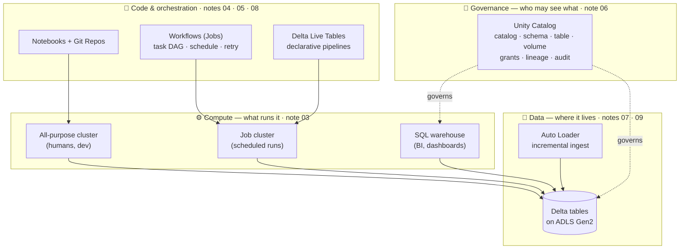

# Databricks — Learning Path

**Azure Databricks** is the platform where most modern Azure data engineering actually happens: it's a managed Apache Spark environment with the [lakehouse](../05_Storage_and_Formats/Lakehouse/03_Lakehouse_Architecture.md) built in. If [PySpark](../03_Programming/PySpark/00_PySpark_Learning_Path.md) is the *language* and [Delta Lake](../05_Storage_and_Formats/Lakehouse/01_Delta_Lake.md) is the *storage format*, **Databricks is the house they both live in.**

This module teaches the **platform** — clusters, notebooks, jobs, governance, and the managed features (Unity Catalog, DLT, Auto Loader) that turn raw Spark into a production data platform.

> **Note on the two Databricks tracks in this repo:** this `08_Databricks/` folder is the **learning path** — concepts first, each note a single continuous read from the basics through to production practice. The separate [Databricks Data Engineer Associate](../Certifications/Databricks_Data_Engineer_Associate/00_Study_Guide_Overview.md) folder is **exam prep** for the certification. Read this to *understand*; read that to *pass the test*.

---

## The platform at a glance

Databricks has a lot of surface area, and the fastest way to stop feeling lost is to see how the pieces stack. Four layers, and every note in this module sits in one of them:

Read it as a sentence: **you write code (notebooks/DLT), a scheduler (Workflows) runs it on compute (clusters), which reads and writes Delta tables on your storage, and Unity Catalog decides who is allowed to do any of it.** Note 01 explains the split that sits underneath all four layers — Databricks runs the *brains* (control plane) while the *muscle and your data* stay in your Azure subscription (data plane).

The three ideas that make everything else click, if you only remember three:

| Idea | Why it matters | Note |
|---|---|---|
| **Control plane vs data plane** | Answers "does Databricks hold our data?" (no) and every security review | [01](01_What_is_Databricks.md) |
| **Job clusters vs all-purpose clusters** | The single biggest cost lever on the platform | [03](03_Clusters_and_Compute.md) |
| **The three-level namespace** `catalog.schema.table` | How governance and dev/prod separation actually work | [06](06_Unity_Catalog.md) |

---

## Prerequisites

Before this module, you should have done:
- [PySpark](../03_Programming/PySpark/00_PySpark_Learning_Path.md) — Databricks runs Spark; you need to speak it
- [Delta Lake](../05_Storage_and_Formats/Lakehouse/01_Delta_Lake.md) & [Lakehouse Architecture](../05_Storage_and_Formats/Lakehouse/03_Lakehouse_Architecture.md) — the storage foundation
- [Azure Data Lake Storage](../05_Storage_and_Formats/Data_Lakes_and_Storage/03_Azure_Data_Lake_Storage.md) — where the data physically lives

---

## The map

| # | Note | What it covers |
|---|---|---|
| 01 | [What is Databricks?](01_What_is_Databricks.md) | The platform, control plane vs data plane, workspace, why it exists |
| 02 | [Why Spark? Why Databricks?](02_Why_Spark_Why_Databricks.md) | Why Spark replaced MapReduce, and what Databricks adds on top |
| 03 | [Clusters & Compute](03_Clusters_and_Compute.md) | All-purpose vs job clusters, pools, autoscaling, Photon, SQL warehouses, cost |
| 04 | [Notebooks, Repos & Jobs](04_Notebooks_Repos_and_Jobs.md) | Notebooks, Git Repos, widgets, `dbutils`, secrets |
| 05 | [Databricks Workflows](05_Databricks_Workflows.md) | Jobs, task graphs, job clusters, scheduling, DLT pipelines |
| 06 | [Unity Catalog](06_Unity_Catalog.md) | Governance: metastore, three-level namespace, access control, lineage |
| 07 | [Storage Access: ABFSS & Volumes](07_Storage_Access_ABFSS_and_Volumes.md) | `abfss://` paths, Unity Catalog Volumes, External Locations & Storage Credentials, DBFS, mounts (legacy) |
| 08 | [Delta Live Tables (DLT)](08_Delta_Live_Tables.md) | Declarative pipelines, expectations, streaming tables, the medallion made easy |
| 09 | [Auto Loader & Ingestion](09_Auto_Loader_and_Ingestion.md) | Incremental file ingestion, schema inference/evolution, `COPY INTO` |
| 10 | [Databricks & Spark Cost Optimization](10_Databricks_Cost_Optimization.md) | DBUs, cluster sizing, autoscaling, spot, Photon, job vs all-purpose |
| — | [Interview Q&A](Interview_Questions_and_Answers.md) | Q&A across the whole module |

> **Related Databricks material elsewhere:** [CI/CD with Asset Bundles](../14_Testing_and_DataOps/05_CICD_for_ADF_and_Databricks.md) (with ADF, in DataOps) · [Synapse vs Fabric vs Databricks](../10_Synapse_and_Fabric/04_Synapse_vs_Fabric_vs_Databricks.md) (platform choice) · [Delta Lake / Lakehouse](../05_Storage_and_Formats/Lakehouse/01_Delta_Lake.md) (the storage format) · [PySpark](../03_Programming/PySpark/00_PySpark_Learning_Path.md) (the language).

---

## Suggested route

- **Just want the concepts:** 01 → 02 → 03 → 06. What it is, why it wins, how compute works, how it's governed.
- **Building pipelines:** all of 01–10 in order.
- **Interview tomorrow:** the [Q&A](Interview_Questions_and_Answers.md) + the [Databricks interview folder](../Job%20Interviews/Azure%20Databricks/Databricks%20Interview%20Questions.md) + [Performance Optimization](../Job%20Interviews/Azure%20Databricks/Performance%20Optimization.md).

**Milestone for the module:** explain the control-plane/data-plane split, pick the right cluster type for a job, describe Unity Catalog's three-level namespace, and sketch a medallion pipeline built with DLT + Auto Loader.
