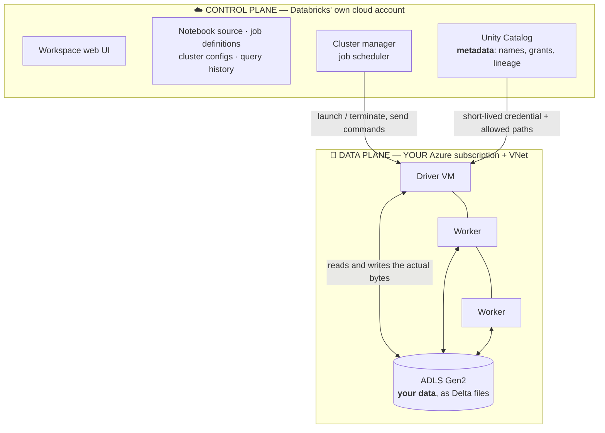
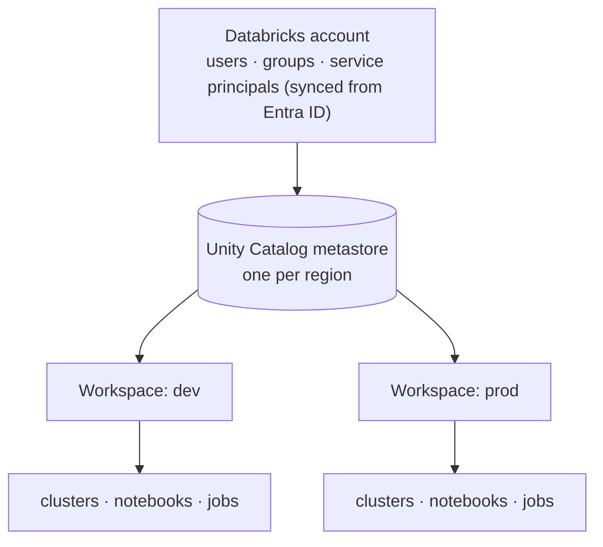

# What is Databricks?

## What is it?

**Databricks** is a cloud **data platform** built on top of Apache Spark by the people who created Spark. It bundles managed Spark compute, notebooks, [Delta Lake](../05_Storage_and_Formats/Lakehouse/01_Delta_Lake.md), governance, and orchestration into one product so teams can run data engineering, analytics, and machine learning on a single [lakehouse](../05_Storage_and_Formats/Lakehouse/03_Lakehouse_Architecture.md) — without assembling and babysitting the infrastructure themselves.

**Azure Databricks** is Databricks sold as a first-party Azure service: same platform, integrated with Azure identity (Entra ID), storage ([ADLS](../05_Storage_and_Formats/Data_Lakes_and_Storage/03_Azure_Data_Lake_Storage.md)), networking, and billing.

In one line: **Databricks = managed Spark + Delta Lake + notebooks + governance + jobs, as one lakehouse platform.**

---

## Analogy: rent a fully-equipped kitchen, don't build one

Running Spark yourself is like **building a restaurant kitchen from scratch** — buy the ovens (servers), wire the gas (networking), hire someone to maintain it all (cluster ops), and hope nothing breaks during dinner service.

Databricks is a **fully-equipped commercial kitchen you rent by the hour**: the ovens are installed and maintained, you walk in, cook (write code), and walk out. You still bring your own recipes (logic) and ingredients (data), but you never fix a broken oven at 2 a.m. When the dinner rush hits, more stations appear automatically (autoscaling); when it's quiet, they're switched off so you stop paying (auto-termination).

---

## Why it exists

Before Databricks, using Spark meant:
- Provisioning and configuring a Hadoop/Spark cluster ([the hard way](../01_Foundations/Fundamentals/05_Hadoop_Architecture.md))
- Keeping data engineers, analysts, and data scientists on *separate* tools with *separate* copies of data
- No transactions on the lake, no built-in governance

Databricks collapsed all of that: one platform, one copy of data (the lakehouse), and the infrastructure managed for you. That's why it became the default for Azure data engineering.

---

## The architecture: control plane vs data plane

This is the single most important thing to understand about Databricks — and a guaranteed interview question.



- **Control plane** — the *brains*, run in Databricks' own cloud account: the web app, notebook source, job configs, cluster orchestration, catalog metadata.
- **Data plane** (a.k.a. compute plane) — the *muscle*, run in **your** Azure subscription: the cluster VMs that do the work and your data in your storage.

**Why it matters:** your data and compute stay in *your* account and network — Databricks orchestrates but doesn't hold your data. This is the answer to "is my data secure?" and "where does the processing happen?"

**What actually crosses the boundary?** Commands and metadata, never your table data. The control plane tells a VM in your subscription "run this code"; that VM reads and writes ADLS directly. The nuance worth knowing for a security review: notebook *source code*, job definitions, and query history **are** stored in the control plane, and query **results** are cached there so the UI can display them — which is why regulated customers also configure **customer-managed keys** for that control-plane content.

### Account vs workspace — the two levels of administration

Newcomers assume the workspace is all there is. There are two levels, and the boundary between them is exactly where Unity Catalog lives.

| | **Account** | **Workspace** |
|---|---|---|
| Scope | The whole Databricks organization | One environment (dev, prod, a business unit) |
| Managed in | The **account console** | The workspace UI |
| Holds | **Unity Catalog metastores**, account-level users/groups/service principals (synced from [Entra ID](../06_Data_Engineering/Data_Governance/03_Microsoft_Entra_ID.md)), billable-usage logs | Notebooks, clusters, jobs, DBFS root, workspace-local ACLs |
| Admin role | Account admin | Workspace admin |

The practical consequence: **identity and governance are account-level; compute and code are workspace-level.** That is precisely why Unity Catalog can enforce one permission model across dev and prod workspaces, and why the pre-UC Hive metastore — which was workspace-local — could not.



### Classic vs serverless compute — where the VMs actually live

Since serverless arrived, "the data plane is in your subscription" needs one qualification, and interviewers increasingly ask for it.

| | **Classic compute** | **Serverless compute** |
|---|---|---|
| VMs run in | **Your** Azure subscription and VNet | **Databricks'** account, isolated per customer |
| Startup | Minutes (seconds from a pool) | Seconds |
| You choose | VM type, worker count, DBR version | Nothing — Databricks sizes it |
| Network control | Full: VNet injection, Private Link, NSGs | Limited: serverless network policies / connectivity configs |
| Billed as | DBUs **+** your Azure VM cost | One higher DBU rate, VMs included |
| Best for | Long ETL, custom libraries, strict network isolation | SQL warehouses, short/bursty jobs, notebooks, DLT |

Neither is simply better. Classic gives control and cheaper long-running compute; serverless removes cluster management entirely and wins wherever startup latency dominates — which is most BI and most short jobs.

### The product surfaces (what the left-hand nav is for)

One platform, three front doors, all reading the **same** Delta tables through the **same** Unity Catalog:

- **Data Engineering** — notebooks, Workflows, DLT, Auto Loader. Where pipelines are built.
- **Databricks SQL** — SQL editor, dashboards, alerts, and SQL warehouses. Where analysts and BI tools land.
- **Machine Learning** — MLflow tracking, the model registry (now in Unity Catalog), feature engineering, model serving.

That shared substrate is the whole lakehouse argument: no export step between the engineer's table, the analyst's dashboard, and the scientist's training set.

---

## Key pieces of the platform

| Piece | What it is |
|---|---|
| **Workspace** | Your Databricks environment — the UI, folders, notebooks, users |
| **Cluster / compute** | The Spark VMs that run your code — see [03](03_Clusters_and_Compute.md) |
| **Notebook** | Interactive multi-language document (Python/SQL/Scala/R) — see [04](04_Notebooks_Repos_and_Jobs.md) |
| **Job / Workflow** | A scheduled, orchestrated pipeline — see [05](05_Databricks_Workflows.md) |
| **Delta Lake** | The default table format — see [Delta Lake](../05_Storage_and_Formats/Lakehouse/01_Delta_Lake.md) |
| **Unity Catalog** | Central governance & metadata — see [06](06_Unity_Catalog.md) |
| **DBFS / mounts** | A file-path abstraction over your cloud storage |
| **Runtime (DBR)** | The pre-packaged Spark + libraries version your cluster runs |

---

## Advantages

- **Managed Spark** — no cluster babysitting; spin up in minutes, auto-terminate when idle.
- **One platform for everyone** — engineers, analysts (Databricks SQL), and data scientists (MLflow) share one lakehouse.
- **Delta Lake built in** — ACID, time travel, MERGE out of the box.
- **Autoscaling & auto-termination** — pay for what you use.
- **Photon** — a vectorized engine that speeds up SQL/DataFrame workloads.
- **Deep Azure integration** — Entra ID, ADLS, Key Vault, ADF, Purview.

## Disadvantages

- **Cost can surprise you** — idle all-purpose clusters and oversized VMs burn money fast.
- **Learning curve** — clusters, runtimes, Unity Catalog, and DLT are a lot of surface area.
- **Not for OLTP** — it's an analytics platform, not a transactional database.
- **Some lock-in** — mitigated because your data stays as open Delta in your storage.

---

## Azure Usage

Azure Databricks fits into a typical pipeline like this:

```
Sources → ADF (ingest/orchestrate) → ADLS (bronze)
        → Azure Databricks (Spark transforms, silver/gold Delta)
        → Databricks SQL / Synapse / Power BI (serve)
        Governance: Unity Catalog + Purview   Secrets: Key Vault
```

ADF often *triggers* Databricks notebooks/jobs; Databricks does the heavy Spark transformation; Power BI reads the Gold Delta tables.

---

## Real World Example

A media company's data scientists were training recommendation models on sampled CSV extracts on their laptops, while a separate BI team ran nightly SQL on a warehouse fed by a fragile copy pipeline — two teams, two copies, constant drift. Moving to Azure Databricks, both teams work on the *same* Delta tables in ADLS: engineers build Bronze→Silver→Gold with Spark, analysts query Gold through Databricks SQL, and data scientists train models on Silver with MLflow tracking — one copy of data, autoscaling clusters that switch off overnight, and Unity Catalog deciding who can see what.

---

## Databricks Runtime (DBR)

A cluster doesn't run "Spark" in the abstract — it runs a specific **Databricks Runtime**, a pre-built image bundling a Spark version, Delta, Python/Scala libraries, and optimizations. Variants:

- **Standard DBR** — general purpose.
- **DBR ML** — adds ML libraries (TensorFlow, PyTorch, MLflow).
- **Photon** — the C++ vectorized engine for SQL/DataFrame speed, toggled per cluster.

**Reading a version string** like `15.4 LTS`: the number is the *Databricks* release, not the Spark version — each DBR pins a specific Spark, Delta, Python, and Java. **LTS** releases carry long-term support (roughly three years); non-LTS releases are supported for months. The rule follows directly: **pin an LTS version for anything scheduled**, and keep latest-and-greatest for experiments.

Upgrading is a real task, not a formality: read the release notes for the Spark and Python version jumps, run the job on the new DBR in dev, and compare both the results *and* the runtime before promoting. A job that "worked last year" breaks most often because it silently moved to a newer runtime with different library versions.

## Workspace objects & the file layers

- **DBFS** (Databricks File System) — a path abstraction (`/dbfs/...`, `dbfs:/...`) layered over cloud storage. The **DBFS root is workspace-managed**; don't store production data there.
- **Mounts** (legacy) — attaching an ADLS container to a DBFS path. **Unity Catalog external locations + volumes are the modern replacement** — mounts are being phased out.
- **Volumes** (Unity Catalog) — governed storage for non-tabular files (models, images, exports).

## How Databricks relates to open-source Spark

Everything you learned in [PySpark](../03_Programming/PySpark/00_PySpark_Learning_Path.md) works here unchanged — Databricks *is* Spark. What Databricks adds on top: the managed cluster lifecycle, Photon, Delta optimizations (liquid clustering, deletion vectors), Unity Catalog, DLT, Auto Loader, Databricks SQL, and MLflow. You can lift a plain PySpark job into Databricks with near-zero code change.

---

## The control-plane/data-plane split is your security story

When security asks "does Databricks see our data?", the precise answer is: **no — compute and data live in the data plane inside your subscription and VNet; the control plane only orchestrates.** Enterprises harden this further with **VNet injection** (clusters in your own VNet), **Private Link** (no public internet path), **customer-managed keys**, and **secure cluster connectivity** (no public IPs on workers). Knowing this distinction separates a platform engineer from a notebook user.

## Cost is an architecture problem, not a billing problem

Databricks bills in **DBUs** (Databricks Units) *on top of* the raw Azure VM cost. The recurring waste patterns: all-purpose clusters left running idle, oversized driver/worker VMs, interactive clusters used for scheduled jobs (job clusters are far cheaper), and no auto-termination. The pro sets auto-termination aggressively, uses **job clusters for jobs**, right-sizes with the Spark UI, and uses **cluster pools** to cut startup time without paying for idle compute. Cost reviews should look at *cluster policies*, not just invoices.

## Cluster policies & governance at scale

In a real org you don't let everyone spin up any cluster — **cluster policies** constrain VM types, autoscaling limits, auto-termination, and tags (for cost attribution). Combined with Unity Catalog for data access, this is how a platform team keeps a 200-person workspace from becoming a cost-and-security free-for-all.

## Field-tested gotchas

- **Interactive cluster running a nightly job** = paying for an idle cluster all day. Use a job cluster that lives only for the run.
- **Storing prod data on the DBFS root** — it's workspace-scoped, not governed, and hard to migrate. Use Unity Catalog external locations/volumes.
- **Mounts with hardcoded keys** — a security and migration headache; move to UC external locations.
- **Runtime drift** — "latest" DBR silently upgrades libraries; pin versions for production jobs.
- **Assuming data leaves your account** — it doesn't; the confusion costs weeks in security reviews if not understood.

## Interview-grade Q&A

- *What is Azure Databricks in one sentence?* A managed, Azure-integrated Apache Spark + Delta Lake platform that unifies data engineering, analytics, and ML on one lakehouse.
- *Explain control plane vs data plane.* Control plane (Databricks-managed): UI, notebooks, job/cluster orchestration, catalog metadata. Data plane (your Azure subscription): the cluster VMs and your data — so processing and data stay in your account.
- *Databricks vs plain Spark?* Databricks *is* Spark plus managed clusters, Photon, Delta optimizations, Unity Catalog, DLT, Auto Loader, SQL, and MLflow — you get Spark without running the infrastructure.
- *Where does your data actually live?* In your own cloud storage (ADLS) in the data plane; Databricks orchestrates but doesn't store your data.
- *Biggest cost trap?* Idle all-purpose clusters and using interactive clusters for scheduled jobs instead of job clusters.
- *Account vs workspace?* The account holds identity (synced from Entra ID) and Unity Catalog metastores; a workspace holds clusters, notebooks, and jobs. Governance is account-level, which is how one permission model spans dev and prod.
- *Does the control plane hold anything of ours?* Notebook source, job definitions, query history, and cached query results — but never your table data, which stays in your storage. Regulated customers add customer-managed keys for that control-plane content.
- *Classic vs serverless compute?* Classic runs VMs in your subscription and VNet (full network control, cheaper for long jobs); serverless runs them in Databricks' account, starts in seconds, and bills one higher DBU rate with the VM included — better for SQL, short jobs, and bursty work.
- *What does `15.4 LTS` mean?* The Databricks release (not the Spark version) with long-term support. Pin an LTS for production; "latest" silently upgrades libraries underneath you.

---

## Related Notes

- **Next:** [Why Spark? Why Databricks?](02_Why_Spark_Why_Databricks.md) → [Clusters & Compute](03_Clusters_and_Compute.md)
- **Foundations:** [Why Spark? Why Databricks?](../08_Databricks/02_Why_Spark_Why_Databricks.md) · [Spark Architecture](../03_Programming/PySpark/Spark_Architecture.md)
- **Storage:** [Lakehouse Architecture](../05_Storage_and_Formats/Lakehouse/03_Lakehouse_Architecture.md) · [Delta Lake](../05_Storage_and_Formats/Lakehouse/01_Delta_Lake.md)
- **Cert:** [Databricks Associate — Lakehouse Platform](../Certifications/Databricks_Data_Engineer_Associate/01_Lakehouse_Platform_Fundamentals.md)

---

## Further Learning — Docs & Videos

**Documentation**
- Azure Databricks overview: https://learn.microsoft.com/en-us/azure/databricks/introduction/
- Databricks architecture: https://learn.microsoft.com/en-us/azure/databricks/getting-started/overview

**Videos**
- What is Azure Databricks: https://www.youtube.com/results?search_query=what+is+azure+databricks
- Databricks control plane vs data plane: https://www.youtube.com/results?search_query=databricks+control+plane+data+plane
