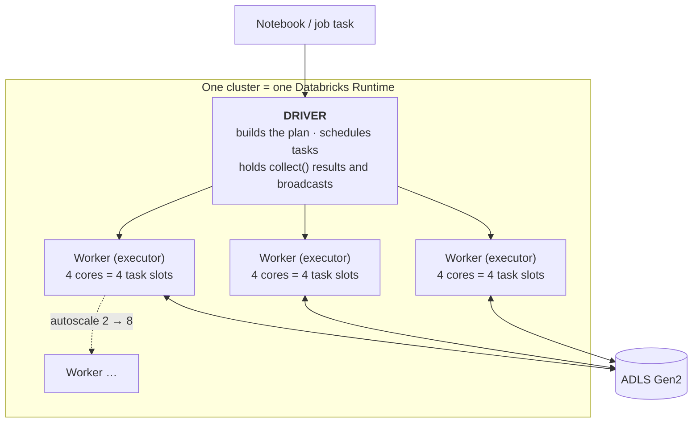

# Clusters & Compute

## What is it?

A **cluster** in Databricks is the group of virtual machines that actually runs your Spark code. Nothing executes without compute attached: a notebook or job hands work to a cluster, the cluster's **driver** plans it and the **workers** (executors) do it in parallel ([Spark architecture recap](../03_Programming/PySpark/Spark_Architecture.md)).

Choosing and sizing compute correctly is where Databricks cost and performance are won or lost — this is the most practical note in the module.

In one line: **a cluster = one driver VM + N worker VMs running a Databricks Runtime, that you rent while your code runs.**

---

## Analogy: hiring crew for a job

A **driver** is the site foreman — it doesn't lift bricks, it reads the plan, splits the work into tasks, and hands them out. The **workers** are the labourers who do the lifting in parallel. A small repair needs one foreman and two labourers; building a tower needs a big crew. **Autoscaling** is hiring extra labourers when the work piles up and letting them go when it's quiet. **Auto-termination** is sending everyone home (and stopping the clock) when there's no work at all — so you're not paying a crew to stand around.

---

## The cluster types (the key decision)

| Type | When it runs | Use for | Cost |
|---|---|---|---|
| **All-purpose (interactive)** | You start it; stays up until idle-terminate | Development, exploration, ad-hoc analysis, shared teamwork | Higher (often idle) |
| **Job cluster** | Created for a job run, **destroyed when done** | Scheduled/production jobs | Lower (no idle time) |
| **SQL warehouse** | Serves Databricks SQL / BI queries | Dashboards, SQL analysts, BI tools | Depends on size/serverless |
| **Instance pool** | Warm idle VMs shared by clusters | Cutting cluster **startup** time | Small idle cost, big time saving |

**The #1 cost mistake:** running a scheduled job on an always-on all-purpose cluster. **Rule: interactive clusters for humans, job clusters for jobs.**

---

## Anatomy of a cluster



**The number that matters is task slots, not "workers".** Total parallelism = *workers × cores per worker*. Three 4-core workers give 12 slots, so 12 tasks run at once — and a stage with 200 shuffle partitions runs in roughly 200 ÷ 12 ≈ 17 waves. Sizing a cluster is really the question *"how many slots does this stage need, and is my data split into enough partitions to fill them?"*

Configuration knobs you'll actually touch:
- **Databricks Runtime (DBR)** — Spark + library version (pick an LTS for production; Photon for SQL speed).
- **Worker & driver VM type** — memory-optimized, compute-optimized, or general.
- **Min/max workers** — the autoscaling range.
- **Auto-termination** — minutes of idle before shutdown (set it low!).
- **Access mode** — single-user vs shared (matters for Unity Catalog).
- **Spot/on-demand** — spot VMs are cheaper but can be reclaimed.

### Access modes — the setting that silently decides what works

Every cluster has an **access mode**, and it is the most under-explained field on the page: it decides which languages run, whether Unity Catalog works at all, and whether row/column security is enforced. (Databricks has been renaming these — *Single user* → **Dedicated**, *Shared* → **Standard** — so you will meet both sets of names.)

| Access mode | Who can attach | Unity Catalog | Languages | Use it for |
|---|---|---|---|---|
| **Dedicated** (single user) | One named user or service principal | ✅ Full, running **as that identity** | Python, SQL, Scala, R | Jobs, ML workloads, anything needing Scala/RDDs or custom init scripts |
| **Standard** (shared) | Many users, isolated from each other | ✅ Full, **with row filters and column masks enforced** | Python, SQL, Scala (recent DBRs) | Shared dev clusters, multi-analyst work |
| **No isolation shared** (legacy) | Many users, **no** isolation | ❌ Not supported | Python, SQL, Scala, R | Nothing new — it exists for pre-UC workloads |

Two consequences that cause real support tickets:

- **A production job that needs fine-grained security must not run on a legacy no-isolation cluster** — the masks and row filters simply aren't applied.
- **Standard (shared) mode restricts some low-level APIs** — the RDD API, `sparkContext` internals, and non-allowlisted init scripts. Code that works on your Dedicated dev cluster can fail on the shared one. If a library needs those, use Dedicated access mode.

---

### Sizing a cluster: a method, not a guess

The repeatable procedure, in the order a working engineer applies it:

1. **Start from the data, not the VM list.** Roughly: input size ÷ 128 MB ≈ the number of partitions Spark will read. 500 GB ≈ 4,000 partitions.
2. **Pick a target of 2–4 partitions per task slot** so slots stay busy without the scheduler thrashing. 4,000 partitions ÷ 3 ≈ ~1,300 slots would be enormous — which tells you immediately this job should run in waves, not on a giant cluster.
3. **Choose a modest cluster and run it once.** 8 workers × 8 cores = 64 slots; 4,000 partitions ≈ 62 waves. Fine.
4. **Read the Spark UI** (below) and change *one* thing: more memory if tasks spill, better partitioning if one task lags, a broadcast hint if the shuffle read is huge.
5. **Only then scale out.** Doubling workers on a job whose bottleneck is one skewed task doubles the bill and changes nothing.

**Driver sizing is a separate decision.** The driver needs headroom when you `collect()` results, build broadcast tables, or run many streaming queries at once — but it never needs to match the workers. An oversized driver is pure waste; an undersized one produces `OutOfMemoryError` on the *driver* while the workers idle.

| Symptom in the Spark UI | What it means | The fix |
|---|---|---|
| Tasks spilling to disk | Not enough executor memory per task | Memory-optimized VMs, or more partitions |
| One task far slower than the rest | [Data skew](../03_Programming/PySpark/14_Performance_and_Best_Practices.md) | Salting, AQE skew join, or a broadcast |
| Huge shuffle read | A join that should be broadcast | `broadcast()` the small side |
| Long GC pauses | Under-provisioned heap | Bigger VMs, or cache less |
| Most slots idle | Too few partitions for the cluster | Repartition, or use a smaller cluster |

---

### What a cluster actually costs: DBUs + VMs

Databricks bills **DBUs** (a unit of processing capacity per hour) **on top of** the Azure VM cost you pay Microsoft. So:

> **hourly cost = (DBUs/hour × DBU rate for the workload type) + (Azure VM price × number of VMs)**

The DBU *rate* depends on the workload SKU, and the ordering is the important part — **All-Purpose compute costs several times more per DBU than Jobs compute** for the identical VMs, with SQL and DLT on their own rates. That single fact is why "run the nightly job on the dev cluster" is such an expensive habit.

A worked example, with the shape of the arithmetic rather than prices that go stale (always check the Azure Databricks pricing page for current rates):

```
Cluster: 1 driver + 8 workers, all DS4v2 (8 cores, 28 GB) → 9 VMs, 6 DBU/hour total
Job runs 40 minutes/night, 30 nights/month  → 20 cluster-hours/month

On an all-purpose cluster left running 24/7:   9 VMs × 730 h  +  6 DBU × 730 h × all-purpose rate
On a job cluster that lives 40 min/night:      9 VMs × 20 h   +  6 DBU × 20 h  × jobs rate
                                                ▲ ~36× less VM time, on the cheaper DBU rate
```

The lesson is not "tune the VM size." It's that **cluster *type* and *lifetime* dominate every other cost lever** — see [Cost Optimization](10_Databricks_Cost_Optimization.md).

---

### Classic vs serverless — choosing, not just knowing

[Note 01](01_What_is_Databricks.md) covers where the VMs live. The choice in practice:

| Choose **serverless** when | Choose **classic** when |
|---|---|
| Startup latency matters (BI, ad-hoc SQL, short tasks) | The job runs long enough that the higher DBU rate outweighs the saved startup |
| You want zero cluster administration | You need a specific VM type, GPU, or custom init scripts |
| Workloads are bursty and unpredictable | You need VNet injection / Private Link / strict egress control |
| A SQL warehouse serves dashboards | You need libraries or APIs serverless doesn't allow |

---

### Cluster policies — how a platform team keeps 200 people in budget

A **cluster policy** is a JSON document limiting what users may configure. It is the single most effective governance control on compute, because it makes the cheap path the *only* path:

```json
{
  "autotermination_minutes": { "type": "range", "maxValue": 30, "defaultValue": 20 },
  "node_type_id":            { "type": "allowlist",
                               "values": ["Standard_DS3_v2", "Standard_DS4_v2"] },
  "autoscale.max_workers":   { "type": "range", "maxValue": 10 },
  "spark_version":           { "type": "regex", "pattern": "1[0-9]\\.[0-9]+\\.x-.*-lts.*" },
  "custom_tags.cost_center": { "type": "fixed", "value": "data-platform" }
}
```

That policy alone enforces auto-termination, blocks oversized VMs, caps autoscaling, pins LTS runtimes, and guarantees every cluster carries a cost-centre tag for chargeback in Azure Cost Management. Pair it with Unity Catalog for data access and you have the two halves of workspace governance.

---

### Startup time, pools, and spot — the operational trio

**Why a cold cluster takes minutes:** Azure must allocate the VMs, they boot, the Databricks Runtime image is pulled and started, libraries install, and the cluster registers with the control plane. Nothing there is instant.

**Instance pools** pre-allocate idle VMs so a cluster claims warm machines instead of provisioning new ones — startup drops from minutes to seconds, and you pay only the (small) Azure VM cost of the idle pool, no DBUs. The mature production shape is **job clusters drawn from a pool**: near-interactive startup at batch-cluster cost.

**Spot instances** cut VM cost sharply but Azure can reclaim them at any time. The field configuration:

- **Driver always on-demand.** Lose the driver and the whole run dies.
- **Workers on spot with on-demand fallback**, so a reclaim degrades speed rather than killing the job.
- **Keep a few on-demand workers** as a floor for jobs with a hard SLA.
- Avoid spot entirely for long single-stage jobs with no checkpointing — a late reclaim can mean recomputing hours of work.

---

## Advantages

- **Elastic** — autoscale up for big jobs, down when idle; no fixed cluster to maintain.
- **Cost control** — auto-termination and job clusters mean you pay only while working.
- **Fast starts** — instance pools keep warm VMs ready.
- **Photon** — big speedups for SQL/DataFrame workloads with no code change.
- **Isolation** — each job cluster is fresh, avoiding "noisy neighbour" and dependency clashes.

## Disadvantages

- **Startup latency** — a cold cluster takes minutes to launch (pools mitigate).
- **Cost sprawl** — idle interactive clusters and oversized VMs waste money quietly.
- **Tuning skill needed** — wrong VM type or worker count = slow *and* expensive.
- **Spot reclaim** — cheap spot workers can vanish mid-job, causing retries.

---

## Azure Usage

- **DBUs (Databricks Units)** — Databricks bills DBUs *plus* the underlying Azure VM cost. Cost ≈ (DBU rate × cluster DBUs) + Azure VM hours.
- **Cluster policies** — platform teams restrict VM types, autoscale limits, tags, and auto-termination so a big workspace doesn't overspend.
- **Tags** — attach cost-center tags to clusters for chargeback in Azure Cost Management.
- **Serverless** — Databricks-managed compute (SQL warehouses, and increasingly jobs/DLT) that starts in seconds with no VM management.

---

## Real World Example

A team's nightly ETL ran on the same all-purpose cluster they used for development — left running 24/7 "so it's ready in the morning." The cluster cost as much idle as it did working. Two changes fixed it: the nightly pipeline moved to a **job cluster** (created at 2 a.m., destroyed by 2:40 a.m.), and the dev cluster got a **20-minute auto-termination**. Monthly compute spend dropped by more than half with zero change to the actual pipeline logic — and the pipeline even ran faster on a right-sized, isolated job cluster.

---

## Right-sizing: memory vs compute vs storage optimized

- **Memory-optimized** — wide joins, big shuffles, caching, skew ([joins](../03_Programming/PySpark/07_Joins.md)). Most ETL lives here.
- **Compute-optimized** — CPU-bound work, lots of narrow transformations, streaming.
- **Storage-optimized** — very large shuffles/caching that spill to local disk.

Start from the workload, not a default. A shuffle-heavy job on compute-optimized VMs will spill and crawl; a CPU-bound job on memory-optimized VMs wastes RAM you paid for.

## Autoscaling — what it can and can't do

Autoscaling adds/removes *workers* based on pending tasks. It helps bursty and unpredictable loads. It does **not** fix a badly written job (a giant shuffle or skew doesn't get faster with more small workers if one task is the bottleneck), and it can thrash on very short jobs. For steady, predictable batch jobs, a fixed size is often cheaper and more predictable than autoscaling.

## Photon

Photon is a native (C++) vectorized execution engine that replaces parts of the JVM Spark engine for SQL and DataFrame operations. It can dramatically speed up scans, filters, joins, and aggregations — and because it costs more DBUs per hour but finishes faster, the *total* cost often drops. It doesn't accelerate arbitrary Python UDFs ([why UDFs are slow](../03_Programming/PySpark/10_UDFs_and_Pandas_Integration.md)).

## SQL warehouses vs clusters

**Databricks SQL warehouses** are compute tuned for BI/SQL: high concurrency, fast startup (serverless), and result caching, feeding dashboards and tools like Power BI. Use a SQL warehouse for the *serving* layer and all-purpose/job clusters for *engineering* — pointing Power BI at a general-purpose cluster is the wrong tool.

---

## Reading the Spark UI is the real tuning skill

Right-sizing isn't guesswork — the **Spark UI** shows it. Look for: tasks spilling to disk (need more memory or better partitioning), one task far slower than the rest ([skew](../03_Programming/PySpark/14_Performance_and_Best_Practices.md)), a huge shuffle read (a join that should be broadcast), and long GC pauses (driver/executor under-provisioned). The pro sizes a cluster by running once and reading the UI, not by copying someone's config.

## Job clusters + pools is the production default

The mature pattern: scheduled jobs run on **job clusters** drawn from an **instance pool**. Pools keep a few warm VMs so job clusters start in seconds instead of minutes, while job clusters guarantee no idle spend after the run. This gives near-interactive startup at batch-cluster cost — the best of both.

## Spot instances with a safety net

Spot (preemptible) workers cut cost sharply but can be reclaimed. The field pattern: **driver on-demand, workers on spot with on-demand fallback**, so a reclaim degrades speed instead of killing the job. Never put the driver on spot — losing it kills the whole run.

## Field-tested gotchas

- **Interactive cluster for scheduled jobs** — the classic money leak; use job clusters.
- **Auto-termination disabled** "for convenience" — an idle cluster all weekend is pure waste.
- **Autoscaling a 30-second job** — scaling overhead exceeds the work; fix the code or fix the size.
- **Driver on spot** — one reclaim and the job dies.
- **Oversized cluster to "make it fast"** — often the job is skewed or shuffle-bound; more workers won't help, and you now overpay.
- **Ignoring the Spark UI** — tuning by vibes instead of evidence.

## Interview-grade Q&A

- *All-purpose vs job cluster?* All-purpose is interactive and stays up for humans (dev, ad-hoc, shared); a job cluster is created for a single job run and destroyed after — cheaper for scheduled work.
- *How do you cut Databricks compute cost?* Job clusters for jobs, aggressive auto-termination, right-sized VM types, instance pools for startup, spot workers with on-demand fallback, cluster policies to enforce it.
- *What is Photon and when does it help?* A vectorized C++ engine that speeds up SQL/DataFrame workloads; it doesn't accelerate Python UDFs.
- *What does autoscaling not fix?* A skewed or badly-written job — more small workers won't speed up a single bottleneck task.
- *When do you use a SQL warehouse instead of a cluster?* For BI/SQL serving (dashboards, high concurrency, Power BI), not for Spark engineering work.
- *What is a cluster access mode and why does it matter?* It sets isolation and Unity Catalog behaviour: **Dedicated** (single user) runs as one identity and allows every language and API; **Standard** (shared) isolates users and enforces row filters and column masks; legacy **no-isolation shared** supports neither UC nor fine-grained security. Shared mode also restricts the RDD API and non-allowlisted init scripts.
- *How do you size a cluster?* From the data: input ÷ 128 MB ≈ partitions, target 2–4 partitions per task slot (slots = workers × cores), run once, then read the Spark UI and change one thing. Scale out last, not first.
- *How is a cluster billed?* DBUs per hour for the workload type **plus** the underlying Azure VM cost. All-purpose DBUs cost several times jobs DBUs for the same VMs — which is why scheduled work belongs on job clusters.
- *What are instance pools for?* Keeping warm VMs so job clusters start in seconds instead of minutes; you pay the idle VM cost but no DBUs, so it buys startup time without buying idle compute.
- *How do you use spot instances safely?* Driver on-demand, workers on spot with on-demand fallback, and a floor of on-demand workers for SLA-bound jobs.
- *What is a cluster policy?* A JSON rule set restricting VM types, autoscale ceilings, auto-termination, runtime versions, and mandatory tags — the main way a platform team keeps a large workspace inside budget and standards.

---

## Related Notes

- **Prev:** [What is Databricks?](01_What_is_Databricks.md) · **Next:** [Notebooks, Repos & Jobs](04_Notebooks_Repos_and_Jobs.md)
- **Spark internals:** [Spark Architecture](../03_Programming/PySpark/Spark_Architecture.md) · [Performance & Best Practices](../03_Programming/PySpark/14_Performance_and_Best_Practices.md)
- **Interview:** [Databricks Performance Optimization](../Job%20Interviews/Azure%20Databricks/Performance%20Optimization.md)

---

## Further Learning — Docs & Videos

**Documentation**
- Compute (clusters): https://learn.microsoft.com/en-us/azure/databricks/compute/
- Cluster configuration best practices: https://learn.microsoft.com/en-us/azure/databricks/compute/cluster-config-best-practices

**Videos**
- Databricks clusters explained: https://www.youtube.com/results?search_query=databricks+clusters+explained
- Databricks cost optimization: https://www.youtube.com/results?search_query=databricks+cost+optimization
