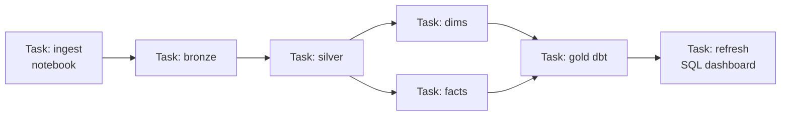
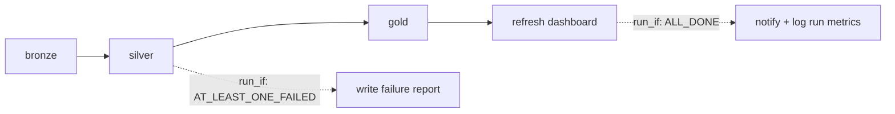

# Databricks Workflows

## What are Databricks Workflows?

Databricks Workflows (a.k.a. **Jobs**) is the **built-in orchestrator inside Databricks** — it lets you chain notebooks, Python scripts, SQL, dbt, and DLT pipelines into a **task DAG**, schedule it, retry it, and monitor it, all on Databricks compute, without a separate tool.

Analogy: if [ADF](../11_Orchestration/02_ADF_Orchestration.md) is an external air-traffic control tower over all of Azure, Databricks Workflows is the **control room inside the Databricks factory** — perfect when everything you're coordinating already lives in Databricks.

---

## The building blocks

| Concept | What it is |
|---|---|
| **Job** | The whole workflow (a DAG of tasks) |
| **Task** | One step: a notebook, Python/JAR, SQL, dbt, DLT pipeline, or "run another job" |
| **Task dependencies** | Arrows: a task runs when its upstream tasks succeed |
| **Job cluster** | Ephemeral compute created for the run and torn down after — cheaper than all-purpose |
| **Trigger** | Scheduled (cron), file-arrival, continuous, or manual |
| **Run** | One execution, with per-task logs, status, and duration |



---

## Task types — a job is not only notebooks

A task is any of these, and mixing them in one DAG is normal:

| Task type | What it runs | Typical use |
|---|---|---|
| **Notebook** | A workspace or Git notebook | The default for transformation steps |
| **Python script / wheel** | A `.py` file or a packaged wheel | **Production code that has unit tests** — the grown-up alternative to notebooks |
| **JAR / Spark Submit** | Compiled Scala/Java | Legacy or JVM-native workloads |
| **SQL** | A query, dashboard refresh, alert, or `.sql` file | Gold-layer transforms and refreshing what BI reads |
| **dbt** | A dbt project against a SQL warehouse | Teams whose modelling layer is [dbt](../13_dbt/01_What_is_dbt.md) |
| **DLT pipeline** | Starts a Delta Live Tables pipeline | The declarative part of a wider DAG |
| **Run job** | Another job | Composing large pipelines from reusable ones |
| **If/else · For each** | Branching and fan-out over a list | Conditional paths; looping the same task over many tables |

---

## Passing values: parameters in, task values across

**Job parameters** are declared once and referenced by every task, which is how one job definition serves dev and prod:

```
{{job.parameters.env}}        →  dev | prod
{{job.parameters.run_date}}   →  2026-09-02
{{job.id}} · {{job.run_id}} · {{task.run_id}}   →  built-in dynamic values
```

Inside a notebook they arrive as widgets:

```python
dbutils.widgets.text("env", "dev")
dbutils.widgets.text("run_date", "")
env      = dbutils.widgets.get("env")
run_date = dbutils.widgets.get("run_date")

df.write.saveAsTable(f"{env}.silver.orders")     # one notebook, both environments
```

**Task values** pass small results *between* tasks — a row count, a computed watermark, a partition to process. They are for control flow, not data:

```python
# upstream task
dbutils.jobs.taskValues.set(key="rows_loaded", value=count)

# downstream task
rows = dbutils.jobs.taskValues.get(taskKey="bronze", key="rows_loaded", debugValue=0)
```

---

## Dependencies and conditional execution

By default a task waits for **all** its upstream tasks to succeed. The `Run if` condition changes that, and it is how you build cleanup and alerting branches:

| `Run if` | Runs when |
|---|---|
| `ALL_SUCCESS` (default) | Every dependency succeeded |
| `AT_LEAST_ONE_SUCCESS` | Any dependency succeeded |
| `NONE_FAILED` | Nothing failed (skipped is acceptable) |
| `ALL_DONE` | Everything finished, success or not — the **cleanup / notify** branch |
| `AT_LEAST_ONE_FAILED` / `ALL_FAILED` | Failure paths — quarantine reports, incident tickets |



---

## Triggers — four ways a job starts

| Trigger | Fires when | Use for |
|---|---|---|
| **Scheduled (cron)** | A cron expression in a named timezone | Nightly and hourly batch |
| **File arrival** | New files land in an external location | Event-driven ingestion without a separate watcher |
| **Table update** | An upstream Delta table changes | Chaining pipelines by data, not by clock |
| **Continuous** | Keeps one run always active, restarting it | Streaming pipelines |

Plus manual runs and the REST API — which is how [ADF](../06_Data_Engineering/ETL_ELT/02_Azure_Data_Factory.md) or an external orchestrator kicks off a Databricks job.

> **Set the timezone deliberately.** A cron in UTC on a business schedule drifts by an hour twice a year when daylight saving changes, and the resulting "the 6 a.m. report was late" tickets are entirely self-inflicted.

---

## Making a job survive the night

Reliability is configuration, not heroics. The settings that matter:

- **Retries with backoff** per task — but only retry what is *idempotent*. Retrying a non-idempotent append duplicates data; this is exactly why the [medallion hops use `MERGE`](../05_Storage_and_Formats/Lakehouse/04_Medallion_Architecture.md).
- **Timeouts** on every task, so a hung Spark stage fails loudly at 90 minutes instead of burning compute until someone notices at 9 a.m.
- **Max concurrent runs = 1** for most batch jobs, so a slow run and its successor never process the same window twice.
- **Notifications** on failure *and* on **duration threshold** — a job that normally takes 20 minutes and is still running at 90 is a problem well before it fails.
- **Repair run** — re-runs only the failed tasks and their descendants, reusing the successful upstream output. On a 30-task DAG that fails at task 27, this is the difference between a 4-minute fix and a 3-hour rerun.
- **Serverless jobs compute** — no cluster to size or wait for; usually the better default for short tasks, while long ETL often stays cheaper on a classic job cluster.

---

## Jobs as code: Databricks Asset Bundles

Clicking jobs together in the UI does not survive contact with a second environment. **Databricks Asset Bundles (DABs)** define jobs, pipelines, and clusters as YAML in the repo, deployed per target:

```yaml
bundle:
  name: sales-pipeline

resources:
  jobs:
    medallion_nightly:
      name: "medallion-nightly-${bundle.target}"
      job_clusters:
        - job_cluster_key: main
          new_cluster:
            spark_version: "15.4.x-scala2.12"
            node_type_id: "Standard_DS4_v2"
            autoscale: { min_workers: 2, max_workers: 8 }
      tasks:
        - task_key: bronze
          job_cluster_key: main
          notebook_task: { notebook_path: ./src/bronze.py }
        - task_key: silver
          depends_on: [{ task_key: bronze }]
          job_cluster_key: main
          notebook_task: { notebook_path: ./src/silver.py }
      schedule:
        quartz_cron_expression: "0 0 2 * * ?"
        timezone_id: "Europe/London"
      email_notifications:
        on_failure: ["data-oncall@example.com"]

targets:
  dev:
    default: true
  prod:
    resources:
      jobs:
        medallion_nightly:
          job_clusters:
            - job_cluster_key: main
              new_cluster: { autoscale: { min_workers: 4, max_workers: 16 } }
```

`databricks bundle deploy -t prod` then makes the environments differ only where you said they should. See [CI/CD for ADF and Databricks](../14_Testing_and_DataOps/05_CICD_for_ADF_and_Databricks.md).

---

## Why use Workflows over ADF (and vice versa)

| Use Databricks Workflows when… | Use ADF when… |
|---|---|
| Everything is notebooks/DLT/dbt in Databricks | You need broad Azure ingestion (100+ connectors) |
| You want **job clusters** (right-sized, auto-terminated) | You want low-code, GUI-first authoring |
| You want tight Spark logging/lineage in one place | You orchestrate many non-Databricks services |
| Data-team-owned, code-first | Platform-team-owned, mixed workloads |

They're **complementary** — a common architecture is **ADF ingests → triggers a Databricks Job → the Job runs the transform DAG**. Know when each is the right layer.

---

## Job clusters vs all-purpose clusters (cost point)

- **All-purpose cluster** — interactive, shared, stays up while you work (dev). Expensive if left running.
- **Job cluster** — spun up **for the job run only** and terminated after. **Cheaper and isolated** — the correct choice for scheduled production jobs.

Choosing job clusters for scheduled work is a real [cost-optimization](../15_Cost_and_Performance/00_Cost_and_Performance_Learning_Path.md) lever and an interview answer.

---

## Reliability features

- **Retries** per task with configurable count and interval.
- **Timeouts** to kill hung tasks.
- **Task-level dependencies** and `Run if` conditions (all succeeded, at least one failed, etc.).
- **Notifications** on start/success/failure to email, Slack, Teams, or webhooks.
- **Repair run** — re-run only the *failed* tasks of a job, not the whole DAG (saves time and money on big pipelines).
- **Concurrent runs** control and **queueing**.

---

## Delta Live Tables (DLT) as orchestration

**DLT** is a declarative pipeline framework: you write the *transformations* and declare data-quality **expectations**, and DLT builds and orchestrates the **dependency graph, incremental processing, retries, and monitoring** for you. It overlaps with orchestration because it manages the flow between tables automatically.

```python
import dlt
from pyspark.sql.functions import col

@dlt.table
def bronze_orders():
    return spark.readStream.format("cloudFiles").option("cloudFiles.format","json").load(path)

@dlt.table
@dlt.expect_or_drop("valid_amount", "amount >= 0")   # quality gate, auto-quarantine
def silver_orders():
    return dlt.read_stream("bronze_orders").where(col("amount").isNotNull())
```

DLT covered in the [Databricks module](../08_Databricks/08_Delta_Live_Tables.md). Use plain **Workflows** to orchestrate arbitrary tasks; use **DLT** when you want declarative, quality-gated table pipelines.

---

## Deploying jobs (as code)

Production teams don't click-build jobs — they define them as **JSON/YAML** and deploy via the **Databricks CLI / REST API / Terraform / Databricks Asset Bundles (DABs)**, promoted through CI/CD. This makes jobs versioned, reviewable, and reproducible across environments — see [DataOps](../14_Testing_and_DataOps/00_Testing_and_DataOps_Learning_Path.md) and [IaC/Terraform](../Job%20Interviews/Terraform/Terraform%20Interview%20Questions.md).

---

## Interview-grade Q&A

- *What are Databricks Workflows?* The native orchestrator for chaining notebook/SQL/dbt/DLT tasks into a scheduled, retried, monitored DAG on Databricks compute.
- *Job cluster vs all-purpose cluster?* Job clusters are ephemeral, per-run, auto-terminated, and cheaper — the right choice for scheduled jobs; all-purpose is for interactive dev.
- *ADF vs Databricks Workflows?* ADF for broad Azure ingestion/low-code; Workflows for Databricks-centric transform DAGs — often used together.
- *What is "repair run"?* Re-running only the failed tasks of a job instead of the entire DAG.
- *When DLT vs Workflows?* DLT for declarative, quality-gated, auto-managed table pipelines; Workflows for orchestrating arbitrary task types.
- *How do you deploy jobs across environments?* As code via CLI/REST/Terraform/Asset Bundles through CI/CD, not manual UI clicks.
- *How do you pass values between tasks?* Job/task **parameters** in (read as notebook widgets), and **task values** (`dbutils.jobs.taskValues`) between tasks for small control-flow values like a row count or watermark — never for data.
- *How do you run a task only when something failed?* The `Run if` condition — `ALL_DONE` for cleanup/notify branches, `AT_LEAST_ONE_FAILED` for failure paths, instead of the default `ALL_SUCCESS`.
- *What triggers can start a job?* Cron schedule (in a named timezone), file arrival, table update, continuous, manual, and the REST API — the last being how ADF or an external orchestrator invokes Databricks.
- *Which reliability settings would you always set?* Per-task retries (only where the task is idempotent), timeouts, max concurrent runs = 1 for batch, and notifications on failure *and* on a duration threshold.
- *What are Databricks Asset Bundles?* YAML definitions of jobs, pipelines, and clusters in the repo, deployed per environment target — so dev and prod differ only where you declare they do.

---

## Further Learning — Docs & Videos
- Databricks Jobs / Workflows: https://learn.microsoft.com/azure/databricks/jobs/
- Delta Live Tables: https://learn.microsoft.com/azure/databricks/delta-live-tables/
- Databricks Asset Bundles: https://learn.microsoft.com/azure/databricks/dev-tools/bundles/
- Video — Databricks Workflows: https://www.youtube.com/results?search_query=databricks+workflows+jobs+orchestration
