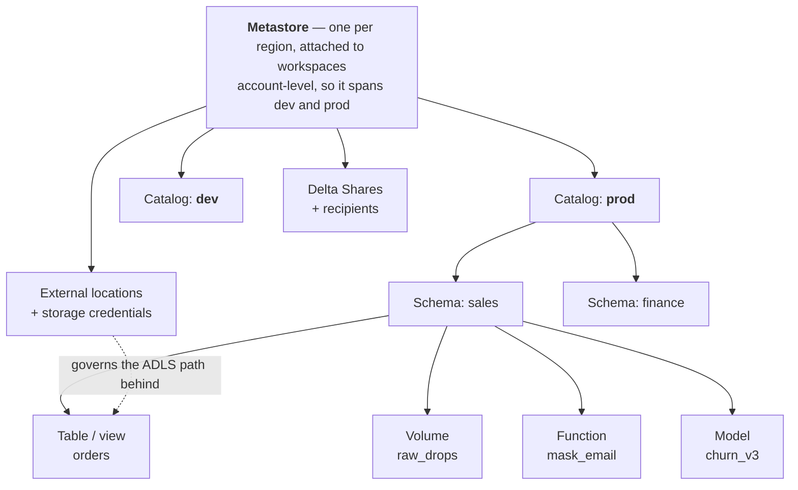
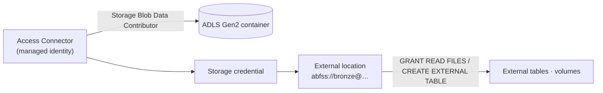

# Unity Catalog

## What is it?

**Unity Catalog (UC)** is Databricks' centralized **governance layer** — one place to manage *who can access what data, across all workspaces*, plus lineage, discovery, and auditing. Before UC, each workspace had its own Hive metastore and permissions were scattered and inconsistent; UC gives an entire organization **one catalog, one permission model, one source of truth** for data governance.

In one line: **Unity Catalog = a single, org-wide access-control + metadata + lineage layer over all your Databricks data.**

---

## Analogy: a library's central catalog and membership desk

Imagine a university with many library buildings. Before UC, each building had its *own* card catalog and its *own* rules about who could borrow what — a book restricted in one building was freely lent in another, and no one could say who had read it. **Unity Catalog is a single central catalog + membership system** for *all* buildings: one search to find any book (discovery), one membership card that works everywhere (identity), one rulebook for who may read each shelf (access control), and a log of every checkout (audit + lineage).

---

## The three-level namespace

This is the defining UC concept and a guaranteed interview question. Every table/view has a **three-part name**:

```
catalog . schema . table
   │         │        │
   │         │        └── the table or view
   │         └── a grouping of tables (a "database")
   └── top-level container, often per environment or domain

e.g.   prod.sales.orders      dev.sales.orders      finance.gl.transactions
```

- **Metastore** — the top of the hierarchy, one per region, attached to workspaces.
- **Catalog** — first level; commonly split by environment (`dev`/`prod`) or business domain.
- **Schema** (database) — groups related tables.
- **Table / View / Volume / Function** — the objects themselves.

Legacy Hive was two-level (`schema.table`); UC adds the **catalog** level, which is what enables clean dev/prod and domain separation.



Everything in that tree is a **securable** — you can `GRANT` on a metastore, catalog, schema, table, view, volume, function, model, external location, storage credential, or connection. That uniformity is the point: one grammar for every kind of asset.

---

## What UC governs

| Object | Governed by UC |
|---|---|
| **Tables & views** | Managed and external Delta tables |
| **Volumes** | Non-tabular files (models, images, exports) |
| **Functions** | Registered UDFs |
| **Models** | MLflow models |
| **External locations & storage credentials** | Governed access to ADLS paths (replaces mounts) |

Permissions use familiar SQL: `GRANT SELECT ON TABLE prod.sales.orders TO group_analysts;`

---

## The privilege chain — why `SELECT` alone isn't enough

This is the number-one Unity Catalog support ticket, and a question that separates people who have used UC from people who have read about it.

**To read one table you need three privileges, at three levels:**

```sql
GRANT USE CATALOG ON CATALOG prod          TO `grp-analysts`;   -- traverse the catalog
GRANT USE SCHEMA  ON SCHEMA  prod.sales    TO `grp-analysts`;   -- traverse the schema
GRANT SELECT      ON TABLE   prod.sales.orders TO `grp-analysts`;  -- read the table
```

Grant only the `SELECT` and the analyst still gets `TABLE_OR_VIEW_NOT_FOUND` — from their side the table appears not to exist, because they cannot traverse the containers above it. `USE CATALOG`/`USE SCHEMA` are **traversal** rights, not read rights: they let you *reach* an object, never see its data.

**Privileges inherit downward.** A grant on a catalog applies to every schema and table inside it, including ones created later — which is what makes a layered medallion grant a one-liner:

```sql
GRANT USE CATALOG ON CATALOG prod TO `grp-analysts`;
GRANT USE SCHEMA, SELECT ON SCHEMA prod.gold TO `grp-analysts`;   -- all Gold tables, forever
```

The privileges worth memorizing:

| Privilege | Grants the ability to |
|---|---|
| `USE CATALOG` / `USE SCHEMA` | **Traverse** to objects inside — required, never sufficient |
| `SELECT` | Read a table, view, or materialized view |
| `MODIFY` | `INSERT` / `UPDATE` / `DELETE` / `MERGE` on a table |
| `CREATE TABLE` / `CREATE SCHEMA` | Create objects in a schema / catalog |
| `EXECUTE` | Run a registered function |
| `READ VOLUME` / `WRITE VOLUME` | Read/write files in a volume |
| `BROWSE` | See an object exists in the catalog UI without reading it — good for discovery |
| `ALL PRIVILEGES` | Everything above on that securable |

**Ownership is a separate axis from privileges.** Every securable has an **owner** (ideally a *group*, never a departing individual) who implicitly holds all privileges on it and can grant them to others. Objects owned by a personal account become orphaned when that person leaves — set ownership to a group at creation time.

```sql
ALTER SCHEMA prod.gold OWNER TO `grp-data-platform`;
SHOW GRANTS ON TABLE prod.sales.orders;   -- the first thing to run when debugging access
```

---

## Advantages

- **One permission model** — govern all workspaces from one place, with SQL `GRANT`/`REVOKE` ([DCL recap](../02_Databases/SQL/12_SQL_DCL_TCL.md)).
- **Fine-grained access** — down to table, column (masking), and row (filters).
- **Automatic lineage** — table- and column-level lineage captured as jobs run.
- **Discovery & search** — a searchable catalog of all data assets.
- **Audit** — every access logged for compliance.
- **Identity federation** — users/groups from **Microsoft Entra ID** synced in, not managed per-workspace.
- **Open sharing** — **Delta Sharing** to share data across orgs without copying.

## Disadvantages

- **Migration effort** — moving off the legacy Hive metastore and mounts takes planning.
- **Setup complexity** — metastore, storage credentials, external locations, and identity sync are a learning curve.
- **Access-mode constraints** — some older cluster/library patterns need shared/single-user access modes to work with UC.

---

## Azure Usage

- **Identity** — UC users and groups come from **Microsoft Entra ID** (SCIM sync), so access aligns with corporate identity.
- **Storage** — UC governs data in **ADLS Gen2** via *storage credentials* (a managed identity) + *external locations* (a governed path). This **replaces DBFS mounts**, which are being deprecated.
- **Purview** — UC lineage/metadata integrates with **Microsoft Purview** for enterprise-wide cataloging beyond Databricks ([governance](../06_Data_Engineering/Data_Governance/01_Data_Governance_and_Security.md)).

---

## Real World Example

A bank runs a dev and a prod Databricks workspace and must prove to auditors exactly who can see customer PII. With Unity Catalog: PII columns in `prod.customers.accounts` are **masked** for the analyst group and visible only to a compliance group; **row filters** restrict each regional team to its own region's rows; **column-level lineage** shows auditors that the `risk_score` in a Gold table derives from specific Silver columns; and every query is **logged**. When a new analyst joins, adding them to the right **Entra ID group** grants exactly the right access across both workspaces — no per-workspace fiddling, one governed model.

---

## Managed vs external tables under UC

UC sharpens the [managed vs external](../05_Storage_and_Formats/Lakehouse/02_Delta_Table.md) distinction:
- **Managed tables** live in UC-managed storage; UC owns the full lifecycle (and `DROP` deletes the data).
- **External tables** point at an **external location** (a governed ADLS path via a storage credential); `DROP` removes only metadata.

External locations + storage credentials are how UC governs *raw file paths* without insecure mounts — the storage credential (a managed identity) holds the access, and grants on the external location control who can use it.

## Fine-grained access: masking & row filters

Both are ordinary **SQL functions** you write once and attach to a table. From then on they apply to *every* query against it — from a notebook, a SQL warehouse, or Power BI — because enforcement lives with the data, not in each report.

**Column mask** — redact unless the caller is in the privileged group:

```sql
CREATE FUNCTION prod.sales.mask_email(email STRING)
RETURN CASE WHEN is_account_group_member('grp-pii-cleared') THEN email
            ELSE regexp_replace(email, '^.*@', '****@') END;

ALTER TABLE prod.sales.customers
  ALTER COLUMN email SET MASK prod.sales.mask_email;
```

**Row filter** — each region sees only its own rows:

```sql
CREATE FUNCTION prod.sales.region_filter(region STRING)
RETURN is_account_group_member('grp-sales-global')
       OR region = current_user_region();      -- e.g. a lookup on current_user()

ALTER TABLE prod.sales.orders
  SET ROW FILTER prod.sales.region_filter ON (region);
```

The two building blocks to remember are `current_user()` and `is_account_group_member('...')` — the same pair powers the older **dynamic view** pattern, which is still what you use when you need logic more complex than a filter or mask expression.

> **A caution worth stating in an interview:** masks and filters are enforced on Unity-Catalog-enabled compute in **Standard (shared)** or **Dedicated** access mode. A legacy no-isolation cluster doesn't apply them at all — the governance is only as strong as the compute it runs on.

## Lineage — automatic and column-level

As jobs run, UC records which tables/columns feed which — table *and* column level. This answers "if I change this Bronze column, what breaks downstream?" and "where did this Gold number come from?" without manual documentation. It's a core reason to adopt UC beyond access control.

## How UC is actually set up (the order matters)

Standing up Unity Catalog is a fixed sequence, and every step depends on the one before it. Knowing this order is what a "have you actually done it?" question is probing:

1. **Create an Azure Databricks Access Connector** — a managed identity that will act on your behalf.
2. **Grant it `Storage Blob Data Contributor`** on the ADLS Gen2 container that will hold managed tables ([why a data-plane role](../06_Data_Engineering/Data_Governance/03_Microsoft_Entra_ID.md)).
3. **Create the metastore** in the account console, pointing at that container, with the Access Connector as its credential. One per region.
4. **Assign workspaces** to the metastore — this is what makes dev and prod share one governance model.
5. **Sync identities** — users and groups from Entra ID via SCIM, at the *account* level.
6. **Create storage credentials and external locations** for any other ADLS paths (Bronze landing zones, external tables).
7. **Create catalogs and schemas**, set **group ownership**, and grant on the schema rather than table by table.



---

## System tables — governance you can query

UC exposes its own operational metadata as **queryable tables** in the `system` catalog, which turns audit and cost questions into SQL instead of ticket requests:

| Table | Answers |
|---|---|
| `system.access.audit` | Who ran what, when, from where |
| `system.access.table_lineage` / `column_lineage` | What feeds this table/column, and what breaks if I change it |
| `system.billing.usage` | DBU consumption by workspace, cluster, job, and tag |
| `system.query.history` | Which queries are slow or scanning the most |

```sql
-- Who has touched the PII table in the last week?
SELECT user_identity.email, action_name, event_time
FROM   system.access.audit
WHERE  request_params.full_name_arg = 'prod.sales.customers'
  AND  event_date >= current_date() - INTERVAL 7 DAYS;
```

Pairing `system.billing.usage` with the `cost_center` tag enforced by a [cluster policy](03_Clusters_and_Compute.md) is how chargeback actually gets done.

---

## Lakehouse Federation — governing data you haven't moved

UC can also register **connections** to external systems (Azure SQL, Synapse, Snowflake, PostgreSQL, BigQuery) and expose them as **foreign catalogs**. You then query them with the same three-level name and the same grants, without copying the data in.

It is not a replacement for ingestion — federated queries run against the source system and inherit its performance limits — but it is the right tool for exploration, one-off joins against a reference system, and giving a governed view of data before a pipeline exists.

---

## Delta Sharing

An open protocol to share live Delta tables with other orgs/tools **without copying** — the recipient reads your data directly (even from non-Databricks engines). It turns data sharing from "export a copy and hope it's current" into "grant read on a live table."

---

## UC is what makes "one copy, many engines" governable

The [lakehouse promise](../05_Storage_and_Formats/Lakehouse/03_Lakehouse_Architecture.md) is one copy of data read by many engines — but without a single governance layer that's a security nightmare. Unity Catalog is the piece that makes it *safe*: one permission model spanning engineering (Spark), BI (SQL warehouses), and ML, tied to corporate identity. When evaluating a lakehouse, the pro asks "whose catalog governs it?" — UC is Databricks' answer, and it's the difference between a governed platform and a swamp.

## Catalog design is an org-design decision

How you carve up catalogs/schemas encodes your operating model: **environment-based** (`dev`/`test`/`prod` catalogs) suits central platform teams; **domain-based** (`sales`, `finance`, `marketing` catalogs) suits a [data mesh](../02_Databases/Data_Warehousing/03_Data_Mesh.md) with domain ownership. Many orgs combine both (`prod_sales`, `dev_sales`). Getting this taxonomy right early avoids painful renames later — it's a governance-architecture choice, not an afterthought.

## Migration off Hive metastore

Real orgs adopt UC incrementally: stand up the metastore, create catalogs, migrate external locations off mounts, then move tables schema by schema, running old and new in parallel until access and lineage are trusted. Big-bang migrations of a live analytics estate fail; the consulting playbook is workload-by-workload with reconciliation.

## Field-tested gotchas

- **Still using DBFS mounts** — deprecated and ungoverned; migrate to external locations + storage credentials.
- **Over-granting** — `GRANT ... TO account users` defeats the point; grant to Entra ID groups by role.
- **Two-level thinking** — forgetting the catalog level and colliding `dev`/`prod` tables; use the full three-part name.
- **Ignoring lineage** — UC captures it for free; teams that don't use it keep documenting dependencies by hand.
- **Access-mode surprises** — a legacy cluster in "no isolation" mode can't use UC features; use shared/single-user access modes.

## Interview-grade Q&A

- *What is Unity Catalog?* Databricks' centralized governance layer — one org-wide model for access control, metadata, lineage, discovery, and audit across all workspaces.
- *Explain the three-level namespace.* `catalog.schema.table` — UC adds the catalog level above the legacy Hive `schema.table`, enabling clean dev/prod and domain separation, all under a regional metastore.
- *How does UC do fine-grained security?* SQL `GRANT`/`REVOKE` at table level, plus column masking and row filters defined once and enforced on every query; identity from Entra ID groups.
- *How does UC govern raw file paths?* Storage credentials (a managed identity) + external locations over ADLS, replacing insecure DBFS mounts.
- *Why does UC matter for the lakehouse?* It provides the single governance model that lets one copy of data be safely read by Spark, SQL, and ML — answering "whose catalog governs it?"
- *An analyst has `SELECT` but the table "doesn't exist" for them. Why?* They're missing `USE CATALOG` and/or `USE SCHEMA` — traversal privileges on the containers above the table. All three levels are required.
- *How do privileges inherit?* Downward: a grant on a catalog or schema covers every object inside it, including objects created later — which is why you grant on `prod.gold` once rather than table by table.
- *What is ownership in UC, and why does it bite?* Every securable has an owner who implicitly holds all privileges and can grant them. Objects owned by a personal account are orphaned when that person leaves — always set ownership to a group.
- *How do you set up UC from scratch?* Access Connector → data-plane role on ADLS → metastore (one per region) → assign workspaces → SCIM identities from Entra ID → storage credentials and external locations → catalogs, group ownership, schema-level grants.
- *Where do you look for audit, lineage, and cost?* The `system` catalog — `system.access.audit`, `system.access.table_lineage`, `system.billing.usage` — all queryable with plain SQL.
- *What is Lakehouse Federation?* Registering external databases as foreign catalogs so they're queryable and governable through the same three-level namespace without copying the data.

---

## Related Notes

- **Prev:** [Notebooks, Repos & Jobs](04_Notebooks_Repos_and_Jobs.md) · **Next:** [Delta Live Tables](08_Delta_Live_Tables.md)
- **Governance:** [Data Governance & Security](../06_Data_Engineering/Data_Governance/01_Data_Governance_and_Security.md) · **Access SQL:** [SQL DCL & TCL](../02_Databases/SQL/12_SQL_DCL_TCL.md)
- **Cert:** [Data Governance & Unity Catalog](../Certifications/Databricks_Data_Engineer_Associate/10_Data_Governance_Unity_Catalog.md)

---

## Further Learning — Docs & Videos

**Documentation**
- Unity Catalog: https://learn.microsoft.com/en-us/azure/databricks/data-governance/unity-catalog/
- Manage privileges in UC: https://learn.microsoft.com/en-us/azure/databricks/data-governance/unity-catalog/manage-privileges/

**Videos**
- Unity Catalog explained: https://www.youtube.com/results?search_query=databricks+unity+catalog+explained
- Unity Catalog three-level namespace: https://www.youtube.com/results?search_query=unity+catalog+three+level+namespace
