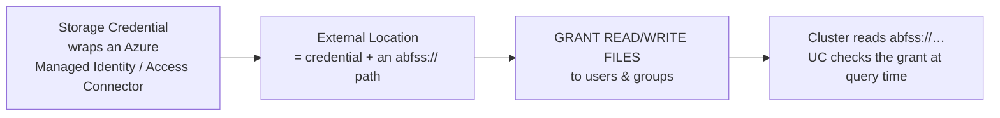

# Storage Access: ABFSS, Volumes & External Locations

## What is this note?

Databricks compute is separate from your data — the data lives in **[ADLS Gen2](../05_Storage_and_Formats/Data_Lakes_and_Storage/03_Azure_Data_Lake_Storage.md)**, and a cluster has to be *told how to reach it and be allowed to*. This note is the complete picture of **how you reference and access files** from Databricks: the **`abfss://`** path scheme, **Unity Catalog Volumes**, **External Locations + Storage Credentials**, and the older **DBFS / mounts** patterns you'll still see (and should mostly avoid).

Analogy: your data is a warehouse across town. **`abfss://`** is the street address. A **Storage Credential** is the company keycard that proves you're allowed in. An **External Location** is "this keycard opens this specific building." A **Volume** is a labelled, access-controlled room inside that you refer to by a friendly name (`/Volumes/...`) instead of the raw address. **Mounts** were the old shared master key taped under the doormat — convenient, and exactly why security hated them.

---

## 1. The `abfss://` path — the address of ADLS Gen2

`abfss` = **A**zure **B**lob **F**ile **S**ystem, **S**ecure (TLS). It's the URI scheme Spark/Hadoop uses to talk to ADLS Gen2:

```
abfss://<container>@<storage-account>.dfs.core.windows.net/<path>
        └─filesystem─┘ └────────── the storage account ──────────┘ └─folders/files─┘
```

Example:
```python
df = spark.read.format("delta").load(
    "abfss://bronze@saretaildev.dfs.core.windows.net/orders/"
)
```

| Scheme | Use it for | Notes |
|---|---|---|
| **`abfss://`** | **ADLS Gen2** (hierarchical namespace) | The correct, secure default for analytics |
| `abfs://` | ADLS Gen2 without TLS | Don't — always use the `s` (secure) form |
| `wasbs://` | Legacy **Blob** storage (WASB driver) | Older; lacks HNS features — avoid for new work |

Key point: the host is `...dfs.core.windows.net` (the **DFS**/Gen2 endpoint), **not** `blob.core.windows.net`. Using the blob endpoint is a classic "why won't ABFSS work?" mistake.

---

## 2. How a cluster is *allowed* to read that path

An `abfss://` path is just an address — the cluster still needs **credentials**. There are two eras; use the first.

### ✅ The modern way — Unity Catalog governs it
You don't put credentials on the cluster at all. **Unity Catalog** holds them centrally:



- **Storage Credential** — a UC object wrapping an **Azure Databricks Access Connector** (a managed identity) that has the `Storage Blob Data Contributor` role on the account. No keys, no secrets.
- **External Location** — pairs a Storage Credential with a specific `abfss://` prefix. "This credential may access *this* container/path."
- **Grants** — you `GRANT READ FILES` / `WRITE FILES` on the External Location to principals. UC checks the grant on every access, with full **lineage and audit**.

This means an `abfss://` read "just works" for authorized users and is **denied + logged** for everyone else — no cluster config, no shared secret.

### ⚠️ The legacy way — cluster/session credentials
Before UC (or outside it), you authorized `abfss://` by putting a credential in the **Spark config** (cluster settings or notebook session), reading the secret from a **Key Vault-backed secret scope** (never a literal):

```python
spark.conf.set("fs.azure.account.auth.type.<acct>.dfs.core.windows.net", "OAuth")
spark.conf.set("fs.azure.account.oauth.provider.type.<acct>...",
               "org.apache.hadoop.fs.azurebfs.oauth2.ClientCredsTokenProvider")
spark.conf.set("fs.azure.account.oauth2.client.id.<acct>...",
               dbutils.secrets.get("kv-scope", "sp-client-id"))
spark.conf.set("fs.azure.account.oauth2.client.secret.<acct>...",
               dbutils.secrets.get("kv-scope", "sp-secret"))
```

Auth options here (in rough order of preference): **service principal (OAuth)** → **managed identity** → **SAS token** → **account key** (worst — full account access, hard to rotate). Prefer Unity Catalog over all of these.

> See [Network Security & Private Connectivity](../06_Data_Engineering/Data_Governance/02_Network_Security_and_Private_Connectivity.md) for making this traffic private (private endpoints), and [Data Governance](../06_Data_Engineering/Data_Governance/01_Data_Governance_and_Security.md) for the identity side.

---

## 3. Unity Catalog **Volumes** — governed access to *files* (non-tabular data)

Tables in UC govern *tabular* data. **Volumes** govern everything else — **files**: CSVs to ingest, images, PDFs, ML model artifacts, libraries, init scripts. A volume is a UC object in the three-level namespace, accessed by a friendly path:

```
/Volumes/<catalog>/<schema>/<volume>/<optional/subpath>
```

```python
# read a landing file from a volume — no abfss://, no mount, no secrets
df = spark.read.csv("/Volumes/retail/bronze/landing/orders/2026-08-03/*.csv", header=True)

# works with plain Python file APIs too (great for non-Spark libs)
import os
os.listdir("/Volumes/retail/bronze/landing/orders")
```

| Volume type | Where the files live | Use when |
|---|---|---|
| **Managed volume** | UC-managed storage in the metastore/catalog's default location | You just need governed file storage and don't care where it sits |
| **External volume** | A path inside an **External Location** (`abfss://…`) you specify | The files already live in a known container, or other tools need the raw path |

**Why volumes beat everything below them:** governed by UC permissions (`GRANT READ VOLUME`), audited, lineage-tracked, **no cluster config**, and they give you an ordinary filesystem path that even non-Spark Python/OS code can use. For file ingestion (e.g. [Auto Loader](09_Auto_Loader_and_Ingestion.md)) and any "I have files, not tables" need, volumes are the modern answer.

---

## 4. DBFS — the built-in filesystem (know it, don't lean on it)

**DBFS (Databricks File System)** is an abstraction layer over object storage, addressed as `dbfs:/...` (Spark) or `/dbfs/...` (local file API).

- **DBFS root** (`dbfs:/`) — a storage account **Databricks creates and manages** for the workspace. Fine for scratch/tmp; **do not store production data there** — it's workspace-scoped, not governed by UC, and not meant as your data lake.
- **`/FileStore`** — a DBFS area for small files, uploaded libraries, and images you want to render.
- The **`/databricks-datasets`** sample data lives on DBFS too.

Rule of thumb: DBFS root is for **workspace plumbing and scratch**, not your Bronze/Silver/Gold. Your real data belongs in ADLS via `abfss://` governed by UC, surfaced through Volumes.

---

## 5. Mounts (`/mnt/...`) — the legacy pattern to retire

Historically you'd **mount** a container so it appeared at `/mnt/<name>`:

```python
# LEGACY — avoid on Unity Catalog workspaces
dbutils.fs.mount(
  source="abfss://bronze@saretaildev.dfs.core.windows.net/",
  mount_point="/mnt/bronze",
  extra_configs={...service principal secrets...})
```

Why it's discouraged (and disabled/ignored under UC):
- **Shared credentials** — the mount's identity is used by *every* user on the workspace, regardless of who *they* are. No per-user governance.
- **No lineage/audit** at the UC level.
- **Workspace-global** and brittle to manage.

The replacement is exactly the UC stack above: **External Location** for governed `abfss://`, and **Volumes** for a friendly path. If you inherit a repo full of `/mnt/...`, migrating those to Volumes/External Locations is a real, common modernization task.

---

## 6. Which access method — decision table

| You want to… | Use | Why |
|---|---|---|
| Read/write your data lake, governed | **External Location** (`abfss://`) under UC | Central grants, audit, lineage, no cluster secrets |
| A friendly, governed path to **files** | **Volume** (`/Volumes/cat/sch/vol/…`) | UC-governed, works with Spark *and* plain Python/OS |
| Query a Delta **table** | UC **table** (`catalog.schema.table`) | Governs the tabular data; you rarely touch the path |
| Scratch / tmp / uploaded small files | **DBFS root** / `/FileStore` | Convenient plumbing — never production data |
| (Legacy) shared mounted path | ~~Mount `/mnt/…`~~ | Deprecated — migrate to Volumes/External Locations |

---

## Field-tested gotchas

- **`dfs` vs `blob` endpoint** — ABFSS must target `…dfs.core.windows.net`. Hitting `blob.core.windows.net` fails or silently loses HNS behavior.
- **Access mode matters** — Unity Catalog features (Volumes, credential enforcement) require a **UC-enabled cluster/SQL warehouse**. Legacy "No Isolation" clusters bypass UC — a governance hole.
- **Credential passthrough is deprecated** — the old "pass the user's AAD identity to storage" feature is superseded by UC's grant model; don't design new systems on it.
- **Account keys are a smell** — they grant full account access and are painful to rotate. If you see `fs.azure.account.key`, treat it as tech debt; move to a managed identity + External Location.
- **Volumes ≠ tables** — volumes hold *files*; you still register Delta *tables* for tabular data. Land files in a volume, then build Bronze tables from them.
- **Private networking still applies** — governance (who) and networking (path) are independent; a locked-down deployment uses UC grants **and** [private endpoints](../06_Data_Engineering/Data_Governance/02_Network_Security_and_Private_Connectivity.md).

---

## Interview-grade Q&A

- *What is an `abfss://` path?* The secure ADLS Gen2 URI: `abfss://container@account.dfs.core.windows.net/path` — note the **dfs** endpoint and TLS (`s`).
- *`abfss` vs `wasbs`?* `abfss` is the ADLS Gen2 driver (hierarchical namespace, the modern default); `wasbs` is the legacy Blob/WASB driver — avoid for new analytics work.
- *How should a cluster be authorized to read ADLS today?* Via **Unity Catalog**: a **Storage Credential** (Access Connector / managed identity) + an **External Location** on the path, with `READ/WRITE FILES` grants — no secrets on the cluster.
- *What is a Unity Catalog Volume?* A UC-governed object for **non-tabular files**, accessed at `/Volumes/catalog/schema/volume/…`; managed (UC storage) or external (a path in an External Location). It replaces mounts.
- *Why avoid `dbutils.fs.mount` / `/mnt`?* Mounts use one shared credential for all users, with no per-user governance, lineage, or audit — replaced by External Locations + Volumes under UC.
- *What is DBFS root good for?* Workspace scratch, `/FileStore`, sample datasets — **not** production data, which belongs in governed ADLS.
- *Storage Credential vs External Location?* The credential wraps the Azure identity (the "keycard"); the External Location binds that credential to a specific `abfss://` path and is what you grant access on.
- *A notebook can't read a container — where do you look?* Wrong endpoint (`blob` vs `dfs`), a missing or ungranted External Location, a non-UC cluster, or an expired/rotated secret in the legacy path.

---

## Related Notes
- **Prev:** [Unity Catalog](06_Unity_Catalog.md) — the governance layer that owns Storage Credentials, External Locations, and Volumes.
- **Then:** [Auto Loader & Ingestion](09_Auto_Loader_and_Ingestion.md) — ingest files (often from a Volume/External Location) into Bronze.
- **Foundations:** [Azure Data Lake Storage](../05_Storage_and_Formats/Data_Lakes_and_Storage/03_Azure_Data_Lake_Storage.md) · [Network Security & Private Connectivity](../06_Data_Engineering/Data_Governance/02_Network_Security_and_Private_Connectivity.md) · [Data Governance](../06_Data_Engineering/Data_Governance/01_Data_Governance_and_Security.md)

---

## Further Learning — Docs & Videos
- Connect to ADLS Gen2 (ABFSS): https://learn.microsoft.com/azure/databricks/connect/storage/azure-storage
- Unity Catalog Volumes: https://learn.microsoft.com/azure/databricks/volumes/
- External locations & storage credentials: https://learn.microsoft.com/azure/databricks/connect/unity-catalog/external-locations
- Video — Unity Catalog Volumes & storage access: https://www.youtube.com/results?search_query=databricks+unity+catalog+volumes+abfss
