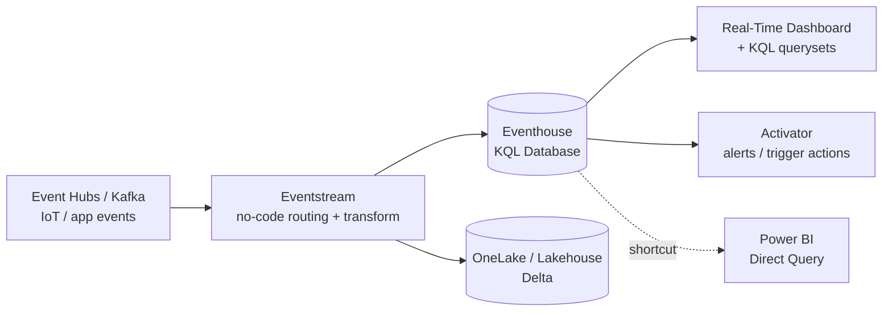

# KQL & Real-Time Intelligence

## What is this, and why it's here

The rest of this module gets events *moving* — [Event Hubs](02_Azure_Event_Hubs.md) and [Kafka](03_Apache_Kafka.md) transport them, [Stream Analytics](04_Azure_Stream_Analytics.md) processes them in flight. This note is about where high-volume event data **lands to be queried instantly**: a **KQL database** (Azure Data Explorer / Microsoft Fabric **Real-Time Intelligence**), and **KQL** — the query language you use to ask it questions.

Analogy: Stream Analytics is the conveyor belt that inspects each parcel as it rolls past; a KQL database is the **giant, instantly-searchable warehouse** the parcels drop into, where you can later ask "how many red parcels arrived per minute last Tuesday?" and get an answer over billions of rows in seconds.

You met KQL briefly in [Azure Monitor & Log Analytics](../13_Monitoring_and_Observability/02_Azure_Monitor_and_Log_Analytics.md) — that's the *logs* face of the same engine. This note is the *data-engineering* face: KQL as a first-class analytics store, and the Fabric **DP-700** exam topic most self-study skips.

---

## The engine, three names

The same core engine (**Kusto**) ships under three product names — knowing they're one thing avoids a lot of confusion:

| Product | What it is |
|---|---|
| **Azure Data Explorer (ADX)** | The standalone Azure service — a fast, append-optimized analytics database for logs, telemetry, IoT, events |
| **Log Analytics** | ADX under the hood, dedicated to Azure resource logs ([monitoring](../13_Monitoring_and_Observability/02_Azure_Monitor_and_Log_Analytics.md)) |
| **Fabric Real-Time Intelligence (Eventhouse / KQL Database)** | The same engine as a **Microsoft Fabric** workload, integrated with [OneLake](../10_Synapse_and_Fabric/03_Microsoft_Fabric.md) |

**Why it's fast:** data is stored **columnar + heavily compressed + time-indexed**, and the engine is built for **append-only, high-ingest, read-mostly** workloads. It is *not* an OLTP database — no per-row updates in the transactional sense; you append and query.

---

## The Real-Time Intelligence pipeline (Fabric)



- **Eventstream** — the no/low-code pipe: connect a source (Event Hubs, Kafka, IoT Hub, CDC), optionally transform, and **fan out** to an Eventhouse *and* a Lakehouse at once.
- **Eventhouse / KQL Database** — where events land for sub-second queries.
- **Real-Time Dashboard** — live tiles driven by KQL, refreshing as data arrives.
- **Activator** — "when this KQL condition is true, do X" (email, Teams, trigger a pipeline) — event-driven action without writing an app.

**The key design idea — dual landing:** the same Eventstream writes hot data to the Eventhouse (query in seconds) *and* to Delta in OneLake (cheap history for batch/BI). This is a **Kappa-style** architecture ([Streaming Fundamentals](01_Streaming_Fundamentals.md)) made turnkey.

---

## KQL you actually need

KQL reads as a **pipeline of `|` operators**, left to right — like PySpark chaining or a shell pipe. You start with a table and keep transforming.

```kusto
// Orders per minute in the last hour, by region
Orders
| where Timestamp > ago(1h)
| summarize count() by Region, bin(Timestamp, 1m)
| render timechart
```

Core verbs (90% of what a DE writes):

| Verb | Does | SQL analogy |
|---|---|---|
| `where` | filter rows | `WHERE` |
| `project` / `project-away` | pick / drop columns | `SELECT` |
| `extend` | add a computed column | `SELECT expr AS c` |
| `summarize` | group & aggregate | `GROUP BY` |
| `bin(col, 1h)` | bucket a timestamp | date truncation |
| `join kind=inner` | join tables | `JOIN` |
| `top N by col` | ranking | `ORDER BY … LIMIT` |
| `render` | chart the result | (no SQL equivalent) |

Two time-series superpowers that are hard to express in SQL and are the reason RTI exists:

```kusto
// make-series: build an evenly-spaced series (fills gaps), then detect anomalies
Telemetry
| make-series avg(Temp) default=0 on Timestamp step 5m by DeviceId
| extend anomalies = series_decompose_anomalies(avg_Temp)

// summarize with time window + arg_max = "latest reading per device"
Telemetry
| summarize arg_max(Timestamp, *) by DeviceId
```

You are **not** expected to be a Kusto expert for a DE role — but reading these and writing basic `where`/`summarize`/`bin`/`join` is expected, and `make-series` + anomaly detection is a strong thing to name.

---

## When to reach for RTI/KQL vs the alternatives

| Need | Reach for |
|---|---|
| Sub-second queries over **huge** volumes of recent events/logs/telemetry | **KQL DB / ADX / Eventhouse** |
| Continuous **windowed processing** with SQL, outputs to sinks | [Stream Analytics](04_Azure_Stream_Analytics.md) |
| Complex **transformations / ML** on streams, full control | Spark [Structured Streaming](../03_Programming/PySpark/13_Structured_Streaming.md) |
| Cheap **historical** store for BI & batch | Delta lakehouse ([Lakehouse](../05_Storage_and_Formats/Lakehouse/03_Lakehouse_Architecture.md)) |

They compose: Eventstream → **Eventhouse** (hot, KQL) **and** → **Lakehouse** (cold, Delta). Don't pick one; route to both.

---

## What breaks (and the fix)

| Problem | Fix |
|---|---|
| Queries slow as data grows | Filter on the **time column first** (`where Timestamp > ago(...)`) so the engine prunes by time index |
| "Why is my ADX query scanning everything?" | You filtered on a high-cardinality string before time; reorder — time/partition filters first |
| Need updates/deletes like a warehouse | Wrong tool — KQL is append-optimized; model as append + `arg_max` for "latest", or use Delta |
| Hot data costs too much to keep forever | Set a **retention/caching policy**: short *hot cache* (fast) + longer *cold* retention; archive history to OneLake |
| Duplicate events on producer retry | Dedupe in the query (`summarize arg_max(...) by id`) or upstream; KQL ingest is at-least-once |

---

## Interview-grade Q&A

- *What is KQL?* Kusto Query Language — the pipe-based read query language of Azure Data Explorer / Log Analytics / Fabric Eventhouse, built for fast analytics over large append-only event and log data.
- *What is Fabric Real-Time Intelligence?* Fabric's real-time workload: **Eventstream** ingests/routes events into an **Eventhouse (KQL database)** for sub-second queries, with **Real-Time Dashboards** and **Activator** for alerting.
- *ADX vs a data warehouse?* ADX is append-optimized columnar for high-ingest telemetry/logs with time-series functions; a warehouse (dedicated SQL pool) is for modeled, updatable star-schema analytics. Different shapes of workload.
- *When KQL DB vs Stream Analytics vs Spark streaming?* KQL DB = store + query recent events fast; Stream Analytics = SQL windowed processing to sinks; Spark = heavy transforms/ML with full control. Often KQL DB is the *sink* the others write to.
- *How do you keep KQL queries fast?* Filter on the time column first (time-indexed), keep hot-cache retention short, avoid leading high-cardinality string filters, pre-aggregate with materialized views.
- *How does RTI avoid Lambda's two-codebase problem?* One Eventstream fans out to a hot Eventhouse and cold Delta in OneLake — a turnkey Kappa architecture.

---

## Further Learning — Docs & Videos
- Fabric Real-Time Intelligence overview: https://learn.microsoft.com/fabric/real-time-intelligence/overview
- KQL quick reference: https://learn.microsoft.com/azure/data-explorer/kusto/query/
- Eventstream in Fabric: https://learn.microsoft.com/fabric/real-time-intelligence/event-streams/overview
- Video — Fabric Real-Time Intelligence: https://www.youtube.com/results?search_query=microsoft+fabric+real+time+intelligence+kql
