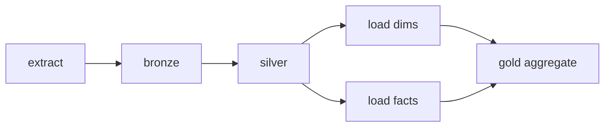

# Orchestration Fundamentals

## What is orchestration?

Orchestration is the practice of **coordinating many data tasks into one reliable, automated workflow** — deciding *what runs, in what order, when, and what happens when a step fails*.

Analogy: an orchestra has dozens of musicians (your tasks). Each can play alone, but you get music only when a **conductor** tells them when to start, keeps them in order, and stops the whole piece if the violins fall apart. An orchestrator is the conductor of your data pipeline — it doesn't play an instrument (it doesn't transform data itself), it makes all the instruments play together correctly.

---

## The DAG — the core concept

Every workflow is a **DAG (Directed Acyclic Graph)**:

- **Directed** — arrows point from a task to the task that depends on it (order matters).
- **Acyclic** — no loops; a task can't eventually depend on itself, so the run always finishes.
- **Graph** — tasks (nodes) connected by dependencies (edges).



The orchestrator reads the DAG and runs tasks **as soon as their dependencies succeed** — `dims` and `facts` can run in parallel, but `aggregate` waits for both. Thinking in DAGs is the transferable skill across ADF, Airflow, Databricks, and dbt.

---

## The properties a good orchestrator gives you

| Property | What it means | Why it matters |
|---|---|---|
| **Scheduling** | Run on a clock/calendar | Data lands nightly/hourly without a human |
| **Dependencies** | Task B waits for task A | Never aggregate before the data is loaded |
| **Retries** | Auto-retry a failed task N times | Survive transient blips without manual restart |
| **Timeouts** | Kill a task that hangs too long | A stuck task doesn't block everything forever |
| **Alerting** | Notify on failure/SLA breach | You hear about problems from the tool, not the CEO |
| **Backfill** | Re-run past time windows | Reprocess a fixed bug or a missed day |
| **Observability** | Run history, logs, lineage | You can see *what ran, when, and why it failed* |

---

## Scheduling models

| Model | Fires… | Example |
|---|---|---|
| **Cron / schedule** | At fixed clock times | "Every day at 02:00" |
| **Interval / tumbling window** | Per fixed, non-overlapping time slice — **stateful**, supports dependencies & **backfill** | "Each hour's window, in order" |
| **Event-based** | When something happens | "When a file lands in ADLS" |
| **Manual / on-demand** | You trigger it | Ad-hoc reruns, testing |

The **tumbling-window vs simple-schedule** distinction is a classic interview question: tumbling windows have **state** (they know which windows ran) so they support **dependencies and backfilling**; a plain schedule just fires at a time and forgets.

---

## Idempotency — the property that makes orchestration safe

Because orchestrators **retry** and you **backfill**, a task may run more than once for the same data. It must be **idempotent** — running it twice produces the same result as running it once.

- ✅ `MERGE`/upsert on a business key; overwrite a partition; "set state to X."
- ❌ Blind `INSERT`/`append`; "add 10 to the total" — these double-count on a rerun.

```python
# idempotent: re-running the same batch_date is safe
(df.write.format("delta").mode("overwrite")
   .option("replaceWhere", f"batch_date = '{batch_date}'")
   .save(gold_path))
```

Idempotency + a natural **partition/key per run** is what lets you retry and backfill without fear. It's the same principle from [CAP/streaming](../02_Databases/NoSQL/06_CAP_Theorem_and_Consistency.md) and [Project 1](../18_Projects/02_Project_1_Batch_Medallion_Pipeline.md).

---

## Failure handling patterns

- **Retry with backoff** for transient errors (network, throttling).
- **Fail-fast vs continue** — decide whether one failed table should stop the whole DAG or just skip that branch.
- **Dead-letter / quarantine** — route bad records aside so one poison row doesn't kill the run ([Data Quality](../06_Data_Engineering/Data_Quality/01_Data_Quality_Fundamentals.md)).
- **Alert on failure** — always. A silent failure is the most dangerous kind.
- **SLA/timeout** — flag when a run is late even if it hasn't technically failed.

---

## Orchestration vs transformation — don't confuse them

A frequent conceptual mix-up: **the orchestrator does not transform data.** ADF/Airflow **coordinate**; Databricks/Spark/dbt **transform**. The clean architecture is **control plane (orchestrator) + data plane (compute)**: ADF triggers a Databricks notebook; Airflow triggers a dbt run. Keeping these separate is a senior design principle and a common interview point.

---

## Interview-grade Q&A

- *What is a DAG?* A Directed Acyclic Graph of tasks with dependencies and no cycles — the model every orchestrator runs.
- *Why must tasks be idempotent?* Retries and backfills can run a task twice; idempotency ensures the result is the same, preventing duplicates/double-counting.
- *Tumbling window vs schedule trigger?* Tumbling windows are stateful (know which windows ran), so they support dependencies and backfill; schedules just fire at a time.
- *Orchestrator vs transformation engine?* The orchestrator coordinates order/scheduling/retries (control plane); the engine does the actual data work (data plane).
- *How do you handle a failed task?* Retries with backoff for transient errors, alerting always, quarantine bad rows, and fail-fast vs continue by design.

---

## Further Learning — Docs & Videos
- Airflow DAG concepts: https://airflow.apache.org/docs/apache-airflow/stable/core-concepts/dags.html
- Idempotent data pipelines: https://www.youtube.com/results?search_query=idempotent+data+pipelines
- Video — DAGs & orchestration explained: https://www.youtube.com/results?search_query=what+is+a+dag+data+engineering
