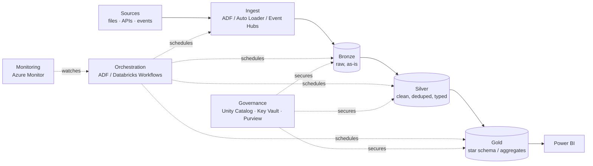

# Hands-On Projects — Learning Path

Everything else in this repo teaches you to *know* data engineering. This module is where you *do* it. **Projects are what get you hired** — a recruiter skims certificates but *reads* a GitHub repo with a real medallion pipeline in it. This is the module that turns all your notes into evidence.

> **The ROADMAP's Golden Rule #3:** *"Build 1–2 real projects. A medallion pipeline on public data beats ten certificates on a résumé."* This module is that rule, made concrete.

**Prerequisites:** you should have worked through [SQL](../02_Databases/SQL/01_What_is_SQL.md), [Python](../06_Programming/Python/00_Python_Learning_Path.md), [PySpark](../06_Programming/PySpark/00_PySpark_Learning_Path.md), [Delta/Lakehouse](../04_Storage_and_Formats/Lakehouse/03_Lakehouse_Architecture.md), and [Databricks](../08_Databricks/00_Databricks_Learning_Path.md). The projects *apply* those; they don't re-teach them.

---

## Why one good project beats ten tutorials

- A tutorial you *followed* proves nothing; a project you *built and can explain* proves everything.
- Interviews spend 30–40 minutes on "walk me through a project you built." A real one gives you infinite, honest material; a fake one collapses under the second follow-up question.
- Building end-to-end forces the integration skills no single note teaches: wiring ADLS to Databricks to Power BI, handling the file that breaks Silver, scheduling the job, and explaining the cost.

---

## The three projects (build in order)

| # | Project | Skills proven | Azure services |
|---|---------|---------------|----------------|
| 02 | [Batch Medallion Pipeline](02_Project_1_Batch_Medallion_Pipeline.md) · 🖥️ [runnable repo](project_1_batch_medallion/README.md) | The core DE loop: ingest → Bronze → Silver → Gold → BI | ADLS Gen2, Databricks, PySpark, Delta, Power BI |
| 03 | [Streaming Pipeline](03_Project_2_Streaming_Pipeline.md) | Real-time ingest & incremental processing | Event Hubs, Structured Streaming, Auto Loader, Delta |
| 04 | [Orchestrated ELT with ADF](04_Project_3_ADF_Orchestrated_ELT.md) | Scheduling, dependencies, monitoring a production-shaped pipeline | ADF, Databricks, Key Vault, Azure SQL |

Then: [05 — Portfolio & GitHub Presentation](05_Portfolio_and_GitHub_Presentation.md) — how to package all three so a recruiter and an interviewer instantly "get it."

---

## What every project note gives you

1. **The business scenario** — a realistic reason the pipeline exists.
2. **Architecture diagram** — the services and the data flow.
3. **Step-by-step build** — with the actual code/config for each hop.
4. **What breaks (and the fix)** — the real gotchas, because handling them is the skill.
5. **How to talk about it in an interview** — the questions you'll be asked and strong answers.

---

## The reference architecture (all projects share this shape)

Learn this diagram cold — it's the answer to half of all data-engineering interview questions, and every project below is one concrete instance of it.

---

## A note on cost (do this for free)

Every project can be built on **free/low-cost tiers**: Azure free account ($200 credit), Databricks Community Edition or a small trial cluster, ADLS pennies-per-GB, Power BI Desktop (free). Always **shut clusters down** and **delete resource groups** when done. Cost discipline is itself a data-engineering skill — see [Cost & Performance](../16_Cost_and_Performance/00_Cost_and_Performance_Learning_Path.md).

Start here: **[01 — Project Setup & Prerequisites](01_Project_Setup_and_Prerequisites.md)**.

## Further Learning — Docs & Videos
- Azure free account: https://azure.microsoft.com/free/
- Databricks Community Edition: https://www.databricks.com/try-databricks
- Public datasets (Kaggle): https://www.kaggle.com/datasets
- Video — build an Azure data engineering project: https://www.youtube.com/results?search_query=azure+data+engineering+end+to+end+project
