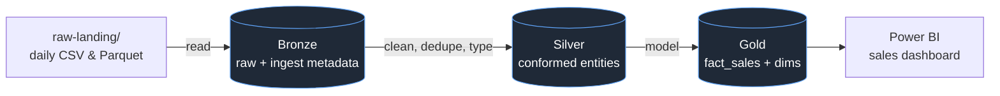
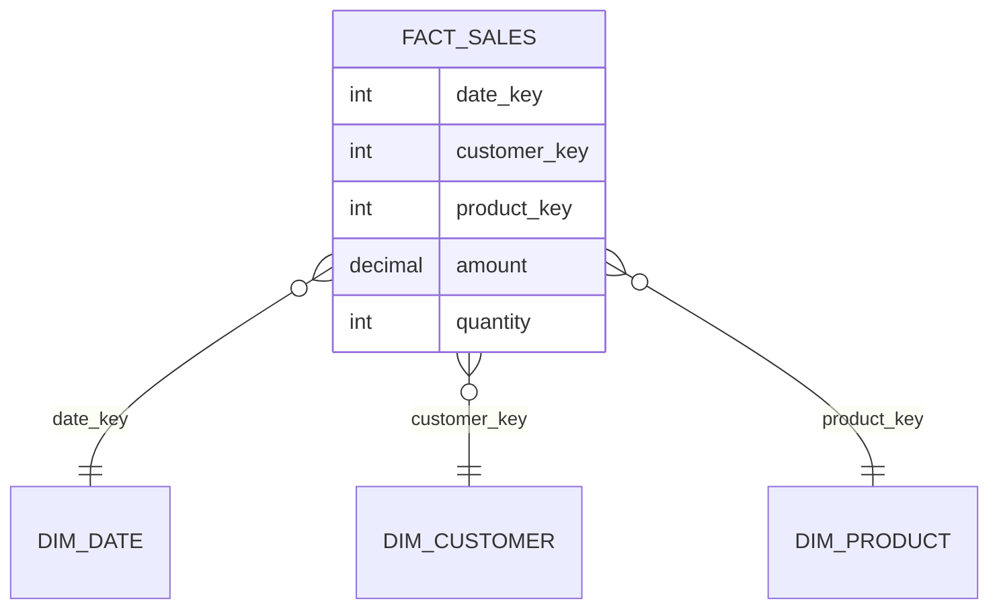

# Project 1 — Batch Medallion Pipeline

> 🖥️ **Runnable implementation:** a complete, locally-executable version of this project (PySpark + Delta, no Azure account needed) lives in **[project_1_batch_medallion/](project_1_batch_medallion/README.md)** — it implements the medallion stages, SCD2, dedupe, and quarantine below, with sample data and unit tests. Read this walkthrough for the *ideas*; run that repo to *prove* them.

## The scenario

You're the data engineer for **"NorthWind Retail."** Every night, the source systems drop yesterday's **orders, order items, customers, and products** as CSV/Parquet files into a landing folder. Finance wants a **daily sales dashboard**: revenue by day, by product category, by region, and a customer view that correctly reflects address changes over time.

Your job: turn those raw daily files into a **trusted star schema** in the Gold layer, and serve it to Power BI. This is *the* canonical data-engineering project — build it well and you can discuss it in any interview.

---

## Architecture



**Skills this proves:** medallion architecture, PySpark transformations, Delta `MERGE`, SCD2, star-schema modeling, incremental loads, data quality checks.

---

## Step 1 — Bronze: land raw data *as-is*

**Rule: Bronze never transforms.** You copy the source faithfully and add **ingestion metadata** so every row is traceable. This lets you reprocess Silver/Gold anytime without re-reading the source.

```python
from pyspark.sql.functions import current_timestamp, input_file_name, lit

raw = (spark.read
       .option("header", True)
       .option("inferSchema", False)          # never infer in prod — define schema
       .schema(orders_schema)                 # explicit schema (see 03_Schemas)
       .csv("abfss://raw-landing@…/orders/2026-08-02/*.csv"))

bronze = (raw
    .withColumn("_ingest_ts", current_timestamp())
    .withColumn("_source_file", input_file_name())
    .withColumn("_batch_date", lit("2026-08-02")))

(bronze.write.format("delta").mode("append")
    .partitionBy("_batch_date")
    .save("abfss://bronze@…/orders"))
```

Why explicit schema, not `inferSchema`? Inference reads the data twice, is slow, and silently changes types between days — a classic production bug. See [Schemas](../06_Programming/PySpark/03_Schemas_and_Data_Types.md).

---

## Step 2 — Silver: clean, dedupe, conform

Silver is where data becomes **trustworthy**: correct types, no duplicates, standardized values, bad rows quarantined. One clean table per business entity.

```python
from pyspark.sql.functions import col, to_date, trim, upper
from pyspark.sql.window import Window
from pyspark.sql.functions import row_number

bronze = spark.read.format("delta").load("abfss://bronze@…/orders")

# 1. type & standardize
clean = (bronze
    .withColumn("order_date", to_date("order_date"))
    .withColumn("region", upper(trim(col("region"))))
    .withColumn("amount", col("amount").cast("decimal(12,2)")))

# 2. quarantine bad rows instead of dropping silently
bad = clean.filter(col("amount").isNull() | (col("amount") < 0))
bad.write.format("delta").mode("append").save("abfss://silver@…/_quarantine/orders")
good = clean.filter(col("amount").isNotNull() & (col("amount") >= 0))

# 3. dedupe — keep latest version of each order
w = Window.partitionBy("order_id").orderBy(col("_ingest_ts").desc())
deduped = (good.withColumn("rn", row_number().over(w))
                .filter("rn = 1").drop("rn"))

deduped.write.format("delta").mode("overwrite").save("abfss://silver@…/orders")
```

The **quarantine** pattern (route bad rows aside, keep the pipeline running, alert on volume) is straight from [Data Quality](../05_Data_Engineering/Data_Quality/01_Data_Quality_Fundamentals.md) — mention it and interviewers nod.

---

## Step 3 — Gold: the star schema

Model for the dashboard's questions: a **fact table** at the grain of *one row per order line*, surrounded by **dimensions**. This is [dimensional modeling](../02_Databases/Data_Modeling/03_Dimensional_Modeling.md) in action.



### SCD2 on the customer dimension (the star of the show)

A customer moves city. Finance must see *old* orders against the *old* city and *new* orders against the *new* city. That's **SCD Type 2** — keep history with `valid_from` / `valid_to` / `is_current`, using Delta `MERGE`:

```python
from delta.tables import DeltaTable

dim = DeltaTable.forPath(spark, "abfss://gold@…/dim_customer")

# incoming changed customers → close old row, insert new version
(dim.alias("t").merge(
     updates.alias("s"),
     "t.customer_id = s.customer_id AND t.is_current = true")
  .whenMatchedUpdate(
     condition="t.city <> s.city",                        # a real change
     set={"is_current": "false", "valid_to": "current_date()"})
  .whenNotMatchedInsert(values={
     "customer_id": "s.customer_id", "city": "s.city",
     "is_current": "true", "valid_from": "current_date()", "valid_to": "null"})
  .execute())
```

`MERGE` (upsert) is the single most-tested Delta operation — see [Delta with PySpark](../06_Programming/PySpark/12_Delta_Lake_with_PySpark.md) and [SCDs](../02_Databases/Data_Modeling/04_Slowly_Changing_Dimensions.md).

---

## Step 4 — Serve to Power BI

Point Power BI at the Gold Delta tables (via Databricks SQL Warehouse / serverless SQL). Build the star-schema model, mark the date table, and create measures. Covered in [Power BI for Engineers](../17_Power_BI_for_Engineers/00_Power_BI_Learning_Path.md). The dashboard: revenue trend, revenue by category/region, top customers.

---

## What breaks (and the fix) — the part that impresses

| Problem | Fix |
|---|---|
| Day 2's file has an extra column | Delta **schema evolution** (`mergeSchema`) in Bronze; validate in Silver |
| Same order arrives twice (re-run) | **Dedupe window** + idempotent `MERGE` on business key |
| Tiny-file explosion after many days | `OPTIMIZE` + partition sensibly; don't over-partition |
| Slow join customers↔orders | Broadcast the small dim; check for skew ([Performance](../06_Programming/PySpark/14_Performance_and_Best_Practices.md)) |
| Numbers wrong after a re-run | Gold built with **overwrite/MERGE**, never blind `append` |

Being able to *narrate these* is what separates "I followed a tutorial" from "I built a pipeline."

---

## How to talk about it in an interview

- *"Walk me through a project."* → Scenario → medallion diagram → one interesting problem you solved (SCD2 or dedupe) → the result (a dashboard finance uses).
- *"How did you handle a customer changing address?"* → SCD2 with Delta MERGE, valid_from/valid_to/is_current.
- *"How do you make a re-run safe?"* → Idempotent MERGE on business keys + dedupe window; Bronze is append-only and reprocessable.
- *"Where do quality checks go?"* → At the Bronze→Silver boundary; quarantine bad rows, alert on volume.

---

## Definition of done

- [ ] Bronze/Silver/Gold Delta tables exist and rebuild from raw
- [ ] Customer dimension implements SCD2 with a working MERGE
- [ ] Bad rows are quarantined, not silently dropped
- [ ] A Power BI dashboard reads Gold and answers the finance questions
- [ ] Repo has a README with the architecture diagram and run steps

Next: **[03 — Project 2: Streaming Pipeline](03_Project_2_Streaming_Pipeline.md)**.

## Further Learning — Docs & Videos
- Medallion architecture (Databricks): https://learn.microsoft.com/azure/databricks/lakehouse/medallion
- Delta MERGE: https://docs.databricks.com/en/delta/merge.html
- Video — end-to-end medallion project: https://www.youtube.com/results?search_query=databricks+medallion+architecture+project+end+to+end
