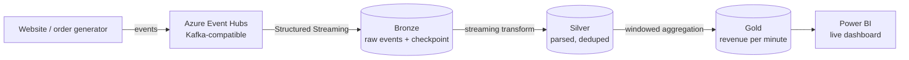

# Project 2 — Streaming / Incremental Pipeline

## The scenario

NorthWind Retail launched a website, and now **orders arrive continuously** as events, not nightly files. The business wants a **near-real-time** view: live revenue in the last hour, orders per minute, and fraud-ish anomalies flagged as they happen. Batch-once-a-night won't cut it.

Your job: ingest a **live event stream**, process it **incrementally** with exactly-once guarantees, and keep a Gold table fresh within seconds-to-minutes. This project proves you can do **streaming**, the skill that separates mid from senior.

---

## Architecture



**Skills this proves:** Event Hubs/Kafka, Spark **Structured Streaming**, checkpointing, watermarking, exactly-once, Auto Loader, incremental Gold.

---

## Two ways to "stream" — know both

| Approach | What it is | When |
|---|---|---|
| **True streaming** (Event Hubs → Structured Streaming) | Continuous processing of an event stream | Real-time dashboards, alerting, IoT |
| **Incremental file ingestion** (**Auto Loader**) | New *files* landing in ADLS processed as they arrive | "Micro-batch" — files drop every few minutes |

Both use the same Structured Streaming engine. Auto Loader is the everyday Databricks pattern; do the Event Hubs version too because interviews ask about it. See [Streaming Fundamentals](../09_Streaming/01_Streaming_Fundamentals.md) and [Structured Streaming](../06_Programming/PySpark/13_Structured_Streaming.md).

---

## Step 1 — Produce events (Event Hubs)

Create an **Event Hubs namespace** + hub `orders`. A small Python producer simulates the website:

```python
# producer.py — sends order events
from azure.eventhub import EventHubProducerClient, EventData
import json, random, time

producer = EventHubProducerClient.from_connection_string(CONN_STR, eventhub_name="orders")
while True:
    evt = {"order_id": random.randint(1, 1e9), "amount": round(random.uniform(5, 500), 2),
           "region": random.choice(["EAST","WEST","NORTH"]), "ts": time.time()}
    batch = producer.create_batch(); batch.add(EventData(json.dumps(evt)))
    producer.send_batch(batch); time.sleep(0.2)
```

Event Hubs is **Kafka-protocol-compatible**, so the same code pattern works against Kafka — a nice thing to say in interviews. See [Event Hubs](../09_Streaming/02_Azure_Event_Hubs.md) and [Kafka](../09_Streaming/03_Apache_Kafka.md).

---

## Step 2 — Bronze: read the stream with checkpointing

```python
raw = (spark.readStream
    .format("kafka")                                  # Event Hubs speaks Kafka
    .option("kafka.bootstrap.servers", EH_ENDPOINT)
    .option("subscribe", "orders")
    .option("startingOffsets", "latest")
    .load())

(raw.writeStream
    .format("delta")
    .option("checkpointLocation", "abfss://bronze@…/_chk/orders")   # ← exactly-once
    .outputMode("append")
    .start("abfss://bronze@…/orders_stream"))
```

The **checkpoint** is the whole game: it records exactly which offsets were processed, so a crash-and-restart resumes without loss or duplication → **exactly-once**. Delete the checkpoint and you reprocess everything. This is the #1 streaming interview point.

---

## Step 3 — Silver: parse + watermark for late data

Events arrive out of order and late (a phone was offline). A **watermark** tells Spark how long to wait for stragglers before finalizing a window and dropping older state — so state doesn't grow forever.

```python
from pyspark.sql.functions import from_json, col, to_timestamp

parsed = (bronze_stream
    .select(from_json(col("value").cast("string"), order_schema).alias("d"))
    .select("d.*")
    .withColumn("event_time", to_timestamp("ts"))
    .withWatermark("event_time", "10 minutes")        # tolerate 10-min lateness
    .dropDuplicates(["order_id", "event_time"]))       # streaming dedupe
```

Watermarking + `dropDuplicates` gives **deduplicated, bounded-state** streaming — covered in [Structured Streaming](../06_Programming/PySpark/13_Structured_Streaming.md).

---

## Step 4 — Gold: windowed aggregation

```python
from pyspark.sql.functions import window, sum as _sum, count

revenue = (silver_stream
    .groupBy(window("event_time", "1 minute"), "region")
    .agg(_sum("amount").alias("revenue"), count("*").alias("orders")))

(revenue.writeStream
    .format("delta").outputMode("append")
    .option("checkpointLocation", "abfss://gold@…/_chk/revenue")
    .trigger(processingTime="30 seconds")
    .start("abfss://gold@…/revenue_per_minute"))
```

Power BI reads `revenue_per_minute` for a live tile. `trigger` controls the micro-batch cadence — cost vs freshness trade-off.

---

## What breaks (and the fix)

| Problem | Fix |
|---|---|
| Restart reprocesses everything | Keep the **checkpoint**; never delete it casually |
| State/memory grows forever | **Watermark** to bound and evict old window state |
| Duplicate events (at-least-once source) | `dropDuplicates` on a key within the watermark |
| Late events silently dropped | Set the watermark to your real lateness SLA; monitor dropped counts |
| Tiny files pile up from micro-batches | Periodic `OPTIMIZE`; tune trigger interval |
| Small stream but a huge cluster | Right-size / use a single-node or serverless for low volume ([Cost](../16_Cost_and_Performance/00_Cost_and_Performance_Learning_Path.md)) |

---

## How to talk about it in an interview

- *"How do you get exactly-once in Spark streaming?"* → Checkpointing (offset tracking) + idempotent Delta sink.
- *"What's a watermark and why does it matter?"* → It bounds state and defines how long to wait for late data before finalizing windows.
- *"Batch vs streaming — when streaming?"* → When decisions need seconds-to-minutes freshness (fraud, live ops); otherwise batch is cheaper and simpler.
- *"Event Hubs vs Kafka?"* → Event Hubs is a managed, Kafka-protocol-compatible Azure service — same code, no cluster to run.

---

## Definition of done

- [ ] A producer sends events to Event Hubs (or files to an Auto Loader folder)
- [ ] Structured Streaming lands Bronze with a checkpoint (survives restart)
- [ ] Silver parses, watermarks, and dedupes
- [ ] Gold holds a per-minute windowed aggregate feeding a live Power BI tile
- [ ] You can explain exactly-once and watermarking without notes

Next: **[04 — Project 3: Orchestrated ELT with ADF](04_Project_3_ADF_Orchestrated_ELT.md)**.

## Further Learning — Docs & Videos
- Structured Streaming (Databricks): https://learn.microsoft.com/azure/databricks/structured-streaming/
- Auto Loader: https://learn.microsoft.com/azure/databricks/ingestion/auto-loader/
- Event Hubs + Spark: https://learn.microsoft.com/azure/event-hubs/event-hubs-kafka-spark-tutorial
- Video — Spark structured streaming project: https://www.youtube.com/results?search_query=spark+structured+streaming+event+hubs+project
