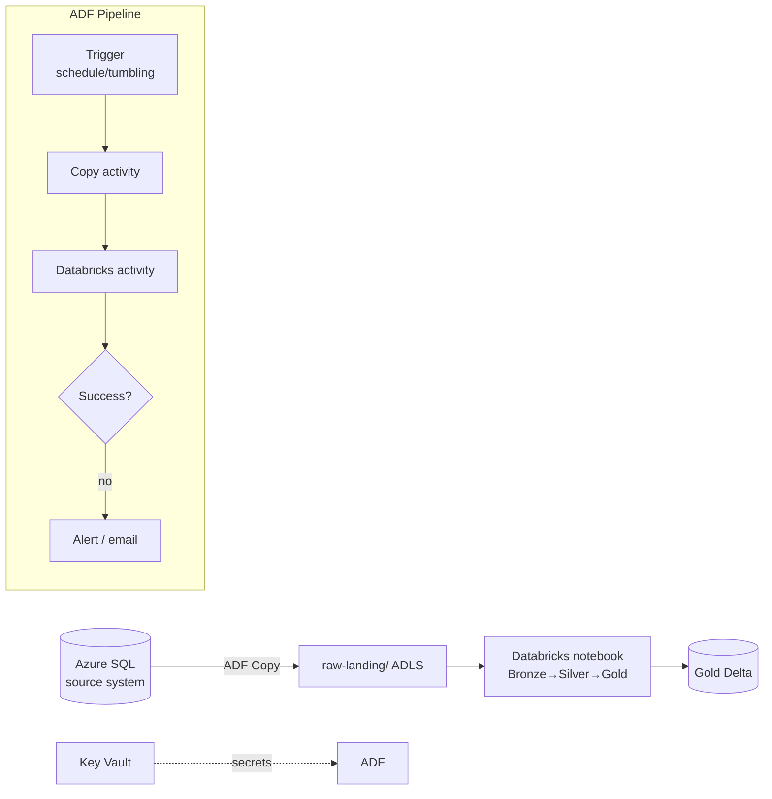
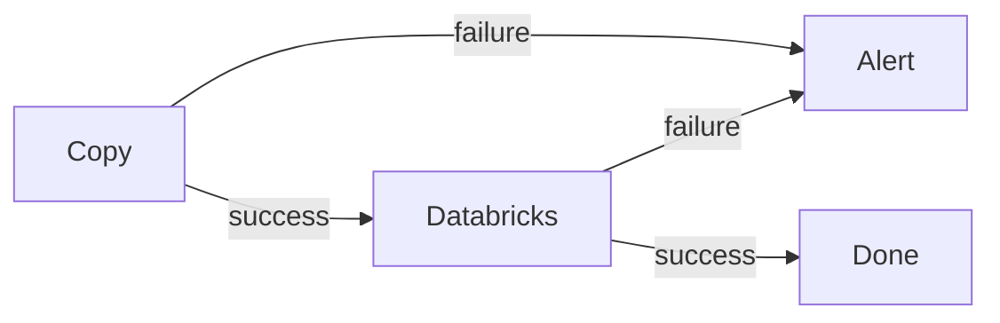

# Project 3 — Orchestrated ELT with Azure Data Factory

## The scenario

The two pipelines you built run when *you* run them. In production, nobody runs anything by hand — pipelines are **scheduled, chained, retried, monitored, and parameterized**. NorthWind needs the nightly batch to: pull new data from an **on-prem-style Azure SQL source**, land it in ADLS, trigger the **Databricks** medallion transform, and **fail loudly** if anything breaks.

Your job: wrap Project 1 in **Azure Data Factory** so it's a real, production-shaped, orchestrated ELT. This project proves you can operate pipelines, not just write transformations.

---

## Architecture



**Skills this proves:** ADF pipelines, linked services, datasets, Integration Runtime, triggers, parameterization, retries, Key Vault integration, monitoring & alerting.

---

## ADF building blocks (the vocabulary interviews expect)

| Concept | What it is |
|---|---|
| **Linked service** | A connection string to a source/sink (Azure SQL, ADLS, Databricks) — secrets from Key Vault |
| **Dataset** | A named pointer to data *through* a linked service (a table, a folder) |
| **Activity** | One step (Copy, Databricks notebook, Lookup, ForEach, If) |
| **Pipeline** | An ordered graph of activities with dependencies |
| **Trigger** | What starts a pipeline: **schedule**, **tumbling window**, **event**, or manual |
| **Integration Runtime (IR)** | The compute that moves data: **Azure IR** (cloud), **Self-hosted IR** (on-prem/VNet), **SSIS IR** |

Deep-dived in [Azure Data Factory](../06_Data_Engineering/ETL_ELT/02_Azure_Data_Factory.md) and orchestration patterns in [Orchestration](../12_Orchestration/00_Orchestration_Learning_Path.md).

---

## Step 1 — Copy from source to landing (parameterized)

Build a **Copy activity**: source = Azure SQL dataset, sink = ADLS Parquet. Make it **incremental** — only pull rows newer than the last run, using a **watermark column** (`modified_date`):

```
Lookup (last watermark) → Copy (WHERE modified_date > @lastWatermark) → StoredProc (update watermark)
```

Parameterize the pipeline (`@pipeline().parameters.tableName`, run date) so **one pipeline loads many tables** via a `ForEach` over a config table — the professional pattern, not one pipeline per table. This "metadata-driven pipeline" is a strong senior talking point.

---

## Step 2 — Trigger Databricks from ADF

Add a **Databricks Notebook activity** that runs your Project 1 medallion notebook, passing the batch date as a parameter:

```json
{ "type": "DatabricksNotebook",
  "notebookPath": "/Repos/de/01_medallion",
  "baseParameters": { "batch_date": "@pipeline().TriggerTime" } }
```

The notebook receives it via `dbutils.widgets.get("batch_date")`. Now ADF **orchestrates** and Databricks **transforms** — the classic Azure division of labor (ADF = control plane, Databricks = data plane).

---

## Step 3 — Dependencies, retries, and failure paths

- Chain activities on **success** (`green` dependency) so Databricks only runs if Copy succeeded.
- Set **retry** (e.g., 2 retries, 5-min interval) on transient-failure-prone activities.
- Add a **failure path**: on any failure, run a **Web/Logic App activity** that emails or posts to Teams. A pipeline that fails *silently* is worse than no pipeline.



Failure handling and alerting are the heart of [Monitoring & Observability](../13_Monitoring_and_Observability/00_Monitoring_Learning_Path.md).

---

## Step 4 — Schedule & monitor

- Attach a **schedule trigger** (nightly) or a **tumbling-window trigger** (which supports dependencies and backfill — better for data pipelines).
- Watch runs in **ADF Monitor**; pipe metrics/logs to **Azure Monitor / Log Analytics** and set an **alert** on failed runs.

**Tumbling vs schedule trigger** is a favorite interview question: tumbling windows are **stateful, support dependencies, and can backfill** past windows; schedule triggers are simple fire-at-a-time. See [Orchestration](../12_Orchestration/02_ADF_Orchestration.md).

---

## Step 5 — Source control & deploy the pipeline

Connect ADF to **Git** (Azure DevOps/GitHub): pipelines are stored as JSON, and you promote dev→prod via **ARM templates / CI-CD**. Export the `adf/` JSON into your project repo so reviewers can see the orchestration. This ties into [CI/CD](../07_DevOps/Git_GitHub/09_Production_Best_Practices_and_CICD.md) and [DataOps](../15_Testing_and_DataOps/00_Testing_and_DataOps_Learning_Path.md).

---

## What breaks (and the fix)

| Problem | Fix |
|---|---|
| Full reload every night (slow, costly) | **Incremental** copy via watermark column |
| One pipeline per table (unmaintainable) | **Metadata-driven** ForEach over a config table |
| Secrets in linked services | Reference **Key Vault** in linked services |
| Failures noticed days later | **Alert activity** on failure + Azure Monitor alert |
| Can't rerun a missed day | **Tumbling-window** trigger with backfill |
| Can't tell prod from dev | Git integration + parameterized environments |

---

## How to talk about it in an interview

- *"How do you orchestrate pipelines?"* → ADF pipelines with triggers, dependency chains, retries, and failure/alert paths; Databricks activity for transforms.
- *"Schedule vs tumbling-window trigger?"* → Tumbling is stateful, supports dependencies and backfill; schedule just fires on a clock.
- *"How do you do incremental loads?"* → Watermark column + Lookup/Copy/update-watermark, or CDC ([Change Data Capture](../06_Data_Engineering/Data_Integration/03_Change_Data_Capture.md)).
- *"What's a metadata-driven pipeline?"* → One parameterized pipeline that loops over a config table of tables — DRY and scalable.
- *"ADF vs Databricks — who does what?"* → ADF orchestrates/moves (control plane); Databricks transforms at scale (data plane).

---

## Definition of done

- [ ] ADF Copy loads from Azure SQL to ADLS **incrementally**
- [ ] A **Databricks activity** runs the medallion transform with parameters
- [ ] Activities chained with retries and a **failure→alert** path
- [ ] A **trigger** schedules it; runs visible in Monitor with a failure alert
- [ ] Pipeline JSON is in Git and exported to your project repo

Next: **[05 — Portfolio & GitHub Presentation](05_Portfolio_and_GitHub_Presentation.md)**.

## Further Learning — Docs & Videos
- ADF documentation: https://learn.microsoft.com/azure/data-factory/introduction
- ADF triggers: https://learn.microsoft.com/azure/data-factory/concepts-pipeline-execution-triggers
- Metadata-driven copy: https://learn.microsoft.com/azure/data-factory/copy-data-tool-metadata-driven
- Video — ADF end-to-end pipeline: https://www.youtube.com/results?search_query=azure+data+factory+end+to+end+project+databricks
