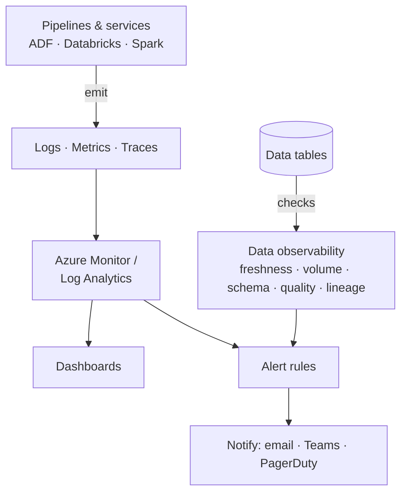

# Monitoring & Observability — Learning Path

You built pipelines ([Projects](../18_Projects/00_Projects_Learning_Path.md)) and scheduled them ([Orchestration](../11_Orchestration/00_Orchestration_Learning_Path.md)). Now: **how do you know they're actually working?** Monitoring and observability are how you find out a pipeline broke — or, better, that it's *about to* — **before the business does**. This is what separates "I write jobs" from "I run a reliable data platform," and it's a Phase 7 🔜 gap the [ROADMAP](../ROADMAP.md) flagged.

---

## Why this is a senior-level differentiator

- The worst data incident isn't a job that **fails loudly** — it's one that **succeeds while producing wrong data**. Only observability catches that.
- On-call, SLAs, and "who gets paged at 2 AM" are real parts of the job. Interviews for 3+ year roles probe this hard.
- "It ran green" ≠ "the data is correct." Rows can silently drop to zero, a schema can change, freshness can slip — all with a green checkmark.

---

## Monitoring vs Observability (know the difference)

| | **Monitoring** | **Observability** |
|---|---|---|
| Question | "Is the known thing broken?" | "Why is *something* wrong, including things I didn't predict?" |
| Watches | Pre-defined metrics/alerts (job failed, CPU high) | Freshness, volume, schema, distribution, lineage |
| Analogy | A smoke alarm | A doctor who can diagnose a symptom you can't name |

Monitoring tells you the pipeline **ran**; observability tells you the **data is trustworthy**. You need both.

---

## Reading order

| # | File | What you'll learn |
|---|------|-------------------|
| 01 | [Monitoring Fundamentals](01_Monitoring_Fundamentals.md) | Metrics/logs/traces, SLAs/SLOs, alerting, the on-call mindset |
| 02 | [Azure Monitor & Log Analytics](02_Azure_Monitor_and_Log_Analytics.md) | Collecting logs/metrics, KQL, dashboards, alert rules |
| 03 | [Pipeline Reliability](03_Pipeline_Reliability.md) | Failure handling, retries, idempotency, dead-letter, SLAs |
| 04 | [Data Observability](04_Data_Observability.md) | Freshness, volume, schema, lineage — the five pillars & tools |
| — | [Interview Questions & Answers](Interview_Questions_and_Answers.md) | Test yourself across the module |

---

## The big picture

Two streams feed your alerts: **operational** (did the job run?) from Azure Monitor, and **data** (is the data right?) from observability checks. A mature platform watches both.

Start here: **[01 — Monitoring Fundamentals](01_Monitoring_Fundamentals.md)**.

## Further Learning — Docs & Videos
- Azure Monitor overview: https://learn.microsoft.com/azure/azure-monitor/overview
- Data observability (Monte Carlo): https://www.montecarlodata.com/blog-what-is-data-observability/
- Google SRE book (SLIs/SLOs): https://sre.google/sre-book/service-level-objectives/
- Video — data observability explained: https://www.youtube.com/results?search_query=data+observability+explained
