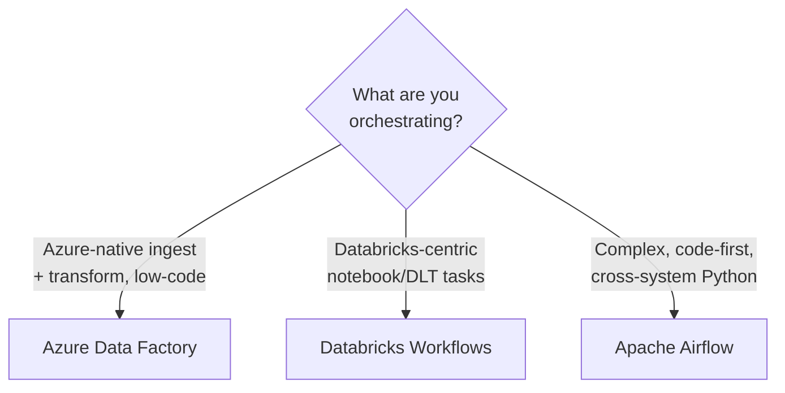
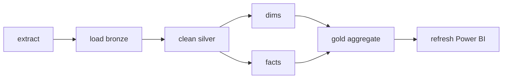

# Orchestration & Workflows — Learning Path

A pipeline that you run by hand isn't a pipeline — it's a script. **Orchestration** is the layer that runs your jobs **automatically, in the right order, on a schedule, with retries, dependencies, and alerts** when things break. It's the difference between "I wrote a transformation" and "I run a production data platform."

This module fills a gap the [ROADMAP](../ROADMAP.md) explicitly flagged (Phase 7 🔜). It builds directly on [ETL/ELT](../05_Data_Engineering/ETL_ELT/01_ETL_vs_ELT.md), [ADF](../05_Data_Engineering/ETL_ELT/02_Azure_Data_Factory.md), and [Databricks](../08_Databricks/00_Databricks_Learning_Path.md).

---

## Why orchestration matters

- Real pipelines have **dozens of steps with dependencies** — "load dims before facts, aggregate only after both land." Something must enforce that order.
- Jobs **fail** — networks blip, sources are late. Orchestration handles **retries, timeouts, and alerts** so a transient failure doesn't become a 2 a.m. phone call.
- The business needs data **on a schedule** and the ability to **backfill** a missed or reprocessed day.
- It's a top interview area: *"How do you schedule and monitor your pipelines?"* has no good answer without this vocabulary.

---

## Reading order

| # | File | What you'll learn |
|---|------|-------------------|
| 01 | [Orchestration Fundamentals](01_Orchestration_Fundamentals.md) | DAGs, dependencies, idempotency, retries, backfill, scheduling concepts |
| 02 | [ADF Orchestration](02_ADF_Orchestration.md) | Triggers (schedule/tumbling/event), dependencies, metadata-driven pipelines |
| 03 | [Databricks Workflows](03_Databricks_Workflows.md) | Jobs, task graphs, job clusters, DLT pipelines |
| 04 | [Apache Airflow](04_Apache_Airflow.md) | DAGs, operators, sensors, scheduling — the open-source standard |
| — | [Interview Questions & Answers](Interview_Questions_and_Answers.md) | Test yourself across the module |

---

## The tools, and when each wins

| Tool | Sweet spot | Style |
|---|---|---|
| **Azure Data Factory** | Cloud-native ingest + orchestration on Azure | Low-code, GUI + JSON |
| **Databricks Workflows** | Chaining notebooks/DLT/dbt tasks inside Databricks | Config in the workspace |
| **Apache Airflow** | Complex, code-first DAGs spanning many systems | Pure Python |

Most Azure shops use **ADF or Databricks Workflows**; **Airflow** dominates the broader/open-source market and is a frequent résumé keyword — know all three.

---

## The one idea underneath all of them: the DAG

Every orchestrator is really running a **DAG** — a **Directed Acyclic Graph** of tasks: arrows show dependencies (direction), and there are no loops (acyclic), so execution always terminates. Learn to *think in DAGs* and every tool is just a different way to draw the same picture.

Start here: **[01 — Orchestration Fundamentals](01_Orchestration_Fundamentals.md)**.

## Further Learning — Docs & Videos
- Apache Airflow concepts: https://airflow.apache.org/docs/apache-airflow/stable/core-concepts/
- ADF pipeline execution & triggers: https://learn.microsoft.com/azure/data-factory/concepts-pipeline-execution-triggers
- Databricks Workflows: https://learn.microsoft.com/azure/databricks/jobs/
- Video — data orchestration explained: https://www.youtube.com/results?search_query=data+orchestration+airflow+explained
