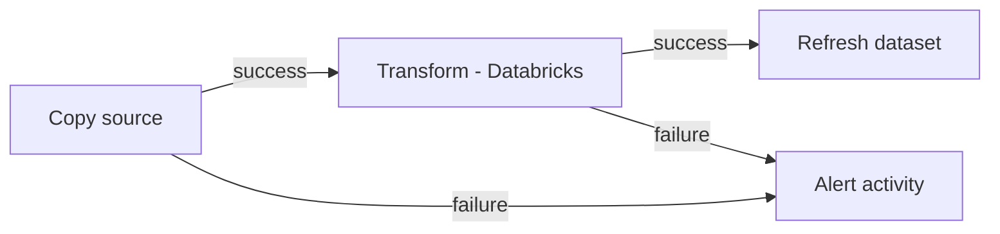

# ADF Orchestration

## What this note covers

[Azure Data Factory basics](../06_Data_Engineering/ETL_ELT/02_Azure_Data_Factory.md) taught you *what* ADF is. This note is about using ADF as an **orchestrator** — triggers, dependencies, parameterization, and the patterns that make ADF pipelines production-grade rather than toy demos.

Analogy: ADF is the **air-traffic control tower** of an Azure data platform. It doesn't fly the planes (Databricks/Spark do the transforming); it decides which plane takes off when, in what order, holds them if the runway's busy, and raises an alarm if one goes missing.

---

## Triggers — how pipelines start

| Trigger | Fires | Key trait |
|---|---|---|
| **Schedule** | At wall-clock times (cron-like) | Simple; **stateless** — no dependency/backfill |
| **Tumbling window** | Per fixed, contiguous time slice | **Stateful**: dependencies, retries per window, **backfill** |
| **Storage event** | When a blob is created/deleted in ADLS | Event-driven ingestion (file arrives → run) |
| **Custom event** | On an Event Grid custom event | Integrate with app events |
| **Manual** | You click Run / call the REST API | Ad-hoc, testing |

### Schedule vs tumbling window (the interview favorite)

- **Schedule** = "run at 2 AM." If a run is missed, it's gone; no memory.
- **Tumbling window** = a series of **stateful windows** (e.g., each hour). It knows which windows have run, supports **window-to-window dependencies**, per-window **retries**, concurrency limits, and — crucially — **backfilling** past windows when you deploy a fix or onboard historical data.

For real data pipelines, prefer **tumbling window** when you need ordering, dependencies, or backfill.

---

## Building dependencies

Inside a pipeline, activities are chained by **dependency conditions** on the arrows between them:

| Condition | Runs next activity when previous… |
|---|---|
| **Success** (green) | succeeded |
| **Failure** (red) | failed → use for alert/cleanup paths |
| **Completion** (blue) | finished, success *or* fail |
| **Skipped** (grey) | was skipped |



*Across* pipelines, use the **Execute Pipeline** activity to compose a parent orchestrator that calls child pipelines — the standard way to build a large DAG from reusable pieces.

---

## Control-flow activities (the DAG toolkit)

| Activity | Purpose |
|---|---|
| **Lookup** | Read a config value/row (e.g., last watermark, list of tables) |
| **ForEach** | Loop over a list — the heart of metadata-driven pipelines |
| **If Condition / Switch** | Branch on a value |
| **Until** | Loop until a condition (poll for readiness) |
| **Execute Pipeline** | Call a child pipeline (composition) |
| **Web / Webhook** | Call an API, send an alert |
| **Wait** | Pause (rarely needed) |

---

## The metadata-driven pattern (senior signal)

Naïve ADF = one pipeline per table → dozens of near-identical pipelines nobody can maintain. The professional pattern: **one parameterized pipeline** driven by a **control/config table**:

```
Lookup (read config: list of tables + watermark columns)
   → ForEach table:
        Copy (WHERE modified_date > @watermark, parameterized source/sink)
        → Databricks notebook (parameterized)
        → update watermark
```

Add a table to the config → it's loaded, no new pipeline. This **metadata-driven / config-driven** approach is a strong interview talking point and how real platforms scale to hundreds of tables. Ties into [Data Integration Patterns](../06_Data_Engineering/Data_Integration/02_Integration_Patterns.md).

---

## Parameters & secure config

- **Pipeline parameters** — passed at trigger time (batch date, table name).
- **Variables** — mutable within a run (build up a value in a loop).
- **Global parameters / environment** — differ per dev/test/prod.
- **Key Vault–backed linked services** — never store connection secrets in ADF; reference Key Vault ([Governance](../06_Data_Engineering/Data_Governance/01_Data_Governance_and_Security.md)).

---

## Integration Runtime (IR) — the compute that moves data

| IR type | Use |
|---|---|
| **Azure IR** | Cloud-to-cloud data movement and dispatch (default) |
| **Self-hosted IR** | Reach **on-prem** or private-network sources securely |
| **SSIS IR** | Lift-and-shift existing SSIS packages |

"How do you pull data from an on-prem SQL Server?" → **Self-hosted Integration Runtime**. A guaranteed interview question.

---

## Monitoring & alerting

- **ADF Monitor** shows pipeline/trigger/activity run history and lets you rerun from a failed activity.
- Wire ADF **diagnostic logs to Log Analytics** and set **Azure Monitor alerts** on failed runs or SLA misses — see [Monitoring & Observability](../13_Monitoring_and_Observability/00_Monitoring_Learning_Path.md).
- A **failure-path activity** (Web/Logic App) that emails/Teams on failure is the minimum bar.

---

## CI/CD for ADF

ADF integrates with **Git** (Azure Repos/GitHub): authoring happens in a branch, publishing generates **ARM templates**, and a release pipeline promotes dev→test→prod with per-environment parameters. Covered in [CI/CD](../07_DevOps/Git_GitHub/09_Production_Best_Practices_and_CICD.md) and [DataOps](../15_Testing_and_DataOps/00_Testing_and_DataOps_Learning_Path.md).

---

## Interview-grade Q&A

- *Schedule vs tumbling-window trigger?* Tumbling is stateful with dependencies, per-window retries, and backfill; schedule is a stateless clock fire.
- *How do you build a maintainable pipeline for 200 tables?* Metadata-driven: one parameterized pipeline + a config table + ForEach.
- *How do you pull from an on-prem source?* Self-hosted Integration Runtime.
- *How do you handle failures in ADF?* Retry settings, failure-dependency paths to alert activities, diagnostic logs → Azure Monitor alerts.
- *Where do secrets go?* Key Vault–backed linked services, never inline.
- *How is ADF deployed across environments?* Git integration → ARM templates → release pipeline with environment parameters.

---

## Further Learning — Docs & Videos
- ADF triggers: https://learn.microsoft.com/azure/data-factory/concepts-pipeline-execution-triggers
- Tumbling window triggers: https://learn.microsoft.com/azure/data-factory/how-to-create-tumbling-window-trigger
- Metadata-driven copy: https://learn.microsoft.com/azure/data-factory/copy-data-tool-metadata-driven
- Video — ADF triggers & metadata-driven pipelines: https://www.youtube.com/results?search_query=azure+data+factory+metadata+driven+pipeline
