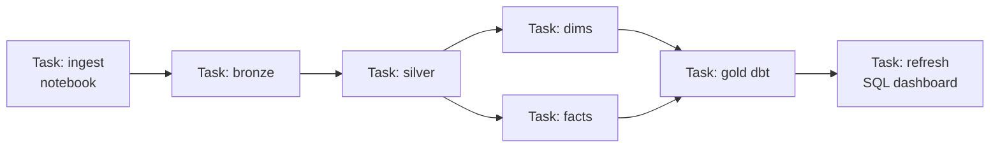

# Databricks Workflows

## What are Databricks Workflows?

Databricks Workflows (a.k.a. **Jobs**) is the **built-in orchestrator inside Databricks** — it lets you chain notebooks, Python scripts, SQL, dbt, and DLT pipelines into a **task DAG**, schedule it, retry it, and monitor it, all on Databricks compute, without a separate tool.

Analogy: if [ADF](02_ADF_Orchestration.md) is an external air-traffic control tower over all of Azure, Databricks Workflows is the **control room inside the Databricks factory** — perfect when everything you're coordinating already lives in Databricks.

---

## The building blocks

| Concept | What it is |
|---|---|
| **Job** | The whole workflow (a DAG of tasks) |
| **Task** | One step: a notebook, Python/JAR, SQL, dbt, DLT pipeline, or "run another job" |
| **Task dependencies** | Arrows: a task runs when its upstream tasks succeed |
| **Job cluster** | Ephemeral compute created for the run and torn down after — cheaper than all-purpose |
| **Trigger** | Scheduled (cron), file-arrival, continuous, or manual |
| **Run** | One execution, with per-task logs, status, and duration |



---

## Why use Workflows over ADF (and vice versa)

| Use Databricks Workflows when… | Use ADF when… |
|---|---|
| Everything is notebooks/DLT/dbt in Databricks | You need broad Azure ingestion (100+ connectors) |
| You want **job clusters** (right-sized, auto-terminated) | You want low-code, GUI-first authoring |
| You want tight Spark logging/lineage in one place | You orchestrate many non-Databricks services |
| Data-team-owned, code-first | Platform-team-owned, mixed workloads |

They're **complementary** — a common architecture is **ADF ingests → triggers a Databricks Job → the Job runs the transform DAG**. Know when each is the right layer.

---

## Job clusters vs all-purpose clusters (cost point)

- **All-purpose cluster** — interactive, shared, stays up while you work (dev). Expensive if left running.
- **Job cluster** — spun up **for the job run only** and terminated after. **Cheaper and isolated** — the correct choice for scheduled production jobs.

Choosing job clusters for scheduled work is a real [cost-optimization](../16_Cost_and_Performance/00_Cost_and_Performance_Learning_Path.md) lever and an interview answer.

---

## Reliability features

- **Retries** per task with configurable count and interval.
- **Timeouts** to kill hung tasks.
- **Task-level dependencies** and `Run if` conditions (all succeeded, at least one failed, etc.).
- **Notifications** on start/success/failure to email, Slack, Teams, or webhooks.
- **Repair run** — re-run only the *failed* tasks of a job, not the whole DAG (saves time and money on big pipelines).
- **Concurrent runs** control and **queueing**.

---

## Delta Live Tables (DLT) as orchestration

**DLT** is a declarative pipeline framework: you write the *transformations* and declare data-quality **expectations**, and DLT builds and orchestrates the **dependency graph, incremental processing, retries, and monitoring** for you. It overlaps with orchestration because it manages the flow between tables automatically.

```python
import dlt
from pyspark.sql.functions import col

@dlt.table
def bronze_orders():
    return spark.readStream.format("cloudFiles").option("cloudFiles.format","json").load(path)

@dlt.table
@dlt.expect_or_drop("valid_amount", "amount >= 0")   # quality gate, auto-quarantine
def silver_orders():
    return dlt.read_stream("bronze_orders").where(col("amount").isNotNull())
```

DLT covered in the [Databricks module](../08_Databricks/05_Delta_Live_Tables.md). Use plain **Workflows** to orchestrate arbitrary tasks; use **DLT** when you want declarative, quality-gated table pipelines.

---

## Deploying jobs (as code)

Production teams don't click-build jobs — they define them as **JSON/YAML** and deploy via the **Databricks CLI / REST API / Terraform / Databricks Asset Bundles (DABs)**, promoted through CI/CD. This makes jobs versioned, reviewable, and reproducible across environments — see [DataOps](../15_Testing_and_DataOps/00_Testing_and_DataOps_Learning_Path.md) and [IaC/Terraform](../Job%20Interviews/Terraform/Terraform%20Interview%20Questions.md).

---

## Interview-grade Q&A

- *What are Databricks Workflows?* The native orchestrator for chaining notebook/SQL/dbt/DLT tasks into a scheduled, retried, monitored DAG on Databricks compute.
- *Job cluster vs all-purpose cluster?* Job clusters are ephemeral, per-run, auto-terminated, and cheaper — the right choice for scheduled jobs; all-purpose is for interactive dev.
- *ADF vs Databricks Workflows?* ADF for broad Azure ingestion/low-code; Workflows for Databricks-centric transform DAGs — often used together.
- *What is "repair run"?* Re-running only the failed tasks of a job instead of the entire DAG.
- *When DLT vs Workflows?* DLT for declarative, quality-gated, auto-managed table pipelines; Workflows for orchestrating arbitrary task types.
- *How do you deploy jobs across environments?* As code via CLI/REST/Terraform/Asset Bundles through CI/CD, not manual UI clicks.

---

## Further Learning — Docs & Videos
- Databricks Jobs / Workflows: https://learn.microsoft.com/azure/databricks/jobs/
- Delta Live Tables: https://learn.microsoft.com/azure/databricks/delta-live-tables/
- Databricks Asset Bundles: https://learn.microsoft.com/azure/databricks/dev-tools/bundles/
- Video — Databricks Workflows: https://www.youtube.com/results?search_query=databricks+workflows+jobs+orchestration
