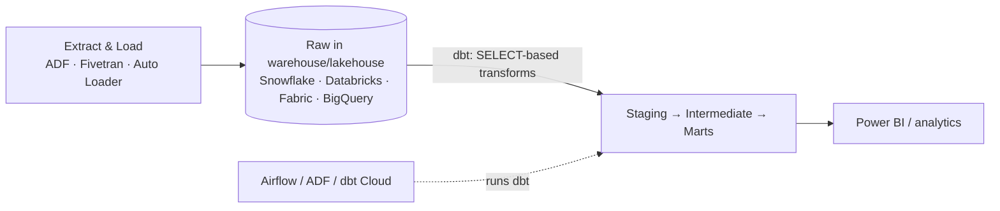

# dbt (data build tool) — Learning Path

**dbt** is the tool that brought software-engineering discipline to the **T (transform)** in ELT. You write transformations as **SQL SELECT statements**, and dbt turns them into tables/views, in the right dependency order, with **built-in testing, documentation, and lineage**. It's one of the most in-demand skills in modern data-engineering job specs — and it was entirely absent from this repo until now.

This module builds on [SQL](../02_Databases/SQL/01_What_is_SQL.md), [ETL/ELT](../06_Data_Engineering/ETL_ELT/01_ETL_vs_ELT.md), and [Data Modeling](../02_Databases/Data_Modeling/00_Data_Modeling_Learning_Path.md).

---

## Why dbt exists

Before dbt, warehouse transformations were a mess of hand-written, undocumented, untested SQL scripts run in a fragile order by hand or by a scheduler. dbt fixed that by treating **analytics code like software**:

- **Version control** — models live in Git.
- **Modularity** — build big models from small, reusable ones with `ref()`.
- **Testing** — assert `not_null`, `unique`, relationships — automatically.
- **Documentation & lineage** — auto-generated docs and a DAG of every model.
- **DRY** — Jinja macros eliminate copy-paste SQL.

This is often called **"analytics engineering"** — the discipline dbt created.

---

## Where dbt fits (it does the T, nothing else)

dbt **does not extract or load** and **does not have its own compute** — it **pushes SQL down** to your warehouse/lakehouse, which does the work. It's the transformation-authoring and quality layer, orchestrated by something else.

---

## Reading order

| # | File | What you'll learn |
|---|------|-------------------|
| 01 | [What is dbt](01_What_is_dbt.md) | The problem it solves, dbt Core vs Cloud, ELT-T, project anatomy |
| 02 | [Models & refs](02_Models_and_Refs.md) | Models, `ref()`/`source()`, materializations, the model DAG |
| 03 | [Tests & Documentation](03_Tests_and_Documentation.md) | Generic & singular tests, docs, lineage graph |
| 04 | [Snapshots, Seeds & Macros](04_Snapshots_Seeds_Macros.md) | SCD2 via snapshots, seeds, Jinja macros, packages |
| 05 | [dbt in Azure](05_dbt_in_Azure.md) | dbt with Databricks, Fabric, Synapse, Snowflake; orchestration |
| — | [Interview Questions & Answers](Interview_Questions_and_Answers.md) | Test yourself across the module |

---

## The mental model

> **dbt = SQL + software engineering.** You write `SELECT`s; dbt handles dependencies, materialization, testing, docs, and lineage.

If you can write SQL ([Phase 1](../ROADMAP.md)), you can learn dbt quickly — and it makes your [Gold layer](../05_Storage_and_Formats/Lakehouse/03_Lakehouse_Architecture.md) transformations tested and documented, a big upgrade for your [portfolio projects](../18_Projects/05_Portfolio_and_GitHub_Presentation.md).

Start here: **[01 — What is dbt](01_What_is_dbt.md)**.

## Further Learning — Docs & Videos
- dbt documentation: https://docs.getdbt.com/
- dbt fundamentals course (free): https://learn.getdbt.com/
- Video — dbt crash course: https://www.youtube.com/results?search_query=dbt+data+build+tool+crash+course
