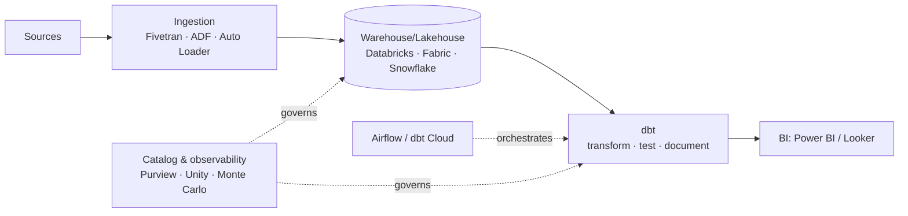

# dbt in Azure & the Modern Stack

## Where dbt runs in an Azure data platform

dbt needs a **SQL-speaking compute engine** to push its transformations down to. In the Azure/modern world, that's usually **Databricks**, **Microsoft Fabric**, **Synapse**, or **Snowflake**. dbt is the transformation-authoring layer on top; the platform does the work.

Analogy: dbt is a **universal remote** — the same buttons (models, tests, refs) control very different TVs (Databricks, Fabric, Snowflake). You learn the remote once; only the **adapter** in the back changes per TV.

---

## The adapter model

dbt connects to each platform through an **adapter** — a plugin that translates dbt's compiled SQL into that platform's dialect:

| Platform | Adapter | Notes |
|---|---|---|
| **Databricks** | `dbt-databricks` | Runs on a SQL Warehouse / cluster; builds **Delta** tables — the common Azure lakehouse choice |
| **Microsoft Fabric** | `dbt-fabric` | Targets Fabric Warehouse / Lakehouse SQL endpoint |
| **Synapse** | `dbt-synapse` | Dedicated/serverless SQL pools |
| **Snowflake** | `dbt-snowflake` | Extremely popular pairing outside Azure-only shops |
| **Postgres / SQL Server** | `dbt-postgres` / `dbt-sqlserver` | Smaller-scale / on-prem |

Your models are (mostly) **portable** across these — the same `SELECT` logic, a different `profiles.yml` connection. That portability is a big part of dbt's appeal.

---

## dbt on Databricks (the flagship Azure combo)

`dbt-databricks` runs your models against a **Databricks SQL Warehouse** (or cluster), materializing them as **Delta tables** in Unity Catalog. This gives you:
- dbt's testing/docs/lineage **plus** Delta's ACID, time travel, and `MERGE` ([Delta](../05_Storage_and_Formats/Lakehouse/01_Delta_Lake.md)).
- Incremental models compiled to Delta `MERGE` under the hood.
- Governance via [Unity Catalog](../08_Databricks/04_Unity_Catalog.md).

A very common real architecture: **Auto Loader / ADF loads Bronze & Silver → dbt builds the Gold marts (tested & documented) → Power BI**. dbt owns the "business logic" layer; Databricks owns ingestion and compute.

---

## Orchestrating dbt (dbt doesn't schedule itself, mostly)

`dbt run` is a command — something has to run it on a schedule:

| Orchestrator | How |
|---|---|
| **dbt Cloud** | Built-in scheduler + CI (the easy path) |
| **Airflow** | `BashOperator`/`DbtCloudRunJobOperator`/**Cosmos** — dbt as tasks in a DAG ([Airflow](../11_Orchestration/04_Apache_Airflow.md)) |
| **ADF** | Run dbt in a container/Batch or trigger dbt Cloud via its API ([ADF](../11_Orchestration/02_ADF_Orchestration.md)) |
| **Databricks Workflows** | A native **dbt task** type runs your project as a job task ([Workflows](../11_Orchestration/03_Databricks_Workflows.md)) |

The clean mental model from [Orchestration](../11_Orchestration/01_Orchestration_Fundamentals.md) holds: the orchestrator **schedules**, dbt **transforms**.

---

## dbt vs Spark/PySpark — when each?

A frequent interview and design question:

| | **dbt (SQL)** | **PySpark** |
|---|---|---|
| Language | SQL | Python/Scala |
| Best for | In-warehouse set-based transforms, marts, business logic | Complex/custom logic, ML, unstructured data, huge-scale ETL |
| Compute | Pushed down to the warehouse | Spark cluster |
| Strength | Testing, docs, lineage, simplicity | Flexibility, non-SQL processing |

They **coexist**: PySpark for heavy ingestion and complex Bronze/Silver processing, **dbt for the SQL-friendly Gold/marts layer** where testing and documentation matter most. "Use both" is the mature answer.

---

## dbt in the modern data stack

dbt is the transformation centerpiece of the **"modern data stack"**:

Recognizing this stack — and where dbt sits in it — is exactly the kind of architecture fluency senior interviews look for.

---

## Interview-grade Q&A

- *What does dbt need to run?* A SQL compute engine (Databricks, Fabric, Synapse, Snowflake, Postgres…) it connects to via an **adapter**; dbt pushes SQL down, it has no compute of its own.
- *How does dbt work with Databricks?* Via `dbt-databricks`, running models against a SQL Warehouse/cluster and materializing **Delta** tables (incrementals compile to `MERGE`).
- *How do you schedule dbt?* dbt Cloud's scheduler, or an orchestrator — Airflow, ADF, or a Databricks Workflows **dbt task**.
- *dbt vs PySpark — when each?* dbt for SQL-based in-warehouse marts with testing/docs; PySpark for complex, custom, non-SQL, or ML-scale processing — commonly used together.
- *Are dbt models portable across platforms?* Largely yes — same SQL/model logic, different adapter + connection profile; some dialect-specific tweaks may be needed.
- *Where does dbt sit in the modern data stack?* The transformation + testing + documentation layer between raw-loaded data and BI, orchestrated externally and governed by a catalog.

---

## Further Learning — Docs & Videos
- dbt-databricks adapter: https://docs.getdbt.com/docs/core/connect-data-platform/databricks-setup
- dbt with Microsoft Fabric: https://learn.microsoft.com/fabric/data-warehouse/generate-dbt
- dbt + Airflow (Cosmos): https://www.astronomer.io/docs/learn/airflow-dbt/
- Video — dbt on Databricks: https://www.youtube.com/results?search_query=dbt+on+databricks+tutorial
