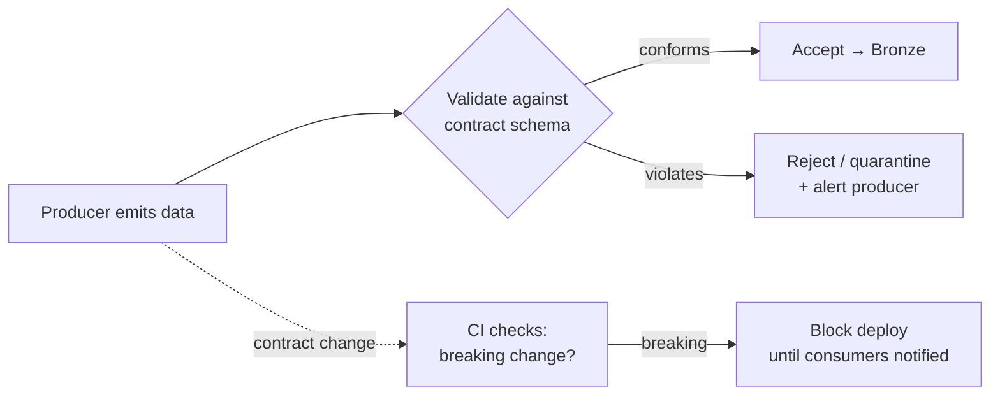

# Data Contracts

## What is a data contract?

A data contract is an **explicit, enforced agreement** between the **producer** of data (an app team, a source system) and its **consumers** (your pipelines, analysts) about the data's **schema, semantics, quality, and SLAs**. It turns an informal "we send you some JSON" into a versioned, testable **API for data**.

Analogy: a data contract is the **nutrition label + ingredients list** legally required on food. Before contracts, the producer could change the recipe (add an allergen, drop a vitamin) without telling anyone, and consumers discovered it the hard way. The contract forces the producer to **declare** what's inside and **warn before changing it** — so consumers aren't silently poisoned.

---

## The problem contracts solve

The most common way data pipelines break isn't your code — it's **upstream change you didn't know about**:
- An app team **renames `user_id` to `userId`** → your join silently produces nulls.
- They **change `amount` from dollars to cents** → every revenue number is 100× off, and it *looks valid*.
- They **drop a column** → a downstream dashboard errors at 6 AM.

None of these are caught by *your* tests, because your code is fine — the **input changed**. Contracts make the producer **accountable** for the interface and give you a tripwire when it changes.

---

## What's in a contract

| Element | Example |
|---|---|
| **Schema** | Field names, types, nullability |
| **Semantics** | "`amount` is USD, net of discount"; "`status` ∈ {placed, shipped, …}" |
| **Quality guarantees** | "`order_id` is unique and non-null"; "≤ 0.1% nulls in `email`" |
| **SLA** | "delivered hourly; ≤ 15-min lateness" |
| **Versioning & change policy** | "breaking changes require a major version + 30-day notice" |
| **Ownership** | Who to contact; who's responsible |

A contract is often a **YAML/JSON file in version control**, reviewed like code.

---

## How contracts are enforced

A contract is only useful if it's **checked automatically**, not just documented:

Enforcement points:
- **Schema validation on ingest** — reject/quarantine data that doesn't match the agreed schema ([quality testing](02_Data_Quality_Testing.md)).
- **CI checks on the producer side** — a schema registry or contract test **fails the producer's build** if they make a breaking change without bumping the version.
- **Schema registry** (e.g., for [Kafka/Event Hubs](../09_Streaming/03_Apache_Kafka.md)) enforcing compatibility on streaming topics.

---

## Schema evolution & compatibility

Contracts formalize **what kinds of change are safe**:

| Change | Compatibility | Safe? |
|---|---|---|
| Add an optional field | Backward-compatible | ✅ usually fine |
| Remove a field / rename | Breaking | ❌ needs a new version + notice |
| Widen a type (int→long) | Backward-compatible | ✅ often fine |
| Narrow a type / change meaning | Breaking | ❌ dangerous (the "cents" bug) |

This is the same compatibility thinking behind [Avro schema evolution](../05_Storage_and_Formats/File_Formats/03_Avro.md) and Delta schema enforcement — contracts apply it at the **organizational** level, not just the file level.

---

## Where contracts fit in the modern stack

Data contracts are a **2023+ hot topic** because the "shift-left" idea — catch data problems at the **source**, not three layers downstream — is how mature orgs stop playing whack-a-mole. They complement, not replace, [data quality testing](02_Data_Quality_Testing.md) and [observability](../12_Monitoring_and_Observability/04_Data_Observability.md): contracts **prevent** bad interfaces, quality tests **catch** bad values, observability **detects** anything that slips through. Mentioning contracts signals you're current with modern practice.

---

## Interview-grade Q&A

- *What is a data contract?* An explicit, enforced, versioned agreement between data producers and consumers covering schema, semantics, quality, and SLAs — an "API for data."
- *What problem do they solve?* Silent upstream changes (renamed/dropped columns, changed units) that break consumers even though consumer code is correct.
- *What's in a contract?* Schema (names/types/nullability), semantics, quality guarantees, SLA, versioning/change policy, and ownership.
- *How are contracts enforced?* Schema validation on ingest (reject/quarantine), CI checks that block breaking producer changes, and schema registries for streaming.
- *What's a breaking vs non-breaking change?* Adding optional fields/widening types is backward-compatible; renaming/removing fields or changing meaning/type is breaking and needs a version bump + notice.
- *How do contracts relate to quality tests and observability?* Contracts prevent bad interfaces (shift-left), quality tests catch bad values, observability detects the rest — layered defense.

---

## Further Learning — Docs & Videos
- Data contracts explained: https://www.datacontract.com/
- Data contracts (dbt Labs / industry): https://www.getdbt.com/blog/data-contracts
- Schema registry (Confluent): https://docs.confluent.io/platform/current/schema-registry/index.html
- Video — data contracts explained: https://www.youtube.com/results?search_query=data+contracts+explained+data+engineering
