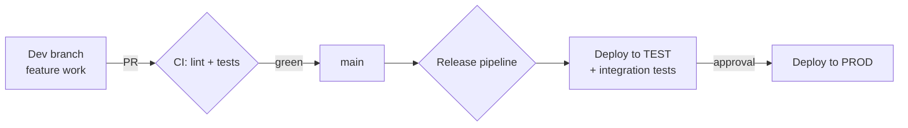

# CI/CD for ADF & Databricks

## Where this fits

[DataOps & CI/CD for Data](04_DataOps_and_CICD_for_Data.md) explained **why** you deploy data platforms from Git and **what** a data CI pipeline runs. This note is the concrete **how** for the two tools an Azure DE actually deploys: **Azure Data Factory** and **Azure Databricks** (via **Asset Bundles**). This is the gap between "I know CI/CD matters" and "I have wired up a release pipeline" — exactly what a senior interview digs into.

Analogy: note 04 is the *blueprint* of the factory's assembly line; this note is the *wiring diagram* — the actual cables, branches, and buttons that move a change from your laptop to production.

---

## The shared mental model

Every data asset lives in **Git**, and a pipeline promotes it **dev → test → prod** with **per-environment parameters** so the *same code* points at different workspaces/storage.



The two things that change per environment: **connections/linked services** (which storage, which SQL) and **compute targets** (which workspace/cluster). Everything else is identical code. Parameterization is the whole game.

---

## Part 1 — Azure Data Factory CI/CD

ADF is JSON under the hood (pipelines, datasets, linked services, triggers). Two ways to ship it:

### Option A — the classic "adf_publish" (ARM) flow
1. Connect the **dev** ADF to a Git repo (collaboration branch = `main`). You author in dev; nothing auto-deploys.
2. Click **Publish** in the dev ADF → it generates **ARM templates** into the `adf_publish` branch (`ARMTemplateForFactory.json` + parameters).
3. A **release pipeline** (Azure DevOps / GitHub Actions) deploys that ARM template to **test**, then **prod**, overriding values via **ARM template parameters** (or **global parameters**) — e.g. the storage URL and Key Vault name per environment.
4. **Stop triggers → deploy → restart triggers** (a required pre/post step, or the deploy fails on active triggers). Microsoft ships a `PrePostDeploymentScript.ps1` for exactly this.

```yaml
# azure-pipelines.yml (excerpt) — deploy ADF ARM to an environment
- task: AzureResourceManagerTemplateDeployment@3
  inputs:
    deploymentScope: 'Resource Group'
    resourceGroupName: 'rg-data-$(env)'
    csmFile: '$(Pipeline.Workspace)/adf_publish/ARMTemplateForFactory.json'
    csmParametersFile: '$(Pipeline.Workspace)/adf_publish/ARMTemplateParametersForFactory.json'
    overrideParameters: >
      -factoryName adf-$(env)
      -ls_adls_properties_typeProperties_url https://sa$(env).dfs.core.windows.net
```

### Option B — the newer npm/`ADFUtilities` validation flow
Validate and export the ARM template **in CI from the repo** (via the `@microsoft/azure-data-factory-utilities` npm package) instead of clicking Publish — so validation runs on every PR, not manually. Preferred for mature teams.

**Golden rules:** author only in **dev**; never edit test/prod ADF by hand; keys/secrets come from **Key Vault** referenced in linked services, never hard-coded in JSON.

---

## Part 2 — Databricks CI/CD with Asset Bundles

**Databricks Asset Bundles (DABs)** are the modern, first-party way to package notebooks/jobs/DLT pipelines/cluster config **as code** and deploy them per environment. A bundle is a `databricks.yml` describing resources + **targets** (dev/prod).

```yaml
# databricks.yml
bundle:
  name: northwind-medallion

resources:
  jobs:
    medallion_batch:
      name: "Medallion Batch (${bundle.target})"
      tasks:
        - task_key: bronze
          notebook_task: { notebook_path: ./src/01_bronze.py }
        - task_key: silver
          depends_on: [{ task_key: bronze }]
          notebook_task: { notebook_path: ./src/02_silver.py }
        - task_key: gold
          depends_on: [{ task_key: silver }]
          notebook_task: { notebook_path: ./src/03_gold.py }

targets:
  dev:
    mode: development        # prefixes objects with your user, pauses schedules
    workspace: { host: https://adb-dev.azuredatabricks.net }
  prod:
    mode: production
    workspace: { host: https://adb-prod.azuredatabricks.net }
    run_as: { service_principal_name: sp-data-prod }
```

Deploy from CI:

```bash
databricks bundle validate            # schema + reference checks
databricks bundle deploy -t dev       # push notebooks + create/update the job
databricks bundle run medallion_batch -t dev   # optional: run it
# after approval:
databricks bundle deploy -t prod
```

- `mode: development` namespaces objects per user and **pauses schedules** — safe to iterate. `mode: production` deploys the real, scheduled job, typically **run as a service principal** (not a person).
- Auth in CI uses a **service principal** + OAuth (or Entra ID token), stored as pipeline secrets — never a personal access token in a shared pipeline.
- **dbt** deploys alongside via its own `target`s ([dbt in Azure](../13_dbt/05_dbt_in_Azure.md)); **Terraform** provisions the workspaces/storage the bundle deploys into.

---

## A minimal GitHub Actions CI

```yaml
# .github/workflows/ci.yml
on: { pull_request: { branches: [main] } }
jobs:
  test:
    runs-on: ubuntu-latest
    steps:
      - uses: actions/checkout@v4
      - uses: actions/setup-python@v5
        with: { python-version: '3.11' }
      - run: pip install -r requirements.txt
      - run: ruff check .                 # lint
      - run: pytest tests/ -q             # unit tests (chispa/pytest)
      - run: databricks bundle validate   # bundle is well-formed
```

CI **gates the PR** (lint + unit tests + bundle validation); merge to `main` triggers the **CD** workflow that runs `bundle deploy` / ADF ARM deploy to test, then prod behind an **approval**. See [Testing Data Pipelines](01_Testing_Data_Pipelines.md) for the tests themselves.

---

## What breaks (and the fix)

| Problem | Fix |
|---|---|
| ADF deploy fails: "trigger is active" | Run the **stop-triggers** pre-step; restart them post-deploy |
| Prod ADF has changes that vanish on next deploy | Someone edited **prod by hand** — author only in dev; prod is deploy-only |
| Secrets/URLs baked into JSON or notebooks | Parameterize: ADF **global/ARM parameters** + **Key Vault**; bundle **variables** per target |
| Databricks job "works in dev, wrong data in prod" | Per-**target** workspace/catalog wasn't overridden — check `targets:` and variables |
| CI uses a personal token that expires/leaves with an employee | Use a **service principal** with OAuth; store as pipeline secrets |
| Notebook deployed but no tests ran | Add `pytest` + `bundle validate` as **required** PR checks (branch protection) |

---

## Interview-grade Q&A

- *How do you do CI/CD for ADF?* Author in **dev** (Git-integrated), **Publish** to generate ARM templates on `adf_publish` (or export via the ADFUtilities npm task in CI), then a **release pipeline** deploys ARM to test/prod with **ARM/global parameters** per env and **stop/start triggers** around the deploy.
- *What are Databricks Asset Bundles?* The first-party way to define jobs/notebooks/DLT/cluster config as code in `databricks.yml` with per-environment **targets**, deployed via `databricks bundle deploy` — reproducible, versioned Databricks deployments.
- *development vs production bundle mode?* `development` namespaces objects per user and pauses schedules for safe iteration; `production` deploys the real scheduled job, usually **run as a service principal**.
- *How do you parameterize across environments?* ADF global/ARM parameters + Key Vault; bundle variables per target; dbt targets — the same code, different workspace/storage/catalog.
- *Why must you author ADF only in dev?* Test/prod are **deploy-only**; hand edits there are overwritten on the next release and aren't in Git — breaking reproducibility.
- *How does CI authenticate to Databricks?* A **service principal** with OAuth/Entra token stored as a pipeline secret — never a personal access token in a shared pipeline.
- *What gates a merge?* Branch protection requiring green CI: lint, unit tests (chispa/pytest), `bundle validate`, and data-quality checks.

---

## Further Learning — Docs & Videos
- ADF continuous integration & delivery: https://learn.microsoft.com/azure/data-factory/continuous-integration-delivery
- Databricks Asset Bundles: https://learn.microsoft.com/azure/databricks/dev-tools/bundles/
- CI/CD for Databricks with bundles: https://learn.microsoft.com/azure/databricks/dev-tools/bundles/ci-cd
- Video — Databricks Asset Bundles: https://www.youtube.com/results?search_query=databricks+asset+bundles+ci+cd
