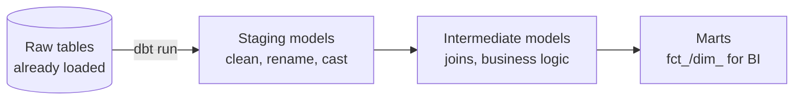

# What is dbt?

## What is dbt?

dbt (**data build tool**) is a transformation framework that lets you build your warehouse/lakehouse tables using **plain SQL `SELECT` statements**, while it handles the engineering around them: **dependency ordering, materialization, testing, documentation, and lineage**.

Analogy: dbt is a **smart kitchen assistant for a recipe book**. You (the chef) write each recipe as a simple instruction ("combine these into a sauce"). The assistant figures out that the sauce must be made *before* the pasta dish that uses it (dependencies), decides whether to make a fresh batch or reuse yesterday's (materialization), **tastes each dish against a checklist** (tests), and keeps the **recipe book updated with a flow chart** of what depends on what (docs + lineage). You focus on the cooking (SQL); the assistant runs the kitchen.

---

## The problem dbt solves

Traditional warehouse transformation was:
- Hundreds of `.sql` scripts run in a **hand-maintained order** (break the order → wrong results).
- **No tests** — nobody knew a value went null until a dashboard broke.
- **No docs** — "what does `fct_v2_final_FINAL` mean?" No one remembered.
- **Copy-pasted SQL** everywhere — fix a bug in one place, miss it in ten.

dbt replaces that with a **version-controlled project** where models declare their dependencies, tests run automatically, and docs/lineage generate themselves. This discipline is called **analytics engineering**.

---

## dbt is the "T" in ELT

dbt assumes data is **already loaded raw** into the warehouse (the E and L done by ADF, Fivetran, Auto Loader, etc.), then transforms it **in place** using the warehouse's own compute:



Crucially, **dbt has no compute of its own** — it **compiles your SQL and pushes it down** to Snowflake / Databricks / Fabric / BigQuery / Postgres, which does the heavy lifting. dbt is the *authoring, testing, and orchestration-of-SQL* layer. See [ETL vs ELT](../05_Data_Engineering/ETL_ELT/01_ETL_vs_ELT.md).

---

## dbt Core vs dbt Cloud

| | **dbt Core** | **dbt Cloud** |
|---|---|---|
| What | Free, open-source CLI | Hosted SaaS on top of Core |
| Runs | Your machine / your orchestrator | Managed scheduler + web IDE |
| Adds | — | Scheduling, IDE, docs hosting, CI, RBAC |
| Cost | Free | Paid (free developer tier) |

Learn **dbt Core** (the engine everyone shares); dbt Cloud just wraps convenience around it.

---

## Anatomy of a dbt project

```
my_project/
├── dbt_project.yml          # project config
├── models/
│   ├── staging/
│   │   ├── stg_orders.sql    # a model = one SELECT
│   │   └── _sources.yml      # declares raw source tables + tests
│   ├── marts/
│   │   ├── fct_sales.sql
│   │   └── dim_customer.sql
│   └── schema.yml            # model docs + tests
├── snapshots/                # SCD2 (see file 04)
├── seeds/                    # small CSVs loaded as tables
├── macros/                   # reusable Jinja SQL
└── tests/                    # custom singular tests
```

The **model** is the atom of dbt: a `.sql` file containing one `SELECT`. Its filename becomes the table/view name. That's the whole idea — everything else is engineering around SELECTs.

---

## A first model

`models/marts/fct_sales.sql`:

```sql
{{ config(materialized='table') }}

select
    o.order_id,
    o.customer_id,
    o.order_date,
    o.amount,
    c.region
from {{ ref('stg_orders') }} o        -- ref() = depend on another model
left join {{ ref('stg_customers') }} c
    on o.customer_id = c.customer_id
where o.amount >= 0
```

The `{{ ref('stg_orders') }}` is the magic: it tells dbt "this model depends on `stg_orders`," so dbt builds them **in the right order** and draws the **lineage** automatically — no manual sequencing. Covered next in [Models & refs](02_Models_and_Refs.md).

---

## Interview-grade Q&A

- *What is dbt?* A SQL-based transformation framework that adds software engineering — dependency ordering, materialization, testing, docs, and lineage — to warehouse/lakehouse transforms.
- *Where does dbt sit in ELT?* It's the **T**: it transforms data already loaded (raw) in the warehouse, using the warehouse's compute; it doesn't extract or load.
- *Does dbt have its own compute?* No — it compiles SQL and **pushes it down** to the underlying platform (Snowflake/Databricks/Fabric/BigQuery).
- *dbt Core vs Cloud?* Core is the free open-source CLI/engine; Cloud is a hosted layer adding scheduling, an IDE, docs hosting, and CI.
- *What is a dbt model?* A single `.sql` file with one `SELECT`; its filename becomes the resulting table/view.
- *What is "analytics engineering"?* Applying software practices (version control, testing, modularity, docs) to analytics transformations — the discipline dbt popularized.

---

## Further Learning — Docs & Videos
- What is dbt? (docs): https://docs.getdbt.com/docs/introduction
- dbt Core vs Cloud: https://docs.getdbt.com/docs/cloud/about-cloud/dbt-cloud-features
- Video — dbt explained: https://www.youtube.com/results?search_query=what+is+dbt+data+build+tool
