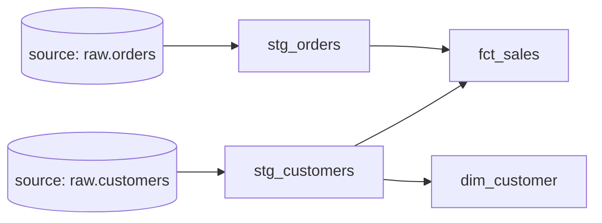

# dbt Models, refs & Materializations

## Models — the atom of dbt

A **model** is a single `.sql` file containing one `SELECT`. When you run `dbt run`, dbt wraps that SELECT in the right `CREATE TABLE AS` / `CREATE VIEW AS` and builds it in your warehouse. The **filename is the object name** (`stg_orders.sql` → a `stg_orders` relation).

You never write `CREATE TABLE` yourself — you write the *query that defines the data*, and dbt handles the DDL. This is the core productivity win.

---

## `source()` and `ref()` — how dbt learns the DAG

Two functions wire your models together and let dbt compute the dependency graph automatically:

- **`source()`** — points at a **raw table** loaded by your EL tool, declared in a `_sources.yml`:

```yaml
# models/staging/_sources.yml
sources:
  - name: raw
    schema: raw_data
    tables:
      - name: orders
      - name: customers
```

```sql
-- models/staging/stg_orders.sql
select
    order_id,
    customer_id,
    cast(order_date as date) as order_date,
    cast(amount as decimal(12,2)) as amount
from {{ source('raw', 'orders') }}
```

- **`ref()`** — points at **another model**:

```sql
-- models/marts/fct_sales.sql
select * from {{ ref('stg_orders') }}
```

Because every dependency is expressed as `ref()`/`source()`, dbt builds a **DAG** and runs models in the correct order — no manual sequencing, ever. This is dbt's single most important idea.



---

## Why `ref()` instead of hardcoding table names?

`ref()` isn't just for ordering — it also makes your project **environment-portable**. dbt resolves `ref('stg_orders')` to the *correct* fully-qualified name for the current environment (dev schema vs prod schema, different databases). Hardcoding `analytics.stg_orders` breaks the moment you run in dev. `ref()` gives you free dev/prod isolation.

---

## Materializations — how a model becomes physical

The **materialization** decides *what* dbt builds from your SELECT. Set it with `{{ config(materialized='…') }}` or in `dbt_project.yml`:

| Materialization | dbt builds | Use when |
|---|---|---|
| **view** (default) | A `VIEW` | Lightweight, always-fresh, cheap to store; small/fast logic |
| **table** | A full `TABLE`, rebuilt each run | Expensive queries you don't want to recompute on read |
| **incremental** | A table, but only **new/changed rows** appended/merged each run | Large, append-heavy fact tables — avoid rebuilding billions of rows |
| **ephemeral** | Not built at all — **inlined** as a CTE into models that ref it | Reusable logic you don't need as its own object |

### Incremental models (the one that matters at scale)

```sql
{{ config(materialized='incremental', unique_key='order_id') }}

select * from {{ ref('stg_orders') }}

    where order_date > (select max(order_date) from {{ this }})   -- only new rows

```

On the first run it builds everything; on later runs, `is_incremental()` is true and it processes only new rows, MERGE-ing on `unique_key`. This is dbt's answer to the same incremental-load problem you solved manually in [Project 1](../11_Projects/02_Project_1_Batch_Medallion_Pipeline.md).

---

## The layered modeling convention

dbt projects follow a standard layering that mirrors the [medallion architecture](../05_Storage_and_Formats/Lakehouse/03_Lakehouse_Architecture.md):

| Layer | Prefix | Job |
|---|---|---|
| **Staging** | `stg_` | One model per source table — rename, cast, light cleaning (≈ Silver) |
| **Intermediate** | `int_` | Joins and business logic, not exposed to BI |
| **Marts** | `fct_` / `dim_` | Final star-schema tables for consumption (≈ Gold) |

This convention keeps large projects navigable and is expected knowledge on the job. It's [dimensional modeling](../02_Databases/Data_Modeling/03_Dimensional_Modeling.md) expressed in dbt.

---

## Running & selecting models

```bash
dbt run                          # build all models
dbt run --select stg_orders      # just one
dbt run --select stg_orders+     # that model and everything downstream
dbt run --select +fct_sales      # fct_sales and everything upstream
dbt build                        # run + test + snapshot + seed, in DAG order
```

The `+` graph selectors (upstream/downstream) are used constantly — e.g., "rebuild everything affected by this staging change."

---

## Interview-grade Q&A

- *What does `ref()` do?* Declares a dependency on another model so dbt builds in the right order, and resolves to the environment-correct table name (dev/prod portability).
- *`source()` vs `ref()`?* `source()` points at raw loaded tables (declared in YAML); `ref()` points at other dbt models.
- *Name the materializations and when to use each.* View (default, cheap/fresh), table (rebuilt, for expensive logic), incremental (only new rows, for large facts), ephemeral (inlined CTE).
- *How does an incremental model work?* First run builds all; later runs use `is_incremental()` to filter to new rows and MERGE on `unique_key`.
- *What are staging/intermediate/marts?* The standard dbt layering: stg_ (clean per-source), int_ (business logic), fct_/dim_ (final marts) — mirrors medallion.
- *How does dbt know the build order?* From the `ref()`/`source()` graph it compiles into a DAG.

---

## Further Learning — Docs & Videos
- dbt models: https://docs.getdbt.com/docs/build/models
- Materializations: https://docs.getdbt.com/docs/build/materializations
- Incremental models: https://docs.getdbt.com/docs/build/incremental-models
- Video — dbt models & refs: https://www.youtube.com/results?search_query=dbt+models+ref+materializations
