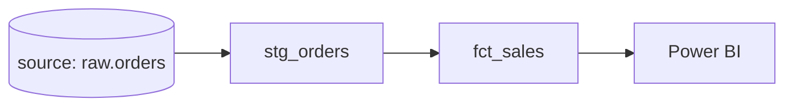

# dbt Tests & Documentation

## Why this is dbt's killer feature

Anyone can write SQL that transforms data. What makes dbt beloved is that it makes **testing and documenting** that data *easy and automatic* — the two things hand-written SQL pipelines almost always skip. This is where dbt turns "some SQL scripts" into a trustworthy data product, and it's exactly the [data quality](../06_Data_Engineering/Data_Quality/01_Data_Quality_Fundamentals.md) and [observability](../13_Monitoring_and_Observability/04_Data_Observability.md) discipline made effortless.

---

## Two kinds of tests

### 1. Generic tests (declarative, one line each)

Attach built-in tests to columns in a YAML file. dbt runs them as SQL and fails if any row violates them:

```yaml
# models/marts/schema.yml
models:
  - name: fct_sales
    columns:
      - name: order_id
        tests:
          - unique                 # no duplicate order_ids
          - not_null               # never null
      - name: customer_id
        tests:
          - not_null
          - relationships:         # every customer_id exists in dim_customer
              to: ref('dim_customer')
              field: customer_id
      - name: status
        tests:
          - accepted_values:
              values: ['placed', 'shipped', 'delivered', 'cancelled']
```

The four built-ins — **`unique`, `not_null`, `relationships`, `accepted_values`** — cover a huge share of real data-quality checks. `relationships` is a **referential-integrity test** the warehouse itself doesn't enforce.

### 2. Singular tests (custom SQL)

Any business rule you can express as "a query that should return **zero rows**":

```sql
-- tests/assert_no_future_orders.sql
select order_id
from {{ ref('fct_sales') }}
where order_date > current_date        -- any row here = test failure
```

If the query returns rows, the test fails. This handles the arbitrary rules generic tests can't.

---

## Running tests

```bash
dbt test                          # run all tests
dbt test --select fct_sales       # tests for one model
dbt build                         # run + test together, in DAG order (recommended)
```

Wire `dbt build` into [CI/CD](../07_DevOps/Git_GitHub/09_Production_Best_Practices_and_CICD.md) so a pull request that would break data-quality **fails the build before it merges** — this is the heart of [DataOps](../15_Testing_and_DataOps/00_Testing_and_DataOps_Learning_Path.md). Extend built-ins with the **dbt-utils** and **dbt-expectations** packages for dozens more tests (row counts, ranges, freshness).

---

## Source freshness testing

dbt can also check that your **raw sources** are up to date — catching a stalled upstream feed before you build on stale data:

```yaml
sources:
  - name: raw
    tables:
      - name: orders
        loaded_at_field: _loaded_at
        freshness:
          warn_after:  {count: 12, period: hour}
          error_after: {count: 24, period: hour}
```

```bash
dbt source freshness
```

This is the **freshness pillar** of [data observability](../13_Monitoring_and_Observability/04_Data_Observability.md), built into dbt.

---

## Documentation & lineage — generated for free

You describe models and columns once, in YAML:

```yaml
models:
  - name: fct_sales
    description: "One row per order line. Grain: order_id. Source of truth for revenue."
    columns:
      - name: amount
        description: "Line amount in USD, net of discounts."
```

Then:

```bash
dbt docs generate     # build the docs site
dbt docs serve        # view it locally
```

You get a **searchable documentation website** *and* an interactive **lineage graph (DAG)** showing how every source flows through every model to every mart — auto-generated from your `ref()`/`source()` calls. No separate diagramming, always in sync with the code.



Auto lineage is a genuine superpower: during an incident you instantly see a model's **upstream** cause and **downstream** blast radius ([observability](../13_Monitoring_and_Observability/04_Data_Observability.md)).

---

## Interview-grade Q&A

- *What testing does dbt provide out of the box?* Generic tests — `unique`, `not_null`, `relationships`, `accepted_values` — declared in YAML, plus custom **singular tests** (SQL returning zero rows on success).
- *What is the `relationships` test?* A referential-integrity check that every value in a column exists in a referenced model/column — enforcing FK-like integrity the warehouse doesn't.
- *How do you test an arbitrary business rule?* A singular test: write a SELECT that returns rows only when the rule is violated.
- *How does dbt help with documentation and lineage?* `dbt docs generate` builds a searchable docs site and an auto-generated lineage DAG from `ref()`/`source()` — always in sync with the code.
- *What is `dbt source freshness`?* A check that raw sources have loaded recently (warn/error thresholds) — the freshness pillar of observability.
- *How does dbt fit CI/CD?* Run `dbt build` (run + test) in the pipeline so a PR that breaks data quality fails before merge.

---

## Further Learning — Docs & Videos
- dbt tests: https://docs.getdbt.com/docs/build/data-tests
- dbt documentation: https://docs.getdbt.com/docs/build/documentation
- Source freshness: https://docs.getdbt.com/docs/build/sources#snapshotting-source-data-freshness
- Video — dbt tests & docs: https://www.youtube.com/results?search_query=dbt+tests+and+documentation
