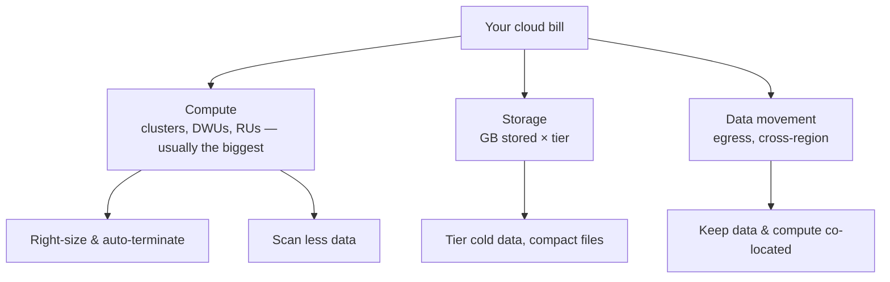

# Cost & Performance (FinOps) — Learning Path

Anyone can make a query *run*. A data engineer makes it run **fast and cheap**. Cloud bills are metered by the second, and a careless pipeline can cost 10× what a careful one does for the *same result*. **Cost and performance optimization** is a core, promotable skill — and a Phase 7 🔜 gap the [ROADMAP](../ROADMAP.md) flagged.

Builds on [PySpark Performance](../03_Programming/PySpark/14_Performance_and_Best_Practices.md), [Storage](../05_Storage_and_Formats/Data_Storage/01_Data_Lake_vs_Warehouse_vs_Database.md), and [Databricks](../08_Databricks/03_Clusters_and_Compute.md).

---

## Why cost is an engineering skill, not an afterthought

- Cloud cost is a **direct result of engineering choices** — cluster size, file layout, partition strategy, how much data a query scans. You control the bill.
- "It works" isn't done; "it works, fast, at reasonable cost" is done. Senior interviews and performance reviews probe this.
- **Performance and cost are usually the same problem**: a faster query uses less compute-time, which costs less. Optimize once, win twice.

---

## FinOps in one idea

**FinOps** = bringing financial accountability to cloud spend: **visibility** (know what costs what), **optimization** (cut waste), and **governance** (budgets, alerts, ownership). For a data engineer it mostly means: right-size compute, minimize data scanned, and don't leave things running.

---

## Reading order

| # | File | What you'll learn |
|---|------|-------------------|
| 01 | [Cost Fundamentals (FinOps)](01_Cost_Fundamentals_FinOps.md) | How cloud billing works, the cost levers, budgets & alerts |
| 02 | [Storage & Query Cost](02_Storage_and_Query_Cost.md) | ADLS tiers, partitioning/pruning, Synapse DWU, Cosmos RU, file sizing |
| 03 | [Performance Optimization](03_Performance_Optimization.md) | Shuffle, skew, caching, broadcast, Z-order — the speed levers |
| — | [Interview Questions & Answers](Interview_Questions_and_Answers.md) | Test yourself across the module |

> **Databricks & Spark cost optimization** (DBUs, cluster sizing, spot, Photon) now lives in the [Databricks module (08)](../08_Databricks/10_Databricks_Cost_Optimization.md), with the rest of the platform. It's the biggest single lever on most Azure DE bills — read it alongside this module.

---

## The cost mental model

**Compute dominates** most data-platform bills, and the two biggest levers are **right-sizing compute** and **scanning less data**. Everything in this module is a variation on those two.

Start here: **[01 — Cost Fundamentals (FinOps)](01_Cost_Fundamentals_FinOps.md)**.

## Further Learning — Docs & Videos
- FinOps Foundation: https://www.finops.org/introduction/what-is-finops/
- Azure Cost Management: https://learn.microsoft.com/azure/cost-management-billing/
- Databricks best practices: https://learn.microsoft.com/azure/databricks/lakehouse-architecture/cost-optimization/
- Video — cloud cost optimization for data: https://www.youtube.com/results?search_query=databricks+cost+optimization
