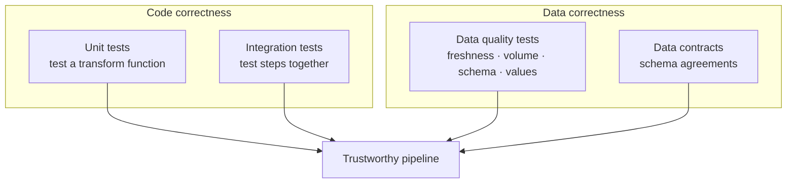

# Testing & DataOps — Learning Path

Most data engineers can write a transformation. Far fewer can **prove it's correct** and **deploy it safely**. This module is about that gap: **testing data pipelines** and **DataOps** — applying DevOps discipline (CI/CD, automation, version control) to data. It's what makes the difference between "it worked on my laptop" and "it runs reliably in production and I can change it without fear."

Builds on [Data Quality](../05_Data_Engineering/Data_Quality/01_Data_Quality_Fundamentals.md), [CI/CD](../07_DevOps/CICD/00_CICD_Learning_Path.md), [dbt](../14_dbt/00_dbt_Learning_Path.md), and [Monitoring](../13_Monitoring_and_Observability/00_Monitoring_Learning_Path.md).

---

## Why testing data is different (and hard)

Software testing checks **code** against fixed inputs. Data pipelines have **two** things that can be wrong:
1. **The code** — your transformation logic (does the join/aggregation compute correctly?).
2. **The data** — the actual values flowing through (are they fresh, complete, in range?).

You must test **both**. Traditional unit tests cover the code; data tests (dbt/Great Expectations) cover the data. This dual nature is why data testing has its own practices.

---

## Reading order

| # | File | What you'll learn |
|---|------|-------------------|
| 01 | [Testing Data Pipelines](01_Testing_Data_Pipelines.md) | Unit-testing PySpark (pytest, chispa), the test pyramid, fixtures |
| 02 | [Data Quality Testing](02_Data_Quality_Testing.md) | Great Expectations, dbt tests, contracts as tests |
| 03 | [Data Contracts](03_Data_Contracts.md) | Producer/consumer schema agreements, schema enforcement |
| 04 | [DataOps & CI/CD for Data](04_DataOps_and_CICD_for_Data.md) | CI for pipelines, environments, deployment, DataOps principles |
| 05 | [CI/CD for ADF & Databricks](05_CICD_for_ADF_and_Databricks.md) | The concrete how-to — ADF ARM release flow, Databricks Asset Bundles, GitHub Actions/Azure DevOps |
| — | [Interview Questions & Answers](Interview_Questions_and_Answers.md) | Test yourself across the module |

---

## The two axes of pipeline testing

A mature pipeline has **both columns**. Most junior engineers do neither; doing them is a strong differentiator.

---

## DataOps in one sentence

> **DataOps = DevOps for data:** version control, automated testing, CI/CD, and monitoring applied to data pipelines so you can ship changes **fast and safely**.

The payoff: you can refactor a transformation, open a PR, have tests + data checks run automatically, and merge knowing you didn't silently break a downstream dashboard. That confidence is the whole point.

Start here: **[01 — Testing Data Pipelines](01_Testing_Data_Pipelines.md)**.

## Further Learning — Docs & Videos
- DataOps principles (dbt/industry): https://www.getdbt.com/blog/what-is-dataops
- Testing Spark (chispa): https://github.com/MrPowers/chispa
- Great Expectations: https://docs.greatexpectations.io/docs/
- Video — testing data pipelines: https://www.youtube.com/results?search_query=testing+data+pipelines+pyspark
