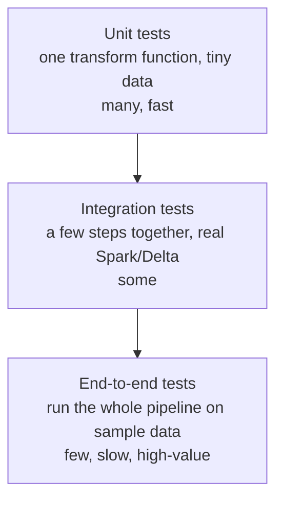

# Testing Data Pipelines

## Why test pipeline code?

Your transformation logic — a join, a window function, a dedupe rule — is **code**, and code has bugs. A wrong `join` type or an off-by-one window silently corrupts every downstream table. **Unit tests** catch these bugs *before* they reach production, and — just as importantly — they let you **change the code later without fear** of breaking something you forgot about.

Analogy: tests are the **spell-check for your logic**. You could proofread every transformation by hand every time you change it, or you could have a machine instantly re-check the whole thing against known-correct examples. Once you've written the test, it re-verifies your logic forever, for free.

---

## The test pyramid for data engineering



- **Unit** — test a single transformation function on a tiny in-memory DataFrame. Fast, numerous — the base.
- **Integration** — test that steps work together (read → transform → write) against real Delta/Spark.
- **End-to-end** — run the whole pipeline on a small sample and assert the final output.

Most value comes from **lots of fast unit tests**. The key enabler: **write transformations as pure functions** you can call in a test.

---

## Make transformations testable (the crucial habit)

Untestable code mixes reading, transforming, and writing in one blob:

```python
# ❌ hard to test — I/O and logic tangled together
def run():
    df = spark.read.parquet("abfss://…/orders")
    result = df.filter(...).groupBy(...).agg(...)
    result.write.format("delta").save("abfss://…/gold")
```

Testable code **separates the transformation** into a pure function `(DataFrame) -> DataFrame`:

```python
# ✅ pure, testable
def clean_orders(df: DataFrame) -> DataFrame:
    return (df.filter(col("amount") >= 0)
              .dropDuplicates(["order_id"]))

def run():                                  # thin I/O wrapper, not unit-tested
    df = spark.read.parquet(src)
    clean_orders(df).write.format("delta").save(dst)
```

Now `clean_orders` can be tested with a handful of rows and no cloud, no files. This single design habit is what makes a pipeline testable — and it's a strong interview point.

---

## Unit-testing PySpark with pytest + chispa

`pytest` is the standard Python test runner; **chispa** adds DataFrame equality assertions built for Spark.

```python
# tests/test_clean_orders.py
import pytest
from chispa import assert_df_equality
from pyspark.sql import SparkSession
from src.transforms import clean_orders

@pytest.fixture(scope="session")
def spark():
    return SparkSession.builder.master("local[1]").appName("test").getOrCreate()

def test_removes_negative_amounts_and_dupes(spark):
    input_df = spark.createDataFrame(
        [(1, 100.0), (1, 100.0), (2, -5.0), (3, 20.0)],
        ["order_id", "amount"])

    expected = spark.createDataFrame(
        [(1, 100.0), (3, 20.0)], ["order_id", "amount"])

    result = clean_orders(input_df)
    assert_df_equality(result, expected, ignore_row_order=True)
```

Run with `pytest`. The pattern is always **arrange** (build a tiny input), **act** (call the function), **assert** (compare to expected). `assert_df_equality` handles the Spark-specific comparison (schema + rows). See [PySpark](../06_Programming/PySpark/00_PySpark_Learning_Path.md).

---

## What to unit-test (and what not to)

**Test the logic that can be wrong:**
- Business rules (discount calc, status mapping, revenue definition)
- Deduplication and filtering logic
- Join correctness (right rows, no accidental fan-out)
- Edge cases: nulls, empty input, duplicate keys, boundary values

**Don't bother unit-testing:**
- Spark/Delta themselves (they're already tested)
- Pure I/O (covered by integration tests)
- Trivial passthroughs

Focus tests where a **bug would be costly and is plausible** — that's the ROI sweet spot.

---

## Testing SQL / dbt logic

For SQL transformations, **dbt tests** ([dbt tests](../14_dbt/03_Tests_and_Documentation.md)) cover the *data*; for the *logic*, dbt supports **unit tests** (fixed input rows → expected output) so you can verify a model's SQL against known cases — the SQL-world equivalent of the chispa example above.

---

## Interview-grade Q&A

- *How do you unit-test a PySpark pipeline?* Extract transformations into pure `DataFrame -> DataFrame` functions, then test them with `pytest` + `chispa` on tiny in-memory DataFrames (arrange/act/assert).
- *Why separate transformation from I/O?* So the logic can be tested without cloud/files; it also makes code reusable and cleaner.
- *What is the test pyramid for data?* Many fast unit tests, fewer integration tests, a few end-to-end tests on sample data.
- *What should you unit-test in a pipeline?* Business rules, dedupe/filter logic, join correctness, and edge cases (nulls, empties, duplicates) — not Spark/Delta itself.
- *How do you compare two DataFrames in a test?* `chispa.assert_df_equality` (schema + rows, order-insensitive if needed).
- *Difference between testing code and testing data?* Unit tests verify the transformation logic; data-quality tests verify the actual values (freshness/volume/schema/ranges).

---

## Further Learning — Docs & Videos
- pytest docs: https://docs.pytest.org/
- chispa (Spark test helpers): https://github.com/MrPowers/chispa
- dbt unit tests: https://docs.getdbt.com/docs/build/unit-tests
- Video — unit testing PySpark: https://www.youtube.com/results?search_query=unit+testing+pyspark+pytest+chispa
