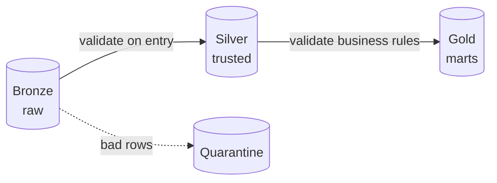

# Data Quality Testing

## Code tests vs data tests

[Unit tests](01_Testing_Data_Pipelines.md) prove your **logic** is correct on known inputs. But in production the **inputs themselves** change — a source sends nulls, a currency flips units, a feed doubles its volume. **Data quality tests** run against the *actual data flowing through* and catch those problems that no code test can predict.

Analogy: unit tests are checking the **recipe** is written correctly; data quality tests are **tasting the actual dish** each night, because even a perfect recipe produces garbage if today's tomatoes are rotten.

---

## The dimensions of data quality

The checks you write map to well-known quality dimensions (from [Data Quality Fundamentals](../06_Data_Engineering/Data_Quality/01_Data_Quality_Fundamentals.md)):

| Dimension | Check |
|---|---|
| **Completeness** | No unexpected nulls; all expected rows/partitions present |
| **Uniqueness** | No duplicate keys |
| **Validity** | Values in allowed ranges/sets/formats |
| **Consistency** | Cross-field/cross-table agreement (referential integrity) |
| **Accuracy** | Values match reality (hardest to test automatically) |
| **Timeliness** | Data is fresh within SLA |

These overlap the [five pillars of observability](../13_Monitoring_and_Observability/04_Data_Observability.md) — quality *testing* is the proactive, in-pipeline half; observability is the continuous-monitoring half.

---

## Three ways to implement data quality tests

### 1. dbt tests (if you use dbt)

Declarative, one line each — covered in [dbt Tests](../14_dbt/03_Tests_and_Documentation.md):

```yaml
columns:
  - name: order_id
    tests: [unique, not_null]
  - name: status
    tests:
      - accepted_values: {values: ['placed','shipped','delivered']}
```

### 2. Great Expectations (framework-agnostic)

**Great Expectations (GX)** is the leading Python data-validation library. You define **expectations** and validate any DataFrame (pandas or Spark) against them:

```python
import great_expectations as gx

validator = context.sources.add_spark("s").add_dataframe_asset("orders").build_batch_request()
v = context.get_validator(batch_request=validator)

v.expect_column_values_to_not_be_null("customer_id")
v.expect_column_values_to_be_between("amount", min_value=0, max_value=100000)
v.expect_column_values_to_be_in_set("status", ["placed","shipped","delivered"])
v.expect_table_row_count_to_be_between(min_value=1000)     # volume check
```

GX produces a **validation report** (Data Docs) and can **fail the pipeline** or route bad data to quarantine. It shines when you're not on dbt or need rich, reusable expectation suites.

### 3. Native assertions / DLT expectations

In Spark/Databricks you can assert inline or use **Delta Live Tables expectations** as declarative quality gates:

```python
@dlt.expect_or_drop("valid_amount", "amount >= 0")     # drop & quarantine bad rows
@dlt.expect_or_fail("has_key", "order_id IS NOT NULL") # fail the pipeline on violation
```

See [DLT](../08_Databricks/05_Delta_Live_Tables.md).

---

## The three responses to a failed check

When a quality test fails, you choose the action deliberately:

| Action | When | Effect |
|---|---|---|
| **Warn** | Minor/expected variance | Log + alert, pipeline continues |
| **Drop / quarantine** | Bad rows shouldn't reach downstream but shouldn't stop everything | Route aside, continue with good rows ([quarantine](../13_Monitoring_and_Observability/03_Pipeline_Reliability.md)) |
| **Fail / block** | A violation means the data is untrustworthy | Stop the pipeline before bad data propagates |

Getting this policy right per check is the craft: fail-fast on critical integrity, quarantine on row-level dirt, warn on soft anomalies.

---

## Where to put quality gates

Place checks at **layer boundaries**, especially **Bronze → Silver** (the "trust boundary"):



Validate structure/completeness entering Silver, and business-rule/aggregate sanity entering Gold. Don't validate everything everywhere — check where a failure would be **costly and catchable**.

---

## Interview-grade Q&A

- *Difference between unit tests and data quality tests?* Unit tests verify transformation **logic** on known inputs; data quality tests verify the **actual values** flowing through (nulls, ranges, duplicates, volume, freshness).
- *What is Great Expectations?* A Python framework for defining and validating **expectations** against DataFrames, producing reports and gating pipelines.
- *Name data quality dimensions.* Completeness, uniqueness, validity, consistency, accuracy, timeliness.
- *What are the responses to a failed check?* Warn (continue), drop/quarantine (aside + continue), or fail (block) — chosen per check by severity.
- *Where do you place quality gates?* At layer boundaries — especially Bronze→Silver (structure/completeness) and Silver→Gold (business rules).
- *dbt tests vs Great Expectations vs DLT expectations?* dbt for SQL/warehouse models, GX for framework-agnostic Python/Spark validation, DLT expectations for declarative gates inside Databricks pipelines.

---

## Further Learning — Docs & Videos
- Great Expectations: https://docs.greatexpectations.io/docs/
- Soda (alternative): https://docs.soda.io/
- DLT expectations: https://learn.microsoft.com/azure/databricks/delta-live-tables/expectations
- Video — Great Expectations tutorial: https://www.youtube.com/results?search_query=great+expectations+data+quality+tutorial
