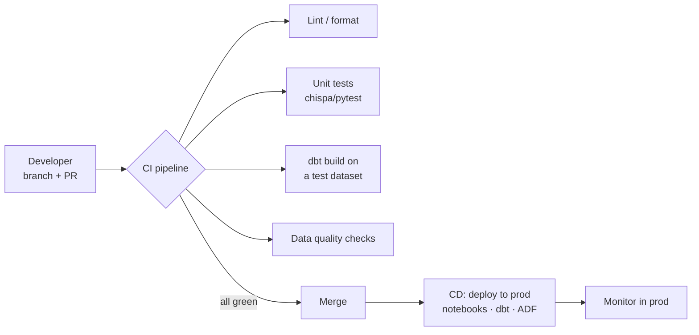

# DataOps & CI/CD for Data

## What is DataOps?

DataOps is **DevOps applied to data** — bringing version control, automated testing, continuous integration/deployment, and monitoring to data pipelines so teams can ship changes **quickly and safely**. It's the practice that ties together everything in this repo: the code ([PySpark](../06_Programming/PySpark/00_PySpark_Learning_Path.md)/[dbt](../14_dbt/00_dbt_Learning_Path.md)), the tests ([testing](01_Testing_Data_Pipelines.md)/[quality](02_Data_Quality_Testing.md)), the [orchestration](../12_Orchestration/00_Orchestration_Learning_Path.md), and the [monitoring](../13_Monitoring_and_Observability/00_Monitoring_Learning_Path.md).

Analogy: DataOps is the **assembly line with quality control** in a modern factory, versus a workshop where one artisan hand-builds each item and hopes it's right. The assembly line has automated checkpoints (tests), a repeatable process (CI/CD), and gauges everywhere (monitoring) — so it produces reliable output fast, and any worker can improve the line without breaking it.

---

## The DataOps principles

| Principle | In practice |
|---|---|
| **Version control everything** | Code, SQL, notebooks, ADF JSON, IaC, configs — all in Git |
| **Automate testing** | Unit + data quality tests run on every change |
| **CI/CD** | Automated build → test → deploy across environments |
| **Environments** | Separate dev / test / prod data and compute |
| **Monitor & observe** | Operational + data health in production ([monitoring](../13_Monitoring_and_Observability/00_Monitoring_Learning_Path.md)) |
| **Collaboration** | PRs, code review, shared standards |

---

## CI/CD for data pipelines

[CI/CD](../07_DevOps/CICD/00_CICD_Learning_Path.md) for application code is well-trodden; for data there are **extra** steps because both code and data can break.

A **pull request** triggers CI that: lints, runs unit tests, runs `dbt build` (or the pipeline) against a **small test dataset**, and runs data-quality checks. Only if everything is green does it merge and deploy. This is how you change a transformation and **know** you didn't break a downstream dashboard.

---

## Environments — dev / test / prod

Never develop against production data or write to production tables from a laptop. The standard is **three isolated environments**:

| Env | Data | Purpose |
|---|---|---|
| **Dev** | Sample/synthetic or a small copy | Build & experiment freely |
| **Test/Staging** | Realistic subset | CI runs, integration tests |
| **Prod** | Real data | Live, protected, deploy-only |

Tools make this concrete: dbt **targets**, Databricks **workspaces/catalogs per env**, ADF **git integration + ARM parameters** ([ADF](../12_Orchestration/02_ADF_Orchestration.md)), and [Terraform](../07_DevOps/IaC_and_Tooling/02_Terraform.md) to provision identical infra per environment. `ref()` in dbt and parameterization in ADF make the *same code* run against different environments — the whole point.

---

## Deploying data assets as code

Everything a data platform needs should be **reproducible from Git**, not clicked together by hand:

- **Notebooks / Spark jobs** → Databricks Repos + Asset Bundles ([Workflows](../12_Orchestration/03_Databricks_Workflows.md)).
- **dbt project** → deployed via CI or dbt Cloud.
- **ADF pipelines** → ARM templates promoted through a release pipeline.
- **Infrastructure** → [Terraform](../07_DevOps/IaC_and_Tooling/02_Terraform.md) (storage, clusters, permissions).

If your platform can be **rebuilt from the repo**, you have DataOps. If it lives only in someone's workspace clicks, you don't.

---

## Why this makes you hireable

DataOps maturity is a major senior differentiator because it directly addresses the fear every data team has: **"if I change this, what will silently break?"** An engineer who can set up CI that runs tests + dbt build on every PR, isolate environments, and deploy from Git is operating at a level most job postings explicitly ask for and most candidates can't demonstrate. Show it in your [portfolio](../11_Projects/05_Portfolio_and_GitHub_Presentation.md) with a green CI badge.

---

## Interview-grade Q&A

- *What is DataOps?* DevOps applied to data — version control, automated testing, CI/CD, environments, and monitoring for pipelines, enabling fast, safe change.
- *What's different about CI/CD for data vs app code?* You test **both** the code (unit tests) and the **data** (quality tests / dbt build on a test dataset), not just the code.
- *What runs in a data CI pipeline?* Lint/format, unit tests, `dbt build`/pipeline run on a test dataset, and data-quality checks — gating merge and deploy.
- *Why separate dev/test/prod?* To develop and test safely without touching production data; the same parameterized code runs against each environment.
- *How do you deploy pipelines across environments?* As code — Databricks Asset Bundles/Repos, dbt targets, ADF ARM templates, Terraform for infra — promoted via release pipelines.
- *How does DataOps reduce risk?* Automated tests + isolated environments + deploy-from-Git mean a change is verified before it can affect production, answering "what will this break?"

---

## Further Learning — Docs & Videos
- What is DataOps: https://www.getdbt.com/blog/what-is-dataops
- CI/CD for dbt: https://docs.getdbt.com/docs/deploy/continuous-integration
- Databricks Asset Bundles: https://learn.microsoft.com/azure/databricks/dev-tools/bundles/
- Video — DataOps & CI/CD for data: https://www.youtube.com/results?search_query=dataops+cicd+for+data+pipelines
